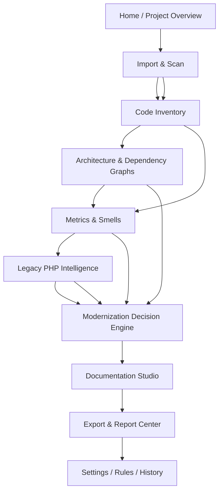

Here is a strong Streamlit page architecture for your legacy PHP modernization decision-support tool, designed as a local web app with a clear flow from **project intake → static analysis → interpretation → modernization decisions → generated artifacts**.

---

# 1) The product logic

Your tool should not feel like “a metrics dashboard.”

It should feel like a **modernization command center**.

That means the user should move through these questions in order:

1. **What project am I analyzing?**
2. **What did the scanner find?**
3. **How is the system structured?**
4. **Where is the risk?**
5. **What should we do next?**
6. **What documents/artifacts should be generated?**

That flow is what makes it stronger than PHPMetrics.

---

# 2) Recommended page map

Use a left sidebar with a strict top-to-bottom workflow.

```text
1. Home / Project Overview
2. Import & Scan
3. Code Inventory
4. Architecture & Dependency Graphs
5. Metrics & Smells
6. Legacy PHP Intelligence
7. Modernization Decision Engine
8. Documentation Studio
9. Export & Report Center
10. Settings / Rules / History
```

---

# 3) The best logical flow

## High-level flow diagram



This flow works because each page answers one layer of the modernization problem.

---

# 4) Page-by-page design

## Page 1 — Home / Project Overview

This is the landing page and project control room.

### Purpose

Give the user a fast summary of the project status and the most important signals.

### What it should hold

* Project name
* Repository path
* PHP version detected
* Number of files scanned
* Entry points found
* Framework/CMS signatures
* Last scan time
* Overall modernization score
* Overall risk score
* Recommended strategy

### Main widgets

* Project summary cards
* Status indicators
* Latest scan snapshot
* “Start new scan” button
* “Open last report” button
* High-level recommendation panel

### Example contents

* “Legacy PHP 5.2 procedural monolith”
* “1,842 files scanned”
* “312 include relationships detected”
* “27 high-risk files”
* “Recommended path: strangler migration”

### Why this page matters

It establishes executive-level understanding immediately, which PHPMetrics does not do well.

---

## Page 2 — Import & Scan

This is the intake page.

### Purpose

Let the user load a local codebase and configure the scan.

### What it should hold

* Folder picker or path input
* Scan options
* Ignore patterns
* PHP version assumptions
* Framework detection toggle
* Secret scanning toggle
* Output format options
* Scan progress status

### Data fields

* project_path
* project_name
* include_patterns
* exclude_patterns
* scan_depth
* php_version_hint
* scan_mode
* created_at

### Functionality

* Validate path
* Detect file types
* Find PHP entry points
* Parse includes/requires
* Extract classes/functions
* Build symbol index
* Save scan session

### Suggested controls

* “Scan now”
* “Rescan changed files only”
* “Use aggressive legacy detection”
* “Enable document generation after scan”

### Why this page matters

This is where your app becomes a local engineering tool, not just a viewer.

---

## Page 3 — Code Inventory

This page is the file system truth layer.

### Purpose

Show every file and classify what it does.

### What it should hold

* File list
* File type
* Purpose classification
* File size
* Last modified
* PHP version compatibility
* Entry-point status
* Risk flags
* Associated modules

### Suggested categories

* Controllers
* Views
* Models
* Libraries
* Helpers
* Config
* Bootstrap
* Cron/jobs
* Includes
* Templates
* Uploads
* Vendor
* Unknown

### Best widgets

* Search box
* Filter by file category
* Sort by risk
* Table with expandable rows
* File detail panel
* Tag chips like “global state”, “dynamic include”, “db access”

### Example file detail card

For each file:

* path
* role
* included-by
* includes
* classes defined
* functions defined
* globals used
* superglobals used
* DB calls
* security flags

### Why this page matters

Legacy PHP is often opaque. This page makes the codebase legible.

---

## Page 4 — Architecture & Dependency Graphs

This is one of the most important pages.

### Purpose

Show structural relationships across the system.

### What it should hold

* Include graph
* Call graph
* Class dependency graph
* Entry-point graph
* Database dependency graph
* Module interaction map

### Visuals to show

* Sankey or node-link dependency graph
* Tree for include chains
* Graph clusters by module
* Heatmap of coupling

### Data fields

* nodes
* edges
* edge_type
* edge_weight
* clusters
* centrality_scores
* circular_dependencies

### Key insights to surface

* “This file is a hub”
* “This module depends on 38 others”
* “Circular include detected”
* “Bootstrap chain is fragile”
* “3 modules account for 71% of all dependencies”

### Why this page matters

This page helps the user understand the system’s shape, which is a major differentiator beyond PHPMetrics.

---

## Page 5 — Metrics & Smells

This is the classic static analysis page, but made modernization-aware.

### Purpose

Show metrics, but not just as numbers.

### What it should hold

* Cyclomatic complexity
* Maintainability index
* LOC per file/module
* Function length
* Class size
* Fan-in / fan-out
* Coupling
* Cohesion
* Duplication
* Dead code
* Comment density
* Nesting depth
* Global variable usage
* Superglobal usage
* Dynamic function calls
* Dynamic includes
* Deprecated APIs

### Suggested presentation

Use three layers:

1. Summary cards
2. Ranked issue table
3. Drill-down file view

### Example issue labels

* High complexity
* God object
* Long method
* Spaghetti include chain
* Duplicate logic
* Unsafe input handling
* Hardcoded credentials
* Deprecated `mysql_*` use

### Why this page matters

PHPMetrics-style data belongs here, but your tool should go further by making it actionable.

---

## Page 6 — Legacy PHP Intelligence

This is your standout page.

### Purpose

Interpret the code like a legacy PHP expert would.

### What it should hold

* Global namespace analysis
* Procedural vs object-oriented ratio
* Autoloading strategy detection
* PHP era estimation
* Shared-hosting assumptions
* Hidden routing patterns
* Template style analysis
* Legacy DB API analysis
* Configuration style analysis
* Security pattern analysis

### Example intelligence cards

* “Codebase appears to be PHP 4 / early PHP 5 era”
* “No namespaces detected in 94% of files”
* “Application relies on include-based bootstrapping”
* “Uses custom auth/session logic”
* “Likely designed for Apache + shared hosting”
* “Mixed HTML/PHP view layer detected”

### Great subpanels

* Namespace usage map
* Superglobal usage map
* Legacy function usage map
* Dynamic behavior map
* Version-risk detector

### Why this page matters

This is the page that makes your tool smarter than PHPMetrics.

---

## Page 7 — Modernization Decision Engine

This is the core “decision support” page.

### Purpose

Convert technical findings into a modernization strategy.

### What it should hold

* Modernization score
* Risk score
* Complexity score
* Business criticality score
* Effort estimate
* Recommended path
* Justification
* Confidence level
* Suggested phased roadmap

### Recommended strategy outputs

* Rehost
* Replatform
* Refactor
* Rearchitect
* Replace
* Strangler fig migration
* Incremental modularization
* Syntax upgrade only

### The decision matrix

Use a 2x2 or 3x3 matrix.

```text
                    Business Value
                Low                  High
Complexity
Low         Keep / small fixes     Modernize now
High        Deprioritize / retire   Refactor urgently
```

### Stronger version

Add a third factor:

* security risk
* dependency centrality
* runtime instability

### Data fields

* module_name
* complexity_score
* business_value_score
* risk_score
* modernization_option
* estimated_effort_days
* priority_rank
* rationale
* recommended_sequence

### Why this page matters

This is where your tool becomes a decision-making assistant, not a report generator.

---

## Page 8 — Documentation Studio

This page generates the artifacts users actually need.

### Purpose

Turn analysis into formal outputs.

### What it should hold

* Document templates
* Auto-generated system docs
* architecture summary
* module profiles
* risk register
* modernization roadmap
* technical debt report
* executive summary
* migration plan
* glossary

### Possible generated artifacts

* System overview document
* Module decomposition document
* Dependency report
* Risk assessment report
* Refactoring backlog
* Modernization roadmap
* Data flow summary
* PHP version compatibility report

### Best widgets

* Template chooser
* Document preview
* Regenerate button
* Section toggles
* Export as PDF/Word/JSON

### Why this page matters

This is where the tool creates value for supervisors, developers, and stakeholders.

---

## Page 9 — Export & Report Center

### Purpose

Package the results into usable outputs.

### What it should hold

* Download report bundle
* Download JSON results
* Download diagrams
* Download document pack
* Download evidence tables
* Timestamped run archives

### Good exports

* PDF report
* DOCX report
* JSON analysis output
* CSV findings
* Graphviz/PNG diagrams
* Mermaid markdown
* ZIP archive of all artifacts

### Why this page matters

Local tools are often judged by what they produce, not only what they show.

---

## Page 10 — Settings / Rules / History

### Purpose

Make the app configurable and reproducible.

### What it should hold

* Scan rules
* Severity thresholds
* Strategy thresholds
* File ignore rules
* Deprecated API lists
* PHP version profiles
* Custom heuristics
* Previous scan history
* Compare scans

### Important controls

* Set risk thresholds
* Tune modernization scoring
* Save project profile
* Manage rule presets
* Compare before/after scans

### Why this page matters

This makes the tool maintainable and forward-compatible.

---

# 5) Best page order in sidebar

Use this exact order:

```text
Home
Import & Scan
Code Inventory
Architecture Graphs
Metrics & Smells
Legacy PHP Intelligence
Modernization Decision Engine
Documentation Studio
Export & Report Center
Settings / History
```

That order follows how a real analyst thinks.

---

# 6) What data each page should depend on

Here is a clean data architecture.

| Page                          | Primary data it uses                    | Primary output          |
| ----------------------------- | --------------------------------------- | ----------------------- |
| Home                          | project summary, latest scan            | executive overview      |
| Import & Scan                 | project path, scan config               | raw scan dataset        |
| Code Inventory                | file index, symbol index                | classified file catalog |
| Architecture Graphs           | nodes, edges, modules                   | dependency maps         |
| Metrics & Smells              | metric engine results                   | ranked issues           |
| Legacy PHP Intelligence       | heuristics, legacy signatures           | era/style detection     |
| Modernization Decision Engine | metrics + intelligence + business rules | strategy + roadmap      |
| Documentation Studio          | all analysis outputs                    | generated docs          |
| Export & Report Center        | final outputs                           | downloadable bundles    |
| Settings / History            | rules, profiles, past scans             | reproducibility         |

---

# 7) Recommended internal data model

This is important because Streamlit will need consistent state.

## Core objects

### Project

* id
* name
* path
* description
* created_at
* last_scanned_at

### FileRecord

* path
* extension
* size
* file_role
* is_entry_point
* module_name
* php_version_hint

### SymbolRecord

* name
* symbol_type
* file_path
* namespace
* visibility
* dependencies

### MetricRecord

* target
* metric_name
* metric_value
* severity
* threshold
* note

### IssueRecord

* id
* target
* category
* severity
* evidence
* recommendation

### StrategyRecord

* scope
* option
* rationale
* effort
* confidence
* priority

### ArtifactRecord

* artifact_type
* title
* format
* location
* generated_at

---

# 8) The best user journey

A good user should experience this sequence:

```text
Open app
→ create/select project
→ scan repository
→ inspect file inventory
→ inspect architecture graphs
→ inspect metrics and smells
→ inspect legacy PHP characteristics
→ review modernization recommendation
→ generate documents
→ export everything
```

That is the cleanest flow.

---

# 9) How to surpass PHPMetrics clearly

PHPMetrics is strongest at **measurement**.

Your tool should be strongest at **interpretation and action**.

## Your unique capabilities

* legacy PHP era detection
* include graph analysis
* global namespace analysis
* modernization path selection
* effort estimation
* document generation
* business-aware prioritization
* migration roadmap creation

## Your positioning

Instead of:

* “This code is complex”

Say:

* “This module is high-risk, business-critical, and best handled via strangler migration in phase 1.”

That is the value.

---

# 10) Suggested dashboard sections for the home page

Use these four blocks:

## Block 1: Project health

* scan completion
* file count
* modules
* entry points

## Block 2: risk summary

* security
* coupling
* deprecated APIs
* legacy patterns

## Block 3: modernization recommendation

* recommended path
* effort estimate
* confidence

## Block 4: next actions

* inspect graphs
* generate docs
* export report

---

# 11) A strong Streamlit layout pattern

Use a consistent layout on every page:

```text
[Top header: project name + scan status]

[Sidebar filters]

[Main content area]
  - summary cards
  - charts/graphs
  - detailed table
  - evidence panel
  - action buttons
```

This keeps the app clean and professional.

---

# 12) Minimum viable strong version

If you want the strongest first version, build these first:

1. Home / Project Overview
2. Import & Scan
3. Code Inventory
4. Architecture Graphs
5. Modernization Decision Engine
6. Documentation Studio

Those six pages are enough for a very strong FYP prototype.

---

# 13) Final recommended page strategy

If I were designing this for maximum impact, I would group it like this:

## Phase 1: Observe

* Home
* Import & Scan
* Code Inventory

## Phase 2: Understand

* Architecture Graphs
* Metrics & Smells
* Legacy PHP Intelligence

## Phase 3: Decide

* Modernization Decision Engine

## Phase 4: Produce

* Documentation Studio
* Export & Report Center

## Phase 5: Control

* Settings / History

---

If you want, I can turn this into a **full Streamlit site map with exact widgets, sections, and a sidebar navigation spec** next.
