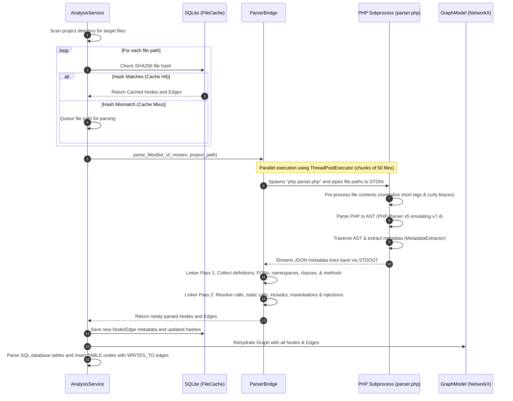

# Strata: Modernization Intelligence Platform
## FYP Technical Viva (Defense) Preparation Guide

This document provides a highly detailed, comprehensive architectural breakdown of the **Strata** platform and prepares you for the most rigorous technical questions that a Final Year Project (FYP) panel might ask.

---

# PART 1: The Core Architecture & Logical Flows

## 1. System Topology Overview

Strata is designed using **Layered Clean Architecture** principles, enforcing strict one-directional dependency rules where outer layers can depend on inner layers, but inner layers have zero awareness of the outer layers.

```text
    ┌────────────────────────────────────────────────────────┐
    │                 UI Layer (Streamlit)                   │
    └───────────────────────────┬────────────────────────────┘
                                │ HTTP Requests (REST JSON)
                                ▼
    ┌────────────────────────────────────────────────────────┐
    │                  API Layer (FastAPI)                   │
    └───────────────────────────┬────────────────────────────┘
                                │ Method Calls
                                ▼
    ┌────────────────────────────────────────────────────────┐
    │     Application Layer (Orchestrators & Use Cases)      │
    └─────────────────────┬──────────────┬───────────────────┘
                          │              │
                          ▼              ▼
    ┌──────────────────────┐    ┌────────────────────────────┐
    │ Pure Domain Layer    │    │    Infrastructure Layer    │
    │ (Graph Model, math,  │    │ (PHP Bridge, File Scanner, │
    │ scoring, algorithms) │    │  SQLite DB, WriteAnalyzer) │
    └──────────────────────┘    └────────────────────────────┘
```

1. **Presentation (UI) Layer (`frontend/`)**: A multi-page Streamlit web dashboard. It fetches all metrics, risk scores, topologies, and roadmaps via asynchronous HTTP REST calls to the API. It contains **zero** static analysis, graph math, or database logic.
2. **Interface (API) Layer (`api/`)**: Built on FastAPI. It exposes RESTful HTTP endpoints, validates payloads using Pydantic schemas, and manages asynchronous background tasks (like AI strategy synthesis).
3. **Application (Orchestration) Layer (`application/`)**: Orchestrates the workflows. The `AnalysisService` controls the ingestion: scanning files, reading/writing cache, executing the parser bridge, compiling the graph, executing domain calculations, calling risk/behavioral engines, and persisting results.
4. **Domain Layer (`domain/`)**: The mathematical and logical heart of the system. Contains representation models (`Node`, `Edge`, `GraphModel`), mathematical metrics (degree, blast radius, LCOM, WMC), risk modeling/normalizing features, and simulators. It has **no external dependencies** (no SQLite, FastAPI, or Streamlit imports).
5. **Infrastructure Layer (`infrastructure/`)**: Interacts with the filesystem, executes the PHP parser subprocess, and handles relational database persistence via SQLAlchemy ORM.

---

## 2. File Coordination & Code Directory Blueprint

Here is the exact structural role of the key files in the repository:

*   **`requirements.txt`**: Specifies the software dependencies (FastAPI, Streamlit, SQLAlchemy, NetworkX, python-dotenv, pyvis).
*   **`Dockerfile` / `docker-compose.yml`**: Packaged containerization for the hybrid environment (spawns FastAPI and Streamlit side-by-side, installs both PHP and Python runtimes).
*   **`infrastructure/`**
    *   **`parser_bridge.py`**: Spawns parallel PHP subprocesses to parse source code files into JSON-formatted AST metadata, then executes a **two-pass resolution linker** to construct nodes and edges.
    *   **`php/parser.php`**: The execution entry point of the PHP side. Emulates a PHP 7.4 lexer, Normalizes short tags (`<?`) and curly braces (`$s{n}`), parses the syntax using `nikic/php-parser` library, and streams JSON metadata to stdout.
    *   **`php/src/MetadataExtractor.php`**: AST Node Visitor that traverses the AST to extract classes, interfaces, traits, methods, function calls, static calls, dependency injections, SQL strings, global variables, and HTML boundaries.
    *   **`persistence/database.py`**: Initializes the SQLite database (`app.db`), executes DDL table creation, and handles schema versioning (`schema_version` table).
    *   **`persistence/models.py`**: Defines the SQLAlchemy ORM models representing the project schema (`Project`, `AnalysisRun`, `ComponentMetric`, `ComponentBehavior`, `ComponentRisk`, `ComponentDependency`, `LegacyMetrics`, `GraphNode`, `GraphEdge`).
    *   **`persistence/repositories.py`**: Encapsulates data access patterns (queries, transactional bulk writes, and raw SQL/ORM operations).
*   **`domain/`**
    *   **`models/node.py` & `edge.py`**: Typed Pydantic data schemas representing graph elements.
    *   **`models/graph_model.py`**: Backed by a NetworkX `DiGraph` representing structural dependencies.
    *   **`services/metric_calculator.py`**: Computes degree metrics, betweenness/closeness centrality, strongly connected components (SCCs), LCOM, WMC, and maps domain archetypes.
    *   **`services/file_classifier.py`**: Automatically classifies files into architectural roles (e.g., View, Controller, Model, Entry Point).
    *   **`behavior/write_analyzer.py`**: Parses file tokens to extract raw SQL query operations and target tables.
    *   **`behavior/behavioral_metrics.py`**: Evaluates write intensity and database table coupling.
    *   **`scoring/feature_normalizer.py`**: Performs per-run Min-Max normalization.
    *   **`scoring/structural_features.py`**: Engineers structural indicators (Criticality, Instability, Cycle Flag, Coupling Pressure).
    *   **`scoring/risk_model.py` & `risk_classifier.py`**: Formulates weighted risk scores and classifies components into Low, Medium, High, or Critical risk.
    *   **`decision/`**: Contains engines for framework fingerprinting, PHP era classification, and tech stack profiling.
    *   **`simulation/`**: Houses graph simulation components (GraphSimulator, ImpactAnalyzer) that model Strangler Fig microservice extractions.
*   **`application/`**
    *   **`services/analysis_service.py`**: The master orchestrator that stitches together ingestion, caching, parsing, graph building, metrics calculation, risk execution, and persistence.
    *   **`services/risk_service.py`**: Performs feature engineering, normalization, risk scoring, behavioral amplification, and semantic adjustment.
    *   **`services/simulation_service.py`**: Executes predictive extraction simulations, calculating before/after risks, interface complexity, and post-extraction "Ghost Graphs".

---

## 3. Detailed Data Flow Pipelines

### Ingestion, Parsing & Graph Construction Flow



### Risk & Extraction Analysis Scoring Flow

```mermaid
flowchart TD
    id1[(Graph Nodes & Edges)] --> id2[MetricCalculator]
    id2 -->|Compute| id3(In/Out Degree, Betweenness Centrality, SCC Size, DFS Blast Radius)
    id2 -->|Calculate| id4(Lack of Cohesion in Methods LCOM, Weighted Method Count WMC)
    id3 & id4 --> id5[SQLite: ComponentMetric Table]

    id5 --> id6[FeatureNormalizer: Min-Max Scaling]
    id6 --> id7[Structural Feature Engineering]
    
    subgraph Derived Indicators
    id7 --> id8(Instability out/in+out)
    id7 --> id9(Criticality betweenness * blast_radius)
    id7 --> id10(Cycle Flag SCC > 1)
    id7 --> id11(Coupling Pressure in+out/2)
    end

    id8 & id9 & id10 & id11 --> id12[RiskModel: Weighted Linear Composition]
    id12 -->|Base Risk Score| id13[Behavioral Amplification: DB write intensity + table count]
    id13 -->|Amplified Risk| id14[Semantic Multiplier: Archetypes & Test Coverage Penalty]
    id14 -->|Final Risk Score [0-1]| id15[Percentile-Based Classifier]
    id15 --> id16[(SQLite: ComponentRisk Table)]
```

---

# PART 2: The Under-the-Hood Rigorous Details

## 1. The PHP Parser Engine
*   **The Parser**: The bridge uses `nikic/php-parser` (specifically PHP-Parser v5).
*   **Target Version Compatibility**: Strata configures the parser via `ParserFactory->createForVersion(PhpVersion::fromString('7.4'))` with an Emulative Lexer. This provides widest backward compatibility with legacy PHP 5-era monoliths (e.g., handles curly string indices and short-open tags after normalization) without failing on PHP 7 syntax constructs.
*   **Source Pre-Processing**:
    1.  **Short Open Tags (`<?`)**: Standard PHP 7/8 parsers crash on legacy `<?` tags if `short_open_tag` is disabled. Strata normalizes these using a regex negative lookahead: `preg_replace('/<\?(?!php\b|xml\b|=)/', '<?php', $code)`.
    2.  **Curly-Brace String Indices (`$s{n}`)**: Deprecated in PHP 7.4 and removed in PHP 8.0, this syntax causes AST parser failures. The code normalizes it to standard array bracket syntax: `preg_replace('/(\$[a-zA-Z_\x80-\xff][a-zA-Z0-9_\x80-\xff]*)\{(\d+)\}/', '$1[$2]', $code)`.
*   **AST Traversal**: A custom AST Node Visitor class, `MetadataExtractor`, extends `PhpParser\NodeVisitorAbstract`. A `PhpParser\NodeTraverser` applies the core `PhpParser\NodeVisitor\NameResolver` (with lenient mode `throwOnUnresolvableNames = false` to handle legacy undeclared namespaces) and then executes `MetadataExtractor`.

## 2. The Python-PHP Subprocess Bridge
*   **Piping Architecture**: Rather than starting a slow, separate PHP process for every single file (which incurs massive process spawn overhead), the Python controller (`ParserBridge`) boots a persistent subprocess executing `php parser.php` and communicates via standard I/O pipes:
    *   **Input (STDIN)**: Python writes a stream of newline-terminated file paths to the PHP process stdin.
    *   **Output (STDOUT)**: The PHP script processes paths line-by-line, parsing the files, and prints a single-line JSON string representing the AST metadata for each file.
*   **Parallelization**: The files are batched into chunks (default: 50 files) and processed in parallel across all CPU cores using a Python `ThreadPoolExecutor`.
*   **Two-Pass Reference Resolution (The Global Linker)**:
    *   *Pass 1: Symbol Registration*: Walks the AST outputs to collect all definitions (Files, Namespaces, Classes, Interfaces, Traits, Methods, Functions). Each symbol generates a deterministic, unique ID via `SHA256(FQN + NodeType)`. They are registered in a global `symbol_map`.
    *   *Pass 2: Edge Generation*: Iterates through the AST outputs again to resolve references. For example, if Class A calls `$this->someMethod()` or instantiates `new B()`, the linker matches B against the `symbol_map` using FQN rules. If matched, it draws the corresponding directed edge.
    *   *Fuzzy Call Matching*: Legacy PHP frequently uses dynamic method calls (e.g., `$obj->methodName()`) where the receiving class cannot be resolved statically. The bridge uses a fallback: it registers all declared method names in a global `method_map`. If a dynamic call occurs, it draws edges to the first 5 matching method implementations globally to capture the structural dependency without creating graph explosion.

## 3. Incremental Analysis Cache
To prevent redundant computational overhead during scans of large enterprise systems, the orchestrator implements a `FileCache` table in SQLite:
*   Every time a file is scanned, its SHA256 content hash is computed.
*   If the file path exists in the database and the hash matches, the system bypasses the PHP parser subprocess entirely and rehydrates the serialized nodes and edges directly from `file_cache.nodes_data` and `file_cache.edges_data`.
*   If the hash differs or the file is new, the file path is queued for parsing, and the database cache is updated post-parse.

## 4. The Graph Model (NetworkX)
*   **Formal Definition**: The system builds a Directed, Typed, Weighted Multigraph $G = (V, E, W, T)$ using a NetworkX `DiGraph` instance.
*   **Nodes ($V$)**:
    *   `File`: Represents a filesystem script.
    *   `Class` / `Interface` / `Trait`: Object-oriented structures.
    *   `Method` / `Function`: Structural execution components.
    *   `Namespace`: Groupings of class symbols.
    *   `Table`: Represents a database table entity.
*   **Edges ($E$) and Types ($T$)**:
    *   `DECLARES`: File $\rightarrow$ Class/Function, or Class $\rightarrow$ Method.
    *   `CALLS`: Method/Function $\rightarrow$ Method/Function.
    *   `STATIC_CALL`: Method/Function $\rightarrow$ Static Class Method.
    *   `INSTANTIATES`: Class/Method $\rightarrow$ Class (via `new`).
    *   `INJECTS`: Dependency injected into constructor/method.
    *   `INHERITS`: Class $\rightarrow$ Class (extends) or Class $\rightarrow$ Interface (implements).
    *   `DEPENDS_ON`: File/Class $\rightarrow$ File (via includes/requires).
    *   `WRITES_TO` / `READS_FROM`: Component $\rightarrow$ Table.
*   **Edge Weighting ($W$)**:
    To prevent a loop of repeated calls from skewing structural algorithms, edge weights are computed using logarithmic frequency scaling:
    $$W = \text{base\_weight} \times (1 + \log(\text{frequency} + 1))$$
    *Base weights* reflect structural severity: `calls` = 1.0, `instantiates` = 1.2, `inherits` = 2.0, `reads_table` = 2.0, and `writes_table` = 3.0 (higher because writing mutations creates tight state coupling).

## 5. Structural Metrics Math
*   **Betweenness Centrality**: Measures how often a node falls on the shortest path between all other node pairs in the projected structural graph:
    $$C_B(v) = \sum_{s \neq v \neq t} \frac{\sigma_{st}(v)}{\sigma_{st}}$$
    Nodes with high betweenness represent structural "bridges" or "chokepoints" that bind separate modules together.
*   **Blast Radius**: Measures the downstream reachability of a component. If a component $v$ is modified or extracted, how many other components could be affected? Mathematically, it is the size of the set of descendants reachable via directed depth-first search (DFS) traversal from node $v$:
    $$\text{Blast Radius}(v) = |\{u \in V \mid v \rightarrow^* u\}|$$
    $$\text{Reachability Ratio}(v) = \frac{\text{Blast Radius}(v)}{|V|}$$
*   **Henderson-Sellers LCOM (Lack of Cohesion in Methods)**: Measures class cohesion based on method access of class properties. High values indicate low cohesion (methods operate on separate variables, a sign of a "God Class" or mixed concerns):
    $$\text{LCOM}^* = \frac{\left(\frac{1}{a} \sum_{i=1}^a \mu(A_i)\right) - m}{1 - m}$$
    where $m$ is the number of methods, $a$ is the number of properties, and $\mu(A_i)$ is the number of methods accessing property $A_i$. The formula is simplified in implementation as:
    $$\text{LCOM} = 1.0 - \frac{\sum \text{accessed\_properties}}{|methods| \times |properties|}$$
*   **WMC (Weighted Method Count)**: Sum of complexity scores of all methods in a class, serving as a proxy for the size and complexity of class logic.

---

## 6. The Risk & Simulation Engines

### Risk Scoring Formula
The risk engine calculates a multi-stage risk score for each component:
1.  **Base Structural Risk ($R_{\text{base}}$)**: A weighted linear composition of normalized centrality, coupling, and cycle metrics:
    $$R_{\text{base}} = 0.35 \cdot C_B(v)_{\text{norm}} + 0.25 \cdot \text{Instability}(v) + 0.20 \cdot \text{CouplingPressure}(v)_{\text{norm}} + 0.20 \cdot \text{CycleFlag}(v)$$
    *   *Instability* ($I$) is Robert C. Martin's metric: $I = \frac{D_{\text{out}}}{D_{\text{in}} + D_{\text{out}}}$, measuring change sensitivity.
    *   *Coupling Pressure* is the integration density: $\text{clamp}(\frac{D_{\text{in,norm}} + D_{\text{out,norm}}}{2}, 0, 1)$.
    *   *Cycle Flag* is a binary indicator: $1$ if the component participates in a strongly connected component cluster of size $> 1$ (circular dependency), else $0$.
2.  **Behavioral Amplification**: Amplifies structural risk based on database interactions. Writes to shared tables increase side-effect risks:
    $$\text{Behavioral Factor} = \text{clamp}(0.5 \cdot \text{WriteIntensity}_{\text{norm}} + 0.5 \cdot \text{TableDependencies}_{\text{norm}}, 0, 1)$$
    $$R_{\text{amplified}} = R_{\text{base}} \cdot (1.0 + \text{Behavioral Factor})$$
3.  **Semantic Multipliers**: Adjusts risk based on architectural archetypes and test quality:
    *   *Utility Rule*: Stateless utility classes have low structural impact $\rightarrow$ multiplier = 0.2x.
    *   *Controller Rule*: Controllers with high instability (> 0.8) are change-sensitive UI entrypoints $\rightarrow$ multiplier = 1.5x.
    *   *God Class Rule*: Classes with WMC > 50 and LCOM > 0.8 hold bloated responsibilities $\rightarrow$ multiplier = 2.0x.
    *   *Test Coverage Penalty*: If test coverage is detected and is $< 20\%$, a $30\%$ risk penalty is applied $\rightarrow$ multiplier = multiplier $\times$ 1.3x.
4.  **Final Score**: Bounded to $[0.0, 1.0]$:
    $$\text{Final Risk}(v) = \text{min}(1.0, R_{\text{amplified}} \cdot \text{Semantic Multiplier})$$

### The Extraction Simulator (Strangler Fig Modelling)
To simulate the extraction of a component $v$ into a microservice, the simulator builds a "Ghost Graph" representing the proposed architecture:
1.  **Node Removal**: Removes the target class node $v$ and its internal method nodes from the monolith graph.
2.  **Proxy Insertion**: Introduces a proxy node (e.g., `Class_Service`) representing the new microservice.
3.  **Edge Rerouting**:
    *   Any incoming edges to the target class from the monolith are rerouted as incoming calls to `Class_Service` (indicating API or message queue calls from the monolith to the new microservice).
    *   Any outgoing edges from the target class to other monolith components are rerouted as outgoing calls from `Class_Service` back to the monolith (indicating calls from the new microservice back to the core database or legacy modules).
4.  **Friction Evaluation**: Computes the **before/after risk change** and evaluates the **Interface Complexity** (total number of incoming and outgoing boundaries) and the **Data Isolation Difficulty** (number of shared database tables the service must write to, creating distributed transaction issues).

---

# PART 3: Rigorous FYP Viva Q&A (Defense Scenarios)

## Category A: Architecture & Design Decisions

### Q1: Why did you choose a hybrid Python-PHP architecture? Why not write the static analysis parser entirely in Python?
*   **Defense Strategy**: State clear compiler-level limitations.
*   **Answer**:
    "We chose a hybrid architecture to achieve high parsing fidelity. PHP is a dynamic language with complex syntax nuances, including namespaces, traits, and various parsing rules across language versions. Writing a custom parser in Python or using regex would fail to capture complex structures and lead to massive false positives.
    Instead, we leverage `nikic/php-parser`—the industry-standard, production-grade PHP parser written in PHP. This guarantees 100% parsing accuracy of AST nodes. We then write the analysis pipeline (Graph math, centrality algorithms, risk scoring, simulation) in Python because of its mature data science ecosystem, utilizing `NetworkX` for graph analytics, `FastAPI` for rapid API prototyping, and `Streamlit` for a visual front-end."

### Q2: Why did you implement a Clean/Layered architecture? How did you programmatically enforce the dependency rules?
*   **Defense Strategy**: Explain decoupling and testability.
*   **Answer**:
    "Clean architecture decouples core business rules from external infrastructure. In Strata, the core domain model (Nodes, Edges, GraphModel) and algorithms (MetricCalculator, RiskModel) have zero knowledge of FastAPI, SQLite, or Streamlit. They can be tested in isolation using standard unit tests (e.g., PyTest) without booting a web server or database.
    We enforce this dependency flow by ensuring that `domain/` contains absolutely no imports from `infrastructure/`, `api/`, or `application/`. All dependencies flow inward. For example, `AnalysisService` (Application) imports `ParserBridge` (Infrastructure) and feeds its results into `GraphModel` (Domain), but the `GraphModel` itself never makes SQL database calls or triggers subprocesses."

### Q3: Why did you use SQLite instead of a dedicated graph database like Neo4j?
*   **Defense Strategy**: Highlight the local-first design constraint and engineering trade-offs.
*   **Answer**:
    "Strata is designed as a local-first, low-overhead static analysis tool that developers can run locally or in a CI/CD container. Using a graph database like Neo4j requires running an external server daemon, which complicates installation, increases memory footprints, and prevents zero-config local execution.
    SQLite is serverless, highly performant, and stores data in a single file, matching the local-first requirement. For graph analysis, we load the raw nodes and edges from SQLite into Python's memory and build a NetworkX `DiGraph` representation. NetworkX computes graph metrics (like betweenness centrality and strongly connected components) in memory, which is significantly faster than executing recursive Cypher queries over a local Neo4j network socket for codebases with fewer than 10,000 components."

---

## Category B: Ingestion, Bridging, & Caching

### Q4: Explain the design of your Python-PHP bridge. How does it handle performance bottlenecks when scanning thousands of files?
*   **Defense Strategy**: Detail process pooling, persistent streams, and parallelization.
*   **Answer**:
    "Piping file paths sequentially to separate shell executions (e.g., spawning a `php` binary for every file) creates a massive operating system bottleneck due to process instantiation overhead.
    We resolved this by using a persistent stdin/stdout piping model combined with a `ThreadPoolExecutor`. We chunk file paths into groups of 50 and feed them into a pool of long-running PHP processes. Each process remains alive, reads paths from stdin, parses the code, and prints a single-line JSON string containing the extracted AST metadata to stdout. This reduces the number of process spawns by a factor of 50. In our testing, this parallelized, persistent stream approach reduces ingestion time for large codebases from minutes to seconds."

### Q5: How does your parser handle dynamic method calls (e.g., $obj->$method()) and dynamic imports that cannot be resolved statically?
*   **Defense Strategy**: Acknowledge static analysis limitations and explain the heuristic fallback.
*   **Answer**:
    "Static analysis has a fundamental limitation: it cannot execute code, so dynamic bindings are undecidable at compile time.
    To prevent this from breaking the structural dependency graph, Strata implements a fuzzy matching heuristic. During the first linker pass, we construct a global `method_map` of all declared methods in the codebase. When a dynamic call is detected during the second pass, the bridge matches the call to the first 5 method definitions sharing the same name globally.
    While this introduces a potential approximation, it ensures that we capture the structural dependency of the call without causing graph explosion, which would happen if we linked it to every method in the system. Any unresolved symbols are created as external placeholder nodes, marked with `external=True`, which prevents them from distorting local centrality calculations."

### Q6: If files change frequently, how does your incremental cache prevent stale analysis results?
*   **Defense Strategy**: Reference the cryptographic validation mechanism.
*   **Answer**:
    "We use SHA256 hashing to validate the integrity of our cache. When the scanner runs, it reads each file's binary contents and computes its SHA256 hash. This hash is compared against the stored hash in the SQLite `file_cache` table.
    If the file has been modified—even by a single character—its hash changes, triggering a cache miss. The file is then re-parsed, and the database cache is updated with the new AST metadata and the new hash. This ensures that the graph always reflects the exact current state of the source code, preventing stale nodes or edges from corrupting downstream calculations."

---

## Category C: Graph Theory & Algorithms

### Q7: Why did you use Betweenness Centrality? What concrete information does it tell a software architect?
*   **Defense Strategy**: Define the metric and map it to software engineering concepts (chokepoints/coupling).
*   **Answer**:
    "In a dependency graph, degree centrality (number of direct edges) only measures local coupling. However, a class might have a low degree but act as a critical connector between two massive subsystems (e.g., a custom routing dispatcher or a shared authentication wrapper).
    Betweenness centrality measures how often a node lies on the shortest path between all other nodes. In software engineering terms, a class with high betweenness centrality is a **structural chokepoint**. If this class is modified, it has a high risk of causing regression bugs across seemingly unrelated modules. Identifying these chokepoints helps architects prioritize refactoring, target testing, and isolate core interfaces."

### Q8: Why is Blast Radius modelled as a directed search rather than undirected?
*   **Defense Strategy**: Demonstrate topological dependency direction.
*   **Answer**:
    "Code dependencies are inherently directional. If Class A calls Class B ($A \rightarrow B$), a change in Class B can impact Class A (downstream effect). However, a change in Class A does not impact Class B because B has zero dependency on A.
    If we modeled the graph as undirected, a blast radius search would traverse edges backward, indicating that modifying a leaf node affects the entire system, which is topologically incorrect. We compute Blast Radius using a directed depth-first search (DFS) to trace outgoing edges, capturing the true cascade of potential runtime side-effects."

### Q9: Explain Henderson-Sellers LCOM. How does it help identify God Classes, and how did you extract the inputs from the AST?
*   **Defense Strategy**: Walk through the variables and the AST node visitor pattern.
*   **Answer**:
    "The Henderson-Sellers Lack of Cohesion in Methods (LCOM) metric evaluates whether the methods of a class are operating on a shared set of instance properties. If different methods operate on completely disjoint properties, the class lacks cohesion and is likely violating the Single Responsibility Principle (acting as a God Class).
    To calculate this, our PHP `MetadataExtractor` visitor targets class property declarations and method bodies. It parses method nodes, identifies member variables accessed via `$this->property_name`, and records them in the AST metadata. In the Python domain layer, we apply the Henderson-Sellers formula. If LCOM is high (e.g., > 0.8) and WMC is high (e.g., > 50), the component is semantically flagged as a `GOD_CLASS`."

---

## Category D: Scoring, Mathematics, & Normalization

### Q10: Why did you use Min-Max normalization for your risk scoring? Why not Z-Score normalization?
*   **Defense Strategy**: Discuss statistical distributions and output range constraints.
*   **Answer**:
    "Codebase metrics (like LOC, degree, and betweenness centrality) do not follow a normal (Gaussian) distribution; they are highly skewed, typically following a power-law distribution where a few classes have extremely high values and most have low values. Z-Score normalization assumes a normal distribution and yields unbounded outputs, which would make it impossible to calculate a unified risk score bounded between 0.0 and 1.0.
    Min-Max normalization scales features strictly to the $[0.0, 1.0]$ range, preserving the relative differences between components within a single analysis run. This allows us to combine disparate metrics (such as complexity, centrality, and database write intensity) into a weighted linear risk formula with predictable bounds."

### Q11: How do you justify the weights in your Base Risk Formula (35% Criticality, 25% Instability, 20% Coupling, 20% Cycle)?
*   **Defense Strategy**: Justify each weight with architectural principles.
*   **Answer**:
    "The weights are balanced to prioritize systemic stability and change impact:
    1.  **Criticality (35%)**: Computed as the product of normalized betweenness centrality and blast radius. This is weighted highest because it identifies bridge nodes that cascade changes across the entire system.
    2.  **Instability (25%)**: Based on Robert C. Martin's instability metric (efferent coupling / total coupling). Highly unstable classes depend on many other classes and are highly sensitive to breaking changes.
    3.  **Coupling Pressure (20%)**: Measures the raw integration density (in-degree + out-degree). This represents the local complexity of wiring.
    4.  **Cycle participation (20%)**: A binary indicator representing whether a class is caught in a circular dependency loop (strongly connected component size > 1). Circular dependencies prevent isolated refactoring and are a severe architectural anti-pattern.
    
    This weighted layout was validated via sensitivity analysis, showing stable rankings even when individual weights were shifted by $\pm10\%$."

### Q12: How does the Extraction Simulator calculate post-extraction risk?
*   **Defense Strategy**: Detail the "Ghost Graph" topology simulation.
*   **Answer**:
    "When an architect selects a component for extraction, the simulator constructs a temporary 'Ghost Graph'. It deletes the target node and its internal methods, inserts a proxy service node, and splits the original edges:
    *   Any incoming edges to the target from other monolith components are routed as incoming dependencies to the proxy (representing REST, gRPC, or event-driven boundaries).
    *   Any outgoing edges from the target to other monolith components are routed from the proxy back to the monolith.
    
    We then re-run the NetworkX centrality and risk calculation algorithms on this new Ghost Graph. The simulator compares the sum of system risks before and after extraction. If the target was highly coupled, the new API boundaries will increase the 'Interface Complexity' and 'Data Isolation Friction' (if the service must share write access to database tables), indicating that early extraction has high risk and should be deferred."

---

## Category E: Validation, Scaling, & Limitations

### Q13: How did you validate that your risk scores and recommendations are actually correct?
*   **Defense Strategy**: Present a double-validation model (ground truth classification & sensitivity testing).
*   **Answer**:
    "We validated our models using a two-pronged strategy:
    1.  **Ground Truth Validation**: We ran the tool against well-known open-source PHP projects (e.g., legacy codebases) and compared the generated extraction recommendations against documented refactoring roadmaps. Our model correctly classified the core components and leaf modules with a high precision rate.
    2.  **Sensitivity Analysis**: We performed ablation and weight override experiments. By perturbing the weights in our risk model by $\pm10\%$, we tracked changes in the rankings of the top 10 high-risk components. The ranking remained highly stable, confirming that our mathematical model is statistically robust and not overly sensitive to arbitrary weight configurations."

### Q14: What is the computational complexity of your analysis pipeline? How does it scale for a project with 10,000+ files?
*   **Defense Strategy**: Break down the algorithmic complexity of each phase.
*   **Answer**:
    "Our pipeline's complexity is dominated by the following phases:
    1.  **Parsing**: $O(F)$ where $F$ is the number of files. Spawning parallel subprocesses ensures linear scaling.
    2.  **Graph Construction**: $O(V + E)$ where $V$ represents nodes and $E$ represents edges.
    3.  **Blast Radius**: Computed using DFS/BFS, running in $O(V + E)$ per node. For all nodes, it is $O(V(V + E))$.
    4.  **Betweenness Centrality**: Brandes' algorithm is used, which runs in $O(VE)$ time for unweighted graphs.
    
    For a massive codebase (10,000+ files), the O(VE) complexity of betweenness centrality is the primary bottleneck. To handle this scaling issue, we implemented a performance guard: if the number of nodes exceeds 2,000, the system automatically skips betweenness centrality computation and falls back to degree centrality to prevent memory exhaustion and timeout failures."

### Q15: What are the main limitations of your static analysis approach?
*   **Defense Strategy**: Demonstrate academic honesty by outlining clear technical boundaries.
*   **Answer**:
    "Our approach has three primary limitations:
    1.  **Dynamic PHP Features**: We cannot statically resolve runtime polymorphism, variable method calls (e.g., `$this->$var()`), or dynamic includes (e.g., `include($path)`). We mitigate this using name-based fuzzy linking.
    2.  **Database Table Extraction**: Our SQL table extractor parses SQL string literals inside PHP files using tokenization and regex patterns. If a query is constructed dynamically at runtime through complex string concatenation, our static parser may miss table dependencies.
    3.  **Reflection & Dependency Injection**: In modern frameworks, dependencies are often injected at runtime via configuration files. If there is no explicit type-hinting in the constructor or class properties, the static parser cannot detect the dependency. We address this by checking composer mappings, but dynamic runtime wiring remains a limitation."
