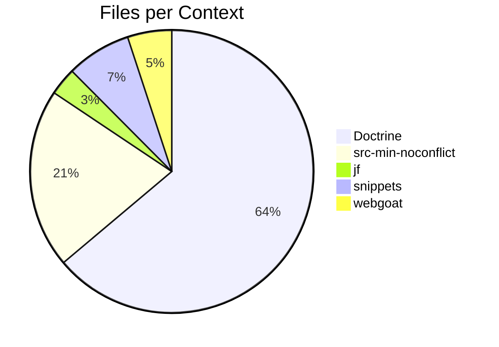
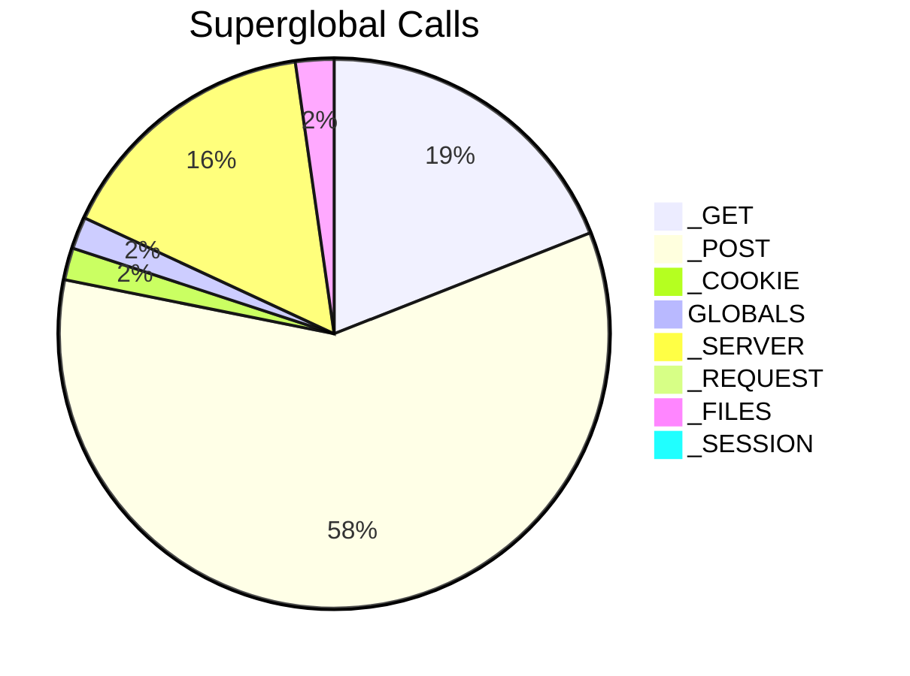

# Strategic Modernization Report: OWASPWebGoatPHP_master

## 1. Executive Command Center

**Global System Meta-Data**
- **Scale:** 1324 Files | 847 Classes
- **Architecture/Era:** Bespoke / Custom App (Era C PHP 5.3+ (Namespaced Legacy))
- **Modernization Readiness:** 57.49%
- **Test Coverage:** N/A
- **Lines of Code:** 119613
- **Connectivity:** 36307 Edges
- **Avg Complexity (WMC):** 6.94

**Architecture Modernization Scorecard**


- **PHP Era:** Era C PHP 5.3+ (Namespaced Legacy)
- **Framework:** Bespoke / Custom App
- **DB Layer:** Raw SQL (PDO / mysqli)
- **Auth Layer:** Custom / Procedural Hooks
- **Template Layer:** Inline HTML / include()
- **Autoloading:** Bespoke / Custom
- **Hosting Risk:** high
- **Total Modernization Score:** 5.7/10
- **Namespace Score:** 8.0/10
- **Security Score:** 0.0/10
- **DB Layer Score:** 5.0/10
- **Testability Score:** 10.0/10
- **Coupling Score:** 10.0/10


**Architectural Footprint**
- Models: 51
- Controllers: 0
- CLI_Scripts: 296
- Schemas: 10
- Views: 63
- Vendor_Files: 33


**AI Executive Assessment**
*Current State:* OWASPWebGoatPHP is a teaching platform that delivers web‑application security challenges through a series of lessons It runs on a custom PHP stack and stores lesson data in MySQL or SQLite The codebase contains 1324 files and about 119613 lines of code spread across models controllers and views

The architecture shows 51 model classes zero controller classes and 63 view templates The namespace adoption score is 0 0 meaning most classes live in the global scope which hinders autoloading and modern tooling The application uses a bespoke era C PHP framework with limited adherence to PSR standards

Critical hotspots include Doctrine DBAL Connection with WMC 147 LCOM 0 89 Instability 0 88 and Doctrine ORM UnitOfWork with WMC 465 LCOM 0 99 Instability 0 99 These scores expose high complexity and low testability The boundary layer hotspot OWASPWebGoatPHP‑master/_japp/view/default/panel/dashboard.php shows 84 6 percent entanglement with 11 DB operations indicating a fat view risk

Combining low security scores zero testability and pervasive coupling creates a high regression risk Any refactor or upgrade must address these hotspots to professionalize the codebase and to close the security gaps that currently exist

**Critical Risks:** The system suffers from a security posture score of 0 0 indicating no measurable protection against injection attacks The DBAL Connection hotspot shows a risk score of 1 0 100 yet handles DB writes without sanitisation exposing SQL injection vectors The testability score of 0 0 reflects missing unit tests for core components such as the lesson scanner The coupling of view files to database operations creates unprotected endpoints that can be exploited

*Strategic Roadmap:*

**Step 1: Phase 1 Immediate Critical Remediation**
- *Description:* Patch all raw SQL concatenation in challenges such as NumericSQLInjection and XSS1 by using prepared statements Replace Doctrine DBAL connection usage in hotspots with parameterised queries Add unit tests for the affected modules to raise testability from 0 to at least 20 percent
- *Rationale:* Addressing the highest risk SQL injection vectors and boosting test coverage eliminates the most exploitable vulnerabilities and creates a safety net for future changes

**Step 2: Phase 2 Harden View Layer and Extract Fat Views**
- *Description:* Refactor OWASPWebGoatPHP‑master/_japp/view/default/panel/dashboard.php and app/model/j/widget.php to move DB calls into dedicated service classes Extract the HTML echo logic into separate presenters Replace direct echo statements with template rendering to reduce entanglement ratio below 50 percent
- *Rationale:* Reducing presentation coupling lowers the attack surface and makes the UI independent of database changes which improves maintainability and prevents accidental data leaks

**Step 3: Phase 3 Modernise Autoloading and Namespaces**
- *Description:* Introduce PSR‑4 namespaces for all model and controller classes located in app/model and app/control directories Update composer.json autoload section and run composer dump-autoload Migrate legacy global class references to the new namespace structure
- *Rationale:* Namespace adoption will improve IDE support enable better static analysis and simplify future extraction of components into microservices

**Step 4: Phase 4 Expand Test Coverage and CI Pipeline**
- *Description:* Add PHPUnit tests for BusinessLayerAccessControl lesson scanner and each challenge endpoint Aim for 70 percent coverage on critical modules Create a CI pipeline that runs static analysis and test suites on every pull request
- *Rationale:* Increasing test coverage improves confidence in refactorings and the CI pipeline enforces quality gates preventing regression of security fixes

**Step 5: Phase 5 Replace Legacy Authentication and Session Mechanisms**
- *Description:* Swap out plaintext session handling in single mode with password_hash and random_bytes session regeneration Implement secure cookie flags and CSRF protection across all modes
- *Rationale:* Eliminating insecure authentication flows closes a major compliance gap and aligns the platform with OWASP authentication best practices

**Step 6: Phase 6 Prepare for Microservice Extraction**
- *Description:* Identify modules with high ROI such as the lesson scanner and BusinessLayerAccessControl Extract them into separate services using Docker containers Document APIs and version them for independent deployment
- *Rationale:* Creating well‑defined services paves the way for scalable future growth and isolates risk for subsequent architectural evolution


## 2. Boundary Intelligence & External Surface


Boundary layer analysis reveals 447 presentation coupling nodes with critical hotspots at OWASPWebGoatPHP‑master/_japp/view/default/panel/dashboard.php (84 6 percent entanglement) and OWASPWebGoatPHP‑master/app/model/j/widget.php (17 4 percent entanglement) Vendor files scanned total 693 and API surface count matches endpoints indicating tight coupling of UI to backend functions


### Presentation Layer Coupling
- **Global UI Entanglement:** 10.9%
- **Fat Views (DB Coupled):** 4

<details>
<summary>View Fat Views & Entanglement Data</summary>

| File | Entanglement Ratio | HTML/Echo Nodes | DB Operations | Severity |
| :--- | :--- | :--- | :--- | :--- |
| <kbd>OWASPWebGoatPHP-master/_japp/view/default/users/edit.php</kbd> | 82.8% | 53 | 1 |  CRITICAL (Fat View) |
| <kbd>OWASPWebGoatPHP-master/app/model/j/widget.php</kbd> | 17.4% | 8 | 1 |  CRITICAL (Fat View) |
| <kbd>OWASPWebGoatPHP-master/_japp/view/default/panel/development/options.php</kbd> | 50.0% | 3 | 1 |  CRITICAL (Fat View) |
| <kbd>OWASPWebGoatPHP-master/_japp/view/default/panel/dashboard.php</kbd> | 84.6% | 77 | 11 |  CRITICAL (Fat View) |
| <kbd>OWASPWebGoatPHP-master/script/ace/src-min-noconflict/mode-rdoc.js</kbd> | 50.0% | 1 | 0 |  MEDIUM |
| <kbd>OWASPWebGoatPHP-master/script/ace/src-min-noconflict/theme-clouds.js</kbd> | 50.0% | 1 | 0 |  MEDIUM |
| <kbd>OWASPWebGoatPHP-master/script/ace/src-min-noconflict/snippets/django.js</kbd> | 50.0% | 1 | 0 |  MEDIUM |
| <kbd>OWASPWebGoatPHP-master/script/ace/src-min-noconflict/worker-css.js</kbd> | 50.0% | 1 | 0 |  MEDIUM |
| <kbd>OWASPWebGoatPHP-master/_japp/view/default/_template/foot.php</kbd> | 83.3% | 10 | 0 |  MEDIUM |
| <kbd>OWASPWebGoatPHP-master/app/view/default/_template/foot.php</kbd> | 77.8% | 7 | 0 |  MEDIUM |
| <kbd>OWASPWebGoatPHP-master/script/ace/src-min-noconflict/mode-sql.js</kbd> | 50.0% | 1 | 0 |  MEDIUM |
| <kbd>OWASPWebGoatPHP-master/script/ace/src-min-noconflict/mode-logiql.js</kbd> | 50.0% | 1 | 0 |  MEDIUM |
| <kbd>OWASPWebGoatPHP-master/app/view/default/about.php</kbd> | 92.9% | 13 | 0 |  MEDIUM |
| <kbd>OWASPWebGoatPHP-master/script/ace/src-min-noconflict/ext-settings_menu.js</kbd> | 50.0% | 1 | 0 |  MEDIUM |
| <kbd>OWASPWebGoatPHP-master/script/ace/src-min-noconflict/snippets/java.js</kbd> | 50.0% | 1 | 0 |  MEDIUM |
| <kbd>OWASPWebGoatPHP-master/script/ace/src-min-noconflict/snippets/vhdl.js</kbd> | 50.0% | 1 | 0 |  MEDIUM |
| <kbd>OWASPWebGoatPHP-master/script/ace/src-min-noconflict/ext-split.js</kbd> | 50.0% | 1 | 0 |  MEDIUM |
| <kbd>OWASPWebGoatPHP-master/app/plugin/doctrine/Doctrine/Symfony/Component/Yaml/Tests/Fixtures/YtsErrorTests.yml</kbd> | 50.0% | 1 | 0 |  MEDIUM |
| <kbd>OWASPWebGoatPHP-master/script/ace/src-min-noconflict/snippets/c_cpp.js</kbd> | 50.0% | 1 | 0 |  MEDIUM |
| <kbd>OWASPWebGoatPHP-master/script/ace/src-min-noconflict/mode-rust.js</kbd> | 50.0% | 1 | 0 |  MEDIUM |
| <kbd>OWASPWebGoatPHP-master/script/ace/src-min-noconflict/snippets/ada.js</kbd> | 50.0% | 1 | 0 |  MEDIUM |
| <kbd>OWASPWebGoatPHP-master/_japp/view/default/xuser/signup.php</kbd> | 73.3% | 11 | 0 |  MEDIUM |
| <kbd>OWASPWebGoatPHP-master/script/ace/src-min-noconflict/mode-latex.js</kbd> | 50.0% | 1 | 0 |  MEDIUM |
| <kbd>OWASPWebGoatPHP-master/script/ace/src-min-noconflict/mode-objectivec.js</kbd> | 50.0% | 1 | 0 |  MEDIUM |
| <kbd>OWASPWebGoatPHP-master/style/prettify.css</kbd> | 50.0% | 1 | 0 |  MEDIUM |
| <kbd>OWASPWebGoatPHP-master/script/ace/src-min-noconflict/mode-batchfile.js</kbd> | 50.0% | 1 | 0 |  MEDIUM |
| <kbd>OWASPWebGoatPHP-master/_japp/view/default/rbac/editpermission.php</kbd> | 76.2% | 32 | 0 |  MEDIUM |
| <kbd>OWASPWebGoatPHP-master/script/ace/src-min-noconflict/mode-vbscript.js</kbd> | 50.0% | 1 | 0 |  MEDIUM |
| <kbd>OWASPWebGoatPHP-master/_japp/view/default/modules/add.php</kbd> | 83.3% | 5 | 0 |  MEDIUM |
| <kbd>OWASPWebGoatPHP-master/script/ace/src-min-noconflict/mode-tex.js</kbd> | 50.0% | 1 | 0 |  MEDIUM |
| <kbd>OWASPWebGoatPHP-master/script/ace/src-min-noconflict/theme-solarized_light.js</kbd> | 50.0% | 1 | 0 |  MEDIUM |
| <kbd>OWASPWebGoatPHP-master/script/ace/src-min-noconflict/mode-ruby.js</kbd> | 50.0% | 1 | 0 |  MEDIUM |
| <kbd>OWASPWebGoatPHP-master/script/ace/src-min-noconflict/worker-html.js</kbd> | 50.0% | 1 | 0 |  MEDIUM |
| <kbd>OWASPWebGoatPHP-master/script/ace/src-min-noconflict/snippets/dot.js</kbd> | 50.0% | 1 | 0 |  MEDIUM |
| <kbd>OWASPWebGoatPHP-master/script/ace/src-min-noconflict/theme-katzenmilch.js</kbd> | 50.0% | 1 | 0 |  MEDIUM |
| <kbd>OWASPWebGoatPHP-master/_japp/view/_internal/error.php</kbd> | 57.9% | 33 | 0 |  MEDIUM |
| <kbd>OWASPWebGoatPHP-master/script/ace/src-min-noconflict/mode-ada.js</kbd> | 50.0% | 1 | 0 |  MEDIUM |
| <kbd>OWASPWebGoatPHP-master/app/plugin/doctrine/Doctrine/Symfony/Component/Yaml/composer.json</kbd> | 50.0% | 1 | 0 |  MEDIUM |
| <kbd>OWASPWebGoatPHP-master/script/ace/src-min-noconflict/theme-crimson_editor.js</kbd> | 50.0% | 1 | 0 |  MEDIUM |
| <kbd>OWASPWebGoatPHP-master/app/model/j/form.php</kbd> | 70.3% | 26 | 0 |  MEDIUM |
| <kbd>OWASPWebGoatPHP-master/app/config/.htaccess</kbd> | 50.0% | 1 | 0 |  MEDIUM |
| <kbd>OWASPWebGoatPHP-master/script/prettify/lang-dart.js</kbd> | 50.0% | 1 | 0 |  MEDIUM |
| <kbd>OWASPWebGoatPHP-master/script/ace/src-min-noconflict/mode-vhdl.js</kbd> | 50.0% | 1 | 0 |  MEDIUM |
| <kbd>OWASPWebGoatPHP-master/script/ace/src-min-noconflict/theme-chaos.js</kbd> | 50.0% | 1 | 0 |  MEDIUM |
| <kbd>OWASPWebGoatPHP-master/app/view/default/mode/workshop/admin.php</kbd> | 85.7% | 42 | 0 |  MEDIUM |
| <kbd>OWASPWebGoatPHP-master/script/ace/src-min-noconflict/snippets/coffee.js</kbd> | 50.0% | 1 | 0 |  MEDIUM |
| <kbd>OWASPWebGoatPHP-master/script/ace/src-min-noconflict/theme-textmate.js</kbd> | 50.0% | 1 | 0 |  MEDIUM |
| <kbd>OWASPWebGoatPHP-master/script/ace/src-min-noconflict/mode-lucene.js</kbd> | 50.0% | 1 | 0 |  MEDIUM |
| <kbd>OWASPWebGoatPHP-master/script/ace/src-min-noconflict/theme-tomorrow_night_blue.js</kbd> | 50.0% | 1 | 0 |  MEDIUM |
| <kbd>OWASPWebGoatPHP-master/script/ace/src-min-noconflict/snippets/jack.js</kbd> | 50.0% | 1 | 0 |  MEDIUM |
| <kbd>OWASPWebGoatPHP-master/script/prettify/lang-r.js</kbd> | 50.0% | 1 | 0 |  MEDIUM |
| <kbd>OWASPWebGoatPHP-master/app/plugin/doctrine/Doctrine/Symfony/Component/Console/composer.json</kbd> | 50.0% | 1 | 0 |  MEDIUM |
| <kbd>OWASPWebGoatPHP-master/script/prettify/lang-css.js</kbd> | 50.0% | 1 | 0 |  MEDIUM |
| <kbd>OWASPWebGoatPHP-master/script/ace/src-min-noconflict/mode-gitignore.js</kbd> | 50.0% | 1 | 0 |  MEDIUM |
| <kbd>OWASPWebGoatPHP-master/script/ace/src-min-noconflict/ext-searchbox.js</kbd> | 50.0% | 1 | 0 |  MEDIUM |
| <kbd>OWASPWebGoatPHP-master/_japp/view/_internal/test/result/web.php</kbd> | 59.0% | 59 | 0 |  MEDIUM |
| <kbd>OWASPWebGoatPHP-master/script/ace/src-min-noconflict/ext-linking.js</kbd> | 50.0% | 1 | 0 |  MEDIUM |
| <kbd>OWASPWebGoatPHP-master/script/ace/src-min-noconflict/mode-haskell.js</kbd> | 50.0% | 1 | 0 |  MEDIUM |
| <kbd>OWASPWebGoatPHP-master/_japp/view/default/users/unassign.php</kbd> | 83.3% | 35 | 0 |  MEDIUM |
| <kbd>OWASPWebGoatPHP-master/script/ace/src-min-noconflict/mode-soy_template.js</kbd> | 50.0% | 1 | 0 |  MEDIUM |
| <kbd>OWASPWebGoatPHP-master/script/ace/src-min-noconflict/theme-tomorrow.js</kbd> | 50.0% | 1 | 0 |  MEDIUM |
| <kbd>OWASPWebGoatPHP-master/script/ace/src-min-noconflict/mode-dart.js</kbd> | 50.0% | 1 | 0 |  MEDIUM |
| <kbd>OWASPWebGoatPHP-master/_japp/view/default/rbac/unassign.php</kbd> | 83.7% | 36 | 0 |  MEDIUM |
| <kbd>OWASPWebGoatPHP-master/script/ace/src-min-noconflict/snippets/clojure.js</kbd> | 50.0% | 1 | 0 |  MEDIUM |
| <kbd>OWASPWebGoatPHP-master/script/ace/src-min-noconflict/snippets/xquery.js</kbd> | 50.0% | 1 | 0 |  MEDIUM |
| <kbd>OWASPWebGoatPHP-master/_japp/view/default/main.php</kbd> | 50.0% | 1 | 0 |  MEDIUM |
| <kbd>OWASPWebGoatPHP-master/script/ace/src-min-noconflict/mode-groovy.js</kbd> | 50.0% | 1 | 0 |  MEDIUM |
| <kbd>OWASPWebGoatPHP-master/app/model/j/form/widget.php</kbd> | 54.1% | 20 | 0 |  MEDIUM |
| <kbd>OWASPWebGoatPHP-master/challenges/single/JSObfuscation/static/obfuscator.js</kbd> | 50.0% | 1 | 0 |  MEDIUM |
| <kbd>OWASPWebGoatPHP-master/script/calendar/skins/calendar-brown.css</kbd> | 50.0% | 1 | 0 |  MEDIUM |
| <kbd>OWASPWebGoatPHP-master/script/ace/src-min-noconflict/mode-liquid.js</kbd> | 50.0% | 1 | 0 |  MEDIUM |
| <kbd>OWASPWebGoatPHP-master/challenges/single/SameOriginPolicy/static/request.js</kbd> | 50.0% | 1 | 0 |  MEDIUM |
| <kbd>OWASPWebGoatPHP-master/app/view/default/main.php</kbd> | 92.0% | 23 | 0 |  MEDIUM |
| <kbd>OWASPWebGoatPHP-master/script/ace/src-min-noconflict/mode-stylus.js</kbd> | 50.0% | 1 | 0 |  MEDIUM |
| <kbd>OWASPWebGoatPHP-master/_japp/view/default/rbac/addrole.php</kbd> | 76.2% | 32 | 0 |  MEDIUM |
| <kbd>OWASPWebGoatPHP-master/script/ace/src-min-noconflict/mode-velocity.js</kbd> | 50.0% | 1 | 0 |  MEDIUM |
| <kbd>OWASPWebGoatPHP-master/script/ace/src-min-noconflict/snippets/ftl.js</kbd> | 50.0% | 1 | 0 |  MEDIUM |
| <kbd>OWASPWebGoatPHP-master/script/ace/src-min-noconflict/mode-curly.js</kbd> | 50.0% | 1 | 0 |  MEDIUM |
| <kbd>OWASPWebGoatPHP-master/script/ace/src-min-noconflict/theme-monokai.js</kbd> | 50.0% | 1 | 0 |  MEDIUM |
| <kbd>OWASPWebGoatPHP-master/script/ace/src-min-noconflict/ext-emmet.js</kbd> | 50.0% | 1 | 0 |  MEDIUM |
| <kbd>OWASPWebGoatPHP-master/script/ace/src-min-noconflict/ext-error_marker.js</kbd> | 50.0% | 1 | 0 |  MEDIUM |
| <kbd>OWASPWebGoatPHP-master/script/calendar/skins/calendar-win2k-cold-1.css</kbd> | 50.0% | 1 | 0 |  MEDIUM |
| <kbd>OWASPWebGoatPHP-master/_japp/view/default/rbac/deleterole.php</kbd> | 78.0% | 32 | 0 |  MEDIUM |
| <kbd>OWASPWebGoatPHP-master/app/view/_internal/error/501-invalid-request.php</kbd> | 83.3% | 5 | 0 |  MEDIUM |
| <kbd>OWASPWebGoatPHP-master/app/view/default/mode/contest/user/signup.php</kbd> | 66.7% | 6 | 0 |  MEDIUM |
| <kbd>OWASPWebGoatPHP-master/install/_db/mysqli.data.sql</kbd> | 50.0% | 1 | 0 |  MEDIUM |
| <kbd>OWASPWebGoatPHP-master/script/ace/src-min-noconflict/mode-ftl.js</kbd> | 50.0% | 1 | 0 |  MEDIUM |
| <kbd>OWASPWebGoatPHP-master/app/view/_internal/error/system-interface-not-found.php</kbd> | 83.3% | 5 | 0 |  MEDIUM |
| <kbd>OWASPWebGoatPHP-master/script/ace/src-min-noconflict/ext-themelist.js</kbd> | 50.0% | 1 | 0 |  MEDIUM |
| <kbd>OWASPWebGoatPHP-master/_japp/view/default/xuser/login.php</kbd> | 80.0% | 16 | 0 |  MEDIUM |
| <kbd>OWASPWebGoatPHP-master/script/ace/src-min-noconflict/mode-mel.js</kbd> | 50.0% | 1 | 0 |  MEDIUM |
| <kbd>OWASPWebGoatPHP-master/script/ace/src-min-noconflict/mode-java.js</kbd> | 50.0% | 1 | 0 |  MEDIUM |
| <kbd>OWASPWebGoatPHP-master/script/jquery-2.1.1.min.js</kbd> | 50.0% | 1 | 0 |  MEDIUM |
| <kbd>OWASPWebGoatPHP-master/script/ace/src-min-noconflict/ext-beautify.js</kbd> | 75.0% | 3 | 0 |  MEDIUM |
| <kbd>OWASPWebGoatPHP-master/files/index.php</kbd> | 43.4% | 56 | 0 |  MEDIUM |
| <kbd>OWASPWebGoatPHP-master/script/ace/src-min-noconflict/snippets/groovy.js</kbd> | 50.0% | 1 | 0 |  MEDIUM |
| <kbd>OWASPWebGoatPHP-master/style/bootstrap.min.css</kbd> | 50.0% | 1 | 0 |  MEDIUM |
| <kbd>OWASPWebGoatPHP-master/script/ace/src-min-noconflict/mode-dockerfile.js</kbd> | 50.0% | 1 | 0 |  MEDIUM |
| <kbd>OWASPWebGoatPHP-master/script/ace/src-min-noconflict/mode-scheme.js</kbd> | 50.0% | 1 | 0 |  MEDIUM |
| <kbd>OWASPWebGoatPHP-master/script/ace/src-min-noconflict/theme-tomorrow_night.js</kbd> | 50.0% | 1 | 0 |  MEDIUM |
| <kbd>OWASPWebGoatPHP-master/script/ace/src-min-noconflict/snippets/cirru.js</kbd> | 50.0% | 1 | 0 |  MEDIUM |
| <kbd>OWASPWebGoatPHP-master/script/ace/src-min-noconflict/mode-erlang.js</kbd> | 50.0% | 1 | 0 |  MEDIUM |
| <kbd>OWASPWebGoatPHP-master/style/print.css</kbd> | 50.0% | 1 | 0 |  MEDIUM |
| <kbd>OWASPWebGoatPHP-master/script/prettify/lang-xq.js</kbd> | 50.0% | 1 | 0 |  MEDIUM |
| <kbd>OWASPWebGoatPHP-master/app/view/_internal/error/403.php</kbd> | 75.0% | 3 | 0 |  MEDIUM |
| <kbd>OWASPWebGoatPHP-master/script/ace/src-min-noconflict/mode-plain_text.js</kbd> | 50.0% | 1 | 0 |  MEDIUM |
| <kbd>OWASPWebGoatPHP-master/app/plugin/doctrine/Doctrine/ORM/Query/Printer.php</kbd> | 33.3% | 1 | 0 |  MEDIUM |
| <kbd>OWASPWebGoatPHP-master/script/ace/src-min-noconflict/mode-handlebars.js</kbd> | 50.0% | 1 | 0 |  MEDIUM |
| <kbd>OWASPWebGoatPHP-master/app/model/j/form/textarea.php</kbd> | 66.7% | 2 | 0 |  MEDIUM |
| <kbd>OWASPWebGoatPHP-master/app/model/j/form/captcha.php</kbd> | 18.8% | 3 | 0 |  MEDIUM |
| <kbd>OWASPWebGoatPHP-master/app/view/default/init.php</kbd> | 50.0% | 1 | 0 |  MEDIUM |
| <kbd>OWASPWebGoatPHP-master/script/ace/src-min-noconflict/mode-cirru.js</kbd> | 50.0% | 1 | 0 |  MEDIUM |
| <kbd>OWASPWebGoatPHP-master/script/ace/src-min-noconflict/mode-golang.js</kbd> | 50.0% | 1 | 0 |  MEDIUM |
| <kbd>OWASPWebGoatPHP-master/_japp/view/default/rbac/assign.php</kbd> | 91.3% | 42 | 0 |  MEDIUM |
| <kbd>OWASPWebGoatPHP-master/script/ace/src-min-noconflict/mode-scala.js</kbd> | 50.0% | 1 | 0 |  MEDIUM |
| <kbd>OWASPWebGoatPHP-master/script/ace/src-min-noconflict/mode-python.js</kbd> | 50.0% | 1 | 0 |  MEDIUM |
| <kbd>OWASPWebGoatPHP-master/script/ace/src-min-noconflict/theme-solarized_dark.js</kbd> | 50.0% | 1 | 0 |  MEDIUM |
| <kbd>OWASPWebGoatPHP-master/app/plugin/doctrine/Doctrine/Common/Util/Debug.php</kbd> | 6.2% | 1 | 0 |  LOW |
| <kbd>OWASPWebGoatPHP-master/script/prettify/prettify.js</kbd> | 66.7% | 2 | 0 |  MEDIUM |
| <kbd>OWASPWebGoatPHP-master/style/style.css</kbd> | 50.0% | 1 | 0 |  MEDIUM |
| <kbd>OWASPWebGoatPHP-master/script/calendar/skins/calendar-win2k-2.css</kbd> | 50.0% | 1 | 0 |  MEDIUM |
| <kbd>OWASPWebGoatPHP-master/script/ace/src-min-noconflict/theme-tomorrow_night_bright.js</kbd> | 50.0% | 1 | 0 |  MEDIUM |
| <kbd>OWASPWebGoatPHP-master/script/calendar/calendar.js</kbd> | 50.0% | 1 | 0 |  MEDIUM |
| <kbd>OWASPWebGoatPHP-master/script/ace/src-min-noconflict/mode-vala.js</kbd> | 50.0% | 1 | 0 |  MEDIUM |
| <kbd>OWASPWebGoatPHP-master/script/ace/src-min-noconflict/mode-actionscript.js</kbd> | 50.0% | 1 | 0 |  MEDIUM |
| <kbd>OWASPWebGoatPHP-master/script/ace/src-min-noconflict/theme-terminal.js</kbd> | 50.0% | 1 | 0 |  MEDIUM |
| <kbd>OWASPWebGoatPHP-master/script/prettify/lang-hs.js</kbd> | 50.0% | 1 | 0 |  MEDIUM |
| <kbd>OWASPWebGoatPHP-master/script/ace/src-min-noconflict/mode-jsx.js</kbd> | 50.0% | 1 | 0 |  MEDIUM |
| <kbd>OWASPWebGoatPHP-master/install/_db/pdo_mysql.schema.sql</kbd> | 50.0% | 1 | 0 |  MEDIUM |
| <kbd>OWASPWebGoatPHP-master/app/plugin/doctrine/Doctrine/Symfony/Component/Yaml/Tests/Fixtures/YtsNullsAndEmpties.yml</kbd> | 50.0% | 1 | 0 |  MEDIUM |
| <kbd>OWASPWebGoatPHP-master/script/ace/src-min-noconflict/ace.js</kbd> | 50.0% | 1 | 0 |  MEDIUM |
| <kbd>OWASPWebGoatPHP-master/script/ace/src-min-noconflict/worker-javascript.js</kbd> | 50.0% | 1 | 0 |  MEDIUM |
| <kbd>OWASPWebGoatPHP-master/app/service/.htaccess</kbd> | 50.0% | 1 | 0 |  MEDIUM |
| <kbd>OWASPWebGoatPHP-master/app/plugin/doctrine/Doctrine/Symfony/Component/Yaml/Tests/Fixtures/sfComments.yml</kbd> | 50.0% | 1 | 0 |  MEDIUM |
| <kbd>OWASPWebGoatPHP-master/script/prettify/lang-mumps.js</kbd> | 50.0% | 1 | 0 |  MEDIUM |
| <kbd>OWASPWebGoatPHP-master/script/calendar/jalali.js</kbd> | 50.0% | 1 | 0 |  MEDIUM |
| <kbd>OWASPWebGoatPHP-master/script/prettify/lang-rd.js</kbd> | 50.0% | 1 | 0 |  MEDIUM |
| <kbd>OWASPWebGoatPHP-master/script/ace/src-min-noconflict/mode-lua.js</kbd> | 50.0% | 1 | 0 |  MEDIUM |
| <kbd>OWASPWebGoatPHP-master/script/flipclock.min.js</kbd> | 50.0% | 1 | 0 |  MEDIUM |
| <kbd>OWASPWebGoatPHP-master/script/ace/src-min-noconflict/mode-toml.js</kbd> | 50.0% | 1 | 0 |  MEDIUM |
| <kbd>OWASPWebGoatPHP-master/script/ace/src-min-noconflict/mode-properties.js</kbd> | 50.0% | 1 | 0 |  MEDIUM |
| <kbd>OWASPWebGoatPHP-master/script/ace/src-min-noconflict/mode-textile.js</kbd> | 50.0% | 1 | 0 |  MEDIUM |
| <kbd>OWASPWebGoatPHP-master/script/calendar/calendar-setup.js</kbd> | 50.0% | 1 | 0 |  MEDIUM |
| <kbd>OWASPWebGoatPHP-master/script/ace/src-min-noconflict/mode-haml.js</kbd> | 50.0% | 1 | 0 |  MEDIUM |
| <kbd>OWASPWebGoatPHP-master/script/prettify/run_prettify.js</kbd> | 66.7% | 2 | 0 |  MEDIUM |
| <kbd>OWASPWebGoatPHP-master/script/calendar/lang/calendar-en.js</kbd> | 50.0% | 1 | 0 |  MEDIUM |
| <kbd>OWASPWebGoatPHP-master/_japp/view/default/users/online.php</kbd> | 72.2% | 13 | 0 |  MEDIUM |
| <kbd>OWASPWebGoatPHP-master/app/control/mode/workshop/user/get.php</kbd> | 50.0% | 1 | 0 |  MEDIUM |
| <kbd>OWASPWebGoatPHP-master/script/ace/src-min-noconflict/snippets/cobol.js</kbd> | 50.0% | 1 | 0 |  MEDIUM |
| <kbd>OWASPWebGoatPHP-master/script/calendar/skins/calendar-system.css</kbd> | 50.0% | 1 | 0 |  MEDIUM |
| <kbd>OWASPWebGoatPHP-master/script/calendar/skins/calendar-blue2.css</kbd> | 50.0% | 1 | 0 |  MEDIUM |
| <kbd>OWASPWebGoatPHP-master/script/calendar/skins/aqua/theme.css</kbd> | 50.0% | 1 | 0 |  MEDIUM |
| <kbd>OWASPWebGoatPHP-master/app/view/default/features.php</kbd> | 66.7% | 2 | 0 |  MEDIUM |
| <kbd>OWASPWebGoatPHP-master/script/ace/src-min-noconflict/ext-spellcheck.js</kbd> | 50.0% | 1 | 0 |  MEDIUM |
| <kbd>OWASPWebGoatPHP-master/script/ace/src-min-noconflict/snippets/typescript.js</kbd> | 50.0% | 1 | 0 |  MEDIUM |
| <kbd>OWASPWebGoatPHP-master/app/plugin/doctrine/Doctrine/Symfony/Component/Yaml/Tests/Fixtures/YtsDocumentSeparator.yml</kbd> | 50.0% | 1 | 0 |  MEDIUM |
| <kbd>OWASPWebGoatPHP-master/app/control/mode/workshop/user/create.php</kbd> | 38.5% | 5 | 0 |  MEDIUM |
| <kbd>OWASPWebGoatPHP-master/app/view/default/mode/contest/admin.php</kbd> | 86.8% | 66 | 0 |  MEDIUM |
| <kbd>OWASPWebGoatPHP-master/challenges/single/XSS1/static/xss.js</kbd> | 50.0% | 1 | 0 |  MEDIUM |
| <kbd>OWASPWebGoatPHP-master/script/ace/src-min-noconflict/snippets/ejs.js</kbd> | 50.0% | 1 | 0 |  MEDIUM |
| <kbd>OWASPWebGoatPHP-master/script/ace/src-min-noconflict/mode-json.js</kbd> | 50.0% | 1 | 0 |  MEDIUM |
| <kbd>OWASPWebGoatPHP-master/_japp/view/default/_template/head.php</kbd> | 90.6% | 48 | 0 |  MEDIUM |
| <kbd>OWASPWebGoatPHP-master/style/signin.css</kbd> | 50.0% | 1 | 0 |  MEDIUM |
| <kbd>OWASPWebGoatPHP-master/app/model/j/form/fieldset.php</kbd> | 83.3% | 5 | 0 |  MEDIUM |
| <kbd>OWASPWebGoatPHP-master/script/ace/src-min-noconflict/snippets/jsx.js</kbd> | 50.0% | 1 | 0 |  MEDIUM |
| <kbd>OWASPWebGoatPHP-master/app/view/default/mode/single/challenges/__catch.php</kbd> | 79.4% | 50 | 0 |  MEDIUM |
| <kbd>OWASPWebGoatPHP-master/script/ace/src-min-noconflict/mode-css.js</kbd> | 50.0% | 1 | 0 |  MEDIUM |
| <kbd>OWASPWebGoatPHP-master/script/prettify/lang-lisp.js</kbd> | 50.0% | 1 | 0 |  MEDIUM |
| <kbd>OWASPWebGoatPHP-master/script/jquery-3.1.0.min.js</kbd> | 50.0% | 1 | 0 |  MEDIUM |
| <kbd>OWASPWebGoatPHP-master/script/prettify/lang-vb.js</kbd> | 50.0% | 1 | 0 |  MEDIUM |
| <kbd>OWASPWebGoatPHP-master/script/ace/src-min-noconflict/mode-autohotkey.js</kbd> | 50.0% | 1 | 0 |  MEDIUM |
| <kbd>OWASPWebGoatPHP-master/script/ace/src-min-noconflict/mode-pascal.js</kbd> | 50.0% | 1 | 0 |  MEDIUM |
| <kbd>OWASPWebGoatPHP-master/script/prettify/lang-yaml.js</kbd> | 50.0% | 1 | 0 |  MEDIUM |
| <kbd>OWASPWebGoatPHP-master/script/ace/src-min-noconflict/worker-lua.js</kbd> | 50.0% | 1 | 0 |  MEDIUM |
| <kbd>OWASPWebGoatPHP-master/script/ace/src-min-noconflict/mode-ejs.js</kbd> | 50.0% | 1 | 0 |  MEDIUM |
| <kbd>OWASPWebGoatPHP-master/challenges/single/HTTPOnly/static/cookie.js</kbd> | 50.0% | 1 | 0 |  MEDIUM |
| <kbd>OWASPWebGoatPHP-master/app/view/_internal/error/service-not-found.php</kbd> | 83.3% | 5 | 0 |  MEDIUM |
| <kbd>OWASPWebGoatPHP-master/script/ace/src-min-noconflict/mode-cobol.js</kbd> | 50.0% | 1 | 0 |  MEDIUM |
| <kbd>OWASPWebGoatPHP-master/_japp/view/default/rbac/deletepermission.php</kbd> | 78.0% | 32 | 0 |  MEDIUM |
| <kbd>OWASPWebGoatPHP-master/script/ace/src-min-noconflict/mode-matlab.js</kbd> | 50.0% | 1 | 0 |  MEDIUM |
| <kbd>OWASPWebGoatPHP-master/script/ace/src-min-noconflict/snippets/d.js</kbd> | 50.0% | 1 | 0 |  MEDIUM |
| <kbd>OWASPWebGoatPHP-master/script/ace/src-min-noconflict/snippets/assembly_x86.js</kbd> | 50.0% | 1 | 0 |  MEDIUM |
| <kbd>OWASPWebGoatPHP-master/script/ace/src-min-noconflict/keybinding-vim.js</kbd> | 50.0% | 1 | 0 |  MEDIUM |
| <kbd>OWASPWebGoatPHP-master/script/ace/src-min-noconflict/mode-apache_conf.js</kbd> | 50.0% | 1 | 0 |  MEDIUM |
| <kbd>OWASPWebGoatPHP-master/script/ace/src-min-noconflict/mode-mushcode.js</kbd> | 50.0% | 1 | 0 |  MEDIUM |
| <kbd>OWASPWebGoatPHP-master/script/ace/src-min-noconflict/mode-jack.js</kbd> | 50.0% | 1 | 0 |  MEDIUM |
| <kbd>OWASPWebGoatPHP-master/script/prettify/lang-basic.js</kbd> | 50.0% | 1 | 0 |  MEDIUM |
| <kbd>OWASPWebGoatPHP-master/script/ace/src-min-noconflict/mode-verilog.js</kbd> | 50.0% | 1 | 0 |  MEDIUM |
| <kbd>OWASPWebGoatPHP-master/app/control/mode/single/challenges/__catch.php</kbd> | 7.7% | 1 | 0 |  LOW |
| <kbd>OWASPWebGoatPHP-master/script/ace/src-min-noconflict/mode-yaml.js</kbd> | 50.0% | 1 | 0 |  MEDIUM |
| <kbd>OWASPWebGoatPHP-master/install/db/.htaccess</kbd> | 50.0% | 1 | 0 |  MEDIUM |
| <kbd>OWASPWebGoatPHP-master/_japp/plugin/.htaccess</kbd> | 50.0% | 1 | 0 |  MEDIUM |
| <kbd>OWASPWebGoatPHP-master/script/ace/src-min-noconflict/theme-twilight.js</kbd> | 50.0% | 1 | 0 |  MEDIUM |
| <kbd>OWASPWebGoatPHP-master/app/plugin/doctrine/Doctrine/Symfony/Component/Yaml/Tests/Fixtures/escapedCharacters.yml</kbd> | 50.0% | 1 | 0 |  MEDIUM |
| <kbd>OWASPWebGoatPHP-master/install/_db/mariadb.data.sql</kbd> | 50.0% | 1 | 0 |  MEDIUM |
| <kbd>OWASPWebGoatPHP-master/challenges/single/XSS2/static/xss.js</kbd> | 50.0% | 1 | 0 |  MEDIUM |
| <kbd>OWASPWebGoatPHP-master/app/plugin/doctrine/Doctrine/Symfony/Component/Yaml/Tests/Fixtures/YtsTypeTransfers.yml</kbd> | 50.0% | 1 | 0 |  MEDIUM |
| <kbd>OWASPWebGoatPHP-master/script/ace/src-min-noconflict/mode-jade.js</kbd> | 50.0% | 1 | 0 |  MEDIUM |
| <kbd>OWASPWebGoatPHP-master/script/ace/src-min-noconflict/theme-tomorrow_night_eighties.js</kbd> | 50.0% | 1 | 0 |  MEDIUM |
| <kbd>OWASPWebGoatPHP-master/script/ace/src-min-noconflict/mode-ocaml.js</kbd> | 50.0% | 1 | 0 |  MEDIUM |
| <kbd>OWASPWebGoatPHP-master/script/ace/src-min-noconflict/ext-whitespace.js</kbd> | 50.0% | 1 | 0 |  MEDIUM |
| <kbd>OWASPWebGoatPHP-master/script/ace/src-min-noconflict/snippets/javascript.js</kbd> | 50.0% | 1 | 0 |  MEDIUM |
| <kbd>OWASPWebGoatPHP-master/style/base.css</kbd> | 50.0% | 1 | 0 |  MEDIUM |
| <kbd>OWASPWebGoatPHP-master/script/ace/src-min-noconflict/ext-old_ie.js</kbd> | 50.0% | 1 | 0 |  MEDIUM |
| <kbd>OWASPWebGoatPHP-master/app/model/j/form/radio.php</kbd> | 77.8% | 14 | 0 |  MEDIUM |
| <kbd>OWASPWebGoatPHP-master/app/view/_internal/error/400.php</kbd> | 75.0% | 3 | 0 |  MEDIUM |
| <kbd>OWASPWebGoatPHP-master/app/view/default/mode/contest/challenges/__catch.php</kbd> | 85.7% | 18 | 0 |  MEDIUM |
| <kbd>OWASPWebGoatPHP-master/script/ace/src-min-noconflict/snippets/jsoniq.js</kbd> | 50.0% | 1 | 0 |  MEDIUM |
| <kbd>OWASPWebGoatPHP-master/script/ace/src-min-noconflict/mode-php.js</kbd> | 50.0% | 1 | 0 |  MEDIUM |
| <kbd>OWASPWebGoatPHP-master/app/control/mode/workshop/challenges/__catch.php</kbd> | 8.3% | 1 | 0 |  LOW |
| <kbd>OWASPWebGoatPHP-master/script/ace/src-min-noconflict/snippets/toml.js</kbd> | 50.0% | 1 | 0 |  MEDIUM |
| <kbd>OWASPWebGoatPHP-master/app/view/default/user/login.php</kbd> | 63.6% | 7 | 0 |  MEDIUM |
| <kbd>OWASPWebGoatPHP-master/_japp/view/default/xuser/logout.php</kbd> | 80.0% | 8 | 0 |  MEDIUM |
| <kbd>OWASPWebGoatPHP-master/app/control/user/create.php</kbd> | 20.0% | 1 | 0 |  MEDIUM |
| <kbd>OWASPWebGoatPHP-master/install/_db/pdo_sqlite.schema.sql</kbd> | 50.0% | 1 | 0 |  MEDIUM |
| <kbd>OWASPWebGoatPHP-master/script/ace/src-min-noconflict/mode-ini.js</kbd> | 50.0% | 1 | 0 |  MEDIUM |
| <kbd>OWASPWebGoatPHP-master/app/view/_internal/error/401-authentication-required.php</kbd> | 83.3% | 5 | 0 |  MEDIUM |
| <kbd>OWASPWebGoatPHP-master/app/control/.htaccess</kbd> | 50.0% | 1 | 0 |  MEDIUM |
| <kbd>OWASPWebGoatPHP-master/script/calendar/lang/calendar-fa.js</kbd> | 50.0% | 1 | 0 |  MEDIUM |
| <kbd>OWASPWebGoatPHP-master/script/ace/src-min-noconflict/mode-scad.js</kbd> | 50.0% | 1 | 0 |  MEDIUM |
| <kbd>OWASPWebGoatPHP-master/app/test/selenium/loginTest.xml</kbd> | 50.0% | 1 | 0 |  MEDIUM |
| <kbd>OWASPWebGoatPHP-master/install/_db/pdo_mysql.data.sql</kbd> | 50.0% | 1 | 0 |  MEDIUM |
| <kbd>OWASPWebGoatPHP-master/app/plugin/doctrine/Doctrine/Symfony/Component/Yaml/Tests/Fixtures/YtsBasicTests.yml</kbd> | 50.0% | 1 | 0 |  MEDIUM |
| <kbd>OWASPWebGoatPHP-master/script/ace/src-min-noconflict/mode-jsp.js</kbd> | 50.0% | 1 | 0 |  MEDIUM |
| <kbd>OWASPWebGoatPHP-master/challenges/single/XSS3/static/xss.js</kbd> | 50.0% | 1 | 0 |  MEDIUM |
| <kbd>OWASPWebGoatPHP-master/app/view/default/user/logout.php</kbd> | 84.6% | 11 | 0 |  MEDIUM |
| <kbd>OWASPWebGoatPHP-master/script/ace/src-min-noconflict/mode-lisp.js</kbd> | 50.0% | 1 | 0 |  MEDIUM |
| <kbd>OWASPWebGoatPHP-master/app/view/_internal/error/501.php</kbd> | 75.0% | 3 | 0 |  MEDIUM |
| <kbd>OWASPWebGoatPHP-master/script/ace/src-min-noconflict/snippets/gherkin.js</kbd> | 50.0% | 1 | 0 |  MEDIUM |
| <kbd>OWASPWebGoatPHP-master/script/ace/src-min-noconflict/mode-html_ruby.js</kbd> | 50.0% | 1 | 0 |  MEDIUM |
| <kbd>OWASPWebGoatPHP-master/app/control/mode/contest/ajax/challenge.php</kbd> | 12.5% | 1 | 0 |  MEDIUM |
| <kbd>OWASPWebGoatPHP-master/script/prettify/lang-n.js</kbd> | 50.0% | 1 | 0 |  MEDIUM |
| <kbd>OWASPWebGoatPHP-master/script/ace/src-min-noconflict/snippets/golang.js</kbd> | 50.0% | 1 | 0 |  MEDIUM |
| <kbd>OWASPWebGoatPHP-master/script/ace/src-min-noconflict/snippets/curly.js</kbd> | 50.0% | 1 | 0 |  MEDIUM |
| <kbd>OWASPWebGoatPHP-master/script/ace/src-min-noconflict/ext-elastic_tabstops_lite.js</kbd> | 50.0% | 1 | 0 |  MEDIUM |
| <kbd>OWASPWebGoatPHP-master/script/calendar/skins/calendar-tas.css</kbd> | 50.0% | 1 | 0 |  MEDIUM |
| <kbd>OWASPWebGoatPHP-master/script/ace/src-min-noconflict/mode-html.js</kbd> | 50.0% | 1 | 0 |  MEDIUM |
| <kbd>OWASPWebGoatPHP-master/app/plugin/.htaccess</kbd> | 50.0% | 1 | 0 |  MEDIUM |
| <kbd>OWASPWebGoatPHP-master/app/view/mobile/main.php</kbd> | 75.0% | 3 | 0 |  MEDIUM |
| <kbd>OWASPWebGoatPHP-master/script/ace/src-min-noconflict/mode-scss.js</kbd> | 50.0% | 1 | 0 |  MEDIUM |
| <kbd>OWASPWebGoatPHP-master/app/control/mode/contest/user/update.php</kbd> | 50.0% | 4 | 0 |  MEDIUM |
| <kbd>OWASPWebGoatPHP-master/script/prettify/lang-apollo.js</kbd> | 50.0% | 1 | 0 |  MEDIUM |
| <kbd>OWASPWebGoatPHP-master/script/ace/src-min-noconflict/mode-c_cpp.js</kbd> | 50.0% | 1 | 0 |  MEDIUM |
| <kbd>OWASPWebGoatPHP-master/script/ace/src-min-noconflict/theme-dreamweaver.js</kbd> | 50.0% | 1 | 0 |  MEDIUM |
| <kbd>OWASPWebGoatPHP-master/script/ace/src-min-noconflict/keybinding-emacs.js</kbd> | 50.0% | 1 | 0 |  MEDIUM |
| <kbd>OWASPWebGoatPHP-master/app/model/j/form/csrf.php</kbd> | 50.0% | 1 | 0 |  MEDIUM |
| <kbd>OWASPWebGoatPHP-master/script/ace/src-min-noconflict/theme-kuroir.js</kbd> | 50.0% | 1 | 0 |  MEDIUM |
| <kbd>OWASPWebGoatPHP-master/script/ace/src-min-noconflict/snippets/velocity.js</kbd> | 50.0% | 1 | 0 |  MEDIUM |
| <kbd>OWASPWebGoatPHP-master/script/calendar/skins/calendar-blue.css</kbd> | 50.0% | 1 | 0 |  MEDIUM |
| <kbd>OWASPWebGoatPHP-master/script/ace/src-min-noconflict/snippets/applescript.js</kbd> | 50.0% | 1 | 0 |  MEDIUM |
| <kbd>OWASPWebGoatPHP-master/app/control/mode/workshop/user/delete.php</kbd> | 44.4% | 4 | 0 |  MEDIUM |
| <kbd>OWASPWebGoatPHP-master/script/ace/src-min-noconflict/mode-pgsql.js</kbd> | 50.0% | 1 | 0 |  MEDIUM |
| <kbd>OWASPWebGoatPHP-master/script/prettify/lang-ml.js</kbd> | 50.0% | 1 | 0 |  MEDIUM |
| <kbd>OWASPWebGoatPHP-master/script/ace/src-min-noconflict/snippets/glsl.js</kbd> | 50.0% | 1 | 0 |  MEDIUM |
| <kbd>OWASPWebGoatPHP-master/script/ace/src-min-noconflict/snippets/asciidoc.js</kbd> | 50.0% | 1 | 0 |  MEDIUM |
| <kbd>OWASPWebGoatPHP-master/script/ace/src-min-noconflict/mode-django.js</kbd> | 50.0% | 1 | 0 |  MEDIUM |
| <kbd>OWASPWebGoatPHP-master/script/ace/src-min-noconflict/mode-tcl.js</kbd> | 50.0% | 1 | 0 |  MEDIUM |
| <kbd>OWASPWebGoatPHP-master/script/ace/src-min-noconflict/snippets/json.js</kbd> | 50.0% | 1 | 0 |  MEDIUM |
| <kbd>OWASPWebGoatPHP-master/script/ace/src-min-noconflict/theme-clouds_midnight.js</kbd> | 50.0% | 1 | 0 |  MEDIUM |
| <kbd>OWASPWebGoatPHP-master/script/calendar/skins/calendar-win2k-1.css</kbd> | 50.0% | 1 | 0 |  MEDIUM |
| <kbd>OWASPWebGoatPHP-master/app/plugin/doctrine/Doctrine/Symfony/Component/Yaml/Tests/Fixtures/sfQuotes.yml</kbd> | 50.0% | 1 | 0 |  MEDIUM |
| <kbd>OWASPWebGoatPHP-master/script/ace/src-min-noconflict/ext-textarea.js</kbd> | 50.0% | 1 | 0 |  MEDIUM |
| <kbd>OWASPWebGoatPHP-master/script/ace/src-min-noconflict/mode-powershell.js</kbd> | 50.0% | 1 | 0 |  MEDIUM |
| <kbd>OWASPWebGoatPHP-master/script/prettify/lang-go.js</kbd> | 50.0% | 1 | 0 |  MEDIUM |
| <kbd>OWASPWebGoatPHP-master/script/ace/src-min-noconflict/snippets/dart.js</kbd> | 50.0% | 1 | 0 |  MEDIUM |
| <kbd>OWASPWebGoatPHP-master/script/prettify/lang-matlab.js</kbd> | 50.0% | 1 | 0 |  MEDIUM |
| <kbd>OWASPWebGoatPHP-master/app/model/j/form/upload.php</kbd> | 26.7% | 4 | 0 |  MEDIUM |
| <kbd>OWASPWebGoatPHP-master/script/ace/src-min-noconflict/theme-github.js</kbd> | 50.0% | 1 | 0 |  MEDIUM |
| <kbd>OWASPWebGoatPHP-master/script/ace/src-min-noconflict/snippets/vala.js</kbd> | 50.0% | 1 | 0 |  MEDIUM |
| <kbd>OWASPWebGoatPHP-master/script/prettify/lang-wiki.js</kbd> | 50.0% | 1 | 0 |  MEDIUM |
| <kbd>OWASPWebGoatPHP-master/challenges/single/ForgotPassword/static/change.js</kbd> | 50.0% | 1 | 0 |  MEDIUM |
| <kbd>OWASPWebGoatPHP-master/script/ace/src-min-noconflict/snippets/html.js</kbd> | 50.0% | 1 | 0 |  MEDIUM |
| <kbd>OWASPWebGoatPHP-master/script/ace/src-min-noconflict/mode-sass.js</kbd> | 50.0% | 1 | 0 |  MEDIUM |
| <kbd>OWASPWebGoatPHP-master/script/ace/src-min-noconflict/mode-assembly_x86.js</kbd> | 50.0% | 1 | 0 |  MEDIUM |
| <kbd>OWASPWebGoatPHP-master/style/bootstrap-theme.min.css</kbd> | 50.0% | 1 | 0 |  MEDIUM |
| <kbd>OWASPWebGoatPHP-master/script/ace/src-min-noconflict/mode-less.js</kbd> | 50.0% | 1 | 0 |  MEDIUM |
| <kbd>OWASPWebGoatPHP-master/script/ace/src-min-noconflict/mode-jsoniq.js</kbd> | 50.0% | 1 | 0 |  MEDIUM |
| <kbd>OWASPWebGoatPHP-master/script/ace/src-min-noconflict/theme-eclipse.js</kbd> | 50.0% | 1 | 0 |  MEDIUM |
| <kbd>OWASPWebGoatPHP-master/style/reveal.css</kbd> | 50.0% | 1 | 0 |  MEDIUM |
| <kbd>OWASPWebGoatPHP-master/script/ace/src-min-noconflict/snippets/abap.js</kbd> | 50.0% | 1 | 0 |  MEDIUM |
| <kbd>OWASPWebGoatPHP-master/script/ace/src-min-noconflict/mode-xml.js</kbd> | 50.0% | 1 | 0 |  MEDIUM |
| <kbd>OWASPWebGoatPHP-master/script/ace/src-min-noconflict/theme-ambiance.js</kbd> | 50.0% | 1 | 0 |  MEDIUM |
| <kbd>OWASPWebGoatPHP-master/script/ace/src-min-noconflict/worker-coffee.js</kbd> | 50.0% | 1 | 0 |  MEDIUM |
| <kbd>OWASPWebGoatPHP-master/script/ace/src-min-noconflict/mode-markdown.js</kbd> | 50.0% | 1 | 0 |  MEDIUM |
| <kbd>OWASPWebGoatPHP-master/script/ace/src-min-noconflict/snippets/csharp.js</kbd> | 50.0% | 1 | 0 |  MEDIUM |
| <kbd>OWASPWebGoatPHP-master/script/ace/src-min-noconflict/mode-clojure.js</kbd> | 50.0% | 1 | 0 |  MEDIUM |
| <kbd>OWASPWebGoatPHP-master/script/ace/src-min-noconflict/ext-chromevox.js</kbd> | 50.0% | 1 | 0 |  MEDIUM |
| <kbd>OWASPWebGoatPHP-master/app/model/j/form/input.php</kbd> | 64.3% | 9 | 0 |  MEDIUM |
| <kbd>OWASPWebGoatPHP-master/script/ace/src-min-noconflict/snippets/erlang.js</kbd> | 50.0% | 1 | 0 |  MEDIUM |
| <kbd>OWASPWebGoatPHP-master/install/_db/mysqli.schema.sql</kbd> | 50.0% | 1 | 0 |  MEDIUM |
| <kbd>OWASPWebGoatPHP-master/script/bootstrap-datetimepicker.js</kbd> | 50.0% | 1 | 0 |  MEDIUM |
| <kbd>OWASPWebGoatPHP-master/script/ace/src-min-noconflict/ext-keybinding_menu.js</kbd> | 50.0% | 1 | 0 |  MEDIUM |
| <kbd>OWASPWebGoatPHP-master/script/ace/src-min-noconflict/snippets/diff.js</kbd> | 50.0% | 1 | 0 |  MEDIUM |
| <kbd>OWASPWebGoatPHP-master/_japp/view/_internal/test/result/cli.php</kbd> | 75.0% | 15 | 0 |  MEDIUM |
| <kbd>OWASPWebGoatPHP-master/script/ace/src-min-noconflict/theme-kr.js</kbd> | 50.0% | 1 | 0 |  MEDIUM |
| <kbd>OWASPWebGoatPHP-master/script/ace/src-min-noconflict/mode-nix.js</kbd> | 50.0% | 1 | 0 |  MEDIUM |
| <kbd>OWASPWebGoatPHP-master/script/jquery.reveal.js</kbd> | 50.0% | 1 | 0 |  MEDIUM |
| <kbd>OWASPWebGoatPHP-master/_japp/view/default/users/assign.php</kbd> | 89.7% | 35 | 0 |  MEDIUM |
| <kbd>OWASPWebGoatPHP-master/script/ace/src-min-noconflict/worker-php.js</kbd> | 50.0% | 1 | 0 |  MEDIUM |
| <kbd>OWASPWebGoatPHP-master/app/view/_internal/error/test-interface-not-found.php</kbd> | 83.3% | 5 | 0 |  MEDIUM |
| <kbd>OWASPWebGoatPHP-master/script/ace/src-min-noconflict/snippets/xml.js</kbd> | 50.0% | 1 | 0 |  MEDIUM |
| <kbd>OWASPWebGoatPHP-master/script/ace/src-min-noconflict/mode-julia.js</kbd> | 50.0% | 1 | 0 |  MEDIUM |
| <kbd>OWASPWebGoatPHP-master/script/ace/src-min-noconflict/mode-twig.js</kbd> | 50.0% | 1 | 0 |  MEDIUM |
| <kbd>OWASPWebGoatPHP-master/script/prettify/lang-tcl.js</kbd> | 50.0% | 1 | 0 |  MEDIUM |
| <kbd>OWASPWebGoatPHP-master/install/_db/mariadb.schema.sql</kbd> | 50.0% | 1 | 0 |  MEDIUM |
| <kbd>OWASPWebGoatPHP-master/script/ace/src-min-noconflict/snippets/text.js</kbd> | 50.0% | 1 | 0 |  MEDIUM |
| <kbd>OWASPWebGoatPHP-master/script/ace/src-min-noconflict/snippets/verilog.js</kbd> | 50.0% | 1 | 0 |  MEDIUM |
| <kbd>OWASPWebGoatPHP-master/script/ace/src-min-noconflict/snippets/forth.js</kbd> | 50.0% | 1 | 0 |  MEDIUM |
| <kbd>OWASPWebGoatPHP-master/script/ace/src-min-noconflict/mode-sh.js</kbd> | 50.0% | 1 | 0 |  MEDIUM |
| <kbd>OWASPWebGoatPHP-master/script/ace/src-min-noconflict/mode-luapage.js</kbd> | 50.0% | 1 | 0 |  MEDIUM |
| <kbd>OWASPWebGoatPHP-master/app/plugin/doctrine/Doctrine/Symfony/Component/Yaml/Tests/Fixtures/sfCompact.yml</kbd> | 50.0% | 1 | 0 |  MEDIUM |
| <kbd>OWASPWebGoatPHP-master/script/ace/src-min-noconflict/snippets/coldfusion.js</kbd> | 50.0% | 1 | 0 |  MEDIUM |
| <kbd>OWASPWebGoatPHP-master/script/challenges.js</kbd> | 50.0% | 1 | 0 |  MEDIUM |
| <kbd>OWASPWebGoatPHP-master/script/ace/src-min-noconflict/snippets/twig.js</kbd> | 50.0% | 1 | 0 |  MEDIUM |
| <kbd>OWASPWebGoatPHP-master/script/ace/src-min-noconflict/snippets/css.js</kbd> | 50.0% | 1 | 0 |  MEDIUM |
| <kbd>OWASPWebGoatPHP-master/app/view/default/_template/head.php</kbd> | 83.3% | 15 | 0 |  MEDIUM |
| <kbd>OWASPWebGoatPHP-master/script/ace/src-min-noconflict/mode-sjs.js</kbd> | 50.0% | 1 | 0 |  MEDIUM |
| <kbd>OWASPWebGoatPHP-master/script/ace/src-min-noconflict/mode-smarty.js</kbd> | 50.0% | 1 | 0 |  MEDIUM |
| <kbd>OWASPWebGoatPHP-master/script/prettify/lang-vhdl.js</kbd> | 50.0% | 1 | 0 |  MEDIUM |
| <kbd>OWASPWebGoatPHP-master/script/prettify/lang-lua.js</kbd> | 50.0% | 1 | 0 |  MEDIUM |
| <kbd>OWASPWebGoatPHP-master/app/model/.htaccess</kbd> | 50.0% | 1 | 0 |  MEDIUM |
| <kbd>OWASPWebGoatPHP-master/script/ace/src-min-noconflict/snippets/jade.js</kbd> | 50.0% | 1 | 0 |  MEDIUM |
| <kbd>OWASPWebGoatPHP-master/script/ace/src-min-noconflict/snippets/c9search.js</kbd> | 50.0% | 1 | 0 |  MEDIUM |
| <kbd>OWASPWebGoatPHP-master/script/ace/src-min-noconflict/mode-makefile.js</kbd> | 50.0% | 1 | 0 |  MEDIUM |
| <kbd>OWASPWebGoatPHP-master/script/ace/src-min-noconflict/mode-dot.js</kbd> | 50.0% | 1 | 0 |  MEDIUM |
| <kbd>OWASPWebGoatPHP-master/app/plugin/autoform.php</kbd> | 68.1% | 141 | 0 |  MEDIUM |
| <kbd>OWASPWebGoatPHP-master/_japp/view/default/logs/view.php</kbd> | 76.2% | 16 | 0 |  MEDIUM |
| <kbd>OWASPWebGoatPHP-master/script/moment.js</kbd> | 50.0% | 1 | 0 |  MEDIUM |
| <kbd>OWASPWebGoatPHP-master/challenges/single/XSS3/static/image.js</kbd> | 50.0% | 1 | 0 |  MEDIUM |
| <kbd>OWASPWebGoatPHP-master/_japp/view/default/panel/development/registry.php</kbd> | 66.7% | 2 | 0 |  MEDIUM |
| <kbd>OWASPWebGoatPHP-master/script/ace/src-min-noconflict/snippets/html_ruby.js</kbd> | 50.0% | 1 | 0 |  MEDIUM |
| <kbd>OWASPWebGoatPHP-master/script/ace/src-min-noconflict/mode-coffee.js</kbd> | 50.0% | 1 | 0 |  MEDIUM |
| <kbd>OWASPWebGoatPHP-master/app/plugin/doctrine/Doctrine/Symfony/Component/Yaml/Tests/Fixtures/YtsFlowCollections.yml</kbd> | 50.0% | 1 | 0 |  MEDIUM |
| <kbd>OWASPWebGoatPHP-master/script/ace/src-min-noconflict/snippets/apache_conf.js</kbd> | 50.0% | 1 | 0 |  MEDIUM |
| <kbd>OWASPWebGoatPHP-master/install/_db/mysqli.test.schema.sql</kbd> | 50.0% | 1 | 0 |  MEDIUM |
| <kbd>OWASPWebGoatPHP-master/app/plugin/doctrine/Doctrine/Symfony/Component/Yaml/Tests/Fixtures/unindentedCollections.yml</kbd> | 50.0% | 1 | 0 |  MEDIUM |
| <kbd>OWASPWebGoatPHP-master/script/ace/src-min-noconflict/snippets/jsp.js</kbd> | 50.0% | 1 | 0 |  MEDIUM |
| <kbd>OWASPWebGoatPHP-master/script/ace/src-min-noconflict/snippets/haxe.js</kbd> | 50.0% | 1 | 0 |  MEDIUM |
| <kbd>OWASPWebGoatPHP-master/app/view/default/jform.php</kbd> | 50.0% | 1 | 0 |  MEDIUM |
| <kbd>OWASPWebGoatPHP-master/app/view/default/mode/workshop/challenges/__catch.php</kbd> | 77.0% | 47 | 0 |  MEDIUM |
| <kbd>OWASPWebGoatPHP-master/script/ace/src-min-noconflict/theme-xcode.js</kbd> | 50.0% | 1 | 0 |  MEDIUM |
| <kbd>OWASPWebGoatPHP-master/script/ace/src-min-noconflict/mode-snippets.js</kbd> | 50.0% | 1 | 0 |  MEDIUM |
| <kbd>OWASPWebGoatPHP-master/_japp/view/default/xuser/reset.php</kbd> | 73.7% | 14 | 0 |  MEDIUM |
| <kbd>OWASPWebGoatPHP-master/script/prettify/lang-pascal.js</kbd> | 50.0% | 1 | 0 |  MEDIUM |
| <kbd>OWASPWebGoatPHP-master/script/ace/src-min-noconflict/mode-typescript.js</kbd> | 50.0% | 1 | 0 |  MEDIUM |
| <kbd>OWASPWebGoatPHP-master/script/ace/src-min-noconflict/mode-space.js</kbd> | 50.0% | 1 | 0 |  MEDIUM |
| <kbd>OWASPWebGoatPHP-master/script/ace/src-min-noconflict/ext-language_tools.js</kbd> | 50.0% | 1 | 0 |  MEDIUM |
| <kbd>OWASPWebGoatPHP-master/script/ace/src-min-noconflict/mode-applescript.js</kbd> | 50.0% | 1 | 0 |  MEDIUM |
| <kbd>OWASPWebGoatPHP-master/script/ace/src-min-noconflict/mode-haxe.js</kbd> | 50.0% | 1 | 0 |  MEDIUM |
| <kbd>OWASPWebGoatPHP-master/script/prettify/lang-scala.js</kbd> | 50.0% | 1 | 0 |  MEDIUM |
| <kbd>OWASPWebGoatPHP-master/script/ace/src-min-noconflict/theme-mono_industrial.js</kbd> | 50.0% | 1 | 0 |  MEDIUM |
| <kbd>OWASPWebGoatPHP-master/script/prettify/lang-tex.js</kbd> | 50.0% | 1 | 0 |  MEDIUM |
| <kbd>OWASPWebGoatPHP-master/script/ace/src-min-noconflict/snippets/autohotkey.js</kbd> | 50.0% | 1 | 0 |  MEDIUM |
| <kbd>OWASPWebGoatPHP-master/app/view/_internal/error/404-file-not-found.php</kbd> | 75.0% | 3 | 0 |  MEDIUM |
| <kbd>OWASPWebGoatPHP-master/script/ace/src-min-noconflict/worker-json.js</kbd> | 50.0% | 1 | 0 |  MEDIUM |
| <kbd>OWASPWebGoatPHP-master/style/dashboard.css</kbd> | 50.0% | 1 | 0 |  MEDIUM |
| <kbd>OWASPWebGoatPHP-master/app/model/j/form/submit.php</kbd> | 66.7% | 2 | 0 |  MEDIUM |
| <kbd>OWASPWebGoatPHP-master/script/ace/src-min-noconflict/theme-idle_fingers.js</kbd> | 50.0% | 1 | 0 |  MEDIUM |
| <kbd>OWASPWebGoatPHP-master/script/ace/src-min-noconflict/mode-c9search.js</kbd> | 50.0% | 1 | 0 |  MEDIUM |
| <kbd>OWASPWebGoatPHP-master/install/_db/pdo_sqlite.data.sql</kbd> | 50.0% | 1 | 0 |  MEDIUM |
| <kbd>OWASPWebGoatPHP-master/script/ace/src-min-noconflict/mode-r.js</kbd> | 50.0% | 1 | 0 |  MEDIUM |
| <kbd>OWASPWebGoatPHP-master/style/bootstrap-datetimepicker.css</kbd> | 50.0% | 1 | 0 |  MEDIUM |
| <kbd>OWASPWebGoatPHP-master/app/plugin/doctrine/Doctrine/Symfony/Component/Yaml/Tests/Fixtures/index.yml</kbd> | 50.0% | 1 | 0 |  MEDIUM |
| <kbd>OWASPWebGoatPHP-master/script/ace/src-min-noconflict/snippets/yaml.js</kbd> | 50.0% | 1 | 0 |  MEDIUM |
| <kbd>OWASPWebGoatPHP-master/script/ace/src-min-noconflict/mode-xquery.js</kbd> | 50.0% | 1 | 0 |  MEDIUM |
| <kbd>OWASPWebGoatPHP-master/install/.htaccess</kbd> | 50.0% | 1 | 0 |  MEDIUM |
| <kbd>OWASPWebGoatPHP-master/app/plugin/doctrine/Doctrine/Symfony/Component/Yaml/Tests/Fixtures/YtsAnchorAlias.yml</kbd> | 50.0% | 1 | 0 |  MEDIUM |
| <kbd>OWASPWebGoatPHP-master/script/ace/src-min-noconflict/mode-gherkin.js</kbd> | 50.0% | 1 | 0 |  MEDIUM |
| <kbd>OWASPWebGoatPHP-master/app/plugin/autolist.php</kbd> | 56.8% | 42 | 0 |  MEDIUM |
| <kbd>OWASPWebGoatPHP-master/_japp/view/default/users/add.php</kbd> | 91.7% | 11 | 0 |  MEDIUM |
| <kbd>OWASPWebGoatPHP-master/app/view/default/mode/contest/home.php</kbd> | 76.7% | 33 | 0 |  MEDIUM |
| <kbd>OWASPWebGoatPHP-master/script/ace/src-min-noconflict/theme-merbivore.js</kbd> | 50.0% | 1 | 0 |  MEDIUM |
| <kbd>OWASPWebGoatPHP-master/script/ace/src-min-noconflict/mode-svg.js</kbd> | 50.0% | 1 | 0 |  MEDIUM |
| <kbd>OWASPWebGoatPHP-master/app/plugin/doctrine/Doctrine/Symfony/Component/Yaml/Tests/Fixtures/sfTests.yml</kbd> | 50.0% | 1 | 0 |  MEDIUM |
| <kbd>OWASPWebGoatPHP-master/script/ace/src-min-noconflict/mode-d.js</kbd> | 50.0% | 1 | 0 |  MEDIUM |
| <kbd>OWASPWebGoatPHP-master/script/contest-admin.js</kbd> | 50.0% | 1 | 0 |  MEDIUM |
| <kbd>OWASPWebGoatPHP-master/app/plugin/doctrine/Doctrine/Symfony/Component/Yaml/Tests/Fixtures/YtsBlockMapping.yml</kbd> | 50.0% | 1 | 0 |  MEDIUM |
| <kbd>OWASPWebGoatPHP-master/script/ace/src-min-noconflict/mode-asciidoc.js</kbd> | 50.0% | 1 | 0 |  MEDIUM |
| <kbd>OWASPWebGoatPHP-master/script/ace/src-min-noconflict/mode-lsl.js</kbd> | 50.0% | 1 | 0 |  MEDIUM |
| <kbd>OWASPWebGoatPHP-master/script/ace/src-min-noconflict/snippets/handlebars.js</kbd> | 50.0% | 1 | 0 |  MEDIUM |
| <kbd>OWASPWebGoatPHP-master/style/bootstrap-theme.css</kbd> | 50.0% | 1 | 0 |  MEDIUM |
| <kbd>OWASPWebGoatPHP-master/script/ace/src-min-noconflict/mode-glsl.js</kbd> | 50.0% | 1 | 0 |  MEDIUM |
| <kbd>OWASPWebGoatPHP-master/script/prettify/lang-proto.js</kbd> | 50.0% | 1 | 0 |  MEDIUM |
| <kbd>OWASPWebGoatPHP-master/app/plugin/doctrine/Doctrine/Symfony/Component/Yaml/Tests/Fixtures/sfObjects.yml</kbd> | 50.0% | 1 | 0 |  MEDIUM |
| <kbd>OWASPWebGoatPHP-master/_japp/view/.htaccess</kbd> | 50.0% | 1 | 0 |  MEDIUM |
| <kbd>OWASPWebGoatPHP-master/app/view/_internal/error/404.php</kbd> | 80.0% | 4 | 0 |  MEDIUM |
| <kbd>OWASPWebGoatPHP-master/script/ace/src-min-noconflict/theme-dawn.js</kbd> | 50.0% | 1 | 0 |  MEDIUM |
| <kbd>OWASPWebGoatPHP-master/script/ace/src-min-noconflict/snippets/tex.js</kbd> | 50.0% | 1 | 0 |  MEDIUM |
| <kbd>OWASPWebGoatPHP-master/script/ace/src-min-noconflict/mode-livescript.js</kbd> | 50.0% | 1 | 0 |  MEDIUM |
| <kbd>OWASPWebGoatPHP-master/app/config/setup.php</kbd> | 66.7% | 10 | 0 |  MEDIUM |
| <kbd>OWASPWebGoatPHP-master/_japp/service/.htaccess</kbd> | 50.0% | 1 | 0 |  MEDIUM |
| <kbd>OWASPWebGoatPHP-master/script/ace/src-min-noconflict/mode-abap.js</kbd> | 50.0% | 1 | 0 |  MEDIUM |
| <kbd>OWASPWebGoatPHP-master/script/prettify/lang-erlang.js</kbd> | 50.0% | 1 | 0 |  MEDIUM |
| <kbd>OWASPWebGoatPHP-master/script/ace/src-min-noconflict/theme-vibrant_ink.js</kbd> | 50.0% | 1 | 0 |  MEDIUM |
| <kbd>OWASPWebGoatPHP-master/app/view/_internal/error/500.php</kbd> | 75.0% | 3 | 0 |  MEDIUM |
| <kbd>OWASPWebGoatPHP-master/script/contest.js</kbd> | 50.0% | 1 | 0 |  MEDIUM |
| <kbd>OWASPWebGoatPHP-master/_japp/view/default/users/remove.php</kbd> | 78.0% | 32 | 0 |  MEDIUM |
| <kbd>OWASPWebGoatPHP-master/_japp/view/default/panel/development/translate.php</kbd> | 76.3% | 29 | 0 |  MEDIUM |
| <kbd>OWASPWebGoatPHP-master/script/ace/src-min-noconflict/mode-javascript.js</kbd> | 50.0% | 1 | 0 |  MEDIUM |
| <kbd>OWASPWebGoatPHP-master/app/control/mode/workshop/admin.php</kbd> | 11.8% | 2 | 0 |  MEDIUM |
| <kbd>OWASPWebGoatPHP-master/script/calendar/skins/calendar-win2k-cold-2.css</kbd> | 50.0% | 1 | 0 |  MEDIUM |
| <kbd>OWASPWebGoatPHP-master/script/ace/src-min-noconflict/ext-static_highlight.js</kbd> | 50.0% | 1 | 0 |  MEDIUM |
| <kbd>OWASPWebGoatPHP-master/script/ace/src-min-noconflict/mode-csharp.js</kbd> | 50.0% | 1 | 0 |  MEDIUM |
| <kbd>OWASPWebGoatPHP-master/script/ace/src-min-noconflict/snippets/haml.js</kbd> | 50.0% | 1 | 0 |  MEDIUM |
| <kbd>OWASPWebGoatPHP-master/script/ace/src-min-noconflict/snippets/vbscript.js</kbd> | 50.0% | 1 | 0 |  MEDIUM |
| <kbd>OWASPWebGoatPHP-master/script/ace/src-min-noconflict/worker-xquery.js</kbd> | 50.0% | 1 | 0 |  MEDIUM |
| <kbd>OWASPWebGoatPHP-master/script/ace/src-min-noconflict/mode-coldfusion.js</kbd> | 50.0% | 1 | 0 |  MEDIUM |
| <kbd>OWASPWebGoatPHP-master/_japp/view/default/rbac/addpermission.php</kbd> | 76.2% | 32 | 0 |  MEDIUM |
| <kbd>OWASPWebGoatPHP-master/script/ace/src-min-noconflict/theme-merbivore_soft.js</kbd> | 50.0% | 1 | 0 |  MEDIUM |
| <kbd>OWASPWebGoatPHP-master/app/plugin/doctrine/Doctrine/Symfony/Component/Yaml/Tests/Fixtures/YtsFoldedScalars.yml</kbd> | 50.0% | 1 | 0 |  MEDIUM |
| <kbd>OWASPWebGoatPHP-master/script/prettify/lang-sql.js</kbd> | 50.0% | 1 | 0 |  MEDIUM |
| <kbd>OWASPWebGoatPHP-master/script/ace/src-min-noconflict/snippets/textile.js</kbd> | 50.0% | 1 | 0 |  MEDIUM |
| <kbd>OWASPWebGoatPHP-master/style/flipclock.css</kbd> | 50.0% | 1 | 0 |  MEDIUM |
| <kbd>OWASPWebGoatPHP-master/script/ace/src-min-noconflict/snippets/gitignore.js</kbd> | 50.0% | 1 | 0 |  MEDIUM |
| <kbd>OWASPWebGoatPHP-master/script/ace/src-min-noconflict/mode-perl.js</kbd> | 50.0% | 1 | 0 |  MEDIUM |
| <kbd>OWASPWebGoatPHP-master/challenges/single/XPATHInjection/employees.xml</kbd> | 50.0% | 1 | 0 |  MEDIUM |
| <kbd>OWASPWebGoatPHP-master/script/ace/src-min-noconflict/mode-prolog.js</kbd> | 50.0% | 1 | 0 |  MEDIUM |
| <kbd>OWASPWebGoatPHP-master/app/plugin/captcha.php</kbd> | 68.2% | 15 | 0 |  MEDIUM |
| <kbd>OWASPWebGoatPHP-master/app/plugin/doctrine/Doctrine/Symfony/Component/Yaml/Tests/Fixtures/YtsSpecificationExamples.yml</kbd> | 50.0% | 1 | 0 |  MEDIUM |
| <kbd>OWASPWebGoatPHP-master/script/ace/src-min-noconflict/theme-chrome.js</kbd> | 50.0% | 1 | 0 |  MEDIUM |
| <kbd>OWASPWebGoatPHP-master/script/ace/src-min-noconflict/mode-diff.js</kbd> | 50.0% | 1 | 0 |  MEDIUM |
| <kbd>OWASPWebGoatPHP-master/app/view/.htaccess</kbd> | 50.0% | 1 | 0 |  MEDIUM |
| <kbd>OWASPWebGoatPHP-master/script/ace/src-min-noconflict/snippets/batchfile.js</kbd> | 50.0% | 1 | 0 |  MEDIUM |
| <kbd>OWASPWebGoatPHP-master/script/ace/src-min-noconflict/theme-pastel_on_dark.js</kbd> | 50.0% | 1 | 0 |  MEDIUM |
| <kbd>OWASPWebGoatPHP-master/app/view/_internal/error/401.php</kbd> | 75.0% | 3 | 0 |  MEDIUM |
| <kbd>OWASPWebGoatPHP-master/script/ace/src-min-noconflict/mode-rhtml.js</kbd> | 50.0% | 1 | 0 |  MEDIUM |
| <kbd>OWASPWebGoatPHP-master/script/ace/src-min-noconflict/mode-forth.js</kbd> | 50.0% | 1 | 0 |  MEDIUM |
| <kbd>OWASPWebGoatPHP-master/script/ace/src-min-noconflict/snippets/dockerfile.js</kbd> | 50.0% | 1 | 0 |  MEDIUM |
| <kbd>OWASPWebGoatPHP-master/script/ace/src-min-noconflict/mode-mysql.js</kbd> | 50.0% | 1 | 0 |  MEDIUM |
| <kbd>OWASPWebGoatPHP-master/script/ace/src-min-noconflict/snippets/haskell.js</kbd> | 50.0% | 1 | 0 |  MEDIUM |
| <kbd>OWASPWebGoatPHP-master/script/calendar/skins/calendar-green.css</kbd> | 50.0% | 1 | 0 |  MEDIUM |
| <kbd>OWASPWebGoatPHP-master/script/ace/src-min-noconflict/theme-cobalt.js</kbd> | 50.0% | 1 | 0 |  MEDIUM |
| <kbd>OWASPWebGoatPHP-master/script/workshop.js</kbd> | 50.0% | 1 | 0 |  MEDIUM |
| <kbd>OWASPWebGoatPHP-master/_japp/view/default/rbac/editrole.php</kbd> | 76.2% | 32 | 0 |  MEDIUM |
| <kbd>OWASPWebGoatPHP-master/script/ace/src-min-noconflict/ext-modelist.js</kbd> | 50.0% | 1 | 0 |  MEDIUM |
| <kbd>OWASPWebGoatPHP-master/app/plugin/doctrine/Doctrine/Symfony/Component/Yaml/Tests/Fixtures/sfMergeKey.yml</kbd> | 50.0% | 1 | 0 |  MEDIUM |
| <kbd>OWASPWebGoatPHP-master/script/ace/src-min-noconflict/snippets/actionscript.js</kbd> | 50.0% | 1 | 0 |  MEDIUM |
| <kbd>OWASPWebGoatPHP-master/app/plugin/doctrine/Doctrine/DBAL/Logging/EchoSQLLogger.php</kbd> | 25.0% | 1 | 0 |  MEDIUM |
| <kbd>OWASPWebGoatPHP-master/script/calendar/lang/cn_utf8.js</kbd> | 50.0% | 1 | 0 |  MEDIUM |
| <kbd>OWASPWebGoatPHP-master/install/_db/postgre.sql</kbd> | 50.0% | 1 | 0 |  MEDIUM |
| <kbd>OWASPWebGoatPHP-master/script/ace/src-min-noconflict/mode-protobuf.js</kbd> | 50.0% | 1 | 0 |  MEDIUM |
| <kbd>OWASPWebGoatPHP-master/script/ace/src-min-noconflict/ext-statusbar.js</kbd> | 50.0% | 1 | 0 |  MEDIUM |
| <kbd>OWASPWebGoatPHP-master/app/model/j/form/dropdown.php</kbd> | 66.7% | 10 | 0 |  MEDIUM |
| <kbd>OWASPWebGoatPHP-master/script/bootstrap.min.js</kbd> | 50.0% | 1 | 0 |  MEDIUM |
| <kbd>OWASPWebGoatPHP-master/script/ace/src-min-noconflict/snippets/ini.js</kbd> | 50.0% | 1 | 0 |  MEDIUM |
| <kbd>OWASPWebGoatPHP-master/script/prettify/lang-llvm.js</kbd> | 50.0% | 1 | 0 |  MEDIUM |
| <kbd>OWASPWebGoatPHP-master/script/prettify/lang-clj.js</kbd> | 50.0% | 1 | 0 |  MEDIUM |


</details>

### API & Endpoint Surface
- **Total Endpoints:** 433

<details>
<summary>View Discovered Endpoints</summary>

| Entry Point | Classification |
| :--- | :--- |
| <kbd>OWASPWebGoatPHP-master/script/ace/src-min-noconflict/mode-rdoc.js</kbd> | Server-Rendered Page |
| <kbd>OWASPWebGoatPHP-master/script/ace/src-min-noconflict/theme-clouds.js</kbd> | Server-Rendered Page |
| <kbd>OWASPWebGoatPHP-master/script/ace/src-min-noconflict/snippets/django.js</kbd> | Server-Rendered Page |
| <kbd>OWASPWebGoatPHP-master/script/ace/src-min-noconflict/worker-css.js</kbd> | Server-Rendered Page |
| <kbd>OWASPWebGoatPHP-master/_japp/view/default/_template/foot.php</kbd> | Server-Rendered Page |
| <kbd>OWASPWebGoatPHP-master/app/view/default/_template/foot.php</kbd> | Server-Rendered Page |
| <kbd>OWASPWebGoatPHP-master/script/ace/src-min-noconflict/mode-sql.js</kbd> | Server-Rendered Page |
| <kbd>OWASPWebGoatPHP-master/script/ace/src-min-noconflict/mode-logiql.js</kbd> | Server-Rendered Page |
| <kbd>OWASPWebGoatPHP-master/app/view/default/about.php</kbd> | Server-Rendered Page |
| <kbd>OWASPWebGoatPHP-master/script/ace/src-min-noconflict/ext-settings_menu.js</kbd> | Server-Rendered Page |
| <kbd>OWASPWebGoatPHP-master/script/ace/src-min-noconflict/snippets/java.js</kbd> | Server-Rendered Page |
| <kbd>OWASPWebGoatPHP-master/script/ace/src-min-noconflict/snippets/vhdl.js</kbd> | Server-Rendered Page |
| <kbd>OWASPWebGoatPHP-master/script/ace/src-min-noconflict/ext-split.js</kbd> | Server-Rendered Page |
| <kbd>OWASPWebGoatPHP-master/app/plugin/doctrine/Doctrine/Symfony/Component/Yaml/Tests/Fixtures/YtsErrorTests.yml</kbd> | Server-Rendered Page |
| <kbd>OWASPWebGoatPHP-master/_japp/model/service/output/json.php</kbd> | API Endpoint |
| <kbd>OWASPWebGoatPHP-master/script/ace/src-min-noconflict/snippets/c_cpp.js</kbd> | Server-Rendered Page |
| <kbd>OWASPWebGoatPHP-master/script/ace/src-min-noconflict/mode-rust.js</kbd> | Server-Rendered Page |
| <kbd>OWASPWebGoatPHP-master/script/ace/src-min-noconflict/snippets/ada.js</kbd> | Server-Rendered Page |
| <kbd>OWASPWebGoatPHP-master/_japp/view/default/xuser/signup.php</kbd> | Server-Rendered Page |
| <kbd>OWASPWebGoatPHP-master/script/ace/src-min-noconflict/mode-latex.js</kbd> | Server-Rendered Page |
| <kbd>OWASPWebGoatPHP-master/script/ace/src-min-noconflict/mode-objectivec.js</kbd> | Server-Rendered Page |
| <kbd>OWASPWebGoatPHP-master/style/prettify.css</kbd> | Server-Rendered Page |
| <kbd>OWASPWebGoatPHP-master/script/ace/src-min-noconflict/mode-batchfile.js</kbd> | Server-Rendered Page |
| <kbd>OWASPWebGoatPHP-master/_japp/view/default/rbac/editpermission.php</kbd> | Server-Rendered Page |
| <kbd>OWASPWebGoatPHP-master/script/ace/src-min-noconflict/mode-vbscript.js</kbd> | Server-Rendered Page |
| <kbd>OWASPWebGoatPHP-master/_japp/view/default/modules/add.php</kbd> | Server-Rendered Page |
| <kbd>OWASPWebGoatPHP-master/script/ace/src-min-noconflict/mode-tex.js</kbd> | Server-Rendered Page |
| <kbd>OWASPWebGoatPHP-master/script/ace/src-min-noconflict/theme-solarized_light.js</kbd> | Server-Rendered Page |
| <kbd>OWASPWebGoatPHP-master/script/ace/src-min-noconflict/mode-ruby.js</kbd> | Server-Rendered Page |
| <kbd>OWASPWebGoatPHP-master/script/ace/src-min-noconflict/worker-html.js</kbd> | Server-Rendered Page |
| <kbd>OWASPWebGoatPHP-master/script/ace/src-min-noconflict/snippets/dot.js</kbd> | Server-Rendered Page |
| <kbd>OWASPWebGoatPHP-master/script/ace/src-min-noconflict/theme-katzenmilch.js</kbd> | Server-Rendered Page |
| <kbd>OWASPWebGoatPHP-master/script/ace/src-min-noconflict/mode-ada.js</kbd> | Server-Rendered Page |
| <kbd>OWASPWebGoatPHP-master/app/plugin/doctrine/Doctrine/Symfony/Component/Yaml/composer.json</kbd> | Server-Rendered Page |
| <kbd>OWASPWebGoatPHP-master/script/ace/src-min-noconflict/theme-crimson_editor.js</kbd> | Server-Rendered Page |
| <kbd>OWASPWebGoatPHP-master/app/config/.htaccess</kbd> | Server-Rendered Page |
| <kbd>OWASPWebGoatPHP-master/script/prettify/lang-dart.js</kbd> | Server-Rendered Page |
| <kbd>OWASPWebGoatPHP-master/script/ace/src-min-noconflict/mode-vhdl.js</kbd> | Server-Rendered Page |
| <kbd>OWASPWebGoatPHP-master/script/ace/src-min-noconflict/theme-chaos.js</kbd> | Server-Rendered Page |
| <kbd>OWASPWebGoatPHP-master/app/plugin/doctrine/Doctrine/Symfony/Component/Yaml/Exception/ParseException.php</kbd> | API Endpoint |
| <kbd>OWASPWebGoatPHP-master/app/view/default/mode/workshop/admin.php</kbd> | API Endpoint |
| <kbd>OWASPWebGoatPHP-master/script/ace/src-min-noconflict/snippets/coffee.js</kbd> | Server-Rendered Page |
| <kbd>OWASPWebGoatPHP-master/script/ace/src-min-noconflict/theme-textmate.js</kbd> | Server-Rendered Page |
| <kbd>OWASPWebGoatPHP-master/script/ace/src-min-noconflict/mode-lucene.js</kbd> | Server-Rendered Page |
| <kbd>OWASPWebGoatPHP-master/script/ace/src-min-noconflict/theme-tomorrow_night_blue.js</kbd> | Server-Rendered Page |
| <kbd>OWASPWebGoatPHP-master/script/ace/src-min-noconflict/snippets/jack.js</kbd> | Server-Rendered Page |
| <kbd>OWASPWebGoatPHP-master/script/prettify/lang-r.js</kbd> | Server-Rendered Page |
| <kbd>OWASPWebGoatPHP-master/app/plugin/doctrine/Doctrine/Symfony/Component/Console/composer.json</kbd> | Server-Rendered Page |
| <kbd>OWASPWebGoatPHP-master/script/prettify/lang-css.js</kbd> | Server-Rendered Page |
| <kbd>OWASPWebGoatPHP-master/script/ace/src-min-noconflict/mode-gitignore.js</kbd> | Server-Rendered Page |
| <kbd>OWASPWebGoatPHP-master/script/ace/src-min-noconflict/ext-searchbox.js</kbd> | Server-Rendered Page |
| <kbd>OWASPWebGoatPHP-master/script/ace/src-min-noconflict/ext-linking.js</kbd> | Server-Rendered Page |
| <kbd>OWASPWebGoatPHP-master/script/ace/src-min-noconflict/mode-haskell.js</kbd> | Server-Rendered Page |
| <kbd>OWASPWebGoatPHP-master/_japp/view/default/users/unassign.php</kbd> | Server-Rendered Page |
| <kbd>OWASPWebGoatPHP-master/script/ace/src-min-noconflict/mode-soy_template.js</kbd> | Server-Rendered Page |
| <kbd>OWASPWebGoatPHP-master/script/ace/src-min-noconflict/theme-tomorrow.js</kbd> | Server-Rendered Page |
| <kbd>OWASPWebGoatPHP-master/script/ace/src-min-noconflict/mode-dart.js</kbd> | Server-Rendered Page |
| <kbd>OWASPWebGoatPHP-master/_japp/view/default/rbac/unassign.php</kbd> | Server-Rendered Page |
| <kbd>OWASPWebGoatPHP-master/script/ace/src-min-noconflict/snippets/clojure.js</kbd> | Server-Rendered Page |
| <kbd>OWASPWebGoatPHP-master/script/ace/src-min-noconflict/snippets/xquery.js</kbd> | Server-Rendered Page |
| <kbd>OWASPWebGoatPHP-master/_japp/view/default/main.php</kbd> | Server-Rendered Page |
| <kbd>OWASPWebGoatPHP-master/script/ace/src-min-noconflict/mode-groovy.js</kbd> | Server-Rendered Page |
| <kbd>OWASPWebGoatPHP-master/challenges/single/JSObfuscation/static/obfuscator.js</kbd> | Server-Rendered Page |
| <kbd>OWASPWebGoatPHP-master/script/calendar/skins/calendar-brown.css</kbd> | Server-Rendered Page |
| <kbd>OWASPWebGoatPHP-master/script/ace/src-min-noconflict/mode-liquid.js</kbd> | Server-Rendered Page |
| <kbd>OWASPWebGoatPHP-master/challenges/single/SameOriginPolicy/static/request.js</kbd> | Server-Rendered Page |
| <kbd>OWASPWebGoatPHP-master/app/view/default/main.php</kbd> | Server-Rendered Page |
| <kbd>OWASPWebGoatPHP-master/script/ace/src-min-noconflict/mode-stylus.js</kbd> | Server-Rendered Page |
| <kbd>OWASPWebGoatPHP-master/_japp/view/default/rbac/addrole.php</kbd> | Server-Rendered Page |
| <kbd>OWASPWebGoatPHP-master/script/ace/src-min-noconflict/mode-velocity.js</kbd> | Server-Rendered Page |
| <kbd>OWASPWebGoatPHP-master/script/ace/src-min-noconflict/snippets/ftl.js</kbd> | Server-Rendered Page |
| <kbd>OWASPWebGoatPHP-master/script/ace/src-min-noconflict/mode-curly.js</kbd> | Server-Rendered Page |
| <kbd>OWASPWebGoatPHP-master/script/ace/src-min-noconflict/theme-monokai.js</kbd> | Server-Rendered Page |
| <kbd>OWASPWebGoatPHP-master/script/ace/src-min-noconflict/ext-emmet.js</kbd> | Server-Rendered Page |
| <kbd>OWASPWebGoatPHP-master/script/ace/src-min-noconflict/ext-error_marker.js</kbd> | Server-Rendered Page |
| <kbd>OWASPWebGoatPHP-master/script/calendar/skins/calendar-win2k-cold-1.css</kbd> | Server-Rendered Page |
| <kbd>OWASPWebGoatPHP-master/_japp/view/default/rbac/deleterole.php</kbd> | Server-Rendered Page |
| <kbd>OWASPWebGoatPHP-master/app/view/_internal/error/501-invalid-request.php</kbd> | Server-Rendered Page |
| <kbd>OWASPWebGoatPHP-master/app/view/default/mode/contest/user/signup.php</kbd> | Server-Rendered Page |
| <kbd>OWASPWebGoatPHP-master/install/_db/mysqli.data.sql</kbd> | Server-Rendered Page |
| <kbd>OWASPWebGoatPHP-master/script/ace/src-min-noconflict/mode-ftl.js</kbd> | Server-Rendered Page |
| <kbd>OWASPWebGoatPHP-master/app/plugin/doctrine/Doctrine/Common/Annotations/DocParser.php</kbd> | API Endpoint |
| <kbd>OWASPWebGoatPHP-master/app/view/_internal/error/system-interface-not-found.php</kbd> | Server-Rendered Page |
| <kbd>OWASPWebGoatPHP-master/script/ace/src-min-noconflict/ext-themelist.js</kbd> | Server-Rendered Page |
| <kbd>OWASPWebGoatPHP-master/_japp/view/default/xuser/login.php</kbd> | Server-Rendered Page |
| <kbd>OWASPWebGoatPHP-master/script/ace/src-min-noconflict/mode-mel.js</kbd> | Server-Rendered Page |
| <kbd>OWASPWebGoatPHP-master/script/ace/src-min-noconflict/mode-java.js</kbd> | Server-Rendered Page |
| <kbd>OWASPWebGoatPHP-master/script/jquery-2.1.1.min.js</kbd> | Server-Rendered Page |
| <kbd>OWASPWebGoatPHP-master/script/ace/src-min-noconflict/ext-beautify.js</kbd> | Server-Rendered Page |
| <kbd>OWASPWebGoatPHP-master/files/index.php</kbd> | Procedural Router |
| <kbd>OWASPWebGoatPHP-master/script/ace/src-min-noconflict/snippets/groovy.js</kbd> | Server-Rendered Page |
| <kbd>OWASPWebGoatPHP-master/style/bootstrap.min.css</kbd> | Server-Rendered Page |
| <kbd>OWASPWebGoatPHP-master/challenges/single/SessionFixation/index.php</kbd> | Procedural Router |
| <kbd>OWASPWebGoatPHP-master/script/ace/src-min-noconflict/mode-dockerfile.js</kbd> | Server-Rendered Page |
| <kbd>OWASPWebGoatPHP-master/script/ace/src-min-noconflict/mode-scheme.js</kbd> | Server-Rendered Page |
| <kbd>OWASPWebGoatPHP-master/script/ace/src-min-noconflict/theme-tomorrow_night.js</kbd> | Server-Rendered Page |
| <kbd>OWASPWebGoatPHP-master/script/ace/src-min-noconflict/snippets/cirru.js</kbd> | Server-Rendered Page |
| <kbd>OWASPWebGoatPHP-master/script/ace/src-min-noconflict/mode-erlang.js</kbd> | Server-Rendered Page |
| <kbd>OWASPWebGoatPHP-master/style/print.css</kbd> | Server-Rendered Page |
| <kbd>OWASPWebGoatPHP-master/script/prettify/lang-xq.js</kbd> | Server-Rendered Page |
| <kbd>OWASPWebGoatPHP-master/app/view/_internal/error/403.php</kbd> | Server-Rendered Page |
| <kbd>OWASPWebGoatPHP-master/script/ace/src-min-noconflict/mode-plain_text.js</kbd> | Server-Rendered Page |
| <kbd>OWASPWebGoatPHP-master/script/ace/src-min-noconflict/mode-handlebars.js</kbd> | Server-Rendered Page |
| <kbd>OWASPWebGoatPHP-master/app/view/default/init.php</kbd> | Server-Rendered Page |
| <kbd>OWASPWebGoatPHP-master/script/ace/src-min-noconflict/mode-cirru.js</kbd> | Server-Rendered Page |
| <kbd>OWASPWebGoatPHP-master/script/ace/src-min-noconflict/mode-golang.js</kbd> | Server-Rendered Page |
| <kbd>OWASPWebGoatPHP-master/_japp/view/default/rbac/assign.php</kbd> | Server-Rendered Page |
| <kbd>OWASPWebGoatPHP-master/script/ace/src-min-noconflict/mode-scala.js</kbd> | Server-Rendered Page |
| <kbd>OWASPWebGoatPHP-master/script/ace/src-min-noconflict/mode-python.js</kbd> | Server-Rendered Page |
| <kbd>OWASPWebGoatPHP-master/script/ace/src-min-noconflict/theme-solarized_dark.js</kbd> | Server-Rendered Page |
| <kbd>OWASPWebGoatPHP-master/script/prettify/prettify.js</kbd> | Server-Rendered Page |
| <kbd>OWASPWebGoatPHP-master/style/style.css</kbd> | Server-Rendered Page |
| <kbd>OWASPWebGoatPHP-master/script/calendar/skins/calendar-win2k-2.css</kbd> | Server-Rendered Page |
| <kbd>OWASPWebGoatPHP-master/script/ace/src-min-noconflict/theme-tomorrow_night_bright.js</kbd> | Server-Rendered Page |
| <kbd>OWASPWebGoatPHP-master/script/calendar/calendar.js</kbd> | Server-Rendered Page |
| <kbd>OWASPWebGoatPHP-master/script/ace/src-min-noconflict/mode-vala.js</kbd> | Server-Rendered Page |
| <kbd>OWASPWebGoatPHP-master/script/ace/src-min-noconflict/mode-actionscript.js</kbd> | Server-Rendered Page |
| <kbd>OWASPWebGoatPHP-master/script/ace/src-min-noconflict/theme-terminal.js</kbd> | Server-Rendered Page |
| <kbd>OWASPWebGoatPHP-master/script/prettify/lang-hs.js</kbd> | Server-Rendered Page |
| <kbd>OWASPWebGoatPHP-master/script/ace/src-min-noconflict/mode-jsx.js</kbd> | Server-Rendered Page |
| <kbd>OWASPWebGoatPHP-master/install/_db/pdo_mysql.schema.sql</kbd> | Server-Rendered Page |
| <kbd>OWASPWebGoatPHP-master/app/plugin/doctrine/Doctrine/Symfony/Component/Yaml/Tests/Fixtures/YtsNullsAndEmpties.yml</kbd> | Server-Rendered Page |
| <kbd>OWASPWebGoatPHP-master/script/ace/src-min-noconflict/ace.js</kbd> | Server-Rendered Page |
| <kbd>OWASPWebGoatPHP-master/script/ace/src-min-noconflict/worker-javascript.js</kbd> | Server-Rendered Page |
| <kbd>OWASPWebGoatPHP-master/app/service/.htaccess</kbd> | Server-Rendered Page |
| <kbd>OWASPWebGoatPHP-master/app/plugin/doctrine/Doctrine/Symfony/Component/Yaml/Tests/Fixtures/sfComments.yml</kbd> | Server-Rendered Page |
| <kbd>OWASPWebGoatPHP-master/script/prettify/lang-mumps.js</kbd> | Server-Rendered Page |
| <kbd>OWASPWebGoatPHP-master/script/calendar/jalali.js</kbd> | Server-Rendered Page |
| <kbd>OWASPWebGoatPHP-master/script/prettify/lang-rd.js</kbd> | Server-Rendered Page |
| <kbd>OWASPWebGoatPHP-master/script/ace/src-min-noconflict/mode-lua.js</kbd> | Server-Rendered Page |
| <kbd>OWASPWebGoatPHP-master/script/flipclock.min.js</kbd> | Server-Rendered Page |
| <kbd>OWASPWebGoatPHP-master/script/ace/src-min-noconflict/mode-toml.js</kbd> | Server-Rendered Page |
| <kbd>OWASPWebGoatPHP-master/script/ace/src-min-noconflict/mode-properties.js</kbd> | Server-Rendered Page |
| <kbd>OWASPWebGoatPHP-master/script/ace/src-min-noconflict/mode-textile.js</kbd> | Server-Rendered Page |
| <kbd>OWASPWebGoatPHP-master/script/calendar/calendar-setup.js</kbd> | Server-Rendered Page |
| <kbd>OWASPWebGoatPHP-master/script/ace/src-min-noconflict/mode-haml.js</kbd> | Server-Rendered Page |
| <kbd>OWASPWebGoatPHP-master/script/prettify/run_prettify.js</kbd> | Server-Rendered Page |
| <kbd>OWASPWebGoatPHP-master/script/calendar/lang/calendar-en.js</kbd> | Server-Rendered Page |
| <kbd>OWASPWebGoatPHP-master/_japp/view/default/users/online.php</kbd> | Server-Rendered Page |
| <kbd>OWASPWebGoatPHP-master/app/control/mode/workshop/user/get.php</kbd> | API Endpoint |
| <kbd>OWASPWebGoatPHP-master/script/ace/src-min-noconflict/snippets/cobol.js</kbd> | Server-Rendered Page |
| <kbd>OWASPWebGoatPHP-master/script/calendar/skins/calendar-system.css</kbd> | Server-Rendered Page |
| <kbd>OWASPWebGoatPHP-master/script/calendar/skins/calendar-blue2.css</kbd> | Server-Rendered Page |
| <kbd>OWASPWebGoatPHP-master/script/calendar/skins/aqua/theme.css</kbd> | Server-Rendered Page |
| <kbd>OWASPWebGoatPHP-master/app/view/default/features.php</kbd> | Server-Rendered Page |
| <kbd>OWASPWebGoatPHP-master/script/ace/src-min-noconflict/ext-spellcheck.js</kbd> | Server-Rendered Page |
| <kbd>OWASPWebGoatPHP-master/script/ace/src-min-noconflict/snippets/typescript.js</kbd> | Server-Rendered Page |
| <kbd>OWASPWebGoatPHP-master/app/plugin/doctrine/Doctrine/Symfony/Component/Yaml/Tests/Fixtures/YtsDocumentSeparator.yml</kbd> | Server-Rendered Page |
| <kbd>OWASPWebGoatPHP-master/app/control/mode/workshop/user/create.php</kbd> | API Endpoint |
| <kbd>OWASPWebGoatPHP-master/app/view/default/mode/contest/admin.php</kbd> | Server-Rendered Page |
| <kbd>OWASPWebGoatPHP-master/challenges/single/XSS1/static/xss.js</kbd> | Server-Rendered Page |
| <kbd>OWASPWebGoatPHP-master/script/ace/src-min-noconflict/snippets/ejs.js</kbd> | Server-Rendered Page |
| <kbd>OWASPWebGoatPHP-master/_japp/view/default/users/edit.php</kbd> | Server-Rendered Page |
| <kbd>OWASPWebGoatPHP-master/script/ace/src-min-noconflict/mode-json.js</kbd> | Server-Rendered Page |
| <kbd>OWASPWebGoatPHP-master/_japp/view/default/_template/head.php</kbd> | Server-Rendered Page |
| <kbd>OWASPWebGoatPHP-master/style/signin.css</kbd> | Server-Rendered Page |
| <kbd>OWASPWebGoatPHP-master/script/ace/src-min-noconflict/snippets/jsx.js</kbd> | Server-Rendered Page |
| <kbd>OWASPWebGoatPHP-master/app/view/default/mode/single/challenges/__catch.php</kbd> | API Endpoint |
| <kbd>OWASPWebGoatPHP-master/script/ace/src-min-noconflict/mode-css.js</kbd> | Server-Rendered Page |
| <kbd>OWASPWebGoatPHP-master/script/prettify/lang-lisp.js</kbd> | Server-Rendered Page |
| <kbd>OWASPWebGoatPHP-master/script/jquery-3.1.0.min.js</kbd> | Server-Rendered Page |
| <kbd>OWASPWebGoatPHP-master/script/prettify/lang-vb.js</kbd> | Server-Rendered Page |
| <kbd>OWASPWebGoatPHP-master/script/ace/src-min-noconflict/mode-autohotkey.js</kbd> | Server-Rendered Page |
| <kbd>OWASPWebGoatPHP-master/script/ace/src-min-noconflict/mode-pascal.js</kbd> | Server-Rendered Page |
| <kbd>OWASPWebGoatPHP-master/script/prettify/lang-yaml.js</kbd> | Server-Rendered Page |
| <kbd>OWASPWebGoatPHP-master/script/ace/src-min-noconflict/worker-lua.js</kbd> | Server-Rendered Page |
| <kbd>OWASPWebGoatPHP-master/script/ace/src-min-noconflict/mode-ejs.js</kbd> | Server-Rendered Page |
| <kbd>OWASPWebGoatPHP-master/challenges/single/HTTPOnly/static/cookie.js</kbd> | Server-Rendered Page |
| <kbd>OWASPWebGoatPHP-master/app/view/_internal/error/service-not-found.php</kbd> | Server-Rendered Page |
| <kbd>OWASPWebGoatPHP-master/script/ace/src-min-noconflict/mode-cobol.js</kbd> | Server-Rendered Page |
| <kbd>OWASPWebGoatPHP-master/_japp/view/default/rbac/deletepermission.php</kbd> | Server-Rendered Page |
| <kbd>OWASPWebGoatPHP-master/script/ace/src-min-noconflict/mode-matlab.js</kbd> | Server-Rendered Page |
| <kbd>OWASPWebGoatPHP-master/script/ace/src-min-noconflict/snippets/d.js</kbd> | Server-Rendered Page |
| <kbd>OWASPWebGoatPHP-master/app/plugin/doctrine/Doctrine/Common/Annotations/Annotation/IgnoreAnnotation.php</kbd> | API Endpoint |
| <kbd>OWASPWebGoatPHP-master/script/ace/src-min-noconflict/snippets/assembly_x86.js</kbd> | Server-Rendered Page |
| <kbd>OWASPWebGoatPHP-master/script/ace/src-min-noconflict/keybinding-vim.js</kbd> | Server-Rendered Page |
| <kbd>OWASPWebGoatPHP-master/script/ace/src-min-noconflict/mode-apache_conf.js</kbd> | Server-Rendered Page |
| <kbd>OWASPWebGoatPHP-master/script/ace/src-min-noconflict/mode-mushcode.js</kbd> | Server-Rendered Page |
| <kbd>OWASPWebGoatPHP-master/script/ace/src-min-noconflict/mode-jack.js</kbd> | Server-Rendered Page |
| <kbd>OWASPWebGoatPHP-master/script/prettify/lang-basic.js</kbd> | Server-Rendered Page |
| <kbd>OWASPWebGoatPHP-master/script/ace/src-min-noconflict/mode-verilog.js</kbd> | Server-Rendered Page |
| <kbd>OWASPWebGoatPHP-master/app/control/mode/single/challenges/__catch.php</kbd> | API Endpoint |
| <kbd>OWASPWebGoatPHP-master/script/ace/src-min-noconflict/mode-yaml.js</kbd> | Server-Rendered Page |
| <kbd>OWASPWebGoatPHP-master/install/db/.htaccess</kbd> | Server-Rendered Page |
| <kbd>OWASPWebGoatPHP-master/_japp/plugin/.htaccess</kbd> | Server-Rendered Page |
| <kbd>OWASPWebGoatPHP-master/script/ace/src-min-noconflict/theme-twilight.js</kbd> | Server-Rendered Page |
| <kbd>OWASPWebGoatPHP-master/app/plugin/doctrine/Doctrine/Symfony/Component/Yaml/Tests/Fixtures/escapedCharacters.yml</kbd> | Server-Rendered Page |
| <kbd>OWASPWebGoatPHP-master/install/_db/mariadb.data.sql</kbd> | Server-Rendered Page |
| <kbd>OWASPWebGoatPHP-master/challenges/single/XSS2/static/xss.js</kbd> | Server-Rendered Page |
| <kbd>OWASPWebGoatPHP-master/app/plugin/doctrine/Doctrine/Symfony/Component/Yaml/Tests/Fixtures/YtsTypeTransfers.yml</kbd> | Server-Rendered Page |
| <kbd>OWASPWebGoatPHP-master/script/ace/src-min-noconflict/mode-jade.js</kbd> | Server-Rendered Page |
| <kbd>OWASPWebGoatPHP-master/script/ace/src-min-noconflict/theme-tomorrow_night_eighties.js</kbd> | Server-Rendered Page |
| <kbd>OWASPWebGoatPHP-master/script/ace/src-min-noconflict/mode-ocaml.js</kbd> | Server-Rendered Page |
| <kbd>OWASPWebGoatPHP-master/script/ace/src-min-noconflict/ext-whitespace.js</kbd> | Server-Rendered Page |
| <kbd>OWASPWebGoatPHP-master/script/ace/src-min-noconflict/snippets/javascript.js</kbd> | Server-Rendered Page |
| <kbd>OWASPWebGoatPHP-master/style/base.css</kbd> | Server-Rendered Page |
| <kbd>OWASPWebGoatPHP-master/script/ace/src-min-noconflict/ext-old_ie.js</kbd> | Server-Rendered Page |
| <kbd>OWASPWebGoatPHP-master/app/view/_internal/error/400.php</kbd> | Server-Rendered Page |
| <kbd>OWASPWebGoatPHP-master/app/view/default/mode/contest/challenges/__catch.php</kbd> | Server-Rendered Page |
| <kbd>OWASPWebGoatPHP-master/script/ace/src-min-noconflict/snippets/jsoniq.js</kbd> | Server-Rendered Page |
| <kbd>OWASPWebGoatPHP-master/script/ace/src-min-noconflict/mode-php.js</kbd> | Server-Rendered Page |
| <kbd>OWASPWebGoatPHP-master/app/control/mode/workshop/challenges/__catch.php</kbd> | API Endpoint |
| <kbd>OWASPWebGoatPHP-master/script/ace/src-min-noconflict/snippets/toml.js</kbd> | Server-Rendered Page |
| <kbd>OWASPWebGoatPHP-master/app/view/default/user/login.php</kbd> | Server-Rendered Page |
| <kbd>OWASPWebGoatPHP-master/_japp/view/default/xuser/logout.php</kbd> | Server-Rendered Page |
| <kbd>OWASPWebGoatPHP-master/install/_db/pdo_sqlite.schema.sql</kbd> | Server-Rendered Page |
| <kbd>OWASPWebGoatPHP-master/app/plugin/doctrine/Doctrine/DBAL/DBALException.php</kbd> | API Endpoint |
| <kbd>OWASPWebGoatPHP-master/script/ace/src-min-noconflict/mode-ini.js</kbd> | Server-Rendered Page |
| <kbd>OWASPWebGoatPHP-master/app/view/_internal/error/401-authentication-required.php</kbd> | Server-Rendered Page |
| <kbd>OWASPWebGoatPHP-master/app/control/.htaccess</kbd> | Server-Rendered Page |
| <kbd>OWASPWebGoatPHP-master/script/calendar/lang/calendar-fa.js</kbd> | Server-Rendered Page |
| <kbd>OWASPWebGoatPHP-master/script/ace/src-min-noconflict/mode-scad.js</kbd> | Server-Rendered Page |
| <kbd>OWASPWebGoatPHP-master/app/test/selenium/loginTest.xml</kbd> | Server-Rendered Page |
| <kbd>OWASPWebGoatPHP-master/install/_db/pdo_mysql.data.sql</kbd> | Server-Rendered Page |
| <kbd>OWASPWebGoatPHP-master/app/plugin/doctrine/Doctrine/Symfony/Component/Yaml/Tests/Fixtures/YtsBasicTests.yml</kbd> | Server-Rendered Page |
| <kbd>OWASPWebGoatPHP-master/script/ace/src-min-noconflict/mode-jsp.js</kbd> | Server-Rendered Page |
| <kbd>OWASPWebGoatPHP-master/challenges/single/XSS3/static/xss.js</kbd> | Server-Rendered Page |
| <kbd>OWASPWebGoatPHP-master/app/view/default/user/logout.php</kbd> | Server-Rendered Page |
| <kbd>OWASPWebGoatPHP-master/script/ace/src-min-noconflict/mode-lisp.js</kbd> | Server-Rendered Page |
| <kbd>OWASPWebGoatPHP-master/app/view/_internal/error/501.php</kbd> | Server-Rendered Page |
| <kbd>OWASPWebGoatPHP-master/script/ace/src-min-noconflict/snippets/gherkin.js</kbd> | Server-Rendered Page |
| <kbd>OWASPWebGoatPHP-master/script/ace/src-min-noconflict/mode-html_ruby.js</kbd> | Server-Rendered Page |
| <kbd>OWASPWebGoatPHP-master/app/control/mode/contest/ajax/challenge.php</kbd> | API Endpoint |
| <kbd>OWASPWebGoatPHP-master/script/prettify/lang-n.js</kbd> | Server-Rendered Page |
| <kbd>OWASPWebGoatPHP-master/script/ace/src-min-noconflict/snippets/golang.js</kbd> | Server-Rendered Page |
| <kbd>OWASPWebGoatPHP-master/script/ace/src-min-noconflict/snippets/curly.js</kbd> | Server-Rendered Page |
| <kbd>OWASPWebGoatPHP-master/script/ace/src-min-noconflict/ext-elastic_tabstops_lite.js</kbd> | Server-Rendered Page |
| <kbd>OWASPWebGoatPHP-master/script/calendar/skins/calendar-tas.css</kbd> | Server-Rendered Page |
| <kbd>OWASPWebGoatPHP-master/_japp/model/service/output/jsonp.php</kbd> | API Endpoint |
| <kbd>OWASPWebGoatPHP-master/script/ace/src-min-noconflict/mode-html.js</kbd> | Server-Rendered Page |
| <kbd>OWASPWebGoatPHP-master/app/plugin/.htaccess</kbd> | Server-Rendered Page |
| <kbd>OWASPWebGoatPHP-master/app/view/mobile/main.php</kbd> | Server-Rendered Page |
| <kbd>OWASPWebGoatPHP-master/script/ace/src-min-noconflict/mode-scss.js</kbd> | Server-Rendered Page |
| <kbd>OWASPWebGoatPHP-master/app/control/mode/contest/user/update.php</kbd> | API Endpoint |
| <kbd>OWASPWebGoatPHP-master/script/prettify/lang-apollo.js</kbd> | Server-Rendered Page |
| <kbd>OWASPWebGoatPHP-master/script/ace/src-min-noconflict/mode-c_cpp.js</kbd> | Server-Rendered Page |
| <kbd>OWASPWebGoatPHP-master/script/ace/src-min-noconflict/theme-dreamweaver.js</kbd> | Server-Rendered Page |
| <kbd>OWASPWebGoatPHP-master/script/ace/src-min-noconflict/keybinding-emacs.js</kbd> | Server-Rendered Page |
| <kbd>OWASPWebGoatPHP-master/script/ace/src-min-noconflict/theme-kuroir.js</kbd> | Server-Rendered Page |
| <kbd>OWASPWebGoatPHP-master/script/ace/src-min-noconflict/snippets/velocity.js</kbd> | Server-Rendered Page |
| <kbd>OWASPWebGoatPHP-master/script/calendar/skins/calendar-blue.css</kbd> | Server-Rendered Page |
| <kbd>OWASPWebGoatPHP-master/script/ace/src-min-noconflict/snippets/applescript.js</kbd> | Server-Rendered Page |
| <kbd>OWASPWebGoatPHP-master/app/control/mode/workshop/user/delete.php</kbd> | API Endpoint |
| <kbd>OWASPWebGoatPHP-master/script/ace/src-min-noconflict/mode-pgsql.js</kbd> | Server-Rendered Page |
| <kbd>OWASPWebGoatPHP-master/script/prettify/lang-ml.js</kbd> | Server-Rendered Page |
| <kbd>OWASPWebGoatPHP-master/script/ace/src-min-noconflict/snippets/glsl.js</kbd> | Server-Rendered Page |
| <kbd>OWASPWebGoatPHP-master/script/ace/src-min-noconflict/snippets/asciidoc.js</kbd> | Server-Rendered Page |
| <kbd>OWASPWebGoatPHP-master/script/ace/src-min-noconflict/mode-django.js</kbd> | Server-Rendered Page |
| <kbd>OWASPWebGoatPHP-master/script/ace/src-min-noconflict/mode-tcl.js</kbd> | Server-Rendered Page |
| <kbd>OWASPWebGoatPHP-master/script/ace/src-min-noconflict/snippets/json.js</kbd> | Server-Rendered Page |
| <kbd>OWASPWebGoatPHP-master/app/plugin/doctrine/Doctrine/DBAL/Types/JsonArrayType.php</kbd> | API Endpoint |
| <kbd>OWASPWebGoatPHP-master/script/ace/src-min-noconflict/theme-clouds_midnight.js</kbd> | Server-Rendered Page |
| <kbd>OWASPWebGoatPHP-master/script/calendar/skins/calendar-win2k-1.css</kbd> | Server-Rendered Page |
| <kbd>OWASPWebGoatPHP-master/app/plugin/doctrine/Doctrine/Symfony/Component/Yaml/Tests/Fixtures/sfQuotes.yml</kbd> | Server-Rendered Page |
| <kbd>OWASPWebGoatPHP-master/script/ace/src-min-noconflict/ext-textarea.js</kbd> | Server-Rendered Page |
| <kbd>OWASPWebGoatPHP-master/script/ace/src-min-noconflict/mode-powershell.js</kbd> | Server-Rendered Page |
| <kbd>OWASPWebGoatPHP-master/script/prettify/lang-go.js</kbd> | Server-Rendered Page |
| <kbd>OWASPWebGoatPHP-master/script/ace/src-min-noconflict/snippets/dart.js</kbd> | Server-Rendered Page |
| <kbd>OWASPWebGoatPHP-master/script/prettify/lang-matlab.js</kbd> | Server-Rendered Page |
| <kbd>OWASPWebGoatPHP-master/script/ace/src-min-noconflict/theme-github.js</kbd> | Server-Rendered Page |
| <kbd>OWASPWebGoatPHP-master/script/ace/src-min-noconflict/snippets/vala.js</kbd> | Server-Rendered Page |
| <kbd>OWASPWebGoatPHP-master/script/prettify/lang-wiki.js</kbd> | Server-Rendered Page |
| <kbd>OWASPWebGoatPHP-master/challenges/single/ForgotPassword/static/change.js</kbd> | Server-Rendered Page |
| <kbd>OWASPWebGoatPHP-master/script/ace/src-min-noconflict/snippets/html.js</kbd> | Server-Rendered Page |
| <kbd>OWASPWebGoatPHP-master/script/ace/src-min-noconflict/mode-sass.js</kbd> | Server-Rendered Page |
| <kbd>OWASPWebGoatPHP-master/script/ace/src-min-noconflict/mode-assembly_x86.js</kbd> | Server-Rendered Page |
| <kbd>OWASPWebGoatPHP-master/style/bootstrap-theme.min.css</kbd> | Server-Rendered Page |
| <kbd>OWASPWebGoatPHP-master/script/ace/src-min-noconflict/mode-less.js</kbd> | Server-Rendered Page |
| <kbd>OWASPWebGoatPHP-master/script/ace/src-min-noconflict/mode-jsoniq.js</kbd> | Server-Rendered Page |
| <kbd>OWASPWebGoatPHP-master/script/ace/src-min-noconflict/theme-eclipse.js</kbd> | Server-Rendered Page |
| <kbd>OWASPWebGoatPHP-master/style/reveal.css</kbd> | Server-Rendered Page |
| <kbd>OWASPWebGoatPHP-master/script/ace/src-min-noconflict/snippets/abap.js</kbd> | Server-Rendered Page |
| <kbd>OWASPWebGoatPHP-master/script/ace/src-min-noconflict/mode-xml.js</kbd> | Server-Rendered Page |
| <kbd>OWASPWebGoatPHP-master/script/ace/src-min-noconflict/theme-ambiance.js</kbd> | Server-Rendered Page |
| <kbd>OWASPWebGoatPHP-master/script/ace/src-min-noconflict/worker-coffee.js</kbd> | Server-Rendered Page |
| <kbd>OWASPWebGoatPHP-master/script/ace/src-min-noconflict/mode-markdown.js</kbd> | Server-Rendered Page |
| <kbd>OWASPWebGoatPHP-master/script/ace/src-min-noconflict/snippets/csharp.js</kbd> | Server-Rendered Page |
| <kbd>OWASPWebGoatPHP-master/script/ace/src-min-noconflict/mode-clojure.js</kbd> | Server-Rendered Page |
| <kbd>OWASPWebGoatPHP-master/script/ace/src-min-noconflict/ext-chromevox.js</kbd> | Server-Rendered Page |
| <kbd>OWASPWebGoatPHP-master/script/ace/src-min-noconflict/snippets/erlang.js</kbd> | Server-Rendered Page |
| <kbd>OWASPWebGoatPHP-master/install/_db/mysqli.schema.sql</kbd> | Server-Rendered Page |
| <kbd>OWASPWebGoatPHP-master/script/bootstrap-datetimepicker.js</kbd> | Server-Rendered Page |
| <kbd>OWASPWebGoatPHP-master/script/ace/src-min-noconflict/ext-keybinding_menu.js</kbd> | Server-Rendered Page |
| <kbd>OWASPWebGoatPHP-master/script/ace/src-min-noconflict/snippets/diff.js</kbd> | Server-Rendered Page |
| <kbd>OWASPWebGoatPHP-master/script/ace/src-min-noconflict/theme-kr.js</kbd> | Server-Rendered Page |
| <kbd>OWASPWebGoatPHP-master/script/ace/src-min-noconflict/mode-nix.js</kbd> | Server-Rendered Page |
| <kbd>OWASPWebGoatPHP-master/script/jquery.reveal.js</kbd> | Server-Rendered Page |
| <kbd>OWASPWebGoatPHP-master/_japp/view/default/users/assign.php</kbd> | Server-Rendered Page |
| <kbd>OWASPWebGoatPHP-master/script/ace/src-min-noconflict/worker-php.js</kbd> | Server-Rendered Page |
| <kbd>OWASPWebGoatPHP-master/app/view/_internal/error/test-interface-not-found.php</kbd> | Server-Rendered Page |
| <kbd>OWASPWebGoatPHP-master/script/ace/src-min-noconflict/snippets/xml.js</kbd> | Server-Rendered Page |
| <kbd>OWASPWebGoatPHP-master/script/ace/src-min-noconflict/mode-julia.js</kbd> | Server-Rendered Page |
| <kbd>OWASPWebGoatPHP-master/script/ace/src-min-noconflict/mode-twig.js</kbd> | Server-Rendered Page |
| <kbd>OWASPWebGoatPHP-master/script/prettify/lang-tcl.js</kbd> | Server-Rendered Page |
| <kbd>OWASPWebGoatPHP-master/install/_db/mariadb.schema.sql</kbd> | Server-Rendered Page |
| <kbd>OWASPWebGoatPHP-master/script/ace/src-min-noconflict/snippets/text.js</kbd> | Server-Rendered Page |
| <kbd>OWASPWebGoatPHP-master/script/ace/src-min-noconflict/snippets/verilog.js</kbd> | Server-Rendered Page |
| <kbd>OWASPWebGoatPHP-master/script/ace/src-min-noconflict/snippets/forth.js</kbd> | Server-Rendered Page |
| <kbd>OWASPWebGoatPHP-master/script/ace/src-min-noconflict/mode-sh.js</kbd> | Server-Rendered Page |
| <kbd>OWASPWebGoatPHP-master/script/ace/src-min-noconflict/mode-luapage.js</kbd> | Server-Rendered Page |
| <kbd>OWASPWebGoatPHP-master/app/plugin/doctrine/Doctrine/Symfony/Component/Yaml/Tests/Fixtures/sfCompact.yml</kbd> | Server-Rendered Page |
| <kbd>OWASPWebGoatPHP-master/script/ace/src-min-noconflict/snippets/coldfusion.js</kbd> | Server-Rendered Page |
| <kbd>OWASPWebGoatPHP-master/script/challenges.js</kbd> | Server-Rendered Page |
| <kbd>OWASPWebGoatPHP-master/script/ace/src-min-noconflict/snippets/twig.js</kbd> | Server-Rendered Page |
| <kbd>OWASPWebGoatPHP-master/script/ace/src-min-noconflict/snippets/css.js</kbd> | Server-Rendered Page |
| <kbd>OWASPWebGoatPHP-master/app/view/default/_template/head.php</kbd> | Server-Rendered Page |
| <kbd>OWASPWebGoatPHP-master/script/ace/src-min-noconflict/mode-sjs.js</kbd> | Server-Rendered Page |
| <kbd>OWASPWebGoatPHP-master/script/ace/src-min-noconflict/mode-smarty.js</kbd> | Server-Rendered Page |
| <kbd>OWASPWebGoatPHP-master/script/prettify/lang-vhdl.js</kbd> | Server-Rendered Page |
| <kbd>OWASPWebGoatPHP-master/script/prettify/lang-lua.js</kbd> | Server-Rendered Page |
| <kbd>OWASPWebGoatPHP-master/app/model/.htaccess</kbd> | Server-Rendered Page |
| <kbd>OWASPWebGoatPHP-master/script/ace/src-min-noconflict/snippets/jade.js</kbd> | Server-Rendered Page |
| <kbd>OWASPWebGoatPHP-master/script/ace/src-min-noconflict/snippets/c9search.js</kbd> | Server-Rendered Page |
| <kbd>OWASPWebGoatPHP-master/script/ace/src-min-noconflict/mode-makefile.js</kbd> | Server-Rendered Page |
| <kbd>OWASPWebGoatPHP-master/script/ace/src-min-noconflict/mode-dot.js</kbd> | Server-Rendered Page |
| <kbd>OWASPWebGoatPHP-master/_japp/view/default/logs/view.php</kbd> | Server-Rendered Page |
| <kbd>OWASPWebGoatPHP-master/script/moment.js</kbd> | Server-Rendered Page |
| <kbd>OWASPWebGoatPHP-master/challenges/single/XSS3/static/image.js</kbd> | Server-Rendered Page |
| <kbd>OWASPWebGoatPHP-master/_japp/view/default/panel/development/registry.php</kbd> | Server-Rendered Page |
| <kbd>OWASPWebGoatPHP-master/script/ace/src-min-noconflict/snippets/html_ruby.js</kbd> | Server-Rendered Page |
| <kbd>OWASPWebGoatPHP-master/script/ace/src-min-noconflict/mode-coffee.js</kbd> | Server-Rendered Page |
| <kbd>OWASPWebGoatPHP-master/app/plugin/doctrine/Doctrine/Symfony/Component/Yaml/Tests/Fixtures/YtsFlowCollections.yml</kbd> | Server-Rendered Page |
| <kbd>OWASPWebGoatPHP-master/script/ace/src-min-noconflict/snippets/apache_conf.js</kbd> | Server-Rendered Page |
| <kbd>OWASPWebGoatPHP-master/install/_db/mysqli.test.schema.sql</kbd> | Server-Rendered Page |
| <kbd>OWASPWebGoatPHP-master/app/plugin/doctrine/Doctrine/Symfony/Component/Yaml/Tests/Fixtures/unindentedCollections.yml</kbd> | Server-Rendered Page |
| <kbd>OWASPWebGoatPHP-master/script/ace/src-min-noconflict/snippets/jsp.js</kbd> | Server-Rendered Page |
| <kbd>OWASPWebGoatPHP-master/script/ace/src-min-noconflict/snippets/haxe.js</kbd> | Server-Rendered Page |
| <kbd>OWASPWebGoatPHP-master/app/view/default/jform.php</kbd> | Server-Rendered Page |
| <kbd>OWASPWebGoatPHP-master/app/view/default/mode/workshop/challenges/__catch.php</kbd> | API Endpoint |
| <kbd>OWASPWebGoatPHP-master/script/ace/src-min-noconflict/theme-xcode.js</kbd> | Server-Rendered Page |
| <kbd>OWASPWebGoatPHP-master/script/ace/src-min-noconflict/mode-snippets.js</kbd> | Server-Rendered Page |
| <kbd>OWASPWebGoatPHP-master/_japp/view/default/xuser/reset.php</kbd> | Server-Rendered Page |
| <kbd>OWASPWebGoatPHP-master/script/prettify/lang-pascal.js</kbd> | Server-Rendered Page |
| <kbd>OWASPWebGoatPHP-master/script/ace/src-min-noconflict/mode-typescript.js</kbd> | Server-Rendered Page |
| <kbd>OWASPWebGoatPHP-master/script/ace/src-min-noconflict/mode-space.js</kbd> | Server-Rendered Page |
| <kbd>OWASPWebGoatPHP-master/script/ace/src-min-noconflict/ext-language_tools.js</kbd> | Server-Rendered Page |
| <kbd>OWASPWebGoatPHP-master/script/ace/src-min-noconflict/mode-applescript.js</kbd> | Server-Rendered Page |
| <kbd>OWASPWebGoatPHP-master/script/ace/src-min-noconflict/mode-haxe.js</kbd> | Server-Rendered Page |
| <kbd>OWASPWebGoatPHP-master/script/prettify/lang-scala.js</kbd> | Server-Rendered Page |
| <kbd>OWASPWebGoatPHP-master/script/ace/src-min-noconflict/theme-mono_industrial.js</kbd> | Server-Rendered Page |
| <kbd>OWASPWebGoatPHP-master/script/prettify/lang-tex.js</kbd> | Server-Rendered Page |
| <kbd>OWASPWebGoatPHP-master/script/ace/src-min-noconflict/snippets/autohotkey.js</kbd> | Server-Rendered Page |
| <kbd>OWASPWebGoatPHP-master/app/view/_internal/error/404-file-not-found.php</kbd> | Server-Rendered Page |
| <kbd>OWASPWebGoatPHP-master/script/ace/src-min-noconflict/worker-json.js</kbd> | Server-Rendered Page |
| <kbd>OWASPWebGoatPHP-master/style/dashboard.css</kbd> | Server-Rendered Page |
| <kbd>OWASPWebGoatPHP-master/script/ace/src-min-noconflict/theme-idle_fingers.js</kbd> | Server-Rendered Page |
| <kbd>OWASPWebGoatPHP-master/script/ace/src-min-noconflict/mode-c9search.js</kbd> | Server-Rendered Page |
| <kbd>OWASPWebGoatPHP-master/install/_db/pdo_sqlite.data.sql</kbd> | Server-Rendered Page |
| <kbd>OWASPWebGoatPHP-master/script/ace/src-min-noconflict/mode-r.js</kbd> | Server-Rendered Page |
| <kbd>OWASPWebGoatPHP-master/style/bootstrap-datetimepicker.css</kbd> | Server-Rendered Page |
| <kbd>OWASPWebGoatPHP-master/app/plugin/doctrine/Doctrine/Symfony/Component/Yaml/Tests/Fixtures/index.yml</kbd> | Server-Rendered Page |
| <kbd>OWASPWebGoatPHP-master/script/ace/src-min-noconflict/snippets/yaml.js</kbd> | Server-Rendered Page |
| <kbd>OWASPWebGoatPHP-master/script/ace/src-min-noconflict/mode-xquery.js</kbd> | Server-Rendered Page |
| <kbd>OWASPWebGoatPHP-master/install/.htaccess</kbd> | Server-Rendered Page |
| <kbd>OWASPWebGoatPHP-master/app/plugin/doctrine/Doctrine/Symfony/Component/Yaml/Tests/Fixtures/YtsAnchorAlias.yml</kbd> | Server-Rendered Page |
| <kbd>OWASPWebGoatPHP-master/script/ace/src-min-noconflict/mode-gherkin.js</kbd> | Server-Rendered Page |
| <kbd>OWASPWebGoatPHP-master/_japp/view/default/users/add.php</kbd> | Server-Rendered Page |
| <kbd>OWASPWebGoatPHP-master/app/view/default/mode/contest/home.php</kbd> | Server-Rendered Page |
| <kbd>OWASPWebGoatPHP-master/script/ace/src-min-noconflict/theme-merbivore.js</kbd> | Server-Rendered Page |
| <kbd>OWASPWebGoatPHP-master/script/ace/src-min-noconflict/mode-svg.js</kbd> | Server-Rendered Page |
| <kbd>OWASPWebGoatPHP-master/app/plugin/doctrine/Doctrine/Symfony/Component/Yaml/Tests/Fixtures/sfTests.yml</kbd> | Server-Rendered Page |
| <kbd>OWASPWebGoatPHP-master/script/ace/src-min-noconflict/mode-d.js</kbd> | Server-Rendered Page |
| <kbd>OWASPWebGoatPHP-master/script/contest-admin.js</kbd> | Server-Rendered Page |
| <kbd>OWASPWebGoatPHP-master/app/plugin/doctrine/Doctrine/Symfony/Component/Yaml/Tests/Fixtures/YtsBlockMapping.yml</kbd> | Server-Rendered Page |
| <kbd>OWASPWebGoatPHP-master/script/ace/src-min-noconflict/mode-asciidoc.js</kbd> | Server-Rendered Page |
| <kbd>OWASPWebGoatPHP-master/script/ace/src-min-noconflict/mode-lsl.js</kbd> | Server-Rendered Page |
| <kbd>OWASPWebGoatPHP-master/script/ace/src-min-noconflict/snippets/handlebars.js</kbd> | Server-Rendered Page |
| <kbd>OWASPWebGoatPHP-master/style/bootstrap-theme.css</kbd> | Server-Rendered Page |
| <kbd>OWASPWebGoatPHP-master/script/ace/src-min-noconflict/mode-glsl.js</kbd> | Server-Rendered Page |
| <kbd>OWASPWebGoatPHP-master/script/prettify/lang-proto.js</kbd> | Server-Rendered Page |
| <kbd>OWASPWebGoatPHP-master/app/plugin/doctrine/Doctrine/Symfony/Component/Yaml/Tests/Fixtures/sfObjects.yml</kbd> | Server-Rendered Page |
| <kbd>OWASPWebGoatPHP-master/_japp/view/.htaccess</kbd> | Server-Rendered Page |
| <kbd>OWASPWebGoatPHP-master/app/view/_internal/error/404.php</kbd> | Server-Rendered Page |
| <kbd>OWASPWebGoatPHP-master/script/ace/src-min-noconflict/theme-dawn.js</kbd> | Server-Rendered Page |
| <kbd>OWASPWebGoatPHP-master/script/ace/src-min-noconflict/snippets/tex.js</kbd> | Server-Rendered Page |
| <kbd>OWASPWebGoatPHP-master/script/ace/src-min-noconflict/mode-livescript.js</kbd> | Server-Rendered Page |
| <kbd>OWASPWebGoatPHP-master/app/config/setup.php</kbd> | Server-Rendered Page |
| <kbd>OWASPWebGoatPHP-master/_japp/service/.htaccess</kbd> | Server-Rendered Page |
| <kbd>OWASPWebGoatPHP-master/script/ace/src-min-noconflict/mode-abap.js</kbd> | Server-Rendered Page |
| <kbd>OWASPWebGoatPHP-master/script/prettify/lang-erlang.js</kbd> | Server-Rendered Page |
| <kbd>OWASPWebGoatPHP-master/_japp/view/default/panel/development/options.php</kbd> | Server-Rendered Page |
| <kbd>OWASPWebGoatPHP-master/script/ace/src-min-noconflict/theme-vibrant_ink.js</kbd> | Server-Rendered Page |
| <kbd>OWASPWebGoatPHP-master/app/view/_internal/error/500.php</kbd> | Server-Rendered Page |
| <kbd>OWASPWebGoatPHP-master/script/contest.js</kbd> | Server-Rendered Page |
| <kbd>OWASPWebGoatPHP-master/_japp/view/default/users/remove.php</kbd> | Server-Rendered Page |
| <kbd>OWASPWebGoatPHP-master/_japp/view/default/panel/development/translate.php</kbd> | Server-Rendered Page |
| <kbd>OWASPWebGoatPHP-master/script/ace/src-min-noconflict/mode-javascript.js</kbd> | Server-Rendered Page |
| <kbd>OWASPWebGoatPHP-master/app/control/mode/workshop/admin.php</kbd> | API Endpoint |
| <kbd>OWASPWebGoatPHP-master/script/calendar/skins/calendar-win2k-cold-2.css</kbd> | Server-Rendered Page |
| <kbd>OWASPWebGoatPHP-master/script/ace/src-min-noconflict/ext-static_highlight.js</kbd> | Server-Rendered Page |
| <kbd>OWASPWebGoatPHP-master/script/ace/src-min-noconflict/mode-csharp.js</kbd> | Server-Rendered Page |
| <kbd>OWASPWebGoatPHP-master/script/ace/src-min-noconflict/snippets/haml.js</kbd> | Server-Rendered Page |
| <kbd>OWASPWebGoatPHP-master/script/ace/src-min-noconflict/snippets/vbscript.js</kbd> | Server-Rendered Page |
| <kbd>OWASPWebGoatPHP-master/script/ace/src-min-noconflict/worker-xquery.js</kbd> | Server-Rendered Page |
| <kbd>OWASPWebGoatPHP-master/script/ace/src-min-noconflict/mode-coldfusion.js</kbd> | Server-Rendered Page |
| <kbd>OWASPWebGoatPHP-master/_japp/view/default/rbac/addpermission.php</kbd> | Server-Rendered Page |
| <kbd>OWASPWebGoatPHP-master/script/ace/src-min-noconflict/theme-merbivore_soft.js</kbd> | Server-Rendered Page |
| <kbd>OWASPWebGoatPHP-master/app/plugin/doctrine/Doctrine/Symfony/Component/Yaml/Tests/Fixtures/YtsFoldedScalars.yml</kbd> | Server-Rendered Page |
| <kbd>OWASPWebGoatPHP-master/_japp/view/default/panel/dashboard.php</kbd> | Server-Rendered Page |
| <kbd>OWASPWebGoatPHP-master/script/prettify/lang-sql.js</kbd> | Server-Rendered Page |
| <kbd>OWASPWebGoatPHP-master/script/ace/src-min-noconflict/snippets/textile.js</kbd> | Server-Rendered Page |
| <kbd>OWASPWebGoatPHP-master/style/flipclock.css</kbd> | Server-Rendered Page |
| <kbd>OWASPWebGoatPHP-master/script/ace/src-min-noconflict/snippets/gitignore.js</kbd> | Server-Rendered Page |
| <kbd>OWASPWebGoatPHP-master/script/ace/src-min-noconflict/mode-perl.js</kbd> | Server-Rendered Page |
| <kbd>OWASPWebGoatPHP-master/challenges/single/XPATHInjection/employees.xml</kbd> | Server-Rendered Page |
| <kbd>OWASPWebGoatPHP-master/script/ace/src-min-noconflict/mode-prolog.js</kbd> | Server-Rendered Page |
| <kbd>OWASPWebGoatPHP-master/app/plugin/doctrine/Doctrine/Symfony/Component/Yaml/Tests/Fixtures/YtsSpecificationExamples.yml</kbd> | Server-Rendered Page |
| <kbd>OWASPWebGoatPHP-master/script/ace/src-min-noconflict/theme-chrome.js</kbd> | Server-Rendered Page |
| <kbd>OWASPWebGoatPHP-master/script/ace/src-min-noconflict/mode-diff.js</kbd> | Server-Rendered Page |
| <kbd>OWASPWebGoatPHP-master/app/view/.htaccess</kbd> | Server-Rendered Page |
| <kbd>OWASPWebGoatPHP-master/script/ace/src-min-noconflict/snippets/batchfile.js</kbd> | Server-Rendered Page |
| <kbd>OWASPWebGoatPHP-master/script/ace/src-min-noconflict/theme-pastel_on_dark.js</kbd> | Server-Rendered Page |
| <kbd>OWASPWebGoatPHP-master/app/view/_internal/error/401.php</kbd> | Server-Rendered Page |
| <kbd>OWASPWebGoatPHP-master/script/ace/src-min-noconflict/mode-rhtml.js</kbd> | Server-Rendered Page |
| <kbd>OWASPWebGoatPHP-master/script/ace/src-min-noconflict/mode-forth.js</kbd> | Server-Rendered Page |
| <kbd>OWASPWebGoatPHP-master/script/ace/src-min-noconflict/snippets/dockerfile.js</kbd> | Server-Rendered Page |
| <kbd>OWASPWebGoatPHP-master/script/ace/src-min-noconflict/mode-mysql.js</kbd> | Server-Rendered Page |
| <kbd>OWASPWebGoatPHP-master/script/ace/src-min-noconflict/snippets/haskell.js</kbd> | Server-Rendered Page |
| <kbd>OWASPWebGoatPHP-master/script/calendar/skins/calendar-green.css</kbd> | Server-Rendered Page |
| <kbd>OWASPWebGoatPHP-master/script/ace/src-min-noconflict/theme-cobalt.js</kbd> | Server-Rendered Page |
| <kbd>OWASPWebGoatPHP-master/script/workshop.js</kbd> | Server-Rendered Page |
| <kbd>OWASPWebGoatPHP-master/_japp/view/default/rbac/editrole.php</kbd> | Server-Rendered Page |
| <kbd>OWASPWebGoatPHP-master/script/ace/src-min-noconflict/ext-modelist.js</kbd> | Server-Rendered Page |
| <kbd>OWASPWebGoatPHP-master/app/plugin/doctrine/Doctrine/Symfony/Component/Yaml/Tests/Fixtures/sfMergeKey.yml</kbd> | Server-Rendered Page |
| <kbd>OWASPWebGoatPHP-master/script/ace/src-min-noconflict/snippets/actionscript.js</kbd> | Server-Rendered Page |
| <kbd>OWASPWebGoatPHP-master/script/calendar/lang/cn_utf8.js</kbd> | Server-Rendered Page |
| <kbd>OWASPWebGoatPHP-master/install/_db/postgre.sql</kbd> | Server-Rendered Page |
| <kbd>OWASPWebGoatPHP-master/script/ace/src-min-noconflict/mode-protobuf.js</kbd> | Server-Rendered Page |
| <kbd>OWASPWebGoatPHP-master/script/ace/src-min-noconflict/ext-statusbar.js</kbd> | Server-Rendered Page |
| <kbd>OWASPWebGoatPHP-master/script/bootstrap.min.js</kbd> | Server-Rendered Page |
| <kbd>OWASPWebGoatPHP-master/script/ace/src-min-noconflict/snippets/ini.js</kbd> | Server-Rendered Page |
| <kbd>OWASPWebGoatPHP-master/script/prettify/lang-llvm.js</kbd> | Server-Rendered Page |
| <kbd>OWASPWebGoatPHP-master/script/prettify/lang-clj.js</kbd> | Server-Rendered Page |


</details>

### Vendor & Shadow IT Intelligence
- **Vendor Files Scanned:** 693

<details>
<summary>View Shadow IT Inventory</summary>

| File | Vendor Type | Status |
| :--- | :--- | :--- |
| <kbd>OWASPWebGoatPHP-master/app/plugin/doctrine/Doctrine/Symfony/Component/Yaml/Tests/DumperTest.php</kbd> | Symfony |  ORPHANED RISK |
| <kbd>OWASPWebGoatPHP-master/app/plugin/doctrine/Doctrine/Symfony/Component/Console/Application.php</kbd> | Symfony |  ORPHANED RISK |
| <kbd>OWASPWebGoatPHP-master/app/plugin/doctrine/Doctrine/Symfony/Component/Yaml/Tests/ParserTest.php</kbd> | Symfony |  ORPHANED RISK |
| <kbd>OWASPWebGoatPHP-master/_japp/plugin/nusoap/nusoap.php</kbd> | Manual Library/Plugin |  ORPHANED RISK |
| <kbd>OWASPWebGoatPHP-master/app/plugin/doctrine/Doctrine/ORM/Query/AST/Functions/DateSubFunction.php</kbd> | Doctrine |  OK |
| <kbd>OWASPWebGoatPHP-master/app/plugin/doctrine/Doctrine/Symfony/Component/Console/Tester/CommandTester.php</kbd> | Symfony |  OK |
| <kbd>OWASPWebGoatPHP-master/app/plugin/doctrine/Doctrine/ORM/Tools/Console/Command/GenerateProxiesCommand.php</kbd> | Doctrine |  OK |
| <kbd>OWASPWebGoatPHP-master/_japp/model/lib/db/adapter/mysqli.php</kbd> | Manual Library/Plugin |  OK |
| <kbd>OWASPWebGoatPHP-master/app/plugin/doctrine/Doctrine/Common/Persistence/Mapping/Driver/StaticPHPDriver.php</kbd> | Doctrine |  OK |
| <kbd>OWASPWebGoatPHP-master/app/plugin/doctrine/Doctrine/DBAL/Schema/DrizzleSchemaManager.php</kbd> | Doctrine |  OK |
| <kbd>OWASPWebGoatPHP-master/_japp/model/lib/db/adapter/mssql.php</kbd> | Manual Library/Plugin |  OK |
| <kbd>OWASPWebGoatPHP-master/app/plugin/doctrine/Doctrine/DBAL/Driver/SQLSrv/Driver.php</kbd> | Doctrine |  OK |
| <kbd>OWASPWebGoatPHP-master/app/plugin/doctrine/Doctrine/ORM/Tools/Console/Command/SchemaTool/CreateCommand.php</kbd> | Doctrine |  OK |
| <kbd>OWASPWebGoatPHP-master/app/plugin/doctrine/Doctrine/DBAL/Driver/OCI8/Driver.php</kbd> | Doctrine |  OK |
| <kbd>OWASPWebGoatPHP-master/app/plugin/doctrine/Doctrine/DBAL/Driver/PDOMySql/Driver.php</kbd> | Doctrine |  OK |
| <kbd>OWASPWebGoatPHP-master/app/plugin/doctrine/Doctrine/ORM/Mapping/Builder/ManyToManyAssociationBuilder.php</kbd> | Doctrine |  OK |
| <kbd>OWASPWebGoatPHP-master/app/plugin/doctrine/Doctrine/DBAL/Types/VarDateTimeType.php</kbd> | Doctrine |  OK |
| <kbd>OWASPWebGoatPHP-master/app/plugin/doctrine/Doctrine/ORM/Mapping/AttributeOverrides.php</kbd> | Doctrine |  OK |
| <kbd>OWASPWebGoatPHP-master/app/plugin/doctrine/Doctrine/ORM/Internal/Hydration/HydrationException.php</kbd> | Doctrine |  OK |
| <kbd>OWASPWebGoatPHP-master/app/plugin/doctrine/Doctrine/DBAL/Schema/Index.php</kbd> | Doctrine |  OK |
| <kbd>OWASPWebGoatPHP-master/app/plugin/doctrine/Doctrine/ORM/Id/IdentityGenerator.php</kbd> | Doctrine |  OK |
| <kbd>OWASPWebGoatPHP-master/app/plugin/doctrine/Doctrine/Common/Persistence/Event/OnClearEventArgs.php</kbd> | Doctrine |  OK |
| <kbd>OWASPWebGoatPHP-master/app/plugin/doctrine/Doctrine/ORM/Tools/Export/Driver/PhpExporter.php</kbd> | Doctrine |  OK |
| <kbd>OWASPWebGoatPHP-master/app/plugin/doctrine/Doctrine/DBAL/Schema/View.php</kbd> | Doctrine |  OK |
| <kbd>OWASPWebGoatPHP-master/app/plugin/doctrine/Doctrine/DBAL/Logging/DebugStack.php</kbd> | Doctrine |  OK |
| <kbd>OWASPWebGoatPHP-master/app/plugin/doctrine/Doctrine/Symfony/Component/Console/Tests/Fixtures/FooCommand.php</kbd> | Manual Library/Plugin |  OK |
| <kbd>OWASPWebGoatPHP-master/app/plugin/doctrine/Doctrine/ORM/Query/AST/EmptyCollectionComparisonExpression.php</kbd> | Doctrine |  OK |
| <kbd>OWASPWebGoatPHP-master/app/plugin/doctrine/Doctrine/ORM/Tools/Console/Command/ValidateSchemaCommand.php</kbd> | Doctrine |  OK |
| <kbd>OWASPWebGoatPHP-master/app/plugin/doctrine/Doctrine/ORM/Tools/Export/ClassMetadataExporter.php</kbd> | Doctrine |  OK |
| <kbd>OWASPWebGoatPHP-master/app/plugin/doctrine/Doctrine/ORM/Query/AST/SelectStatement.php</kbd> | Doctrine |  OK |
| <kbd>OWASPWebGoatPHP-master/app/plugin/doctrine/Doctrine/Symfony/Component/Console/Tests/Output/OutputTest.php</kbd> | Symfony |  OK |
| <kbd>OWASPWebGoatPHP-master/app/plugin/doctrine/Doctrine/Symfony/Component/Console/Tests/Input/InputArgumentTest.php</kbd> | Symfony |  OK |
| <kbd>OWASPWebGoatPHP-master/app/plugin/doctrine/Doctrine/Symfony/Component/Yaml/Tests/Fixtures/YtsErrorTests.yml</kbd> | Manual Library/Plugin |  OK |
| <kbd>OWASPWebGoatPHP-master/app/plugin/doctrine/Doctrine/ORM/Tools/Export/Driver/XmlExporter.php</kbd> | Doctrine |  OK |
| <kbd>OWASPWebGoatPHP-master/app/plugin/doctrine/Doctrine/ORM/Tools/SchemaValidator.php</kbd> | Doctrine |  OK |
| <kbd>OWASPWebGoatPHP-master/app/plugin/doctrine/Doctrine/ORM/Mapping/Driver/AbstractFileDriver.php</kbd> | Doctrine |  OK |
| <kbd>OWASPWebGoatPHP-master/app/plugin/doctrine/Doctrine/ORM/Query/AST/InstanceOfExpression.php</kbd> | Doctrine |  OK |
| <kbd>OWASPWebGoatPHP-master/app/plugin/doctrine/Doctrine/Common/Annotations/CachedReader.php</kbd> | Doctrine |  OK |
| <kbd>OWASPWebGoatPHP-master/app/plugin/doctrine/Doctrine/DBAL/Platforms/Keywords/ReservedKeywordsValidator.php</kbd> | Doctrine |  OK |
| <kbd>OWASPWebGoatPHP-master/app/plugin/doctrine/Doctrine/ORM/Mapping/MappedSuperclass.php</kbd> | Doctrine |  OK |
| <kbd>OWASPWebGoatPHP-master/app/plugin/doctrine/Doctrine/ORM/Mapping/Builder/AssociationBuilder.php</kbd> | Doctrine |  OK |
| <kbd>OWASPWebGoatPHP-master/app/plugin/doctrine/Doctrine/Common/Annotations/TokenParser.php</kbd> | Doctrine |  OK |
| <kbd>OWASPWebGoatPHP-master/app/plugin/doctrine/Doctrine/Symfony/Component/Console/Helper/HelperSet.php</kbd> | Symfony |  OK |
| <kbd>OWASPWebGoatPHP-master/app/plugin/doctrine/Doctrine/ORM/Query/AST/Functions/LowerFunction.php</kbd> | Doctrine |  OK |
| <kbd>OWASPWebGoatPHP-master/app/plugin/doctrine/Doctrine/Symfony/Component/Yaml/Escaper.php</kbd> | Symfony |  OK |
| <kbd>OWASPWebGoatPHP-master/app/plugin/doctrine/Doctrine/DBAL/Driver/ResultStatement.php</kbd> | Doctrine |  OK |
| <kbd>OWASPWebGoatPHP-master/app/plugin/doctrine/Doctrine/ORM/Query/AST/JoinClassPathExpression.php</kbd> | Doctrine |  OK |
| <kbd>OWASPWebGoatPHP-master/app/plugin/doctrine/Doctrine/Common/Cache/PhpFileCache.php</kbd> | Doctrine |  OK |
| <kbd>OWASPWebGoatPHP-master/app/plugin/doctrine/Doctrine/DBAL/Types/DateType.php</kbd> | Doctrine |  OK |
| <kbd>OWASPWebGoatPHP-master/app/plugin/doctrine/Doctrine/ORM/Tools/Console/Command/SchemaTool/DropCommand.php</kbd> | Doctrine |  OK |
| <kbd>OWASPWebGoatPHP-master/app/plugin/doctrine/Doctrine/DBAL/Platforms/AbstractPlatform.php</kbd> | Doctrine |  OK |
| <kbd>OWASPWebGoatPHP-master/app/plugin/doctrine/Doctrine/DBAL/Types/BlobType.php</kbd> | Doctrine |  OK |
| <kbd>OWASPWebGoatPHP-master/app/plugin/doctrine/Doctrine/Common/Persistence/ObjectManagerAware.php</kbd> | Doctrine |  OK |
| <kbd>OWASPWebGoatPHP-master/app/plugin/doctrine/Doctrine/DBAL/Statement.php</kbd> | Doctrine |  OK |
| <kbd>OWASPWebGoatPHP-master/app/plugin/doctrine/Doctrine/Common/Reflection/StaticReflectionParser.php</kbd> | Doctrine |  OK |
| <kbd>OWASPWebGoatPHP-master/app/plugin/doctrine/Doctrine/ORM/Query/Expr/Base.php</kbd> | Doctrine |  OK |
| <kbd>OWASPWebGoatPHP-master/_japp/model/lib/db/adapter/pdo_sqlite.php</kbd> | Manual Library/Plugin |  OK |
| <kbd>OWASPWebGoatPHP-master/app/plugin/doctrine/Doctrine/DBAL/Platforms/Keywords/DB2Keywords.php</kbd> | Doctrine |  OK |
| <kbd>OWASPWebGoatPHP-master/app/plugin/doctrine/Doctrine/Symfony/Component/Console/Input/InputInterface.php</kbd> | Symfony |  OK |
| <kbd>OWASPWebGoatPHP-master/app/plugin/doctrine/Doctrine/ORM/NoResultException.php</kbd> | Doctrine |  OK |
| <kbd>OWASPWebGoatPHP-master/app/plugin/doctrine.php</kbd> | Manual Library/Plugin |  OK |
| <kbd>OWASPWebGoatPHP-master/app/plugin/doctrine/Doctrine/ORM/QueryBuilder.php</kbd> | Doctrine |  OK |
| <kbd>OWASPWebGoatPHP-master/app/plugin/doctrine/Doctrine/ORM/Event/OnFlushEventArgs.php</kbd> | Doctrine |  OK |
| <kbd>OWASPWebGoatPHP-master/app/plugin/doctrine/bin/doctrine-pear.php</kbd> | Manual Library/Plugin |  OK |
| <kbd>OWASPWebGoatPHP-master/app/plugin/doctrine/Doctrine/ORM/Proxy/ProxyException.php</kbd> | Doctrine |  OK |
| <kbd>OWASPWebGoatPHP-master/_japp/test/lib/rbac/users.php</kbd> | Manual Library/Plugin |  OK |
| <kbd>OWASPWebGoatPHP-master/app/plugin/doctrine/Doctrine/Common/Persistence/Proxy.php</kbd> | Doctrine |  OK |
| <kbd>OWASPWebGoatPHP-master/app/plugin/doctrine/Doctrine/DBAL/Sharding/PoolingShardManager.php</kbd> | Doctrine |  OK |
| <kbd>OWASPWebGoatPHP-master/app/plugin/doctrine/Doctrine/Symfony/Component/Yaml/composer.json</kbd> | Manual Library/Plugin |  OK |
| <kbd>OWASPWebGoatPHP-master/app/plugin/doctrine/Doctrine/ORM/Query/Filter/SQLFilter.php</kbd> | Doctrine |  OK |
| <kbd>OWASPWebGoatPHP-master/app/plugin/doctrine/Doctrine/Symfony/Component/Console/Tests/Output/ConsoleOutputTest.php</kbd> | Symfony |  OK |
| <kbd>OWASPWebGoatPHP-master/app/plugin/doctrine/Doctrine/Symfony/Component/Console/Output/ConsoleOutputInterface.php</kbd> | Symfony |  OK |
| <kbd>OWASPWebGoatPHP-master/app/plugin/doctrine/Doctrine/Common/Cache/ArrayCache.php</kbd> | Doctrine |  OK |
| <kbd>OWASPWebGoatPHP-master/app/plugin/doctrine/Doctrine/Common/Annotations/Parser.php</kbd> | Doctrine |  OK |
| <kbd>OWASPWebGoatPHP-master/app/plugin/doctrine/Doctrine/ORM/Query/AST/GroupByClause.php</kbd> | Doctrine |  OK |
| <kbd>OWASPWebGoatPHP-master/app/plugin/doctrine/Doctrine/DBAL/Query/Expression/ExpressionBuilder.php</kbd> | Doctrine |  OK |
| <kbd>OWASPWebGoatPHP-master/app/plugin/doctrine/Doctrine/ORM/Mapping/Id.php</kbd> | Doctrine |  OK |
| <kbd>OWASPWebGoatPHP-master/app/plugin/doctrine/Doctrine/Symfony/Component/Yaml/Exception/ParseException.php</kbd> | Symfony |  OK |
| <kbd>OWASPWebGoatPHP-master/app/test/plugin/autoform.php</kbd> | Manual Library/Plugin |  OK |
| <kbd>OWASPWebGoatPHP-master/_japp/test/lib/rbac/base.php</kbd> | Manual Library/Plugin |  OK |
| <kbd>OWASPWebGoatPHP-master/app/plugin/doctrine/Doctrine/Common/Annotations/Annotation/Attribute.php</kbd> | Doctrine |  OK |
| <kbd>OWASPWebGoatPHP-master/app/plugin/doctrine/Doctrine/Common/Persistence/ManagerRegistry.php</kbd> | Doctrine |  OK |
| <kbd>OWASPWebGoatPHP-master/app/plugin/doctrine/Doctrine/ORM/Persisters/AbstractCollectionPersister.php</kbd> | Doctrine |  OK |
| <kbd>OWASPWebGoatPHP-master/app/plugin/doctrine/Doctrine/DBAL/Schema/Schema.php</kbd> | Doctrine |  OK |
| <kbd>OWASPWebGoatPHP-master/app/plugin/doctrine/Doctrine/Symfony/Component/Console/Output/Output.php</kbd> | Symfony |  OK |
| <kbd>OWASPWebGoatPHP-master/app/plugin/doctrine/Doctrine/Common/NotifyPropertyChanged.php</kbd> | Doctrine |  OK |
| <kbd>OWASPWebGoatPHP-master/app/plugin/doctrine/Doctrine/ORM/Id/AbstractIdGenerator.php</kbd> | Doctrine |  OK |
| <kbd>OWASPWebGoatPHP-master/app/plugin/doctrine/Doctrine/ORM/Mapping/PreFlush.php</kbd> | Doctrine |  OK |
| <kbd>OWASPWebGoatPHP-master/app/plugin/doctrine/Doctrine/ORM/Tools/Export/Driver/AbstractExporter.php</kbd> | Doctrine |  OK |
| <kbd>OWASPWebGoatPHP-master/app/plugin/doctrine/Doctrine/ORM/Query/Exec/AbstractSqlExecutor.php</kbd> | Doctrine |  OK |
| <kbd>OWASPWebGoatPHP-master/_japp/test/lib/db.php</kbd> | Manual Library/Plugin |  OK |
| <kbd>OWASPWebGoatPHP-master/app/plugin/doctrine/Doctrine/ORM/Mapping/Table.php</kbd> | Doctrine |  OK |
| <kbd>OWASPWebGoatPHP-master/app/plugin/doctrine/Doctrine/ORM/Mapping/MappingException.php</kbd> | Doctrine |  OK |
| <kbd>OWASPWebGoatPHP-master/app/plugin/doctrine/Doctrine/Symfony/Component/Console/Formatter/OutputFormatterInterface.php</kbd> | Symfony |  OK |
| <kbd>OWASPWebGoatPHP-master/app/plugin/doctrine/Doctrine/DBAL/Schema/SQLServerSchemaManager.php</kbd> | Doctrine |  OK |
| <kbd>OWASPWebGoatPHP-master/app/plugin/doctrine/Doctrine/ORM/Mapping/Driver/XmlDriver.php</kbd> | Doctrine |  OK |
| <kbd>OWASPWebGoatPHP-master/app/plugin/doctrine/Doctrine/ORM/Mapping/NamedQueries.php</kbd> | Doctrine |  OK |
| <kbd>OWASPWebGoatPHP-master/app/plugin/doctrine/Doctrine/Symfony/Component/Console/Tester/ApplicationTester.php</kbd> | Symfony |  OK |
| <kbd>OWASPWebGoatPHP-master/app/plugin/doctrine/Doctrine/DBAL/Types/SmallIntType.php</kbd> | Doctrine |  OK |
| <kbd>OWASPWebGoatPHP-master/app/plugin/doctrine/Doctrine/Common/Reflection/ClassFinderInterface.php</kbd> | Doctrine |  OK |
| <kbd>OWASPWebGoatPHP-master/app/plugin/doctrine/Doctrine/ORM/Tools/Setup.php</kbd> | Doctrine |  OK |
| <kbd>OWASPWebGoatPHP-master/app/plugin/doctrine/Doctrine/ORM/Mapping/PreRemove.php</kbd> | Doctrine |  OK |
| <kbd>OWASPWebGoatPHP-master/app/plugin/doctrine/Doctrine/Symfony/Component/Console/Tests/Input/ArgvInputTest.php</kbd> | Symfony |  OK |
| <kbd>OWASPWebGoatPHP-master/app/plugin/doctrine/Doctrine/DBAL/Platforms/Keywords/DrizzleKeywords.php</kbd> | Doctrine |  OK |
| <kbd>OWASPWebGoatPHP-master/app/plugin/doctrine/Doctrine/DBAL/Schema/DB2SchemaManager.php</kbd> | Doctrine |  OK |
| <kbd>OWASPWebGoatPHP-master/app/plugin/doctrine/Doctrine/DBAL/Types/SimpleArrayType.php</kbd> | Doctrine |  OK |
| <kbd>OWASPWebGoatPHP-master/app/plugin/doctrine/Doctrine/ORM/Mapping/OneToMany.php</kbd> | Doctrine |  OK |
| <kbd>OWASPWebGoatPHP-master/app/plugin/doctrine/Doctrine/Symfony/Component/Console/composer.json</kbd> | Manual Library/Plugin |  OK |
| <kbd>OWASPWebGoatPHP-master/app/plugin/doctrine/Doctrine/ORM/Query/Exec/SingleSelectExecutor.php</kbd> | Doctrine |  OK |
| <kbd>OWASPWebGoatPHP-master/app/plugin/doctrine/Doctrine/ORM/Query/AST/Functions/UpperFunction.php</kbd> | Doctrine |  OK |
| <kbd>OWASPWebGoatPHP-master/_japp/test/lib/main.php</kbd> | Manual Library/Plugin |  OK |
| <kbd>OWASPWebGoatPHP-master/app/plugin/doctrine/Doctrine/ORM/Tools/Pagination/CountOutputWalker.php</kbd> | Doctrine |  OK |
| <kbd>OWASPWebGoatPHP-master/app/plugin/doctrine/Doctrine/DBAL/Connections/MasterSlaveConnection.php</kbd> | Doctrine |  OK |
| <kbd>OWASPWebGoatPHP-master/app/plugin/doctrine/Doctrine/ORM/Id/BigIntegerIdentityGenerator.php</kbd> | Doctrine |  OK |
| <kbd>OWASPWebGoatPHP-master/app/plugin/doctrine/Doctrine/ORM/Query/Exec/SingleTableDeleteUpdateExecutor.php</kbd> | Doctrine |  OK |
| <kbd>OWASPWebGoatPHP-master/app/plugin/doctrine/Doctrine/DBAL/Platforms/MsSqlPlatform.php</kbd> | Doctrine |  OK |
| <kbd>OWASPWebGoatPHP-master/app/plugin/doctrine/Doctrine/ORM/Query/AST/Functions/TrimFunction.php</kbd> | Doctrine |  OK |
| <kbd>OWASPWebGoatPHP-master/app/plugin/doctrine/Doctrine/Symfony/Component/Yaml/Yaml.php</kbd> | Symfony |  OK |
| <kbd>OWASPWebGoatPHP-master/app/plugin/doctrine/Doctrine/DBAL/Schema/Synchronizer/SingleDatabaseSynchronizer.php</kbd> | Doctrine |  OK |
| <kbd>OWASPWebGoatPHP-master/app/plugin/doctrine/Doctrine/Symfony/Component/Console/Helper/HelperInterface.php</kbd> | Symfony |  OK |
| <kbd>OWASPWebGoatPHP-master/app/plugin/doctrine/Doctrine/ORM/Mapping/OrderBy.php</kbd> | Doctrine |  OK |
| <kbd>OWASPWebGoatPHP-master/app/plugin/doctrine/Doctrine/DBAL/Event/SchemaDropTableEventArgs.php</kbd> | Doctrine |  OK |
| <kbd>OWASPWebGoatPHP-master/app/plugin/doctrine/Doctrine/Common/Reflection/StaticReflectionProperty.php</kbd> | Doctrine |  OK |
| <kbd>OWASPWebGoatPHP-master/app/plugin/doctrine/Doctrine/ORM/Mapping/AssociationOverride.php</kbd> | Doctrine |  OK |
| <kbd>OWASPWebGoatPHP-master/app/plugin/doctrine/Doctrine/ORM/Tools/Pagination/Paginator.php</kbd> | Doctrine |  OK |
| <kbd>OWASPWebGoatPHP-master/app/plugin/doctrine/Doctrine/Common/Collections/Criteria.php</kbd> | Doctrine |  OK |
| <kbd>OWASPWebGoatPHP-master/app/plugin/doctrine/Doctrine/Symfony/Component/Console/Command/Command.php</kbd> | Symfony |  OK |
| <kbd>OWASPWebGoatPHP-master/app/plugin/doctrine/Doctrine/Common/Persistence/ConnectionRegistry.php</kbd> | Doctrine |  OK |
| <kbd>OWASPWebGoatPHP-master/app/plugin/doctrine/Doctrine/Common/PropertyChangedListener.php</kbd> | Doctrine |  OK |
| <kbd>OWASPWebGoatPHP-master/app/plugin/doctrine/Doctrine/DBAL/Driver/PDOPgSql/Driver.php</kbd> | Doctrine |  OK |
| <kbd>OWASPWebGoatPHP-master/app/plugin/doctrine/Doctrine/DBAL/Platforms/Keywords/MsSQLKeywords.php</kbd> | Doctrine |  OK |
| <kbd>OWASPWebGoatPHP-master/app/plugin/doctrine/Doctrine/ORM/Query/AST/UpdateStatement.php</kbd> | Doctrine |  OK |
| <kbd>OWASPWebGoatPHP-master/app/plugin/doctrine/Doctrine/DBAL/Types/BooleanType.php</kbd> | Doctrine |  OK |
| <kbd>OWASPWebGoatPHP-master/app/plugin/doctrine/Doctrine/DBAL/Driver/IBMDB2/DB2Statement.php</kbd> | Doctrine |  OK |
| <kbd>OWASPWebGoatPHP-master/app/plugin/doctrine/Doctrine/Symfony/Component/Console/Helper/Helper.php</kbd> | Symfony |  OK |
| <kbd>OWASPWebGoatPHP-master/app/plugin/doctrine/Doctrine/ORM/Query/Lexer.php</kbd> | Doctrine |  OK |
| <kbd>OWASPWebGoatPHP-master/app/plugin/doctrine/Doctrine/Symfony/Component/Console/Input/ArrayInput.php</kbd> | Symfony |  OK |
| <kbd>OWASPWebGoatPHP-master/app/plugin/doctrine/Doctrine/ORM/Query/AST/Functions/CurrentTimestampFunction.php</kbd> | Doctrine |  OK |
| <kbd>OWASPWebGoatPHP-master/app/plugin/doctrine/Doctrine/ORM/Mapping/QuoteStrategy.php</kbd> | Doctrine |  OK |
| <kbd>OWASPWebGoatPHP-master/app/plugin/doctrine/Doctrine/ORM/Event/PostFlushEventArgs.php</kbd> | Doctrine |  OK |
| <kbd>OWASPWebGoatPHP-master/app/plugin/doctrine/Doctrine/DBAL/Tools/Console/Command/RunSqlCommand.php</kbd> | Doctrine |  OK |
| <kbd>OWASPWebGoatPHP-master/app/plugin/doctrine/Doctrine/DBAL/Event/Listeners/SQLSessionInit.php</kbd> | Doctrine |  OK |
| <kbd>OWASPWebGoatPHP-master/app/plugin/doctrine/Doctrine/ORM/Mapping/PrePersist.php</kbd> | Doctrine |  OK |
| <kbd>OWASPWebGoatPHP-master/app/plugin/doctrine/Doctrine/ORM/Mapping/ClassMetadata.php</kbd> | Doctrine |  OK |
| <kbd>OWASPWebGoatPHP-master/app/plugin/doctrine/Doctrine/ORM/Mapping/SqlResultSetMappings.php</kbd> | Doctrine |  OK |
| <kbd>OWASPWebGoatPHP-master/app/plugin/doctrine/Doctrine/ORM/Query/AST/HavingClause.php</kbd> | Doctrine |  OK |
| <kbd>OWASPWebGoatPHP-master/_japp/test/lib/security/password.php</kbd> | Manual Library/Plugin |  OK |
| <kbd>OWASPWebGoatPHP-master/app/plugin/doctrine/Doctrine/ORM/Mapping/NamedNativeQuery.php</kbd> | Doctrine |  OK |
| <kbd>OWASPWebGoatPHP-master/app/plugin/doctrine/Doctrine/ORM/Query/Expr/Math.php</kbd> | Doctrine |  OK |
| <kbd>OWASPWebGoatPHP-master/app/plugin/doctrine/Doctrine/ORM/Mapping/PostRemove.php</kbd> | Doctrine |  OK |
| <kbd>OWASPWebGoatPHP-master/app/plugin/doctrine/Doctrine/DBAL/Event/SchemaIndexDefinitionEventArgs.php</kbd> | Doctrine |  OK |
| <kbd>OWASPWebGoatPHP-master/app/plugin/doctrine/Doctrine/DBAL/Platforms/PostgreSqlPlatform.php</kbd> | Doctrine |  OK |
| <kbd>OWASPWebGoatPHP-master/app/plugin/doctrine/Doctrine/DBAL/Driver/IBMDB2/DB2Connection.php</kbd> | Doctrine |  OK |
| <kbd>OWASPWebGoatPHP-master/app/plugin/doctrine/Doctrine/ORM/Mapping/Entity.php</kbd> | Doctrine |  OK |
| <kbd>OWASPWebGoatPHP-master/app/plugin/doctrine/Doctrine/DBAL/Types/DecimalType.php</kbd> | Doctrine |  OK |
| <kbd>OWASPWebGoatPHP-master/app/plugin/doctrine/Doctrine/DBAL/Platforms/OraclePlatform.php</kbd> | Doctrine |  OK |
| <kbd>OWASPWebGoatPHP-master/app/plugin/doctrine/Doctrine/Common/Annotations/DocParser.php</kbd> | Doctrine |  OK |
| <kbd>OWASPWebGoatPHP-master/app/plugin/doctrine/Doctrine/Symfony/Component/Console/Input/InputOption.php</kbd> | Symfony |  OK |
| <kbd>OWASPWebGoatPHP-master/app/plugin/doctrine/Doctrine/ORM/Tools/ToolEvents.php</kbd> | Doctrine |  OK |
| <kbd>OWASPWebGoatPHP-master/app/plugin/doctrine/Doctrine/Symfony/Component/Console/Tests/Helper/FormatterHelperTest.php</kbd> | Symfony |  OK |
| <kbd>OWASPWebGoatPHP-master/app/plugin/doctrine/Doctrine/Symfony/Component/Yaml/Tests/bootstrap.php</kbd> | Manual Library/Plugin |  OK |
| <kbd>OWASPWebGoatPHP-master/app/plugin/doctrine/Doctrine/DBAL/Driver/Statement.php</kbd> | Doctrine |  OK |
| <kbd>OWASPWebGoatPHP-master/app/plugin/doctrine/Doctrine/ORM/Query/AST/SimpleWhenClause.php</kbd> | Doctrine |  OK |
| <kbd>OWASPWebGoatPHP-master/app/plugin/doctrine/Doctrine/ORM/NonUniqueResultException.php</kbd> | Doctrine |  OK |
| <kbd>OWASPWebGoatPHP-master/app/plugin/doctrine/Doctrine/ORM/Query/AST/Functions/IdentityFunction.php</kbd> | Doctrine |  OK |
| <kbd>OWASPWebGoatPHP-master/app/plugin/doctrine/Doctrine/ORM/Tools/ToolsException.php</kbd> | Doctrine |  OK |
| <kbd>OWASPWebGoatPHP-master/app/plugin/doctrine/Doctrine/Common/Annotations/Annotation/Attributes.php</kbd> | Doctrine |  OK |
| <kbd>OWASPWebGoatPHP-master/app/plugin/doctrine/Doctrine/DBAL/Sharding/PoolingShardConnection.php</kbd> | Doctrine |  OK |
| <kbd>OWASPWebGoatPHP-master/app/plugin/doctrine/Doctrine/ORM/OptimisticLockException.php</kbd> | Doctrine |  OK |
| <kbd>OWASPWebGoatPHP-master/app/plugin/doctrine/Doctrine/ORM/Query/AST/Functions/ModFunction.php</kbd> | Doctrine |  OK |
| <kbd>OWASPWebGoatPHP-master/app/plugin/doctrine/Doctrine/ORM/Query/Exec/MultiTableDeleteExecutor.php</kbd> | Doctrine |  OK |
| <kbd>OWASPWebGoatPHP-master/app/plugin/doctrine/Doctrine/ORM/Mapping/Builder/OneToManyAssociationBuilder.php</kbd> | Doctrine |  OK |
| <kbd>OWASPWebGoatPHP-master/app/plugin/doctrine/Doctrine/ORM/Query/AST/ASTException.php</kbd> | Doctrine |  OK |
| <kbd>OWASPWebGoatPHP-master/app/plugin/doctrine/Doctrine/DBAL/Sharding/ShardChoser/MultiTenantShardChoser.php</kbd> | Doctrine |  OK |
| <kbd>OWASPWebGoatPHP-master/app/plugin/doctrine/Doctrine/ORM/Query/AST/Functions/LengthFunction.php</kbd> | Doctrine |  OK |
| <kbd>OWASPWebGoatPHP-master/app/plugin/doctrine/Doctrine/DBAL/Schema/Synchronizer/AbstractSchemaSynchronizer.php</kbd> | Doctrine |  OK |
| <kbd>OWASPWebGoatPHP-master/app/plugin/doctrine/Doctrine/ORM/TransactionRequiredException.php</kbd> | Doctrine |  OK |
| <kbd>OWASPWebGoatPHP-master/_japp/model/lib/rbac/permissions.php</kbd> | Manual Library/Plugin |  OK |
| <kbd>OWASPWebGoatPHP-master/app/plugin/doctrine/Doctrine/ORM/Id/UuidGenerator.php</kbd> | Doctrine |  OK |
| <kbd>OWASPWebGoatPHP-master/app/plugin/doctrine/Doctrine/ORM/Mapping/Driver/Driver.php</kbd> | Doctrine |  OK |
| <kbd>OWASPWebGoatPHP-master/app/plugin/doctrine/Doctrine/Symfony/Component/Console/Output/ConsoleOutput.php</kbd> | Symfony |  OK |
| <kbd>OWASPWebGoatPHP-master/app/plugin/doctrine/Doctrine/Symfony/Component/Console/Tests/Input/ArrayInputTest.php</kbd> | Symfony |  OK |
| <kbd>OWASPWebGoatPHP-master/app/plugin/doctrine/Doctrine/Symfony/Component/Console/Helper/FormatterHelper.php</kbd> | Symfony |  OK |
| <kbd>OWASPWebGoatPHP-master/app/plugin/doctrine/Doctrine/ORM/Persisters/UnionSubclassPersister.php</kbd> | Doctrine |  OK |
| <kbd>OWASPWebGoatPHP-master/app/plugin/doctrine/Doctrine/DBAL/Types/IntegerType.php</kbd> | Doctrine |  OK |
| <kbd>OWASPWebGoatPHP-master/app/plugin/doctrine/Doctrine/ORM/Query/Expr/Select.php</kbd> | Doctrine |  OK |
| <kbd>OWASPWebGoatPHP-master/app/plugin/doctrine/Doctrine/ORM/Query/AST/ConditionalFactor.php</kbd> | Doctrine |  OK |
| <kbd>OWASPWebGoatPHP-master/app/plugin/doctrine/Doctrine/ORM/Query/Printer.php</kbd> | Doctrine |  OK |
| <kbd>OWASPWebGoatPHP-master/app/plugin/doctrine/Doctrine/DBAL/Schema/Visitor/DropSchemaSqlCollector.php</kbd> | Doctrine |  OK |
| <kbd>OWASPWebGoatPHP-master/_japp/test/lib/rbac/main.php</kbd> | Manual Library/Plugin |  OK |
| <kbd>OWASPWebGoatPHP-master/_japp/test/lib/profiler.php</kbd> | Manual Library/Plugin |  OK |
| <kbd>OWASPWebGoatPHP-master/app/plugin/doctrine/Doctrine/ORM/Persisters/BasicEntityPersister.php</kbd> | Doctrine |  OK |
| <kbd>OWASPWebGoatPHP-master/_japp/model/lib/rbac/base.php</kbd> | Manual Library/Plugin |  OK |
| <kbd>OWASPWebGoatPHP-master/app/plugin/doctrine/Doctrine/Common/Persistence/Mapping/Driver/FileDriver.php</kbd> | Doctrine |  OK |
| <kbd>OWASPWebGoatPHP-master/app/plugin/doctrine/Doctrine/ORM/Query/AST/Literal.php</kbd> | Doctrine |  OK |
| <kbd>OWASPWebGoatPHP-master/app/plugin/doctrine/Doctrine/Common/Annotations/Annotation/Required.php</kbd> | Doctrine |  OK |
| <kbd>OWASPWebGoatPHP-master/app/plugin/doctrine/Doctrine/Common/Persistence/Mapping/RuntimeReflectionService.php</kbd> | Doctrine |  OK |
| <kbd>OWASPWebGoatPHP-master/app/plugin/stats.php</kbd> | Manual Library/Plugin |  OK |
| <kbd>OWASPWebGoatPHP-master/app/plugin/doctrine/Doctrine/Common/Annotations/Annotation/Target.php</kbd> | Doctrine |  OK |
| <kbd>OWASPWebGoatPHP-master/app/plugin/doctrine/Doctrine/ORM/Mapping/PostLoad.php</kbd> | Doctrine |  OK |
| <kbd>OWASPWebGoatPHP-master/app/plugin/doctrine/Doctrine/Common/Persistence/Event/PreUpdateEventArgs.php</kbd> | Doctrine |  OK |
| <kbd>OWASPWebGoatPHP-master/app/plugin/doctrine/Doctrine/ORM/Query/AST/Functions/BitOrFunction.php</kbd> | Doctrine |  OK |
| <kbd>OWASPWebGoatPHP-master/_japp/plugin/phpxml.php</kbd> | Manual Library/Plugin |  OK |
| <kbd>OWASPWebGoatPHP-master/_japp/plugin/view/parser.php</kbd> | Manual Library/Plugin |  OK |
| <kbd>OWASPWebGoatPHP-master/app/plugin/doctrine/Doctrine/ORM/Mapping/ElementCollection.php</kbd> | Doctrine |  OK |
| <kbd>OWASPWebGoatPHP-master/app/plugin/doctrine/Doctrine/ORM/Proxy/ProxyFactory.php</kbd> | Doctrine |  OK |
| <kbd>OWASPWebGoatPHP-master/app/plugin/doctrine/Doctrine/DBAL/Driver/Connection.php</kbd> | Doctrine |  OK |
| <kbd>OWASPWebGoatPHP-master/app/plugin/doctrine/Doctrine/ORM/Query/ParameterTypeInferer.php</kbd> | Doctrine |  OK |
| <kbd>OWASPWebGoatPHP-master/app/plugin/doctrine/Doctrine/ORM/Event/LoadClassMetadataEventArgs.php</kbd> | Doctrine |  OK |
| <kbd>OWASPWebGoatPHP-master/app/plugin/doctrine/Doctrine/DBAL/Schema/SchemaException.php</kbd> | Doctrine |  OK |
| <kbd>OWASPWebGoatPHP-master/app/plugin/doctrine/Doctrine/DBAL/Query/Expression/CompositeExpression.php</kbd> | Doctrine |  OK |
| <kbd>OWASPWebGoatPHP-master/app/plugin/doctrine/Doctrine/ORM/Persisters/JoinedSubclassPersister.php</kbd> | Doctrine |  OK |
| <kbd>OWASPWebGoatPHP-master/app/plugin/doctrine/Doctrine/Common/Reflection/StaticReflectionMethod.php</kbd> | Doctrine |  OK |
| <kbd>OWASPWebGoatPHP-master/app/plugin/doctrine/Doctrine/ORM/Query.php</kbd> | Doctrine |  OK |
| <kbd>OWASPWebGoatPHP-master/app/plugin/doctrine/Doctrine/Common/Util/Debug.php</kbd> | Doctrine |  OK |
| <kbd>OWASPWebGoatPHP-master/app/plugin/doctrine/Doctrine/ORM/Tools/Console/Command/ConvertMappingCommand.php</kbd> | Doctrine |  OK |
| <kbd>OWASPWebGoatPHP-master/app/plugin/doctrine/Doctrine/ORM/Tools/Console/Command/InfoCommand.php</kbd> | Doctrine |  OK |
| <kbd>OWASPWebGoatPHP-master/app/plugin/doctrine/Doctrine/Common/Persistence/Mapping/Driver/DefaultFileLocator.php</kbd> | Doctrine |  OK |
| <kbd>OWASPWebGoatPHP-master/app/plugin/doctrine/Doctrine/Common/Persistence/Event/LoadClassMetadataEventArgs.php</kbd> | Doctrine |  OK |
| <kbd>OWASPWebGoatPHP-master/app/plugin/doctrine/sqllogger.php</kbd> | Doctrine |  OK |
| <kbd>OWASPWebGoatPHP-master/app/plugin/doctrine/Doctrine/DBAL/Platforms/Keywords/KeywordList.php</kbd> | Doctrine |  OK |
| <kbd>OWASPWebGoatPHP-master/app/plugin/doctrine/Doctrine/DBAL/Query/QueryBuilder.php</kbd> | Doctrine |  OK |
| <kbd>OWASPWebGoatPHP-master/app/plugin/doctrine/Doctrine/DBAL/Platforms/Keywords/SQLiteKeywords.php</kbd> | Doctrine |  OK |
| <kbd>OWASPWebGoatPHP-master/app/plugin/doctrine/Doctrine/Common/Annotations/Lexer.php</kbd> | Doctrine |  OK |
| <kbd>OWASPWebGoatPHP-master/app/plugin/doctrine/Doctrine/ORM/Mapping/ColumnResult.php</kbd> | Doctrine |  OK |
| <kbd>OWASPWebGoatPHP-master/app/plugin/doctrine/Doctrine/DBAL/Driver/PDOSqlsrv/Connection.php</kbd> | Doctrine |  OK |
| <kbd>OWASPWebGoatPHP-master/app/plugin/doctrine/Doctrine/DBAL/Schema/Sequence.php</kbd> | Doctrine |  OK |
| <kbd>OWASPWebGoatPHP-master/app/plugin/doctrine/Doctrine/DBAL/Schema/Synchronizer/SchemaSynchronizer.php</kbd> | Doctrine |  OK |
| <kbd>OWASPWebGoatPHP-master/app/plugin/doctrine/Doctrine/Symfony/Component/Yaml/Tests/Fixtures/YtsNullsAndEmpties.yml</kbd> | Manual Library/Plugin |  OK |
| <kbd>OWASPWebGoatPHP-master/app/plugin/doctrine/Doctrine/Common/Cache/MemcacheCache.php</kbd> | Doctrine |  OK |
| <kbd>OWASPWebGoatPHP-master/_japp/test/lib/user.php</kbd> | Manual Library/Plugin |  OK |
| <kbd>OWASPWebGoatPHP-master/app/plugin/doctrine/Doctrine/Common/Collections/ExpressionBuilder.php</kbd> | Doctrine |  OK |
| <kbd>OWASPWebGoatPHP-master/app/plugin/doctrine/Doctrine/ORM/Tools/Console/Command/ClearCache/QueryCommand.php</kbd> | Doctrine |  OK |
| <kbd>OWASPWebGoatPHP-master/app/plugin/doctrine/Doctrine/ORM/Query/ResultSetMappingBuilder.php</kbd> | Doctrine |  OK |
| <kbd>OWASPWebGoatPHP-master/app/plugin/doctrine/Doctrine/ORM/Mapping/Driver/DriverChain.php</kbd> | Doctrine |  OK |
| <kbd>OWASPWebGoatPHP-master/app/plugin/doctrine/Doctrine/Symfony/Component/Yaml/Tests/Fixtures/sfComments.yml</kbd> | Manual Library/Plugin |  OK |
| <kbd>OWASPWebGoatPHP-master/_japp/plugin/i18n.php</kbd> | Manual Library/Plugin |  OK |
| <kbd>OWASPWebGoatPHP-master/app/plugin/doctrine/Doctrine/Symfony/Component/Console/Formatter/OutputFormatterStyleStack.php</kbd> | Symfony |  OK |
| <kbd>OWASPWebGoatPHP-master/app/plugin/doctrine/Doctrine/ORM/Tools/Console/Command/EnsureProductionSettingsCommand.php</kbd> | Doctrine |  OK |
| <kbd>OWASPWebGoatPHP-master/app/plugin/doctrine/Doctrine/DBAL/Driver/SQLSrv/SQLSrvConnection.php</kbd> | Doctrine |  OK |
| <kbd>OWASPWebGoatPHP-master/app/plugin/doctrine/Doctrine/DBAL/Driver/PDOSqlsrv/Driver.php</kbd> | Doctrine |  OK |
| <kbd>OWASPWebGoatPHP-master/app/plugin/doctrine/Doctrine/ORM/Mapping/FieldResult.php</kbd> | Doctrine |  OK |
| <kbd>OWASPWebGoatPHP-master/app/plugin/doctrine/Doctrine/DBAL/Platforms/DrizzlePlatform.php</kbd> | Doctrine |  OK |
| <kbd>OWASPWebGoatPHP-master/app/plugin/doctrine/Doctrine/ORM/Internal/Hydration/ObjectHydrator.php</kbd> | Doctrine |  OK |
| <kbd>OWASPWebGoatPHP-master/_japp/model/lib/rbac/roles.php</kbd> | Manual Library/Plugin |  OK |
| <kbd>OWASPWebGoatPHP-master/app/plugin/doctrine/Doctrine/ORM/Internal/Hydration/SimpleObjectHydrator.php</kbd> | Doctrine |  OK |
| <kbd>OWASPWebGoatPHP-master/app/plugin/doctrine/Doctrine/Symfony/Component/Console/Tests/Formatter/OutputFormatterTest.php</kbd> | Symfony |  OK |
| <kbd>OWASPWebGoatPHP-master/app/plugin/doctrine/Doctrine/DBAL/Event/ConnectionEventArgs.php</kbd> | Doctrine |  OK |
| <kbd>OWASPWebGoatPHP-master/app/plugin/doctrine/Doctrine/DBAL/Driver/PDOIbm/Driver.php</kbd> | Doctrine |  OK |
| <kbd>OWASPWebGoatPHP-master/app/plugin/doctrine/Doctrine/ORM/Query/AST/SelectClause.php</kbd> | Doctrine |  OK |
| <kbd>OWASPWebGoatPHP-master/app/plugin/doctrine/Doctrine/ORM/Query/ParserResult.php</kbd> | Doctrine |  OK |
| <kbd>OWASPWebGoatPHP-master/app/plugin/doctrine/Doctrine/ORM/UnitOfWork.php</kbd> | Doctrine |  OK |
| <kbd>OWASPWebGoatPHP-master/app/plugin/doctrine/Doctrine/DBAL/Event/SchemaAlterTableEventArgs.php</kbd> | Doctrine |  OK |
| <kbd>OWASPWebGoatPHP-master/app/plugin/doctrine/Doctrine/ORM/Mapping/DefaultQuoteStrategy.php</kbd> | Doctrine |  OK |
| <kbd>OWASPWebGoatPHP-master/app/plugin/doctrine/Doctrine/DBAL/Schema/Comparator.php</kbd> | Doctrine |  OK |
| <kbd>OWASPWebGoatPHP-master/app/plugin/doctrine/Doctrine/ORM/Mapping/Index.php</kbd> | Doctrine |  OK |
| <kbd>OWASPWebGoatPHP-master/app/plugin/doctrine/Doctrine/Common/Persistence/Mapping/AbstractClassMetadataFactory.php</kbd> | Doctrine |  OK |
| <kbd>OWASPWebGoatPHP-master/app/plugin/doctrine/Doctrine/ORM/Tools/Pagination/WhereInWalker.php</kbd> | Doctrine |  OK |
| <kbd>OWASPWebGoatPHP-master/_japp/model/lib/db/base.php</kbd> | Manual Library/Plugin |  OK |
| <kbd>OWASPWebGoatPHP-master/app/plugin/doctrine/Doctrine/Symfony/Component/Console/Command/ListCommand.php</kbd> | Symfony |  OK |
| <kbd>OWASPWebGoatPHP-master/app/plugin/doctrine/Doctrine/Common/Persistence/Mapping/Driver/AnnotationDriver.php</kbd> | Doctrine |  OK |
| <kbd>OWASPWebGoatPHP-master/app/plugin/doctrine/Doctrine/DBAL/Platforms/Keywords/OracleKeywords.php</kbd> | Doctrine |  OK |
| <kbd>OWASPWebGoatPHP-master/app/plugin/doctrine/Doctrine/ORM/Event/PreFlushEventArgs.php</kbd> | Doctrine |  OK |
| <kbd>OWASPWebGoatPHP-master/app/plugin/doctrine/Doctrine/DBAL/Event/Listeners/MysqlSessionInit.php</kbd> | Doctrine |  OK |
| <kbd>OWASPWebGoatPHP-master/app/plugin/doctrine/Doctrine/Common/Persistence/Mapping/StaticReflectionService.php</kbd> | Doctrine |  OK |
| <kbd>OWASPWebGoatPHP-master/app/plugin/doctrine/Doctrine/DBAL/Query/QueryException.php</kbd> | Doctrine |  OK |
| <kbd>OWASPWebGoatPHP-master/app/plugin/doctrine/Doctrine/Common/Persistence/Mapping/Driver/MappingDriverChain.php</kbd> | Doctrine |  OK |
| <kbd>OWASPWebGoatPHP-master/app/plugin/doctrine/Doctrine/ORM/Query/AST/LikeExpression.php</kbd> | Doctrine |  OK |
| <kbd>OWASPWebGoatPHP-master/app/plugin/doctrine/Doctrine/ORM/Query/QueryException.php</kbd> | Doctrine |  OK |
| <kbd>OWASPWebGoatPHP-master/app/plugin/doctrine/Doctrine/ORM/Mapping/Driver/DoctrineAnnotations.php</kbd> | Manual Library/Plugin |  OK |
| <kbd>OWASPWebGoatPHP-master/app/plugin/doctrine/Doctrine/DBAL/Logging/LoggerChain.php</kbd> | Doctrine |  OK |
| <kbd>OWASPWebGoatPHP-master/app/plugin/doctrine/Doctrine/ORM/Mapping/CustomIdGenerator.php</kbd> | Doctrine |  OK |
| <kbd>OWASPWebGoatPHP-master/_japp/model/lib/rbac/users.php</kbd> | Manual Library/Plugin |  OK |
| <kbd>OWASPWebGoatPHP-master/app/plugin/doctrine/Doctrine/Symfony/Component/Console/Helper/DialogHelper.php</kbd> | Symfony |  OK |
| <kbd>OWASPWebGoatPHP-master/app/plugin/doctrine/Doctrine/Symfony/Component/Yaml/Tests/Fixtures/YtsDocumentSeparator.yml</kbd> | Manual Library/Plugin |  OK |
| <kbd>OWASPWebGoatPHP-master/app/plugin/doctrine/Doctrine/Symfony/Component/Console/Tests/Output/NullOutputTest.php</kbd> | Symfony |  OK |
| <kbd>OWASPWebGoatPHP-master/app/plugin/doctrine/Doctrine/ORM/Mapping/Driver/StaticPHPDriver.php</kbd> | Doctrine |  OK |
| <kbd>OWASPWebGoatPHP-master/app/plugin/doctrine/Doctrine/DBAL/Driver/PDOConnection.php</kbd> | Doctrine |  OK |
| <kbd>OWASPWebGoatPHP-master/app/plugin/doctrine/Doctrine/ORM/Persisters/SingleTablePersister.php</kbd> | Doctrine |  OK |
| <kbd>OWASPWebGoatPHP-master/app/plugin/doctrine/Doctrine/DBAL/Types/BigIntType.php</kbd> | Doctrine |  OK |
| <kbd>OWASPWebGoatPHP-master/app/plugin/doctrine/Doctrine/Symfony/Component/Console/Output/OutputInterface.php</kbd> | Symfony |  OK |
| <kbd>OWASPWebGoatPHP-master/app/plugin/doctrine/helper.php</kbd> | Manual Library/Plugin |  OK |
| <kbd>OWASPWebGoatPHP-master/app/plugin/doctrine/Doctrine/ORM/Mapping/InheritanceType.php</kbd> | Doctrine |  OK |
| <kbd>OWASPWebGoatPHP-master/app/plugin/doctrine/Doctrine/Symfony/Component/Console/Tests/Helper/DialogHelperTest.php</kbd> | Symfony |  OK |
| <kbd>OWASPWebGoatPHP-master/app/plugin/doctrine/Doctrine/ORM/Query/AST/DeleteStatement.php</kbd> | Doctrine |  OK |
| <kbd>OWASPWebGoatPHP-master/app/plugin/doctrine/Doctrine/ORM/Query/AST/Functions/DateDiffFunction.php</kbd> | Doctrine |  OK |
| <kbd>OWASPWebGoatPHP-master/app/plugin/doctrine/Doctrine/ORM/Tools/Export/ExportException.php</kbd> | Doctrine |  OK |
| <kbd>OWASPWebGoatPHP-master/app/plugin/doctrine/Doctrine/ORM/Query/AST/Join.php</kbd> | Doctrine |  OK |
| <kbd>OWASPWebGoatPHP-master/app/plugin/doctrine/Doctrine/Symfony/Component/Yaml/Exception/ExceptionInterface.php</kbd> | Symfony |  OK |
| <kbd>OWASPWebGoatPHP-master/app/plugin/doctrine/Doctrine/ORM/Query/Expr/OrderBy.php</kbd> | Doctrine |  OK |
| <kbd>OWASPWebGoatPHP-master/app/plugin/doctrine/Doctrine/ORM/PessimisticLockException.php</kbd> | Doctrine |  OK |
| <kbd>OWASPWebGoatPHP-master/app/plugin/doctrine/Doctrine/Common/Annotations/IndexedReader.php</kbd> | Doctrine |  OK |
| <kbd>OWASPWebGoatPHP-master/app/plugin/doctrine/Doctrine/DBAL/Schema/Visitor/CreateSchemaSqlCollector.php</kbd> | Doctrine |  OK |
| <kbd>OWASPWebGoatPHP-master/app/plugin/doctrine/Doctrine/ORM/Query/AST/Functions/AbsFunction.php</kbd> | Doctrine |  OK |
| <kbd>OWASPWebGoatPHP-master/app/plugin/doctrine/Doctrine/DBAL/DriverManager.php</kbd> | Doctrine |  OK |
| <kbd>OWASPWebGoatPHP-master/app/plugin/doctrine/Doctrine/ORM/Query/Expr.php</kbd> | Doctrine |  OK |
| <kbd>OWASPWebGoatPHP-master/app/plugin/doctrine/Doctrine/ORM/NativeQuery.php</kbd> | Doctrine |  OK |
| <kbd>OWASPWebGoatPHP-master/app/plugin/doctrine/Doctrine/DBAL/Driver/Mysqli/MysqliConnection.php</kbd> | Doctrine |  OK |
| <kbd>OWASPWebGoatPHP-master/app/plugin/doctrine/Doctrine/ORM/Query/AST/BetweenExpression.php</kbd> | Doctrine |  OK |
| <kbd>OWASPWebGoatPHP-master/app/plugin/doctrine/Doctrine/ORM/Query/Expr/Literal.php</kbd> | Doctrine |  OK |
| <kbd>OWASPWebGoatPHP-master/app/plugin/doctrine/Doctrine/ORM/Mapping/ChangeTrackingPolicy.php</kbd> | Doctrine |  OK |
| <kbd>OWASPWebGoatPHP-master/app/plugin/doctrine/Doctrine/ORM/Mapping/NamedNativeQueries.php</kbd> | Doctrine |  OK |
| <kbd>OWASPWebGoatPHP-master/_japp/model/lib/db/nestedset/base.php</kbd> | Manual Library/Plugin |  OK |
| <kbd>OWASPWebGoatPHP-master/app/plugin/doctrine/Doctrine/Common/Annotations/Annotation/IgnoreAnnotation.php</kbd> | Doctrine |  OK |
| <kbd>OWASPWebGoatPHP-master/app/plugin/doctrine/Doctrine/ORM/Query/AST/IndexBy.php</kbd> | Doctrine |  OK |
| <kbd>OWASPWebGoatPHP-master/app/plugin/doctrine/Doctrine/DBAL/Driver/PDOSqlite/Driver.php</kbd> | Doctrine |  OK |
| <kbd>OWASPWebGoatPHP-master/app/plugin/doctrine/Doctrine/Common/Reflection/ReflectionProviderInterface.php</kbd> | Doctrine |  OK |
| <kbd>OWASPWebGoatPHP-master/app/plugin/doctrine/Doctrine/Extensions/TablePrefix.php</kbd> | Doctrine |  OK |
| <kbd>OWASPWebGoatPHP-master/app/plugin/doctrine/Doctrine/Common/Reflection/Psr0FindFile.php</kbd> | Doctrine |  OK |
| <kbd>OWASPWebGoatPHP-master/app/plugin/doctrine/Doctrine/DBAL/Driver/PDOOracle/Driver.php</kbd> | Doctrine |  OK |
| <kbd>OWASPWebGoatPHP-master/app/plugin/doctrine/Doctrine/ORM/Events.php</kbd> | Doctrine |  OK |
| <kbd>OWASPWebGoatPHP-master/app/plugin/doctrine/Doctrine/ORM/Query/AST/Functions/DateAddFunction.php</kbd> | Doctrine |  OK |
| <kbd>OWASPWebGoatPHP-master/app/plugin/doctrine/Doctrine/DBAL/Event/SchemaCreateTableEventArgs.php</kbd> | Doctrine |  OK |
| <kbd>OWASPWebGoatPHP-master/app/plugin/doctrine/Doctrine/Common/Cache/CacheProvider.php</kbd> | Doctrine |  OK |
| <kbd>OWASPWebGoatPHP-master/app/plugin/doctrine/Doctrine/DBAL/Sharding/SQLAzure/SQLAzureShardManager.php</kbd> | Doctrine |  OK |
| <kbd>OWASPWebGoatPHP-master/app/plugin/doctrine/Doctrine/DBAL/Driver/SQLSrv/SQLSrvStatement.php</kbd> | Doctrine |  OK |
| <kbd>OWASPWebGoatPHP-master/app/plugin/doctrine/Doctrine/ORM/Query/Expr/Func.php</kbd> | Doctrine |  OK |
| <kbd>OWASPWebGoatPHP-master/app/plugin/doctrine/Doctrine/DBAL/Sharding/ShardChoser/ShardChoser.php</kbd> | Doctrine |  OK |
| <kbd>OWASPWebGoatPHP-master/app/plugin/doctrine/Doctrine/ORM/Persisters/ManyToManyPersister.php</kbd> | Doctrine |  OK |
| <kbd>OWASPWebGoatPHP-master/app/plugin/doctrine/Doctrine/Symfony/Component/Console/Tests/Input/StringInputTest.php</kbd> | Symfony |  OK |
| <kbd>OWASPWebGoatPHP-master/app/plugin/doctrine/Doctrine/DBAL/Event/SchemaAlterTableRemoveColumnEventArgs.php</kbd> | Doctrine |  OK |
| <kbd>OWASPWebGoatPHP-master/_japp/plugin/.htaccess</kbd> | Manual Library/Plugin |  OK |
| <kbd>OWASPWebGoatPHP-master/app/plugin/doctrine/Doctrine/DBAL/Schema/Table.php</kbd> | Doctrine |  OK |
| <kbd>OWASPWebGoatPHP-master/app/plugin/doctrine/Doctrine/DBAL/Types/DateTimeType.php</kbd> | Doctrine |  OK |
| <kbd>OWASPWebGoatPHP-master/app/plugin/doctrine/Doctrine/ORM/Mapping/NamingStrategy.php</kbd> | Doctrine |  OK |
| <kbd>OWASPWebGoatPHP-master/app/plugin/doctrine/Doctrine/ORM/Mapping/DefaultNamingStrategy.php</kbd> | Doctrine |  OK |
| <kbd>OWASPWebGoatPHP-master/app/plugin/doctrine/Doctrine/ORM/Query/AST/Functions/ConcatFunction.php</kbd> | Doctrine |  OK |
| <kbd>OWASPWebGoatPHP-master/app/plugin/doctrine/Doctrine/ORM/Query/AST/UpdateClause.php</kbd> | Doctrine |  OK |
| <kbd>OWASPWebGoatPHP-master/app/plugin/doctrine/Doctrine/Symfony/Component/Yaml/Tests/Fixtures/escapedCharacters.yml</kbd> | Manual Library/Plugin |  OK |
| <kbd>OWASPWebGoatPHP-master/app/plugin/doctrine/Doctrine/DBAL/Platforms/SQLServer2005Platform.php</kbd> | Doctrine |  OK |
| <kbd>OWASPWebGoatPHP-master/app/plugin/doctrine/Doctrine/ORM/Persisters/SqlValueVisitor.php</kbd> | Doctrine |  OK |
| <kbd>OWASPWebGoatPHP-master/app/plugin/doctrine/Doctrine/Common/Collections/Selectable.php</kbd> | Doctrine |  OK |
| <kbd>OWASPWebGoatPHP-master/app/plugin/doctrine/Doctrine/Symfony/Component/Yaml/Tests/Fixtures/YtsTypeTransfers.yml</kbd> | Manual Library/Plugin |  OK |
| <kbd>OWASPWebGoatPHP-master/app/plugin/doctrine/Doctrine/Common/Cache/FilesystemCache.php</kbd> | Doctrine |  OK |
| <kbd>OWASPWebGoatPHP-master/app/plugin/doctrine/Doctrine/Symfony/Component/Console/Input/InputDefinition.php</kbd> | Symfony |  OK |
| <kbd>OWASPWebGoatPHP-master/app/plugin/doctrine/Doctrine/Common/ClassLoader.php</kbd> | Doctrine |  OK |
| <kbd>OWASPWebGoatPHP-master/_japp/test/lib/rbac/permissions.php</kbd> | Manual Library/Plugin |  OK |
| <kbd>OWASPWebGoatPHP-master/app/plugin/doctrine/Doctrine/DBAL/Tools/Console/Command/ReservedWordsCommand.php</kbd> | Doctrine |  OK |
| <kbd>OWASPWebGoatPHP-master/_japp/model/lib/db/adapter/mariadb.php</kbd> | Manual Library/Plugin |  OK |
| <kbd>OWASPWebGoatPHP-master/app/plugin/doctrine/Doctrine/DBAL/Tools/Console/Command/ImportCommand.php</kbd> | Doctrine |  OK |
| <kbd>OWASPWebGoatPHP-master/app/plugin/doctrine/Doctrine/Common/Annotations/SimpleAnnotationReader.php</kbd> | Doctrine |  OK |
| <kbd>OWASPWebGoatPHP-master/app/plugin/doctrine/Doctrine/ORM/Query/FilterCollection.php</kbd> | Doctrine |  OK |
| <kbd>OWASPWebGoatPHP-master/app/plugin/doctrine/Doctrine/ORM/Query/AST/ExistsExpression.php</kbd> | Doctrine |  OK |
| <kbd>OWASPWebGoatPHP-master/app/plugin/doctrine/Doctrine/ORM/Event/PreUpdateEventArgs.php</kbd> | Doctrine |  OK |
| <kbd>OWASPWebGoatPHP-master/app/plugin/doctrine/Doctrine/DBAL/Types/ArrayType.php</kbd> | Doctrine |  OK |
| <kbd>OWASPWebGoatPHP-master/app/plugin/doctrine/Doctrine/DBAL/Portability/Connection.php</kbd> | Doctrine |  OK |
| <kbd>OWASPWebGoatPHP-master/app/plugin/doctrine/Doctrine/Common/Cache/RedisCache.php</kbd> | Doctrine |  OK |
| <kbd>OWASPWebGoatPHP-master/app/plugin/doctrine/Doctrine/Common/Comparable.php</kbd> | Doctrine |  OK |
| <kbd>OWASPWebGoatPHP-master/app/plugin/doctrine/Doctrine/Symfony/Component/Yaml/Exception/DumpException.php</kbd> | Symfony |  OK |
| <kbd>OWASPWebGoatPHP-master/app/plugin/doctrine/Doctrine/DBAL/Sharding/SQLAzure/SQLAzureFederationsSynchronizer.php</kbd> | Doctrine |  OK |
| <kbd>OWASPWebGoatPHP-master/app/plugin/doctrine/Doctrine/Symfony/Component/Console/Tests/Tester/ApplicationTesterTest.php</kbd> | Symfony |  OK |
| <kbd>OWASPWebGoatPHP-master/app/plugin/doctrine/Doctrine/DBAL/DBALException.php</kbd> | Doctrine |  OK |
| <kbd>OWASPWebGoatPHP-master/app/plugin/doctrine/Doctrine/Common/Persistence/ObjectRepository.php</kbd> | Doctrine |  OK |
| <kbd>OWASPWebGoatPHP-master/app/plugin/doctrine/Doctrine/ORM/Mapping/Builder/ClassMetadataBuilder.php</kbd> | Doctrine |  OK |
| <kbd>OWASPWebGoatPHP-master/_japp/test/lib/db/adapter/base.php</kbd> | Manual Library/Plugin |  OK |
| <kbd>OWASPWebGoatPHP-master/app/plugin/doctrine/Doctrine/DBAL/Id/TableGeneratorSchemaVisitor.php</kbd> | Doctrine |  OK |
| <kbd>OWASPWebGoatPHP-master/app/plugin/doctrine/Doctrine/ORM/Query/AST/Functions/SqrtFunction.php</kbd> | Doctrine |  OK |
| <kbd>OWASPWebGoatPHP-master/app/plugin/doctrine/Doctrine/DBAL/Driver/SQLSrv/SQLSrvException.php</kbd> | Doctrine |  OK |
| <kbd>OWASPWebGoatPHP-master/app/plugin/doctrine/Doctrine/DBAL/Platforms/DB2Platform.php</kbd> | Doctrine |  OK |
| <kbd>OWASPWebGoatPHP-master/app/plugin/doctrine/Doctrine/DBAL/Driver/Mysqli/MysqliStatement.php</kbd> | Doctrine |  OK |
| <kbd>OWASPWebGoatPHP-master/app/plugin/doctrine/Doctrine/Symfony/Component/Yaml/Tests/Fixtures/YtsBasicTests.yml</kbd> | Manual Library/Plugin |  OK |
| <kbd>OWASPWebGoatPHP-master/app/plugin/doctrine/Doctrine/DBAL/Schema/AbstractAsset.php</kbd> | Doctrine |  OK |
| <kbd>OWASPWebGoatPHP-master/app/plugin/doctrine/Doctrine/ORM/Query/AST/PartialObjectExpression.php</kbd> | Doctrine |  OK |
| <kbd>OWASPWebGoatPHP-master/app/plugin/doctrine/Doctrine/ORM/Query/AST/AggregateExpression.php</kbd> | Doctrine |  OK |
| <kbd>OWASPWebGoatPHP-master/_japp/plugin/useragent/mobile.php</kbd> | Manual Library/Plugin |  OK |
| <kbd>OWASPWebGoatPHP-master/app/plugin/doctrine/Doctrine/ORM/EntityNotFoundException.php</kbd> | Doctrine |  OK |
| <kbd>OWASPWebGoatPHP-master/app/plugin/doctrine/Doctrine/Common/Persistence/Mapping/Driver/PHPDriver.php</kbd> | Doctrine |  OK |
| <kbd>OWASPWebGoatPHP-master/app/plugin/doctrine/Doctrine/ORM/Mapping/OneToOne.php</kbd> | Doctrine |  OK |
| <kbd>OWASPWebGoatPHP-master/app/plugin/doctrine/Doctrine/DBAL/Platforms/SQLAzurePlatform.php</kbd> | Doctrine |  OK |
| <kbd>OWASPWebGoatPHP-master/app/plugin/doctrine/Doctrine/DBAL/Schema/Constraint.php</kbd> | Doctrine |  OK |
| <kbd>OWASPWebGoatPHP-master/app/plugin/doctrine/Doctrine/DBAL/Sharding/ShardingException.php</kbd> | Doctrine |  OK |
| <kbd>OWASPWebGoatPHP-master/app/plugin/doctrine/Doctrine/ORM/Tools/EntityRepositoryGenerator.php</kbd> | Doctrine |  OK |
| <kbd>OWASPWebGoatPHP-master/app/plugin/doctrine/Doctrine/ORM/Mapping/JoinColumn.php</kbd> | Doctrine |  OK |
| <kbd>OWASPWebGoatPHP-master/app/plugin/doctrine/Doctrine/DBAL/Driver/IBMDB2/DB2Driver.php</kbd> | Doctrine |  OK |
| <kbd>OWASPWebGoatPHP-master/app/plugin/doctrine/Doctrine/Symfony/Component/Yaml/Inline.php</kbd> | Symfony |  OK |
| <kbd>OWASPWebGoatPHP-master/app/plugin/doctrine/Doctrine/DBAL/Types/DateTimeTzType.php</kbd> | Doctrine |  OK |
| <kbd>OWASPWebGoatPHP-master/app/plugin/doctrine/Doctrine/Common/EventArgs.php</kbd> | Doctrine |  OK |
| <kbd>OWASPWebGoatPHP-master/app/plugin/doctrine/Doctrine/ORM/Tools/Pagination/LimitSubqueryWalker.php</kbd> | Doctrine |  OK |
| <kbd>OWASPWebGoatPHP-master/app/plugin/doctrine/Doctrine/Common/Persistence/Mapping/Driver/FileLocator.php</kbd> | Doctrine |  OK |
| <kbd>OWASPWebGoatPHP-master/app/plugin/doctrine/Doctrine/Common/Util/Inflector.php</kbd> | Doctrine |  OK |
| <kbd>OWASPWebGoatPHP-master/app/plugin/doctrine/Doctrine/Common/Persistence/Mapping/ClassMetadataFactory.php</kbd> | Doctrine |  OK |
| <kbd>OWASPWebGoatPHP-master/app/plugin/doctrine/Doctrine/ORM/Persisters/ElementCollectionPersister.php</kbd> | Doctrine |  OK |
| <kbd>OWASPWebGoatPHP-master/app/plugin/doctrine/Doctrine/Common/Reflection/StaticReflectionClass.php</kbd> | Doctrine |  OK |
| <kbd>OWASPWebGoatPHP-master/app/plugin/doctrine/Doctrine/ORM/Query/AST/ArithmeticTerm.php</kbd> | Doctrine |  OK |
| <kbd>OWASPWebGoatPHP-master/app/plugin/doctrine/Doctrine/Common/Cache/AbstractCache.php</kbd> | Doctrine |  OK |
| <kbd>OWASPWebGoatPHP-master/app/plugin/doctrine/Doctrine/Common/Cache/Cache.php</kbd> | Doctrine |  OK |
| <kbd>OWASPWebGoatPHP-master/app/plugin/doctrine/Doctrine/ORM/Query/AST/PathExpression.php</kbd> | Doctrine |  OK |
| <kbd>OWASPWebGoatPHP-master/app/plugin/doctrine/Doctrine/DBAL/Schema/PostgreSqlSchemaManager.php</kbd> | Doctrine |  OK |
| <kbd>OWASPWebGoatPHP-master/app/plugin/doctrine/Doctrine/Symfony/Component/Console/Tests/Command/HelpCommandTest.php</kbd> | Symfony |  OK |
| <kbd>OWASPWebGoatPHP-master/app/plugin/doctrine/Doctrine/ORM/Query/AST/Functions/LocateFunction.php</kbd> | Doctrine |  OK |
| <kbd>OWASPWebGoatPHP-master/app/plugin/doctrine/Doctrine/Symfony/Component/Console/Tests/Command/ListCommandTest.php</kbd> | Symfony |  OK |
| <kbd>OWASPWebGoatPHP-master/app/plugin/doctrine/Doctrine/ORM/Mapping/JoinColumns.php</kbd> | Doctrine |  OK |
| <kbd>OWASPWebGoatPHP-master/app/plugin/doctrine/Doctrine/Common/Persistence/PersistentObject.php</kbd> | Doctrine |  OK |
| <kbd>OWASPWebGoatPHP-master/app/plugin/doctrine/Doctrine/Common/Collections/Expr/Value.php</kbd> | Doctrine |  OK |
| <kbd>OWASPWebGoatPHP-master/app/plugin/doctrine/Doctrine/DBAL/Event/SchemaAlterTableChangeColumnEventArgs.php</kbd> | Doctrine |  OK |
| <kbd>OWASPWebGoatPHP-master/app/plugin/doctrine/Doctrine/DBAL/Schema/MsSqlSchemaManager.php</kbd> | Doctrine |  OK |
| <kbd>OWASPWebGoatPHP-master/app/plugin/doctrine/Doctrine/Symfony/Component/Console/Tests/Tester/CommandTesterTest.php</kbd> | Symfony |  OK |
| <kbd>OWASPWebGoatPHP-master/app/plugin/doctrine/Doctrine/ORM/Query/Expr/Join.php</kbd> | Doctrine |  OK |
| <kbd>OWASPWebGoatPHP-master/app/plugin/doctrine/Doctrine/Symfony/Component/Console/Tests/Fixtures/Foo3Command.php</kbd> | Manual Library/Plugin |  OK |
| <kbd>OWASPWebGoatPHP-master/app/plugin/doctrine/Doctrine/ORM/Mapping/PreUpdate.php</kbd> | Doctrine |  OK |
| <kbd>OWASPWebGoatPHP-master/app/plugin/.htaccess</kbd> | Manual Library/Plugin |  OK |
| <kbd>OWASPWebGoatPHP-master/app/plugin/doctrine/Doctrine/Symfony/Component/Console/Input/Input.php</kbd> | Symfony |  OK |
| <kbd>OWASPWebGoatPHP-master/app/plugin/doctrine/Doctrine/ORM/Mapping/Annotation.php</kbd> | Doctrine |  OK |
| <kbd>OWASPWebGoatPHP-master/app/plugin/doctrine/Doctrine/ORM/Query/AST/SubselectFromClause.php</kbd> | Doctrine |  OK |
| <kbd>OWASPWebGoatPHP-master/app/plugin/doctrine/Doctrine/Symfony/Component/Console/Tests/Input/InputDefinitionTest.php</kbd> | Symfony |  OK |
| <kbd>OWASPWebGoatPHP-master/app/plugin/doctrine/Doctrine/Common/Collections/Expr/ClosureExpressionVisitor.php</kbd> | Doctrine |  OK |
| <kbd>OWASPWebGoatPHP-master/app/plugin/doctrine/Doctrine/ORM/Query/TreeWalkerChain.php</kbd> | Doctrine |  OK |
| <kbd>OWASPWebGoatPHP-master/app/plugin/doctrine/Doctrine/DBAL/Driver/OCI8/OCI8Exception.php</kbd> | Doctrine |  OK |
| <kbd>OWASPWebGoatPHP-master/app/plugin/doctrine/Doctrine/ORM/Mapping/JoinTable.php</kbd> | Doctrine |  OK |
| <kbd>OWASPWebGoatPHP-master/app/plugin/doctrine/Doctrine/DBAL/Event/Listeners/OracleSessionInit.php</kbd> | Doctrine |  OK |
| <kbd>OWASPWebGoatPHP-master/app/plugin/doctrine/Doctrine/DBAL/Types/FloatType.php</kbd> | Doctrine |  OK |
| <kbd>OWASPWebGoatPHP-master/app/plugin/doctrine/Doctrine/DBAL/Sharding/SQLAzure/Schema/MultiTenantVisitor.php</kbd> | Doctrine |  OK |
| <kbd>OWASPWebGoatPHP-master/app/plugin/doctrine/Doctrine/DBAL/Schema/SchemaDiff.php</kbd> | Doctrine |  OK |
| <kbd>OWASPWebGoatPHP-master/_japp/model/lib/db/adapter/pdo_mysql.php</kbd> | Manual Library/Plugin |  OK |
| <kbd>OWASPWebGoatPHP-master/app/plugin/doctrine/Doctrine/ORM/Query/AST/JoinAssociationPathExpression.php</kbd> | Doctrine |  OK |
| <kbd>OWASPWebGoatPHP-master/app/plugin/doctrine/Doctrine/Common/Persistence/ObjectManager.php</kbd> | Doctrine |  OK |
| <kbd>OWASPWebGoatPHP-master/app/plugin/doctrine/Doctrine/DBAL/Types/GuidType.php</kbd> | Doctrine |  OK |
| <kbd>OWASPWebGoatPHP-master/app/plugin/doctrine/Doctrine/DBAL/Schema/SchemaConfig.php</kbd> | Doctrine |  OK |
| <kbd>OWASPWebGoatPHP-master/app/plugin/doctrine/Doctrine/ORM/AbstractQuery.php</kbd> | Doctrine |  OK |
| <kbd>OWASPWebGoatPHP-master/app/plugin/doctrine/Doctrine/ORM/Query/AST/SimpleCaseExpression.php</kbd> | Doctrine |  OK |
| <kbd>OWASPWebGoatPHP-master/app/plugin/doctrine/Doctrine/DBAL/LockMode.php</kbd> | Doctrine |  OK |
| <kbd>OWASPWebGoatPHP-master/app/plugin/doctrine/Doctrine/DBAL/Schema/ForeignKeyConstraint.php</kbd> | Doctrine |  OK |
| <kbd>OWASPWebGoatPHP-master/app/plugin/doctrine/Doctrine/ORM/Tools/Event/GenerateSchemaTableEventArgs.php</kbd> | Doctrine |  OK |
| <kbd>OWASPWebGoatPHP-master/app/plugin/doctrine/Doctrine/ORM/EntityRepository.php</kbd> | Doctrine |  OK |
| <kbd>OWASPWebGoatPHP-master/app/plugin/doctrine/Doctrine/Common/Annotations/FileCacheReader.php</kbd> | Doctrine |  OK |
| <kbd>OWASPWebGoatPHP-master/app/plugin/doctrine/Doctrine/ORM/Tools/Console/Command/ClearCache/ResultCommand.php</kbd> | Doctrine |  OK |
| <kbd>OWASPWebGoatPHP-master/_japp/model/lib/xuser.php</kbd> | Manual Library/Plugin |  OK |
| <kbd>OWASPWebGoatPHP-master/app/plugin/doctrine/Doctrine/Symfony/Component/Console/Input/StringInput.php</kbd> | Symfony |  OK |
| <kbd>OWASPWebGoatPHP-master/app/plugin/doctrine/Doctrine/Symfony/Component/Console/Tests/Input/InputOptionTest.php</kbd> | Symfony |  OK |
| <kbd>OWASPWebGoatPHP-master/app/plugin/doctrine/Doctrine/ORM/Query/AST/QuantifiedExpression.php</kbd> | Doctrine |  OK |
| <kbd>OWASPWebGoatPHP-master/app/plugin/doctrine/Doctrine/DBAL/Event/SchemaAlterTableAddColumnEventArgs.php</kbd> | Doctrine |  OK |
| <kbd>OWASPWebGoatPHP-master/app/plugin/doctrine/Doctrine/ORM/Query/Parameter.php</kbd> | Doctrine |  OK |
| <kbd>OWASPWebGoatPHP-master/app/plugin/doctrine/Doctrine/Symfony/Component/Yaml/Tests/InlineTest.php</kbd> | Symfony |  OK |
| <kbd>OWASPWebGoatPHP-master/app/plugin/doctrine/Doctrine/DBAL/Types/JsonArrayType.php</kbd> | Doctrine |  OK |
| <kbd>OWASPWebGoatPHP-master/app/plugin/doctrine/Doctrine/ORM/Query/AST/Functions/FunctionNode.php</kbd> | Doctrine |  OK |
| <kbd>OWASPWebGoatPHP-master/app/plugin/doctrine/Doctrine/DBAL/Cache/ResultCacheStatement.php</kbd> | Doctrine |  OK |
| <kbd>OWASPWebGoatPHP-master/app/plugin/doctrine/Doctrine/Symfony/Component/Yaml/Tests/Fixtures/sfQuotes.yml</kbd> | Manual Library/Plugin |  OK |
| <kbd>OWASPWebGoatPHP-master/app/plugin/doctrine/Doctrine/ORM/Id/AssignedGenerator.php</kbd> | Doctrine |  OK |
| <kbd>OWASPWebGoatPHP-master/app/plugin/doctrine/Doctrine/ORM/Query/AST/IdentificationVariableDeclaration.php</kbd> | Doctrine |  OK |
| <kbd>OWASPWebGoatPHP-master/app/plugin/doctrine/Doctrine/ORM/Mapping/Driver/DatabaseDriver.php</kbd> | Doctrine |  OK |
| <kbd>OWASPWebGoatPHP-master/app/plugin/doctrine/Doctrine/ORM/Tools/Event/GenerateSchemaEventArgs.php</kbd> | Doctrine |  OK |
| <kbd>OWASPWebGoatPHP-master/app/plugin/doctrine/Doctrine/ORM/PersistentCollection.php</kbd> | Doctrine |  OK |
| <kbd>OWASPWebGoatPHP-master/app/plugin/doctrine/Doctrine/Common/Persistence/Mapping/Driver/SymfonyFileLocator.php</kbd> | Doctrine |  OK |
| <kbd>OWASPWebGoatPHP-master/app/plugin/doctrine/Doctrine/ORM/Query/AST/Subselect.php</kbd> | Doctrine |  OK |
| <kbd>OWASPWebGoatPHP-master/app/plugin/doctrine/Doctrine/ORM/Query/AST/ComparisonExpression.php</kbd> | Doctrine |  OK |
| <kbd>OWASPWebGoatPHP-master/app/plugin/doctrine/Doctrine/ORM/Query/AST/DeleteClause.php</kbd> | Doctrine |  OK |
| <kbd>OWASPWebGoatPHP-master/app/plugin/doctrine/Doctrine/ORM/Query/AST/JoinAssociationDeclaration.php</kbd> | Doctrine |  OK |
| <kbd>OWASPWebGoatPHP-master/app/plugin/doctrine/Doctrine/ORM/Query/AST/ConditionalTerm.php</kbd> | Doctrine |  OK |
| <kbd>OWASPWebGoatPHP-master/app/plugin/doctrine/Doctrine/ORM/Query/TreeWalker.php</kbd> | Doctrine |  OK |
| <kbd>OWASPWebGoatPHP-master/app/plugin/doctrine/Doctrine/Common/Persistence/Mapping/Driver/MappingDriver.php</kbd> | Doctrine |  OK |
| <kbd>OWASPWebGoatPHP-master/app/plugin/doctrine/Doctrine/ORM/Mapping/HasLifecycleCallbacks.php</kbd> | Doctrine |  OK |
| <kbd>OWASPWebGoatPHP-master/app/plugin/doctrine/Doctrine/Symfony/Component/Yaml/Unescaper.php</kbd> | Symfony |  OK |
| <kbd>OWASPWebGoatPHP-master/app/plugin/doctrine/Doctrine/ORM/Tools/Console/Command/SchemaTool/AbstractCommand.php</kbd> | Doctrine |  OK |
| <kbd>OWASPWebGoatPHP-master/app/plugin/doctrine/Doctrine/ORM/Mapping/Driver/SimplifiedYamlDriver.php</kbd> | Doctrine |  OK |
| <kbd>OWASPWebGoatPHP-master/app/plugin/doctrine/Doctrine/ORM/Query/Parser.php</kbd> | Doctrine |  OK |
| <kbd>OWASPWebGoatPHP-master/app/plugin/doctrine/Doctrine/Common/Collections/Expr/CompositeExpression.php</kbd> | Doctrine |  OK |
| <kbd>OWASPWebGoatPHP-master/app/plugin/doctrine/Doctrine/Symfony/Component/Console/Shell.php</kbd> | Symfony |  OK |
| <kbd>OWASPWebGoatPHP-master/app/plugin/doctrine/Doctrine/ORM/Query/AST/ArithmeticFactor.php</kbd> | Doctrine |  OK |
| <kbd>OWASPWebGoatPHP-master/app/plugin/doctrine/Doctrine/ORM/Query/AST/GeneralCaseExpression.php</kbd> | Doctrine |  OK |
| <kbd>OWASPWebGoatPHP-master/app/plugin/doctrine/Doctrine/ORM/Query/AST/CoalesceExpression.php</kbd> | Doctrine |  OK |
| <kbd>OWASPWebGoatPHP-master/app/plugin/doctrine/Doctrine/ORM/Query/AST/WhenClause.php</kbd> | Doctrine |  OK |
| <kbd>OWASPWebGoatPHP-master/app/plugin/doctrine/Doctrine/Symfony/Component/Console/Tests/Output/StreamOutputTest.php</kbd> | Symfony |  OK |
| <kbd>OWASPWebGoatPHP-master/app/plugin/doctrine/Doctrine/ORM/Mapping/UniqueConstraint.php</kbd> | Doctrine |  OK |
| <kbd>OWASPWebGoatPHP-master/app/plugin/doctrine/Doctrine/DBAL/Platforms/SQLServerPlatform.php</kbd> | Doctrine |  OK |
| <kbd>OWASPWebGoatPHP-master/app/plugin/doctrine/Doctrine/DBAL/Cache/QueryCacheProfile.php</kbd> | Doctrine |  OK |
| <kbd>OWASPWebGoatPHP-master/app/plugin/doctrine/Doctrine/DBAL/Schema/OracleSchemaManager.php</kbd> | Doctrine |  OK |
| <kbd>OWASPWebGoatPHP-master/app/plugin/doctrine/Doctrine/ORM/Internal/Hydration/IterableResult.php</kbd> | Doctrine |  OK |
| <kbd>OWASPWebGoatPHP-master/app/plugin/doctrine/Doctrine/ORM/Query/Expr/From.php</kbd> | Doctrine |  OK |
| <kbd>OWASPWebGoatPHP-master/app/plugin/doctrine/Doctrine/ORM/Mapping/Driver/SimplifiedXmlDriver.php</kbd> | Doctrine |  OK |
| <kbd>OWASPWebGoatPHP-master/app/plugin/doctrine/Doctrine/Symfony/Component/Console/Tests/ApplicationTest.php</kbd> | Symfony |  OK |
| <kbd>OWASPWebGoatPHP-master/app/plugin/doctrine/Doctrine/ORM/UnexpectedResultException.php</kbd> | Doctrine |  OK |
| <kbd>OWASPWebGoatPHP-master/app/plugin/doctrine/Doctrine/ORM/Query/AST/InExpression.php</kbd> | Doctrine |  OK |
| <kbd>OWASPWebGoatPHP-master/app/plugin/doctrine/Doctrine/ORM/Query/AST/Node.php</kbd> | Doctrine |  OK |
| <kbd>OWASPWebGoatPHP-master/app/plugin/doctrine/Doctrine/Symfony/Component/Console/Tests/Input/InputTest.php</kbd> | Symfony |  OK |
| <kbd>OWASPWebGoatPHP-master/app/plugin/doctrine/Doctrine/DBAL/Schema/MySqlSchemaManager.php</kbd> | Doctrine |  OK |
| <kbd>OWASPWebGoatPHP-master/app/plugin/doctrine/Doctrine/ORM/Query/AST/OrderByClause.php</kbd> | Doctrine |  OK |
| <kbd>OWASPWebGoatPHP-master/app/plugin/doctrine/Doctrine/DBAL/Platforms/SQLServer2008Platform.php</kbd> | Doctrine |  OK |
| <kbd>OWASPWebGoatPHP-master/app/plugin/doctrine/Doctrine/ORM/Mapping/UnderscoreNamingStrategy.php</kbd> | Doctrine |  OK |
| <kbd>OWASPWebGoatPHP-master/app/plugin/doctrine/Doctrine/ORM/Mapping/Version.php</kbd> | Doctrine |  OK |
| <kbd>OWASPWebGoatPHP-master/app/plugin/doctrine/Doctrine/Common/Cache/WinCacheCache.php</kbd> | Doctrine |  OK |
| <kbd>OWASPWebGoatPHP-master/app/plugin/doctrine/Doctrine/ORM/Query/AST/ConditionalPrimary.php</kbd> | Doctrine |  OK |
| <kbd>OWASPWebGoatPHP-master/app/plugin/doctrine/Doctrine/DBAL/Event/SchemaAlterTableRenameColumnEventArgs.php</kbd> | Doctrine |  OK |
| <kbd>OWASPWebGoatPHP-master/app/plugin/doctrine/Doctrine/ORM/Tools/Console/Command/GenerateEntitiesCommand.php</kbd> | Doctrine |  OK |
| <kbd>OWASPWebGoatPHP-master/app/plugin/doctrine/Doctrine/Common/Collections/ArrayCollection.php</kbd> | Doctrine |  OK |
| <kbd>OWASPWebGoatPHP-master/app/plugin/doctrine/Doctrine/Common/Util/ClassUtils.php</kbd> | Doctrine |  OK |
| <kbd>OWASPWebGoatPHP-master/app/plugin/doctrine/Doctrine/ORM/Persisters/OneToManyPersister.php</kbd> | Doctrine |  OK |
| <kbd>OWASPWebGoatPHP-master/_japp/model/lib/db/nestedset/full.php</kbd> | Manual Library/Plugin |  OK |
| <kbd>OWASPWebGoatPHP-master/app/plugin/doctrine/Doctrine/Common/Cache/XcacheCache.php</kbd> | Doctrine |  OK |
| <kbd>OWASPWebGoatPHP-master/app/plugin/doctrine/Doctrine/Common/Annotations/Annotation.php</kbd> | Doctrine |  OK |
| <kbd>OWASPWebGoatPHP-master/app/plugin/doctrine/Doctrine/ORM/Query/Expr/Andx.php</kbd> | Doctrine |  OK |
| <kbd>OWASPWebGoatPHP-master/app/plugin/doctrine/Doctrine/ORM/Id/TableGenerator.php</kbd> | Doctrine |  OK |
| <kbd>OWASPWebGoatPHP-master/app/plugin/doctrine/Doctrine/ORM/Query/Expr/Composite.php</kbd> | Doctrine |  OK |
| <kbd>OWASPWebGoatPHP-master/app/plugin/doctrine/Doctrine/Common/Lexer.php</kbd> | Doctrine |  OK |
| <kbd>OWASPWebGoatPHP-master/_japp/plugin/phpunit/loader.php</kbd> | Manual Library/Plugin |  OK |
| <kbd>OWASPWebGoatPHP-master/app/plugin/doctrine/Doctrine/Common/Collections/Expr/Expression.php</kbd> | Doctrine |  OK |
| <kbd>OWASPWebGoatPHP-master/app/plugin/doctrine/Doctrine/ORM/Tools/Console/Command/RunDqlCommand.php</kbd> | Doctrine |  OK |
| <kbd>OWASPWebGoatPHP-master/app/plugin/doctrine/Doctrine/ORM/Query/AST/Functions/BitAndFunction.php</kbd> | Doctrine |  OK |
| <kbd>OWASPWebGoatPHP-master/app/plugin/doctrine/Doctrine/Common/Cache/ZendDataCache.php</kbd> | Doctrine |  OK |
| <kbd>OWASPWebGoatPHP-master/app/plugin/doctrine/Doctrine/Common/Persistence/Mapping/ReflectionService.php</kbd> | Doctrine |  OK |
| <kbd>OWASPWebGoatPHP-master/app/plugin/doctrine/Doctrine/ORM/Internal/Hydration/SingleScalarHydrator.php</kbd> | Doctrine |  OK |
| <kbd>OWASPWebGoatPHP-master/app/plugin/doctrine/Doctrine/Common/Persistence/AbstractManagerRegistry.php</kbd> | Doctrine |  OK |
| <kbd>OWASPWebGoatPHP-master/app/plugin/doctrine/Doctrine/Common/CommonException.php</kbd> | Doctrine |  OK |
| <kbd>OWASPWebGoatPHP-master/_japp/test/lib/db/adapter/pdo_mysql.php</kbd> | Manual Library/Plugin |  OK |
| <kbd>OWASPWebGoatPHP-master/app/plugin/doctrine/Doctrine/DBAL/Configuration.php</kbd> | Doctrine |  OK |
| <kbd>OWASPWebGoatPHP-master/app/plugin/doctrine/Doctrine/DBAL/Schema/ColumnDiff.php</kbd> | Doctrine |  OK |
| <kbd>OWASPWebGoatPHP-master/app/plugin/doctrine/Doctrine/DBAL/Driver/PDOStatement.php</kbd> | Doctrine |  OK |
| <kbd>OWASPWebGoatPHP-master/app/plugin/doctrine/Doctrine/ORM/Tools/SchemaTool.php</kbd> | Doctrine |  OK |
| <kbd>OWASPWebGoatPHP-master/app/plugin/doctrine/Doctrine/DBAL/Types/Type.php</kbd> | Doctrine |  OK |
| <kbd>OWASPWebGoatPHP-master/app/plugin/doctrine/Doctrine/Symfony/Component/Console/Tests/Command/CommandTest.php</kbd> | Symfony |  OK |
| <kbd>OWASPWebGoatPHP-master/app/plugin/doctrine/Doctrine/DBAL/Types/ObjectType.php</kbd> | Doctrine |  OK |
| <kbd>OWASPWebGoatPHP-master/app/plugin/doctrine/Doctrine/DBAL/Connection.php</kbd> | Doctrine |  OK |
| <kbd>OWASPWebGoatPHP-master/app/plugin/doctrine/Doctrine/Common/EventManager.php</kbd> | Doctrine |  OK |
| <kbd>OWASPWebGoatPHP-master/app/plugin/doctrine/Doctrine/ORM/Tools/Console/Command/ConvertDoctrine1SchemaCommand.php</kbd> | Doctrine |  OK |
| <kbd>OWASPWebGoatPHP-master/app/plugin/doctrine/Doctrine/DBAL/Schema/Visitor/RemoveNamespacedAssets.php</kbd> | Doctrine |  OK |
| <kbd>OWASPWebGoatPHP-master/app/plugin/doctrine/Doctrine/Symfony/Component/Yaml/Tests/Fixtures/sfCompact.yml</kbd> | Manual Library/Plugin |  OK |
| <kbd>OWASPWebGoatPHP-master/app/plugin/doctrine/Doctrine/DBAL/Types/TimeType.php</kbd> | Doctrine |  OK |
| <kbd>OWASPWebGoatPHP-master/app/plugin/doctrine/Doctrine/ORM/Mapping/DiscriminatorMap.php</kbd> | Doctrine |  OK |
| <kbd>OWASPWebGoatPHP-master/app/plugin/doctrine/Doctrine/ORM/Query/Expr/GroupBy.php</kbd> | Doctrine |  OK |
| <kbd>OWASPWebGoatPHP-master/app/plugin/doctrine/Doctrine/ORM/Query/AST/NullComparisonExpression.php</kbd> | Doctrine |  OK |
| <kbd>OWASPWebGoatPHP-master/app/plugin/doctrine/Doctrine/Common/EventSubscriber.php</kbd> | Doctrine |  OK |
| <kbd>OWASPWebGoatPHP-master/app/plugin/doctrine/Doctrine/ORM/Tools/Console/Helper/EntityManagerHelper.php</kbd> | Doctrine |  OK |
| <kbd>OWASPWebGoatPHP-master/app/plugin/doctrine/Doctrine/Symfony/Component/Console/Input/ArgvInput.php</kbd> | Symfony |  OK |
| <kbd>OWASPWebGoatPHP-master/app/plugin/doctrine/Doctrine/DBAL/Tools/Console/Helper/ConnectionHelper.php</kbd> | Doctrine |  OK |
| <kbd>OWASPWebGoatPHP-master/app/plugin/doctrine/Doctrine/Common/Version.php</kbd> | Doctrine |  OK |
| <kbd>OWASPWebGoatPHP-master/app/plugin/doctrine/Doctrine/DBAL/Schema/SqliteSchemaManager.php</kbd> | Doctrine |  OK |
| <kbd>OWASPWebGoatPHP-master/app/plugin/doctrine/Doctrine/ORM/Query/AST/FromClause.php</kbd> | Doctrine |  OK |
| <kbd>OWASPWebGoatPHP-master/app/plugin/doctrine/Doctrine/Symfony/Component/Console/Input/InputArgument.php</kbd> | Symfony |  OK |
| <kbd>OWASPWebGoatPHP-master/app/plugin/doctrine/Doctrine/DBAL/Driver.php</kbd> | Doctrine |  OK |
| <kbd>OWASPWebGoatPHP-master/app/plugin/doctrine/Doctrine/DBAL/Driver/SQLSrv/LastInsertId.php</kbd> | Doctrine |  OK |
| <kbd>OWASPWebGoatPHP-master/app/plugin/doctrine/Doctrine/ORM/Query/AST/OrderByItem.php</kbd> | Doctrine |  OK |
| <kbd>OWASPWebGoatPHP-master/app/plugin/doctrine/Doctrine/ORM/Proxy/Proxy.php</kbd> | Doctrine |  OK |
| <kbd>OWASPWebGoatPHP-master/app/plugin/doctrine/Doctrine/ORM/Mapping/Column.php</kbd> | Doctrine |  OK |
| <kbd>OWASPWebGoatPHP-master/app/plugin/doctrine/Doctrine/ORM/Mapping/ClassMetadataFactory.php</kbd> | Doctrine |  OK |
| <kbd>OWASPWebGoatPHP-master/app/plugin/doctrine/Doctrine/ORM/Query/AST/NullIfExpression.php</kbd> | Doctrine |  OK |
| <kbd>OWASPWebGoatPHP-master/app/plugin/doctrine/Doctrine/Common/Annotations/AnnotationReader.php</kbd> | Doctrine |  OK |
| <kbd>OWASPWebGoatPHP-master/app/plugin/autoform.php</kbd> | Manual Library/Plugin |  OK |
| <kbd>OWASPWebGoatPHP-master/app/plugin/doctrine/bin/doctrine.php</kbd> | Manual Library/Plugin |  OK |
| <kbd>OWASPWebGoatPHP-master/app/plugin/doctrine/Doctrine/Common/Collections/Expr/ExpressionVisitor.php</kbd> | Doctrine |  OK |
| <kbd>OWASPWebGoatPHP-master/_japp/test/lib/db/adapter/mysqli.php</kbd> | Manual Library/Plugin |  OK |
| <kbd>OWASPWebGoatPHP-master/app/plugin/doctrine/Doctrine/DBAL/SQLParserUtils.php</kbd> | Doctrine |  OK |
| <kbd>OWASPWebGoatPHP-master/app/plugin/doctrine/Doctrine/ORM/Mapping/AssociationOverrides.php</kbd> | Doctrine |  OK |
| <kbd>OWASPWebGoatPHP-master/app/plugin/doctrine/Doctrine/Symfony/Component/Yaml/Tests/Fixtures/YtsFlowCollections.yml</kbd> | Manual Library/Plugin |  OK |
| <kbd>OWASPWebGoatPHP-master/app/plugin/doctrine/Doctrine/DBAL/Event/SchemaCreateTableColumnEventArgs.php</kbd> | Doctrine |  OK |
| <kbd>OWASPWebGoatPHP-master/app/plugin/doctrine/Doctrine/Symfony/Component/Yaml/Tests/Fixtures/unindentedCollections.yml</kbd> | Manual Library/Plugin |  OK |
| <kbd>OWASPWebGoatPHP-master/app/plugin/doctrine/Doctrine/Common/Persistence/Mapping/MappingException.php</kbd> | Doctrine |  OK |
| <kbd>OWASPWebGoatPHP-master/app/plugin/doctrine/Doctrine/ORM/Query/Exec/MultiTableUpdateExecutor.php</kbd> | Doctrine |  OK |
| <kbd>OWASPWebGoatPHP-master/app/plugin/doctrine/Doctrine/DBAL/Schema/Visitor/Visitor.php</kbd> | Doctrine |  OK |
| <kbd>OWASPWebGoatPHP-master/app/plugin/doctrine/Doctrine/ORM/Event/OnClearEventArgs.php</kbd> | Doctrine |  OK |
| <kbd>OWASPWebGoatPHP-master/app/plugin/doctrine/Doctrine/DBAL/Schema/AbstractSchemaManager.php</kbd> | Doctrine |  OK |
| <kbd>OWASPWebGoatPHP-master/app/plugin/doctrine/Doctrine/Common/Collections/Collection.php</kbd> | Doctrine |  OK |
| <kbd>OWASPWebGoatPHP-master/app/plugin/doctrine/Doctrine/ORM/Persisters/AbstractEntityInheritancePersister.php</kbd> | Doctrine |  OK |
| <kbd>OWASPWebGoatPHP-master/app/plugin/doctrine/Doctrine/ORM/Tools/Console/Command/GenerateRepositoriesCommand.php</kbd> | Doctrine |  OK |
| <kbd>OWASPWebGoatPHP-master/app/plugin/doctrine/Doctrine/DBAL/Logging/jFrameworkSQLLogger.php</kbd> | Doctrine |  OK |
| <kbd>OWASPWebGoatPHP-master/app/plugin/doctrine/Doctrine/ORM/Tools/Console/MetadataFilter.php</kbd> | Doctrine |  OK |
| <kbd>OWASPWebGoatPHP-master/app/plugin/doctrine/Doctrine/ORM/EntityManager.php</kbd> | Doctrine |  OK |
| <kbd>OWASPWebGoatPHP-master/app/plugin/doctrine/Doctrine/Common/Annotations/DocLexer.php</kbd> | Doctrine |  OK |
| <kbd>OWASPWebGoatPHP-master/app/plugin/doctrine/Doctrine/ORM/Query/SqlWalker.php</kbd> | Doctrine |  OK |
| <kbd>OWASPWebGoatPHP-master/app/plugin/doctrine/Doctrine/Common/Collections/Expr/Comparison.php</kbd> | Doctrine |  OK |
| <kbd>OWASPWebGoatPHP-master/app/plugin/doctrine/Doctrine/Symfony/Component/Console/Command/HelpCommand.php</kbd> | Symfony |  OK |
| <kbd>OWASPWebGoatPHP-master/app/plugin/doctrine/Doctrine/ORM/Mapping/PostUpdate.php</kbd> | Doctrine |  OK |
| <kbd>OWASPWebGoatPHP-master/app/plugin/doctrine/Doctrine/DBAL/Driver/Mysqli/Driver.php</kbd> | Doctrine |  OK |
| <kbd>OWASPWebGoatPHP-master/app/plugin/doctrine/Doctrine/DBAL/Logging/SQLLogger.php</kbd> | Doctrine |  OK |
| <kbd>OWASPWebGoatPHP-master/app/plugin/doctrine/Doctrine/ORM/Query/AST/WhereClause.php</kbd> | Doctrine |  OK |
| <kbd>OWASPWebGoatPHP-master/app/plugin/doctrine/Doctrine/ORM/Persisters/SqlExpressionVisitor.php</kbd> | Doctrine |  OK |
| <kbd>OWASPWebGoatPHP-master/_japp/test/lib/db/adapter/pdo_sqlite.php</kbd> | Manual Library/Plugin |  OK |
| <kbd>OWASPWebGoatPHP-master/app/plugin/doctrine/Doctrine/DBAL/Event/SchemaColumnDefinitionEventArgs.php</kbd> | Doctrine |  OK |
| <kbd>OWASPWebGoatPHP-master/app/plugin/doctrine/Doctrine/DBAL/Version.php</kbd> | Doctrine |  OK |
| <kbd>OWASPWebGoatPHP-master/app/plugin/doctrine/Doctrine/DBAL/Platforms/Keywords/PostgreSQLKeywords.php</kbd> | Doctrine |  OK |
| <kbd>OWASPWebGoatPHP-master/app/plugin/doctrine/Doctrine/ORM/Tools/Console/Command/ClearCache/MetadataCommand.php</kbd> | Doctrine |  OK |
| <kbd>OWASPWebGoatPHP-master/app/plugin/doctrine/Doctrine/Common/Persistence/Mapping/ClassMetadata.php</kbd> | Doctrine |  OK |
| <kbd>OWASPWebGoatPHP-master/_japp/test/plugin/jalali.php</kbd> | Manual Library/Plugin |  OK |
| <kbd>OWASPWebGoatPHP-master/app/plugin/doctrine/Doctrine/ORM/Mapping/ManyToOne.php</kbd> | Doctrine |  OK |
| <kbd>OWASPWebGoatPHP-master/app/plugin/doctrine/Doctrine/Symfony/Component/Console/Tests/Fixtures/Foo2Command.php</kbd> | Manual Library/Plugin |  OK |
| <kbd>OWASPWebGoatPHP-master/app/plugin/doctrine/Doctrine/ORM/Tools/Pagination/CountWalker.php</kbd> | Doctrine |  OK |
| <kbd>OWASPWebGoatPHP-master/_japp/test/lib/session.php</kbd> | Manual Library/Plugin |  OK |
| <kbd>OWASPWebGoatPHP-master/app/plugin/doctrine/Doctrine/ORM/Internal/CommitOrderCalculator.php</kbd> | Doctrine |  OK |
| <kbd>OWASPWebGoatPHP-master/app/plugin/doctrine/Doctrine/DBAL/Driver/DrizzlePDOMySql/Connection.php</kbd> | Doctrine |  OK |
| <kbd>OWASPWebGoatPHP-master/app/plugin/doctrine/Doctrine/ORM/Tools/Export/Driver/YamlExporter.php</kbd> | Doctrine |  OK |
| <kbd>OWASPWebGoatPHP-master/app/plugin/doctrine/Doctrine/ORM/Query/AST/ArithmeticExpression.php</kbd> | Doctrine |  OK |
| <kbd>OWASPWebGoatPHP-master/app/plugin/doctrine/Doctrine/ORM/ORMException.php</kbd> | Doctrine |  OK |
| <kbd>OWASPWebGoatPHP-master/app/plugin/doctrine/Doctrine/ORM/Query/AST/SimpleArithmeticExpression.php</kbd> | Doctrine |  OK |
| <kbd>OWASPWebGoatPHP-master/_japp/test/plugin/main.php</kbd> | Manual Library/Plugin |  OK |
| <kbd>OWASPWebGoatPHP-master/app/plugin/doctrine/Doctrine/ORM/Mapping/Driver/PHPDriver.php</kbd> | Doctrine |  OK |
| <kbd>OWASPWebGoatPHP-master/app/plugin/doctrine/Doctrine/ORM/Configuration.php</kbd> | Doctrine |  OK |
| <kbd>OWASPWebGoatPHP-master/app/plugin/doctrine/Doctrine/Symfony/Component/Yaml/Tests/Fixtures/index.yml</kbd> | Manual Library/Plugin |  OK |
| <kbd>OWASPWebGoatPHP-master/app/plugin/doctrine/Doctrine/DBAL/Portability/Statement.php</kbd> | Doctrine |  OK |
| <kbd>OWASPWebGoatPHP-master/app/plugin/doctrine/Doctrine/ORM/Mapping/AttributeOverride.php</kbd> | Doctrine |  OK |
| <kbd>OWASPWebGoatPHP-master/app/plugin/doctrine/Doctrine/ORM/Query/AST/ConditionalExpression.php</kbd> | Doctrine |  OK |
| <kbd>OWASPWebGoatPHP-master/_japp/test/lib/db/adapter/mariadb.php</kbd> | Manual Library/Plugin |  OK |
| <kbd>OWASPWebGoatPHP-master/app/plugin/doctrine/Doctrine/Symfony/Component/Console/Formatter/OutputFormatter.php</kbd> | Symfony |  OK |
| <kbd>OWASPWebGoatPHP-master/app/plugin/doctrine/Doctrine/DBAL/Events.php</kbd> | Doctrine |  OK |
| <kbd>OWASPWebGoatPHP-master/app/plugin/doctrine/Doctrine/Symfony/Component/Yaml/Tests/Fixtures/YtsAnchorAlias.yml</kbd> | Manual Library/Plugin |  OK |
| <kbd>OWASPWebGoatPHP-master/app/plugin/doctrine/Doctrine/Common/Cache/ApcCache.php</kbd> | Doctrine |  OK |
| <kbd>OWASPWebGoatPHP-master/app/plugin/doctrine/Doctrine/ORM/Query/AST/RangeVariableDeclaration.php</kbd> | Doctrine |  OK |
| <kbd>OWASPWebGoatPHP-master/app/plugin/autolist.php</kbd> | Manual Library/Plugin |  OK |
| <kbd>OWASPWebGoatPHP-master/app/plugin/doctrine/Doctrine/DBAL/Sharding/ShardManager.php</kbd> | Doctrine |  OK |
| <kbd>OWASPWebGoatPHP-master/app/plugin/doctrine/Doctrine/Symfony/Component/Console/Tests/Fixtures/TestCommand.php</kbd> | Manual Library/Plugin |  OK |
| <kbd>OWASPWebGoatPHP-master/app/plugin/doctrine/Doctrine/ORM/Mapping/GeneratedValue.php</kbd> | Doctrine |  OK |
| <kbd>OWASPWebGoatPHP-master/app/plugin/doctrine/Doctrine/Symfony/Component/Console/Tests/Fixtures/Foo1Command.php</kbd> | Manual Library/Plugin |  OK |
| <kbd>OWASPWebGoatPHP-master/app/plugin/doctrine/Doctrine/Common/Cache/MemcachedCache.php</kbd> | Doctrine |  OK |
| <kbd>OWASPWebGoatPHP-master/app/plugin/doctrine/Doctrine/ORM/Tools/Pagination/LimitSubqueryOutputWalker.php</kbd> | Doctrine |  OK |
| <kbd>OWASPWebGoatPHP-master/app/plugin/doctrine/Doctrine/ORM/Mapping/DiscriminatorColumn.php</kbd> | Doctrine |  OK |
| <kbd>OWASPWebGoatPHP-master/app/plugin/doctrine/Doctrine/DBAL/Schema/Column.php</kbd> | Doctrine |  OK |
| <kbd>OWASPWebGoatPHP-master/app/plugin/doctrine/Doctrine/ORM/Internal/Hydration/ArrayHydrator.php</kbd> | Doctrine |  OK |
| <kbd>OWASPWebGoatPHP-master/app/plugin/doctrine/Doctrine/ORM/Id/SequenceGenerator.php</kbd> | Doctrine |  OK |
| <kbd>OWASPWebGoatPHP-master/app/plugin/doctrine/Doctrine/Symfony/Component/Yaml/Tests/Fixtures/sfTests.yml</kbd> | Manual Library/Plugin |  OK |
| <kbd>OWASPWebGoatPHP-master/app/plugin/doctrine/Doctrine/DBAL/ConnectionException.php</kbd> | Doctrine |  OK |
| <kbd>OWASPWebGoatPHP-master/app/plugin/doctrine/Doctrine/Symfony/Component/Yaml/Tests/Fixtures/YtsBlockMapping.yml</kbd> | Manual Library/Plugin |  OK |
| <kbd>OWASPWebGoatPHP-master/app/plugin/doctrine/Doctrine/DBAL/Types/StringType.php</kbd> | Doctrine |  OK |
| <kbd>OWASPWebGoatPHP-master/app/plugin/doctrine/Doctrine/ORM/Tools/ResolveTargetEntityListener.php</kbd> | Doctrine |  OK |
| <kbd>OWASPWebGoatPHP-master/app/plugin/doctrine/Doctrine/DBAL/Driver/Mysqli/MysqliException.php</kbd> | Doctrine |  OK |
| <kbd>OWASPWebGoatPHP-master/app/plugin/doctrine/Doctrine/Symfony/Component/Yaml/Tests/Fixtures/sfObjects.yml</kbd> | Manual Library/Plugin |  OK |
| <kbd>OWASPWebGoatPHP-master/app/plugin/doctrine/Doctrine/DBAL/Driver/OCI8/OCI8Statement.php</kbd> | Doctrine |  OK |
| <kbd>OWASPWebGoatPHP-master/app/plugin/doctrine/Doctrine/ORM/Tools/DisconnectedClassMetadataFactory.php</kbd> | Doctrine |  OK |
| <kbd>OWASPWebGoatPHP-master/app/plugin/doctrine/Doctrine/Common/Annotations/Reader.php</kbd> | Doctrine |  OK |
| <kbd>OWASPWebGoatPHP-master/app/plugin/doctrine/Doctrine/Symfony/Component/Yaml/Dumper.php</kbd> | Symfony |  OK |
| <kbd>OWASPWebGoatPHP-master/app/plugin/doctrine/Doctrine/ORM/Tools/Export/Driver/AnnotationExporter.php</kbd> | Doctrine |  OK |
| <kbd>OWASPWebGoatPHP-master/_japp/test/lib/settings.php</kbd> | Manual Library/Plugin |  OK |
| <kbd>OWASPWebGoatPHP-master/app/plugin/doctrine/Doctrine/Common/Cache/FileCache.php</kbd> | Doctrine |  OK |
| <kbd>OWASPWebGoatPHP-master/app/plugin/doctrine/Doctrine/ORM/Query/AST/JoinVariableDeclaration.php</kbd> | Doctrine |  OK |
| <kbd>OWASPWebGoatPHP-master/app/plugin/doctrine/Doctrine/ORM/Internal/Hydration/AbstractHydrator.php</kbd> | Doctrine |  OK |
| <kbd>OWASPWebGoatPHP-master/app/plugin/doctrine/Doctrine/ORM/Query/AST/InputParameter.php</kbd> | Doctrine |  OK |
| <kbd>OWASPWebGoatPHP-master/_japp/test/lib/xuser.php</kbd> | Manual Library/Plugin |  OK |
| <kbd>OWASPWebGoatPHP-master/app/plugin/doctrine/Doctrine/ORM/Mapping/SequenceGenerator.php</kbd> | Doctrine |  OK |
| <kbd>OWASPWebGoatPHP-master/app/plugin/doctrine/Doctrine/DBAL/Cache/CacheException.php</kbd> | Doctrine |  OK |
| <kbd>OWASPWebGoatPHP-master/app/plugin/doctrine/Doctrine/ORM/Query/AST/SimpleSelectExpression.php</kbd> | Doctrine |  OK |
| <kbd>OWASPWebGoatPHP-master/app/plugin/doctrine/Doctrine/DBAL/Platforms/Keywords/MySQLKeywords.php</kbd> | Doctrine |  OK |
| <kbd>OWASPWebGoatPHP-master/app/plugin/doctrine/Doctrine/ORM/Mapping/Driver/AnnotationDriver.php</kbd> | Doctrine |  OK |
| <kbd>OWASPWebGoatPHP-master/app/plugin/doctrine/Doctrine/DBAL/Event/SchemaEventArgs.php</kbd> | Doctrine |  OK |
| <kbd>OWASPWebGoatPHP-master/app/plugin/doctrine/Doctrine/ORM/Query/AST/SelectExpression.php</kbd> | Doctrine |  OK |
| <kbd>OWASPWebGoatPHP-master/app/plugin/doctrine/Doctrine/Symfony/Component/Console/Output/StreamOutput.php</kbd> | Symfony |  OK |
| <kbd>OWASPWebGoatPHP-master/app/plugin/doctrine/Doctrine/Common/Annotations/AnnotationException.php</kbd> | Doctrine |  OK |
| <kbd>OWASPWebGoatPHP-master/app/plugin/doctrine/Doctrine/DBAL/Platforms/MySqlPlatform.php</kbd> | Doctrine |  OK |
| <kbd>OWASPWebGoatPHP-master/app/plugin/doctrine/Doctrine/Symfony/Component/Yaml/Parser.php</kbd> | Symfony |  OK |
| <kbd>OWASPWebGoatPHP-master/app/plugin/doctrine/Doctrine/Common/Annotations/AnnotationRegistry.php</kbd> | Doctrine |  OK |
| <kbd>OWASPWebGoatPHP-master/app/plugin/doctrine/Doctrine/Symfony/Component/Console/Tests/bootstrap.php</kbd> | Manual Library/Plugin |  OK |
| <kbd>OWASPWebGoatPHP-master/app/plugin/lastrss.php</kbd> | Manual Library/Plugin |  OK |
| <kbd>OWASPWebGoatPHP-master/_japp/plugin/jpki/core.php</kbd> | Manual Library/Plugin |  OK |
| <kbd>OWASPWebGoatPHP-master/app/plugin/doctrine/Doctrine/DBAL/Platforms/SqlitePlatform.php</kbd> | Doctrine |  OK |
| <kbd>OWASPWebGoatPHP-master/app/plugin/doctrine/Doctrine/DBAL/Id/TableGenerator.php</kbd> | Doctrine |  OK |
| <kbd>OWASPWebGoatPHP-master/_japp/model/lib/security/password.php</kbd> | Manual Library/Plugin |  OK |
| <kbd>OWASPWebGoatPHP-master/app/plugin/doctrine/Doctrine/ORM/Mapping/ManyToMany.php</kbd> | Doctrine |  OK |
| <kbd>OWASPWebGoatPHP-master/app/plugin/doctrine/Doctrine/DBAL/Types/TextType.php</kbd> | Doctrine |  OK |
| <kbd>OWASPWebGoatPHP-master/app/plugin/doctrine/Doctrine/ORM/Internal/Hydration/ScalarHydrator.php</kbd> | Doctrine |  OK |
| <kbd>OWASPWebGoatPHP-master/app/plugin/doctrine/Doctrine/Symfony/Component/Yaml/Tests/Fixtures/YtsFoldedScalars.yml</kbd> | Manual Library/Plugin |  OK |
| <kbd>OWASPWebGoatPHP-master/app/plugin/doctrine/Doctrine/Common/Persistence/Event/LifecycleEventArgs.php</kbd> | Doctrine |  OK |
| <kbd>OWASPWebGoatPHP-master/app/plugin/doctrine/Doctrine/ORM/Tools/ConvertDoctrine1Schema.php</kbd> | Doctrine |  OK |
| <kbd>OWASPWebGoatPHP-master/app/plugin/doctrine/Doctrine/ORM/Query/AST/CollectionMemberExpression.php</kbd> | Doctrine |  OK |
| <kbd>OWASPWebGoatPHP-master/app/plugin/doctrine/Doctrine/Symfony/Component/Console/Formatter/OutputFormatterStyle.php</kbd> | Symfony |  OK |
| <kbd>OWASPWebGoatPHP-master/app/plugin/doctrine/Doctrine/ORM/Mapping/SqlResultSetMapping.php</kbd> | Doctrine |  OK |
| <kbd>OWASPWebGoatPHP-master/app/plugin/doctrine/Doctrine/ORM/Query/Expr/Orx.php</kbd> | Doctrine |  OK |
| <kbd>OWASPWebGoatPHP-master/app/plugin/doctrine/Doctrine/ORM/Tools/Console/Command/SchemaTool/UpdateCommand.php</kbd> | Doctrine |  OK |
| <kbd>OWASPWebGoatPHP-master/app/plugin/doctrine/Doctrine/ORM/Query/AST/Functions/CurrentTimeFunction.php</kbd> | Doctrine |  OK |
| <kbd>OWASPWebGoatPHP-master/app/plugin/doctrine/Doctrine/DBAL/Schema/TableDiff.php</kbd> | Doctrine |  OK |
| <kbd>OWASPWebGoatPHP-master/_japp/test/lib/db/adapter/main.php</kbd> | Manual Library/Plugin |  OK |
| <kbd>OWASPWebGoatPHP-master/app/plugin/doctrine/Doctrine/ORM/Query/AST/Functions/SubstringFunction.php</kbd> | Doctrine |  OK |
| <kbd>OWASPWebGoatPHP-master/app/plugin/doctrine/Doctrine/ORM/Query/Expr/Comparison.php</kbd> | Doctrine |  OK |
| <kbd>OWASPWebGoatPHP-master/app/plugin/captcha.php</kbd> | Manual Library/Plugin |  OK |
| <kbd>OWASPWebGoatPHP-master/app/plugin/doctrine/Doctrine/Symfony/Component/Yaml/Tests/Fixtures/YtsSpecificationExamples.yml</kbd> | Manual Library/Plugin |  OK |
| <kbd>OWASPWebGoatPHP-master/app/plugin/doctrine/Doctrine/ORM/Mapping/Builder/FieldBuilder.php</kbd> | Doctrine |  OK |
| <kbd>OWASPWebGoatPHP-master/_japp/test/lib/rbac/roles.php</kbd> | Manual Library/Plugin |  OK |
| <kbd>OWASPWebGoatPHP-master/app/plugin/doctrine/Doctrine/ORM/ORMInvalidArgumentException.php</kbd> | Doctrine |  OK |
| <kbd>OWASPWebGoatPHP-master/app/plugin/doctrine/Doctrine/Symfony/Component/Console/Output/NullOutput.php</kbd> | Symfony |  OK |
| <kbd>OWASPWebGoatPHP-master/app/plugin/doctrine/Doctrine/ORM/Mapping/Driver/YamlDriver.php</kbd> | Doctrine |  OK |
| <kbd>OWASPWebGoatPHP-master/app/plugin/doctrine/Doctrine/ORM/Query/ResultSetMapping.php</kbd> | Doctrine |  OK |
| <kbd>OWASPWebGoatPHP-master/app/plugin/doctrine/Doctrine/ORM/Query/TreeWalkerAdapter.php</kbd> | Doctrine |  OK |
| <kbd>OWASPWebGoatPHP-master/app/plugin/doctrine/Doctrine/ORM/Query/AST/SimpleSelectClause.php</kbd> | Doctrine |  OK |
| <kbd>OWASPWebGoatPHP-master/app/plugin/doctrine/Doctrine/ORM/Mapping/EntityResult.php</kbd> | Doctrine |  OK |
| <kbd>OWASPWebGoatPHP-master/app/plugin/doctrine/Doctrine/DBAL/Types/ConversionException.php</kbd> | Doctrine |  OK |
| <kbd>OWASPWebGoatPHP-master/app/plugin/doctrine/Doctrine/Symfony/Component/Yaml/Tests/Fixtures/sfMergeKey.yml</kbd> | Manual Library/Plugin |  OK |
| <kbd>OWASPWebGoatPHP-master/app/plugin/doctrine/Doctrine/ORM/Mapping/ClassMetadataInfo.php</kbd> | Doctrine |  OK |
| <kbd>OWASPWebGoatPHP-master/app/plugin/doctrine/Doctrine/ORM/Query/AST/UpdateItem.php</kbd> | Doctrine |  OK |
| <kbd>OWASPWebGoatPHP-master/app/plugin/doctrine/Doctrine/DBAL/Driver/IBMDB2/DB2Exception.php</kbd> | Doctrine |  OK |
| <kbd>OWASPWebGoatPHP-master/app/plugin/doctrine/Doctrine/DBAL/Schema/Visitor/Graphviz.php</kbd> | Doctrine |  OK |
| <kbd>OWASPWebGoatPHP-master/app/plugin/doctrine/Doctrine/DBAL/Logging/EchoSQLLogger.php</kbd> | Doctrine |  OK |
| <kbd>OWASPWebGoatPHP-master/app/plugin/doctrine/Doctrine/Symfony/Component/Console/Tests/Formatter/OutputFormatterStyleTest.php</kbd> | Symfony |  OK |
| <kbd>OWASPWebGoatPHP-master/app/plugin/doctrine/Doctrine/ORM/Version.php</kbd> | Doctrine |  OK |
| <kbd>OWASPWebGoatPHP-master/app/plugin/doctrine/Doctrine/ORM/Proxy/Autoloader.php</kbd> | Doctrine |  OK |
| <kbd>OWASPWebGoatPHP-master/app/plugin/doctrine/Doctrine/ORM/Event/LifecycleEventArgs.php</kbd> | Doctrine |  OK |
| <kbd>OWASPWebGoatPHP-master/app/plugin/doctrine/Doctrine/ORM/Tools/DebugUnitOfWorkListener.php</kbd> | Doctrine |  OK |
| <kbd>OWASPWebGoatPHP-master/app/plugin/doctrine/Doctrine/ORM/Tools/EntityGenerator.php</kbd> | Doctrine |  OK |
| <kbd>OWASPWebGoatPHP-master/app/plugin/doctrine/Doctrine/Common/Persistence/Event/ManagerEventArgs.php</kbd> | Doctrine |  OK |
| <kbd>OWASPWebGoatPHP-master/app/plugin/doctrine/Doctrine/DBAL/Driver/DrizzlePDOMySql/Driver.php</kbd> | Doctrine |  OK |
| <kbd>OWASPWebGoatPHP-master/app/plugin/doctrine/Doctrine/DBAL/Driver/OCI8/OCI8Connection.php</kbd> | Doctrine |  OK |
| <kbd>OWASPWebGoatPHP-master/app/plugin/doctrine/Doctrine/ORM/Tools/Console/ConsoleRunner.php</kbd> | Doctrine |  OK |
| <kbd>OWASPWebGoatPHP-master/app/plugin/doctrine/Doctrine/Symfony/Component/Console/Formatter/OutputFormatterStyleInterface.php</kbd> | Symfony |  OK |
| <kbd>OWASPWebGoatPHP-master/app/plugin/doctrine/Doctrine/Common/Annotations/PhpParser.php</kbd> | Doctrine |  OK |
| <kbd>OWASPWebGoatPHP-master/app/plugin/doctrine/Doctrine/ORM/Query/AST/Functions/CurrentDateFunction.php</kbd> | Doctrine |  OK |
| <kbd>OWASPWebGoatPHP-master/app/plugin/doctrine/Doctrine/ORM/Mapping/PostPersist.php</kbd> | Doctrine |  OK |
| <kbd>OWASPWebGoatPHP-master/app/plugin/doctrine/Doctrine/DBAL/Cache/ArrayStatement.php</kbd> | Doctrine |  OK |
| <kbd>OWASPWebGoatPHP-master/app/plugin/jalali.php</kbd> | Manual Library/Plugin |  OK |
| <kbd>OWASPWebGoatPHP-master/app/plugin/doctrine/Doctrine/ORM/Mapping/NamedQuery.php</kbd> | Doctrine |  OK |
| <kbd>OWASPWebGoatPHP-master/app/plugin/doctrine/Doctrine/ORM/Query/AST/Functions/SizeFunction.php</kbd> | Doctrine |  OK |


</details>


## 3. Layered Architecture & Topology


The bounded contexts include Doctrine with 544 files, the src-min-noconflict assets with 175 files, the jf service layer with 27 files and the webgoat challenge module with 43 files These contexts show a mix of monolithic legacy code and isolated front‑end libraries creating a fragmented architecture


- **Presentation vs. Logic Ratio:** 6.454248366013073% of classified files are UI/Routing related.

<details>
<summary>View Project Folder Structure</summary>

```text
.
├── OWASPWebGoatPHP-master/
│   ├── _japp/
│   │   ├── model/
│   │   │   ├── lib/ (1 files, vendor)
│   │   │   │   ├── db/ (1 files, vendor)
│   │   │   │   │   ├── adapter/ (5 files, vendor)
│   │   │   │   │   ├── nestedset/ (2 files, vendor)
│   │   │   │   ├── rbac/ (4 files, vendor)
│   │   │   │   ├── security/ (1 files, vendor)
│   │   │   ├── namespace/
│   │   │   │   ├── public/ (2 files, src)
│   │   │   ├── service/ (1 files, src)
│   │   │   │   ├── input/ (6 files, src)
│   │   │   │   ├── output/ (7 files, src)
│   │   │   ├── test/ (2 files, src)
│   │   ├── plugin/ (3 files, config)
│   │   │   ├── jpki/ (1 files, src)
│   │   │   ├── nusoap/ (1 files, src)
│   │   │   ├── phpunit/ (1 files, src)
│   │   │   ├── useragent/ (1 files, src)
│   │   │   ├── view/ (1 files, src)
│   │   ├── service/ (1 files, config)
│   │   ├── test/ (2 files, src)
│   │   │   ├── core/ (3 files, src)
│   │   │   ├── lib/ (7 files, vendor)
│   │   │   │   ├── db/
│   │   │   │   │   ├── adapter/ (6 files, vendor)
│   │   │   │   ├── rbac/ (5 files, vendor)
│   │   │   │   ├── security/ (1 files, vendor)
│   │   │   ├── plugin/ (2 files, src)
│   │   ├── view/ (1 files, config)
│   │   │   ├── _internal/ (1 files, src)
│   │   │   │   ├── test/
│   │   │   │   │   ├── result/ (2 files, src)
│   │   │   ├── default/ (1 files, src)
│   │   │   │   ├── _template/ (2 files, src)
│   │   │   │   ├── logs/ (1 files, src)
│   │   │   │   ├── modules/ (1 files, src)
│   │   │   │   ├── panel/ (1 files, src)
│   │   │   │   │   ├── development/ (3 files, src)
│   │   │   │   ├── rbac/ (8 files, src)
│   │   │   │   ├── users/ (6 files, src)
│   │   │   │   ├── xuser/ (4 files, src)
│   │   │   │   │   ├── _template/ (2 files, src)
│   ├── app/ (1 files, src)
│   │   ├── config/ (5 files, config)
│   │   │   ├── hook/ (2 files, config)
│   │   ├── control/ (5 files, config)
│   │   │   ├── mode/
│   │   │   │   ├── contest/ (2 files, src)
│   │   │   │   │   ├── ajax/ (1 files, src)
│   │   │   │   │   ├── challenges/ (1 files, src)
│   │   │   │   │   ├── user/ (2 files, src)
│   │   │   │   ├── single/
│   │   │   │   │   ├── challenges/ (1 files, src)
│   │   │   │   ├── workshop/ (1 files, src)
│   │   │   │   │   ├── challenges/ (1 files, src)
│   │   │   │   │   ├── user/ (3 files, src)
│   │   │   ├── user/ (4 files, src)
│   │   ├── model/ (3 files, config)
│   │   │   ├── app/ (1 files, src)
│   │   │   ├── contest/ (6 files, src)
│   │   │   ├── j/ (3 files, src)
│   │   │   │   ├── form/ (11 files, src)
│   │   │   │   │   ├── input/ (5 files, src)
│   │   │   ├── lesson/ (1 files, src)
│   │   │   │   ├── base/ (3 files, src)
│   │   │   ├── workshop/ (1 files, src)
│   │   ├── plugin/ (8 files, config)
│   │   │   ├── doctrine/ (2 files, src)
│   │   │   │   ├── Doctrine/
│   │   │   │   │   ├── Common/ (10 files, src)
│   │   │   │   │   │   ├── Annotations/ (15 files, src)
│   │   │   │   │   │   │   ├── Annotation/ (5 files, src)
│   │   │   │   │   │   ├── Cache/ (14 files, src)
│   │   │   │   │   │   ├── Collections/ (5 files, src)
│   │   │   │   │   │   │   ├── Expr/ (6 files, src)
│   │   │   │   │   │   ├── Persistence/ (8 files, src)
│   │   │   │   │   │   │   ├── Event/ (5 files, src)
│   │   │   │   │   │   │   ├── Mapping/ (7 files, src)
│   │   │   │   │   │   │   │   ├── Driver/ (9 files, src)
│   │   │   │   │   │   ├── Reflection/ (7 files, src)
│   │   │   │   │   │   ├── Util/ (3 files, src)
│   │   │   │   │   ├── DBAL/ (11 files, config)
│   │   │   │   │   │   ├── Cache/ (4 files, src)
│   │   │   │   │   │   ├── Connections/ (1 files, src)
│   │   │   │   │   │   ├── Driver/ (5 files, src)
│   │   │   │   │   │   │   ├── DrizzlePDOMySql/ (2 files, src)
│   │   │   │   │   │   │   ├── IBMDB2/ (4 files, src)
│   │   │   │   │   │   │   ├── Mysqli/ (4 files, src)
│   │   │   │   │   │   │   ├── OCI8/ (4 files, src)
│   │   │   │   │   │   │   ├── PDOIbm/ (1 files, src)
│   │   │   │   │   │   │   ├── PDOMySql/ (1 files, src)
│   │   │   │   │   │   │   ├── PDOOracle/ (1 files, src)
│   │   │   │   │   │   │   ├── PDOPgSql/ (1 files, src)
│   │   │   │   │   │   │   ├── PDOSqlite/ (1 files, src)
│   │   │   │   │   │   │   ├── PDOSqlsrv/ (2 files, src)
│   │   │   │   │   │   │   ├── SQLSrv/ (5 files, src)
│   │   │   │   │   │   ├── Event/ (12 files, src)
│   │   │   │   │   │   │   ├── Listeners/ (3 files, src)
│   │   │   │   │   │   ├── Id/ (2 files, src)
│   │   │   │   │   │   ├── Logging/ (5 files, src)
│   │   │   │   │   │   ├── Platforms/ (12 files, src)
│   │   │   │   │   │   │   ├── Keywords/ (9 files, src)
│   │   │   │   │   │   ├── Portability/ (2 files, src)
│   │   │   │   │   │   ├── Query/ (2 files, src)
│   │   │   │   │   │   │   ├── Expression/ (2 files, src)
│   │   │   │   │   │   ├── Schema/ (24 files, config)
│   │   │   │   │   │   │   ├── Synchronizer/ (3 files, src)
│   │   │   │   │   │   │   ├── Visitor/ (5 files, src)
│   │   │   │   │   │   ├── Sharding/ (4 files, src)
│   │   │   │   │   │   │   ├── SQLAzure/ (2 files, src)
│   │   │   │   │   │   │   │   ├── Schema/ (1 files, src)
│   │   │   │   │   │   │   ├── ShardChoser/ (2 files, src)
│   │   │   │   │   │   ├── Tools/
│   │   │   │   │   │   │   ├── Console/
│   │   │   │   │   │   │   │   ├── Command/ (3 files, src)
│   │   │   │   │   │   │   │   ├── Helper/ (1 files, src)
│   │   │   │   │   │   ├── Types/ (21 files, src)
│   │   │   │   │   ├── Extensions/ (1 files, src)
│   │   │   │   │   ├── ORM/ (20 files, config)
│   │   │   │   │   │   ├── Event/ (7 files, src)
│   │   │   │   │   │   ├── Id/ (7 files, src)
│   │   │   │   │   │   ├── Internal/ (1 files, src)
│   │   │   │   │   │   │   ├── Hydration/ (8 files, src)
│   │   │   │   │   │   ├── Mapping/ (56 files, src)
│   │   │   │   │   │   │   ├── Builder/ (5 files, src)
│   │   │   │   │   │   │   ├── Driver/ (12 files, src)
│   │   │   │   │   │   ├── Persisters/ (11 files, src)
│   │   │   │   │   │   ├── Proxy/ (4 files, src)
│   │   │   │   │   │   ├── Query/ (15 files, src)
│   │   │   │   │   │   │   ├── AST/ (57 files, src)
│   │   │   │   │   │   │   │   ├── Functions/ (21 files, src)
│   │   │   │   │   │   │   ├── Exec/ (5 files, src)
│   │   │   │   │   │   │   ├── Expr/ (13 files, src)
│   │   │   │   │   │   │   ├── Filter/ (1 files, src)
│   │   │   │   │   │   ├── Tools/ (11 files, src)
│   │   │   │   │   │   │   ├── Console/ (2 files, src)
│   │   │   │   │   │   │   │   ├── Command/ (9 files, src)
│   │   │   │   │   │   │   │   │   ├── ClearCache/ (3 files, src)
│   │   │   │   │   │   │   │   │   ├── SchemaTool/ (4 files, src)
│   │   │   │   │   │   │   │   ├── Helper/ (1 files, src)
│   │   │   │   │   │   │   ├── Event/ (2 files, src)
│   │   │   │   │   │   │   ├── Export/ (2 files, src)
│   │   │   │   │   │   │   │   ├── Driver/ (5 files, src)
│   │   │   │   │   │   │   ├── Pagination/ (6 files, src)
│   │   │   │   │   ├── Symfony/
│   │   │   │   │   │   ├── Component/
│   │   │   │   │   │   │   ├── Console/ (3 files, config)
│   │   │   │   │   │   │   │   ├── Command/ (3 files, src)
│   │   │   │   │   │   │   │   ├── Formatter/ (5 files, src)
│   │   │   │   │   │   │   │   ├── Helper/ (5 files, src)
│   │   │   │   │   │   │   │   ├── Input/ (8 files, src)
│   │   │   │   │   │   │   │   ├── Output/ (6 files, src)
│   │   │   │   │   │   │   │   ├── Tester/ (2 files, src)
│   │   │   │   │   │   │   │   ├── Tests/ (2 files, src)
│   │   │   │   │   │   │   │   │   ├── Command/ (3 files, src)
│   │   │   │   │   │   │   │   │   ├── Fixtures/ (5 files, src)
│   │   │   │   │   │   │   │   │   ├── Formatter/ (2 files, src)
│   │   │   │   │   │   │   │   │   ├── Helper/ (2 files, src)
│   │   │   │   │   │   │   │   │   ├── Input/ (7 files, src)
│   │   │   │   │   │   │   │   │   ├── Output/ (4 files, src)
│   │   │   │   │   │   │   │   │   ├── Tester/ (2 files, src)
│   │   │   │   │   │   │   ├── Yaml/ (7 files, config)
│   │   │   │   │   │   │   │   ├── Exception/ (3 files, src)
│   │   │   │   │   │   │   │   ├── Tests/ (4 files, src)
│   │   │   │   │   │   │   │   │   ├── Fixtures/ (19 files, config)
│   │   │   │   ├── bin/ (2 files, src)
│   │   ├── service/ (2 files, config)
│   │   │   ├── jchat/ (6 files, src)
│   │   │   ├── jpki/ (4 files, src)
│   │   │   │   ├── private/ (2 files, src)
│   │   │   │   ├── public/ (2 files, src)
│   │   │   │   ├── x509/ (2 files, src)
│   │   ├── test/ (2 files, src)
│   │   │   ├── lesson/ (1 files, src)
│   │   │   │   ├── base/ (2 files, src)
│   │   │   ├── plugin/ (1 files, src)
│   │   │   ├── selenium/ (1 files, config)
│   │   ├── view/ (1 files, config)
│   │   │   ├── _internal/
│   │   │   │   ├── error/ (12 files, src)
│   │   │   ├── default/ (5 files, src)
│   │   │   │   ├── _template/ (2 files, src)
│   │   │   │   ├── mode/
│   │   │   │   │   ├── contest/ (2 files, src)
│   │   │   │   │   │   ├── challenges/ (1 files, src)
│   │   │   │   │   │   ├── user/ (1 files, src)
│   │   │   │   │   ├── single/
│   │   │   │   │   │   ├── challenges/ (1 files, src)
│   │   │   │   │   ├── workshop/ (1 files, src)
│   │   │   │   │   │   ├── challenges/ (1 files, src)
│   │   │   │   ├── user/ (3 files, src)
│   │   │   ├── mobile/ (1 files, src)
│   ├── challenges/
│   │   ├── single/
│   │   │   ├── AccessControlMatrix/ (1 files, src)
│   │   │   ├── BusinessLayerAccessControl/ (1 files, src)
│   │   │   ├── EncodingBasics/ (1 files, src)
│   │   │   ├── FailOpenAuthentication/ (1 files, src)
│   │   │   ├── ForcedBrowsing/ (1 files, src)
│   │   │   ├── ForgotPassword/ (1 files, src)
│   │   │   │   ├── static/ (1 files, asset)
│   │   │   ├── HTMLClues/ (1 files, src)
│   │   │   ├── HTMLFieldRestrictions/ (1 files, src)
│   │   │   ├── HTTPBasics/ (1 files, src)
│   │   │   ├── HTTPOnly/ (1 files, src)
│   │   │   │   ├── static/ (1 files, asset)
│   │   │   ├── HiddenFields/ (1 files, src)
│   │   │   ├── JSObfuscation/ (1 files, src)
│   │   │   │   ├── static/ (1 files, asset)
│   │   │   ├── LogSpoofing/ (1 files, src)
│   │   │   ├── NumericSQLInjection/ (1 files, src)
│   │   │   ├── PathBasedAccessControl/ (1 files, src)
│   │   │   ├── SameOriginPolicy/ (1 files, src)
│   │   │   │   ├── static/ (1 files, asset)
│   │   │   ├── SessionFixation/ (1 files, src)
│   │   │   ├── UsefulTools/ (1 files, src)
│   │   │   ├── WeakAuthenticationCookie/ (1 files, src)
│   │   │   ├── WebGoatIntro/ (1 files, src)
│   │   │   ├── XPATHInjection/ (2 files, config)
│   │   │   ├── XSS1/ (1 files, src)
│   │   │   │   ├── static/ (1 files, asset)
│   │   │   ├── XSS2/ (1 files, src)
│   │   │   │   ├── static/ (1 files, asset)
│   │   │   ├── XSS3/ (1 files, src)
│   │   │   │   ├── static/ (2 files, asset)
│   ├── files/ (1 files, src)
│   ├── install/ (2 files, config)
│   │   ├── _db/ (10 files, src)
│   │   ├── db/ (1 files, config)
│   ├── script/ (11 files, src)
│   │   ├── ace/
│   │   │   ├── src-min-noconflict/ (175 files, src)
│   │   │   │   ├── snippets/ (63 files, src)
│   │   ├── calendar/ (3 files, src)
│   │   │   ├── lang/ (3 files, src)
│   │   │   ├── skins/ (10 files, src)
│   │   │   │   ├── aqua/ (1 files, src)
│   │   ├── prettify/ (30 files, src)
│   ├── style/ (12 files, asset)
│   ├── template/
│   │   ├── SampleLesson/ (1 files, src)
```

</details>

### Bounded Contexts

#### Top 5 Bounded Contexts by File Count


<details>
<summary>View Complete Context Coupling Data</summary>

| Domain Name | Files | Internal Calls | External Calls | Coupling Ratio | DB Access | Auth Access |
| :--- | :--- | :--- | :--- | :--- | :--- | :--- |
| <kbd>Doctrine</kbd> | 544 | 0 | 0 | 0.13 | False | False |
| <kbd>src-min-noconflict</kbd> | 175 | 0 | 0 | 0.0 | False | False |
| <kbd>jf</kbd> | 27 | 0 | 0 | 0.62 | False | False |
| <kbd>snippets</kbd> | 63 | 0 | 0 | 0.0 | False | False |
| <kbd>webgoat</kbd> | 43 | 0 | 0 | 0.23 | False | False |
| <kbd>_template</kbd> | 6 | 0 | 0 | 9.0 | False | False |
| <kbd>test</kbd> | 6 | 0 | 0 | 6.0 | False | False |
| <kbd>Global</kbd> | 144 | 0 | 0 | 0.6 | False | False |
| <kbd>default</kbd> | 6 | 0 | 0 | 8.0 | False | False |
| <kbd>x509</kbd> | 2 | 0 | 0 | 2.0 | False | False |
| <kbd>XSS1</kbd> | 1 | 0 | 0 | 3.0 | False | False |
| <kbd>output</kbd> | 7 | 0 | 0 | 7.0 | False | False |
| <kbd>xuser</kbd> | 4 | 0 | 0 | 1.0 | False | False |
| <kbd>BusinessLayerAccessControl</kbd> | 1 | 0 | 0 | 3.0 | False | False |
| <kbd>style</kbd> | 8 | 0 | 0 | 0.0 | False | False |
| <kbd>Symfony</kbd> | 67 | 0 | 0 | 0.57 | False | False |
| <kbd>WeakAuthenticationCookie</kbd> | 1 | 0 | 0 | 4.0 | False | False |
| <kbd>rbac</kbd> | 8 | 0 | 0 | 22.0 | False | False |
| <kbd>WebGoatIntro</kbd> | 1 | 0 | 0 | 2.0 | False | False |
| <kbd>modules</kbd> | 1 | 0 | 0 | 1.0 | False | False |
| <kbd>jchat</kbd> | 6 | 0 | 0 | 6.0 | False | False |
| <kbd>hook</kbd> | 2 | 0 | 0 | 3.0 | False | False |
| <kbd>_internal</kbd> | 1 | 0 | 0 | 10.0 | False | False |
| <kbd>contest</kbd> | 10 | 0 | 0 | 18.0 | False | False |
| <kbd>j</kbd> | 3 | 0 | 0 | 8.0 | False | False |
| <kbd>config</kbd> | 5 | 0 | 0 | 5.33 | False | False |
| <kbd>prettify</kbd> | 30 | 0 | 0 | 0.0 | False | False |
| <kbd>workshop</kbd> | 3 | 0 | 0 | 5.0 | False | False |
| <kbd>input</kbd> | 11 | 0 | 0 | 11.0 | False | False |
| <kbd>result</kbd> | 2 | 0 | 0 | 34.0 | False | False |
| <kbd>users</kbd> | 6 | 0 | 0 | 3.0 | False | False |
| <kbd>form</kbd> | 11 | 0 | 0 | 14.0 | False | False |
| <kbd>static</kbd> | 8 | 0 | 0 | 0.0 | False | False |
| <kbd>skins</kbd> | 10 | 0 | 0 | 0.0 | False | False |
| <kbd>user</kbd> | 13 | 0 | 0 | 22.0 | False | False |
| <kbd>error</kbd> | 12 | 0 | 0 | 4.0 | False | False |
| <kbd>base</kbd> | 5 | 0 | 0 | 14.0 | False | False |
| <kbd>_db</kbd> | 10 | 0 | 0 | 0.0 | False | False |
| <kbd>ForcedBrowsing</kbd> | 1 | 0 | 0 | 3.0 | False | False |
| <kbd>lesson</kbd> | 2 | 0 | 0 | 3.0 | False | False |
| <kbd>script</kbd> | 9 | 0 | 0 | 0.0 | False | False |
| <kbd>files</kbd> | 1 | 0 | 0 | 11.0 | False | False |
| <kbd>SessionFixation</kbd> | 1 | 0 | 0 | 5.0 | False | False |
| <kbd>HTTPBasics</kbd> | 1 | 0 | 0 | 3.0 | False | False |
| <kbd>public</kbd> | 4 | 0 | 0 | 13.0 | False | False |
| <kbd>HTTPOnly</kbd> | 1 | 0 | 0 | 3.0 | False | False |
| <kbd>control</kbd> | 4 | 0 | 0 | 5.0 | False | False |
| <kbd>calendar</kbd> | 3 | 0 | 0 | 0.0 | False | False |
| <kbd>LogSpoofing</kbd> | 1 | 0 | 0 | 3.0 | False | False |
| <kbd>service</kbd> | 4 | 0 | 0 | 3.0 | False | False |
| <kbd>model</kbd> | 3 | 0 | 0 | 3.0 | False | False |
| <kbd>lang</kbd> | 3 | 0 | 0 | 0.0 | False | False |
| <kbd>aqua</kbd> | 1 | 0 | 0 | 0.0 | False | False |
| <kbd>HiddenFields</kbd> | 1 | 0 | 0 | 3.0 | False | False |
| <kbd>challenges</kbd> | 6 | 0 | 0 | 22.0 | False | False |
| <kbd>NumericSQLInjection</kbd> | 1 | 0 | 0 | 3.0 | False | False |
| <kbd>db</kbd> | 1 | 0 | 0 | 4.0 | False | False |
| <kbd>HTMLClues</kbd> | 1 | 0 | 0 | 3.0 | False | False |
| <kbd>jpki</kbd> | 4 | 0 | 0 | 4.0 | False | False |
| <kbd>private</kbd> | 2 | 0 | 0 | 2.0 | False | False |
| <kbd>app</kbd> | 2 | 0 | 0 | 3.0 | False | False |
| <kbd>selenium</kbd> | 1 | 0 | 0 | 0.0 | False | False |
| <kbd>ajax</kbd> | 1 | 0 | 0 | 2.0 | False | False |
| <kbd>mobile</kbd> | 1 | 0 | 0 | 0.0 | False | False |
| <kbd>SameOriginPolicy</kbd> | 1 | 0 | 0 | 3.0 | False | False |
| <kbd>XSS3</kbd> | 1 | 0 | 0 | 3.0 | False | False |
| <kbd>UsefulTools</kbd> | 1 | 0 | 0 | 2.0 | False | False |
| <kbd>install</kbd> | 2 | 0 | 0 | 0.0 | False | False |
| <kbd>EncodingBasics</kbd> | 1 | 0 | 0 | 3.0 | False | False |
| <kbd>JSObfuscation</kbd> | 1 | 0 | 0 | 3.0 | False | False |
| <kbd>ForgotPassword</kbd> | 1 | 0 | 0 | 3.0 | False | False |
| <kbd>PathBasedAccessControl</kbd> | 1 | 0 | 0 | 3.0 | False | False |
| <kbd>SampleLesson</kbd> | 1 | 0 | 0 | 3.0 | False | False |
| <kbd>logs</kbd> | 1 | 0 | 0 | 0.0 | False | False |
| <kbd>development</kbd> | 3 | 0 | 0 | 1.0 | False | False |
| <kbd>XPATHInjection</kbd> | 2 | 0 | 0 | 3.0 | False | False |
| <kbd>view</kbd> | 2 | 0 | 0 | 0.0 | False | False |
| <kbd>AccessControlMatrix</kbd> | 1 | 0 | 0 | 3.0 | False | False |
| <kbd>FailOpenAuthentication</kbd> | 1 | 0 | 0 | 3.0 | False | False |
| <kbd>panel</kbd> | 1 | 0 | 0 | 5.0 | False | False |
| <kbd>HTMLFieldRestrictions</kbd> | 1 | 0 | 0 | 3.0 | False | False |
| <kbd>core</kbd> | 2 | 0 | 0 | 5.0 | False | False |
| <kbd>XSS2</kbd> | 1 | 0 | 0 | 3.0 | False | False |


</details>

*(Note: System topology graph JSON is available in the SARIF/JSON data bundle).*


## 4. Database Intelligence


Database coupling is evident in 4 fat view files that embed DB operations directly such as dashboard.php and widget.php The CRUD flows are scattered across unnamed models and lack repository abstraction leading to tight database dependencies throughout the codebase


### CRUD Access Taxonomy

<details>
<summary>View Database Taxonomy Data</summary>

| File Path | Reads | Writes | ORM Usage |
| :--- | :--- | :--- | :--- |
| <kbd>Driver.php</kbd> | 1 | 0 | 0 |
| <kbd>list.php</kbd> | 1 | 0 | 0 |
| <kbd>CachedReader.php</kbd> | 0 | 2 | 2 |
| <kbd>index.php</kbd> | 8 | 0 | 0 |
| <kbd>AbstractPlatform.php</kbd> | 1 | 0 | 0 |
| <kbd>doctrine.php</kbd> | 0 | 1 | 1 |
| <kbd>submissions.php</kbd> | 1 | 0 | 0 |
| <kbd>SQLServerSchemaManager.php</kbd> | 1 | 0 | 0 |
| <kbd>challenges.php</kbd> | 3 | 0 | 0 |
| <kbd>CountOutputWalker.php</kbd> | 1 | 0 | 0 |
| <kbd>MsSqlPlatform.php</kbd> | 5 | 0 | 0 |
| <kbd>PostgreSqlPlatform.php</kbd> | 7 | 0 | 0 |
| <kbd>OraclePlatform.php</kbd> | 10 | 0 | 0 |
| <kbd>MultiTableDeleteExecutor.php</kbd> | 1 | 0 | 0 |
| <kbd>users.php</kbd> | 1 | 0 | 0 |
| <kbd>encrypt.php</kbd> | 2 | 0 | 0 |
| <kbd>BasicEntityPersister.php</kbd> | 2 | 0 | 0 |
| <kbd>Query.php</kbd> | 0 | 1 | 1 |
| <kbd>i18n.php</kbd> | 3 | 4 | 0 |
| <kbd>SQLSrvConnection.php</kbd> | 1 | 0 | 0 |
| <kbd>DrizzlePlatform.php</kbd> | 5 | 0 | 0 |
| <kbd>AbstractClassMetadataFactory.php</kbd> | 0 | 1 | 1 |
| <kbd>edit.php</kbd> | 1 | 0 | 0 |
| <kbd>details.php</kbd> | 4 | 0 | 0 |
| <kbd>SQLAzureShardManager.php</kbd> | 1 | 0 | 0 |
| <kbd>ManyToManyPersister.php</kbd> | 2 | 0 | 0 |
| <kbd>get.php</kbd> | 1 | 0 | 0 |
| <kbd>sign.php</kbd> | 1 | 0 | 0 |
| <kbd>decrypt.php</kbd> | 2 | 0 | 0 |
| <kbd>DB2Platform.php</kbd> | 7 | 0 | 0 |
| <kbd>widget.php</kbd> | 0 | 1 | 1 |
| <kbd>PostgreSqlSchemaManager.php</kbd> | 2 | 0 | 0 |
| <kbd>AbstractQuery.php</kbd> | 0 | 1 | 1 |
| <kbd>user.php</kbd> | 2 | 0 | 0 |
| <kbd>ResultCacheStatement.php</kbd> | 0 | 1 | 1 |
| <kbd>SQLServerPlatform.php</kbd> | 4 | 0 | 0 |
| <kbd>unseal.php</kbd> | 1 | 0 | 0 |
| <kbd>OneToManyPersister.php</kbd> | 1 | 1 | 0 |
| <kbd>seal.php</kbd> | 1 | 0 | 0 |
| <kbd>MultiTableUpdateExecutor.php</kbd> | 1 | 0 | 0 |
| <kbd>verify.php</kbd> | 1 | 0 | 0 |
| <kbd>LimitSubqueryOutputWalker.php</kbd> | 2 | 0 | 0 |
| <kbd>options.php</kbd> | 1 | 0 | 0 |
| <kbd>MySqlPlatform.php</kbd> | 4 | 0 | 0 |
| <kbd>SqlitePlatform.php</kbd> | 2 | 0 | 0 |
| <kbd>TableGenerator.php</kbd> | 1 | 0 | 0 |
| <kbd>dashboard.php</kbd> | 10 | 1 | 0 |
| <kbd>nusoap.php</kbd> | 0 | 1 | 0 |
| <kbd>SizeFunction.php</kbd> | 1 | 0 | 0 |


</details>

### Table Ownership & Pressure

<details>
<summary>View Database Pressure Metrics</summary>

| Table Name | Primary Owner | Write Intensity | Shared Pressure |
| :--- | :--- | :--- | :--- |
| <kbd>jfp_i18n</kbd> | <kbd>plugin</kbd> | - | - |
| <kbd>doctrine\_o_r_m\_entity_managers</kbd> | <kbd>plugin</kbd> | - | - |
| <kbd>jfp_i18n_graph</kbd> | <kbd>plugin</kbd> | - | - |
| <kbd>xxx</kbd> | <kbd>Persisters</kbd> | - | - |
| <kbd>database</kbd> | <kbd>panel</kbd> | - | - |
| <kbd>cookie</kbd> | <kbd>nusoap</kbd> | - | - |


</details>


## 5. Runtime & Global State Intelligence


Superglobal usage is empty and singleton count is zero indicating that side effects are not heavily centralized However the lack of structured state management increases risk of inconsistent data across requests


### Superglobal Usage Distribution




<details>
<summary>View Raw Variables List</summary>

| Superglobal | Occurrences |
| :--- | :--- |
| <kbd>_GET</kbd> | 101 |
| <kbd>_POST</kbd> | 314 |
| <kbd>_COOKIE</kbd> | 10 |
| <kbd>GLOBALS</kbd> | 10 |
| <kbd>_SERVER</kbd> | 84 |
| <kbd>_REQUEST</kbd> | 2 |
| <kbd>_FILES</kbd> | 12 |
| <kbd>_SESSION</kbd> | 4 |


</details>


### Side-Effect Breakdown


<details>
<summary>View Side-Effect Totals</summary>

| Effect Type | Count |
| :--- | :--- |
| <kbd>DB</kbd> | 129 |
| <kbd>IO</kbd> | 48 |
| <kbd>NET</kbd> | 69 |
| <kbd>DANGER</kbd> | 6 |
| <kbd>HOSTING</kbd> | 26 |
| <kbd>TEMPLATE</kbd> | 39 |
| <kbd>LEGACY_HASH</kbd> | 12 |


</details>


## 6. Legacy PHP Intelligence


### Era Classification
- **Classified Era:** Era C PHP 5.3+ (Namespaced Legacy)
- **Procedural Ratio:** 33.8%
- **Namespace Coverage:** 19.5%

#### Era Signals Detected

| Severity | Estimated Era | Occurrences | Detail |
| :--- | :--- | :--- | :--- |
| <kbd>CRITICAL</kbd> | PHP 4 / Early PHP 5 | 1 |  |
| <kbd>MEDIUM</kbd> | PHP 4 / PHP 5 | 1289 | HTML embedded directly in PHP files - no template layer |
| <kbd>LOW</kbd> | PHP 5 transitional | 11 | Assumes direct PHP server control - incompatible with containerized hosting |


### Structural Composition
| Category | Count |
| :--- | :--- |
| **Total Files Scanned** | 210 |
| **OOP Files (has classes)** | 139 |
| **Namespace-aware Files** | 41 |
| **Procedural-only Files** | 4 |
| **Variable Variables ($$var)** | 0 |
| **Hosting Assumption Calls** | 11 |

### Legacy Anti-Pattern Inventory

| Pattern | Occurrences |
| :--- | :--- |
| <kbd>INLINE_HTML</kbd> | 1289 |
| <kbd>HARDCODED_DB_CREDENTIALS</kbd> | 1 |


## 7. Strategic Advisory


### Modernization ROI Matrix
| Module Context | Recommended Strategy | ROI Score | Migration Effort | Primary Blocker |
| :--- | :--- | :--- | :--- | :--- |
| <kbd>view</kbd> | **EXTRACT (MICROSERVICE)** | 90% | 118 Logic Points | None |
| <kbd>model</kbd> | **EXTRACT (MICROSERVICE)** | 90% | 102 Logic Points | None |
| <kbd>control</kbd> | **EXTRACT (MICROSERVICE)** | 90% | 30 Logic Points | None |
| <kbd>plugin</kbd> | **REPLATFORM** | 75% | 7673 Logic Points | None |
| <kbd>index.php</kbd> | **REPLATFORM** | 75% | 35 Logic Points | Logic Complexity |
| <kbd>Core / Root</kbd> | **RETAIN / REHOST** | 60% | 0 Logic Points | None |
| <kbd>ace</kbd> | **RETAIN / REHOST** | 60% | 6 Logic Points | None |
| <kbd>service</kbd> | **RETAIN / REHOST** | 60% | 14 Logic Points | None |
| <kbd>single</kbd> | **RETAIN / REHOST** | 60% | 81 Logic Points | None |
| <kbd>prettify.css</kbd> | **RETAIN / REHOST** | 60% | 0 Logic Points | None |
| <kbd>config</kbd> | **RETAIN / REHOST** | 60% | 7 Logic Points | None |
| <kbd>prettify</kbd> | **RETAIN / REHOST** | 60% | 3 Logic Points | None |
| <kbd>test</kbd> | **RETAIN / REHOST** | 60% | 11 Logic Points | None |
| <kbd>calendar</kbd> | **RETAIN / REHOST** | 60% | 123 Logic Points | None |
| <kbd>_db</kbd> | **RETAIN / REHOST** | 60% | 28 Logic Points | None |
| <kbd>jquery-2.1.1.min.js</kbd> | **RETAIN / REHOST** | 60% | 0 Logic Points | None |
| <kbd>bootstrap.min.css</kbd> | **RETAIN / REHOST** | 60% | 0 Logic Points | None |
| <kbd>print.css</kbd> | **RETAIN / REHOST** | 60% | 0 Logic Points | None |
| <kbd>style.css</kbd> | **RETAIN / REHOST** | 60% | 0 Logic Points | None |
| <kbd>flipclock.min.js</kbd> | **RETAIN / REHOST** | 60% | 0 Logic Points | None |
| <kbd>signin.css</kbd> | **RETAIN / REHOST** | 60% | 0 Logic Points | None |
| <kbd>jquery-3.1.0.min.js</kbd> | **RETAIN / REHOST** | 60% | 0 Logic Points | None |
| <kbd>db</kbd> | **RETAIN / REHOST** | 60% | 0 Logic Points | None |
| <kbd>base.css</kbd> | **RETAIN / REHOST** | 60% | 0 Logic Points | None |
| <kbd>test.php</kbd> | **RETAIN / REHOST** | 60% | 0 Logic Points | None |
| <kbd>bootstrap-theme.min.css</kbd> | **RETAIN / REHOST** | 60% | 0 Logic Points | None |
| <kbd>reveal.css</kbd> | **RETAIN / REHOST** | 60% | 1 Logic Points | None |
| <kbd>bootstrap-datetimepicker.js</kbd> | **RETAIN / REHOST** | 60% | 28 Logic Points | None |
| <kbd>SampleLesson</kbd> | **RETAIN / REHOST** | 60% | 2 Logic Points | None |
| <kbd>jquery.reveal.js</kbd> | **RETAIN / REHOST** | 60% | 3 Logic Points | None |
| <kbd>challenges.js</kbd> | **RETAIN / REHOST** | 60% | 2 Logic Points | None |
| <kbd>moment.js</kbd> | **RETAIN / REHOST** | 60% | 59 Logic Points | None |
| <kbd>dashboard.css</kbd> | **RETAIN / REHOST** | 60% | 2 Logic Points | None |
| <kbd>bootstrap-datetimepicker.css</kbd> | **RETAIN / REHOST** | 60% | 4 Logic Points | None |
| <kbd>.htaccess</kbd> | **RETAIN / REHOST** | 60% | 0 Logic Points | None |
| <kbd>contest-admin.js</kbd> | **RETAIN / REHOST** | 60% | 4 Logic Points | None |
| <kbd>bootstrap-theme.css</kbd> | **RETAIN / REHOST** | 60% | 7 Logic Points | None |
| <kbd>contest.js</kbd> | **RETAIN / REHOST** | 60% | 0 Logic Points | None |
| <kbd>flipclock.css</kbd> | **RETAIN / REHOST** | 60% | 9 Logic Points | None |
| <kbd>workshop.js</kbd> | **RETAIN / REHOST** | 60% | 4 Logic Points | None |
| <kbd>bootstrap.min.js</kbd> | **RETAIN / REHOST** | 60% | 0 Logic Points | None |


## 8. Security Posture
Security posture remains critically low with a score of 0 0 exposing SQL injection XSS and insecure authentication The presence of multiple fat view files and unrestricted DB access amplifies these risks The application currently lacks automated sanitisation layers making it vulnerable to common web attacks

## 9. Testing Strategy
Begin by writing PHPUnit tests for the lesson scanner class and for the BusinessLayerAccessControl component to establish baseline coverage Then add functional tests for each challenge endpoint to verify that input validation works as intended

## 10. Quick Wins


- **Add CSRF tokens to all POST forms**: High

- **Sanitize all user input before database queries**: High

- **Enable error reporting and logging for production**: Medium


## 11. Security & Risk Audit

Security posture remains critically low with a score of 0 0 exposing SQL injection XSS and insecure authentication The presence of multiple fat view files and unrestricted DB access amplifies these risks The application currently lacks automated sanitisation layers making it vulnerable to common web attacks


### The Risk Matrix (Top 100 Highest Risk Files)
*Every file is scored against the Maintainability Index and Cyclomatic Complexity standards. To prevent report bloat, this matrix is capped at the 100 most structurally dangerous components. (For the complete inventory, refer to the CSV export).*

| File Path | Overall Risk | MI (0-100) | Cyclomatic Complexity | Nesting | Method LOC | Fan-Out | Security Sinks | Global Accesses |
| :--- | :--- | :--- | :--- | :--- | :--- | :--- | :--- | :--- |
| <kbd>OWASPWebGoatPHP-master/_japp/plugin/nusoap/nusoap.php</kbd> | 🔴 CRITICAL | 0 | 1308 | 8 | 370 | 0 | 3 | 60 |
| <kbd>OWASPWebGoatPHP-master/app/plugin/doctrine/Doctrine/ORM/UnitOfWork.php</kbd> | 🔴 CRITICAL | 0 | 386 | 9 | 247 | 0 | 0 | 0 |
| <kbd>OWASPWebGoatPHP-master/app/plugin/doctrine/Doctrine/ORM/Query/Parser.php</kbd> | 🔴 CRITICAL | 0 | 303 | 3 | 117 | 0 | 0 | 0 |
| <kbd>OWASPWebGoatPHP-master/app/plugin/doctrine/Doctrine/ORM/Query/SqlWalker.php</kbd> | 🔴 CRITICAL | 0 | 278 | 4 | 172 | 0 | 0 | 0 |
| <kbd>OWASPWebGoatPHP-master/app/plugin/doctrine/Doctrine/ORM/Mapping/ClassMetadataInfo.php</kbd> | 🔴 CRITICAL | 0 | 257 | 6 | 110 | 0 | 0 | 0 |
| <kbd>OWASPWebGoatPHP-master/app/plugin/doctrine/Doctrine/ORM/Persisters/BasicEntityPersister.php</kbd> | 🔴 CRITICAL | 0 | 187 | 5 | 101 | 0 | 0 | 0 |
| <kbd>OWASPWebGoatPHP-master/app/plugin/doctrine/Doctrine/ORM/Tools/EntityGenerator.php</kbd> | 🔴 CRITICAL | 0 | 177 | 6 | 132 | 0 | 0 | 0 |
| <kbd>OWASPWebGoatPHP-master/app/plugin/doctrine/Doctrine/DBAL/Platforms/AbstractPlatform.php</kbd> | 🔴 CRITICAL | 0 | 168 | 5 | 103 | 0 | 0 | 0 |
| <kbd>OWASPWebGoatPHP-master/app/plugin/doctrine/Doctrine/ORM/Mapping/Driver/YamlDriver.php</kbd> | 🔴 CRITICAL | 0 | 148 | 7 | 526 | 0 | 0 | 0 |
| <kbd>OWASPWebGoatPHP-master/app/plugin/doctrine/Doctrine/ORM/Mapping/Driver/XmlDriver.php</kbd> | 🔴 CRITICAL | 0 | 142 | 6 | 508 | 0 | 0 | 0 |
| <kbd>OWASPWebGoatPHP-master/app/plugin/doctrine/Doctrine/Common/Annotations/DocParser.php</kbd> | 🔴 CRITICAL | 0 | 128 | 7 | 152 | 0 | 0 | 0 |
| <kbd>OWASPWebGoatPHP-master/app/plugin/doctrine/Doctrine/Symfony/Component/Console/Application.php</kbd> | 🔴 CRITICAL | 0 | 122 | 4 | 75 | 0 | 2 | 0 |
| <kbd>OWASPWebGoatPHP-master/app/plugin/doctrine/Doctrine/ORM/Tools/SchemaTool.php</kbd> | 🔴 CRITICAL | 0 | 116 | 6 | 148 | 0 | 0 | 0 |
| <kbd>OWASPWebGoatPHP-master/app/plugin/doctrine/Doctrine/Symfony/Component/Yaml/Parser.php</kbd> | 🔴 CRITICAL | 0 | 104 | 7 | 194 | 0 | 0 | 0 |
| <kbd>OWASPWebGoatPHP-master/app/plugin/doctrine/Doctrine/DBAL/Connection.php</kbd> | 🔴 CRITICAL | 0 | 89 | 3 | 39 | 0 | 0 | 0 |
| <kbd>OWASPWebGoatPHP-master/app/plugin/doctrine/Doctrine/ORM/Mapping/Driver/AnnotationDriver.php</kbd> | 🔴 CRITICAL | 0 | 89 | 8 | 419 | 0 | 0 | 0 |
| <kbd>OWASPWebGoatPHP-master/app/plugin/doctrine/Doctrine/ORM/Persisters/JoinedSubclassPersister.php</kbd> | 🔴 CRITICAL | 0 | 87 | 6 | 143 | 0 | 0 | 0 |
| <kbd>OWASPWebGoatPHP-master/app/plugin/doctrine/Doctrine/ORM/Mapping/ClassMetadataFactory.php</kbd> | 🔴 CRITICAL | 0 | 84 | 3 | 99 | 0 | 0 | 0 |
| <kbd>OWASPWebGoatPHP-master/app/plugin/doctrine/Doctrine/Symfony/Component/Yaml/Inline.php</kbd> | 🔴 CRITICAL | 0 | 83 | 3 | 53 | 0 | 0 | 0 |
| <kbd>OWASPWebGoatPHP-master/app/plugin/doctrine/Doctrine/ORM/Tools/Export/Driver/XmlExporter.php</kbd> | 🔴 CRITICAL | 0 | 78 | 5 | 280 | 0 | 0 | 0 |
| <kbd>OWASPWebGoatPHP-master/app/plugin/doctrine/Doctrine/ORM/Internal/Hydration/ObjectHydrator.php</kbd> | 🔴 CRITICAL | 0 | 75 | 8 | 221 | 0 | 0 | 0 |
| <kbd>OWASPWebGoatPHP-master/app/plugin/doctrine/Doctrine/DBAL/Schema/Comparator.php</kbd> | 🔴 CRITICAL | 0 | 74 | 5 | 96 | 0 | 0 | 0 |
| <kbd>OWASPWebGoatPHP-master/app/plugin/doctrine/Doctrine/DBAL/Platforms/SQLServerPlatform.php</kbd> | 🔴 CRITICAL | 0 | 74 | 3 | 61 | 0 | 0 | 0 |
| <kbd>OWASPWebGoatPHP-master/files/index.php</kbd> | 🔴 CRITICAL | 0 | 73 | 4 | 0 | 0 | 3 | 38 |
| <kbd>OWASPWebGoatPHP-master/app/plugin/doctrine/Doctrine/Symfony/Component/Console/Input/InputDefinition.php</kbd> | 🔴 CRITICAL | 0 | 69 | 3 | 64 | 0 | 0 | 0 |
| <kbd>OWASPWebGoatPHP-master/app/plugin/doctrine/Doctrine/DBAL/Query/QueryBuilder.php</kbd> | 🔴 CRITICAL | 0 | 66 | 4 | 46 | 0 | 0 | 0 |
| <kbd>OWASPWebGoatPHP-master/app/plugin/autoform.php</kbd> | 🔴 CRITICAL | 0 | 66 | 5 | 113 | 0 | 0 | 0 |
| <kbd>OWASPWebGoatPHP-master/app/plugin/doctrine/Doctrine/ORM/QueryBuilder.php</kbd> | 🔴 CRITICAL | 0 | 60 | 4 | 35 | 0 | 0 | 0 |
| <kbd>OWASPWebGoatPHP-master/app/plugin/doctrine/Doctrine/DBAL/Platforms/MySqlPlatform.php</kbd> | 🔴 CRITICAL | 0 | 59 | 4 | 66 | 0 | 0 | 0 |
| <kbd>OWASPWebGoatPHP-master/app/plugin/doctrine/Doctrine/DBAL/Platforms/MsSqlPlatform.php</kbd> | 🔴 CRITICAL | 0 | 57 | 3 | 46 | 0 | 0 | 0 |
| <kbd>OWASPWebGoatPHP-master/app/plugin/doctrine/Doctrine/ORM/PersistentCollection.php</kbd> | 🔴 CRITICAL | 0 | 56 | 2 | 35 | 0 | 0 | 0 |
| <kbd>OWASPWebGoatPHP-master/app/plugin/doctrine/Doctrine/ORM/EntityManager.php</kbd> | 🔴 CRITICAL | 0 | 56 | 2 | 66 | 0 | 0 | 0 |
| <kbd>OWASPWebGoatPHP-master/app/plugin/doctrine/Doctrine/ORM/Tools/SchemaValidator.php</kbd> | 🔴 CRITICAL | 0 | 55 | 6 | 168 | 0 | 0 | 0 |
| <kbd>OWASPWebGoatPHP-master/app/plugin/doctrine/Doctrine/DBAL/Platforms/PostgreSqlPlatform.php</kbd> | 🔴 CRITICAL | 0 | 51 | 3 | 100 | 0 | 0 | 0 |
| <kbd>OWASPWebGoatPHP-master/app/plugin/doctrine/Doctrine/DBAL/Platforms/OraclePlatform.php</kbd> | 🔴 CRITICAL | 0 | 51 | 3 | 73 | 0 | 0 | 0 |
| <kbd>OWASPWebGoatPHP-master/app/plugin/doctrine/Doctrine/ORM/Tools/ConvertDoctrine1Schema.php</kbd> | 🔴 CRITICAL | 0 | 51 | 4 | 65 | 0 | 0 | 0 |
| <kbd>OWASPWebGoatPHP-master/app/plugin/doctrine/Doctrine/DBAL/Schema/PostgreSqlSchemaManager.php</kbd> | 🔴 CRITICAL | 0 | 50 | 4 | 118 | 0 | 0 | 0 |
| <kbd>OWASPWebGoatPHP-master/app/plugin/doctrine/Doctrine/DBAL/Schema/AbstractSchemaManager.php</kbd> | 🔴 CRITICAL | 0 | 50 | 2 | 49 | 0 | 0 | 0 |
| <kbd>OWASPWebGoatPHP-master/app/plugin/doctrine/Doctrine/DBAL/Schema/Table.php</kbd> | 🔴 CRITICAL | 0 | 49 | 3 | 30 | 0 | 0 | 0 |
| <kbd>OWASPWebGoatPHP-master/app/plugin/doctrine/Doctrine/ORM/Query/TreeWalkerChain.php</kbd> | 🔴 CRITICAL | 0 | 47 | 1 | 6 | 0 | 0 | 0 |
| <kbd>OWASPWebGoatPHP-master/app/plugin/doctrine/Doctrine/ORM/AbstractQuery.php</kbd> | 🔴 CRITICAL | 0 | 46 | 2 | 50 | 0 | 0 | 0 |
| <kbd>OWASPWebGoatPHP-master/app/plugin/doctrine/Doctrine/ORM/Mapping/Driver/DatabaseDriver.php</kbd> | 🔴 CRITICAL | 0 | 46 | 5 | 166 | 0 | 0 | 0 |
| <kbd>OWASPWebGoatPHP-master/_japp/model/service/manager.php</kbd> | 🔴 CRITICAL | 0 | 43 | 4 | 70 | 0 | 0 | 0 |
| <kbd>OWASPWebGoatPHP-master/app/plugin/doctrine/Doctrine/DBAL/Schema/OracleSchemaManager.php</kbd> | 🔴 CRITICAL | 0 | 43 | 3 | 109 | 0 | 0 | 0 |
| <kbd>OWASPWebGoatPHP-master/app/plugin/doctrine/Doctrine/Common/Annotations/Parser.php</kbd> | 🔴 CRITICAL | 0 | 42 | 2 | 65 | 0 | 0 | 0 |
| <kbd>OWASPWebGoatPHP-master/_japp/view/_internal/test/result/web.php</kbd> | 🔴 CRITICAL | 0 | 41 | 5 | 0 | 0 | 0 | 8 |
| <kbd>OWASPWebGoatPHP-master/app/plugin/doctrine/Doctrine/Symfony/Component/Console/Input/ArgvInput.php</kbd> | 🔴 CRITICAL | 0 | 41 | 4 | 33 | 0 | 0 | 2 |
| <kbd>OWASPWebGoatPHP-master/app/plugin/doctrine/Doctrine/ORM/Proxy/ProxyFactory.php</kbd> | 🔴 CRITICAL | 0 | 40 | 5 | 67 | 0 | 0 | 0 |
| <kbd>OWASPWebGoatPHP-master/app/plugin/doctrine/Doctrine/ORM/Internal/Hydration/ArrayHydrator.php</kbd> | 🔴 CRITICAL | 0 | 40 | 6 | 156 | 0 | 0 | 0 |
| <kbd>OWASPWebGoatPHP-master/app/plugin/autolist.php</kbd> | 🔴 CRITICAL | 0 | 32 | 5 | 55 | 0 | 0 | 12 |
| <kbd>OWASPWebGoatPHP-master/app/model/j/widget.php</kbd> | 🔴 CRITICAL | 5.0 | 38 | 4 | 72 | 0 | 0 | 0 |
| <kbd>OWASPWebGoatPHP-master/app/plugin/doctrine/Doctrine/ORM/Persisters/ManyToManyPersister.php</kbd> | 🔴 CRITICAL | 7.5 | 37 | 2 | 49 | 0 | 0 | 0 |
| <kbd>OWASPWebGoatPHP-master/app/plugin/doctrine/Doctrine/DBAL/Schema/MySqlSchemaManager.php</kbd> | 🔴 CRITICAL | 7.5 | 37 | 3 | 78 | 0 | 0 | 0 |
| <kbd>OWASPWebGoatPHP-master/app/plugin/doctrine/Doctrine/DBAL/Platforms/DrizzlePlatform.php</kbd> | 🔴 CRITICAL | 10.0 | 36 | 3 | 67 | 0 | 0 | 0 |
| <kbd>OWASPWebGoatPHP-master/app/plugin/doctrine/Doctrine/DBAL/Driver/Mysqli/MysqliStatement.php</kbd> | 🔴 CRITICAL | 10.0 | 36 | 3 | 49 | 0 | 0 | 0 |
| <kbd>OWASPWebGoatPHP-master/app/plugin/doctrine/Doctrine/ORM/Tools/Export/Driver/YamlExporter.php</kbd> | 🔴 CRITICAL | 10.0 | 36 | 4 | 160 | 0 | 0 | 0 |
| <kbd>OWASPWebGoatPHP-master/app/model/j/phpjs.php</kbd> | 🔴 CRITICAL | 12.5 | 35 | 3 | 27 | 0 | 0 | 0 |
| <kbd>OWASPWebGoatPHP-master/app/plugin/doctrine/Doctrine/ORM/Query/ResultSetMappingBuilder.php</kbd> | 🔴 CRITICAL | 12.5 | 35 | 4 | 45 | 0 | 0 | 0 |
| <kbd>OWASPWebGoatPHP-master/app/plugin/doctrine/Doctrine/DBAL/Platforms/DB2Platform.php</kbd> | 🔴 CRITICAL | 12.5 | 35 | 5 | 57 | 0 | 0 | 0 |
| <kbd>OWASPWebGoatPHP-master/app/plugin/lastrss.php</kbd> | 🔴 CRITICAL | 12.5 | 35 | 5 | 84 | 0 | 0 | 0 |
| <kbd>OWASPWebGoatPHP-master/app/plugin/doctrine/Doctrine/ORM/Configuration.php</kbd> | 🔴 CRITICAL | 20.0 | 32 | 1 | 18 | 0 | 0 | 0 |
| <kbd>OWASPWebGoatPHP-master/app/plugin/doctrine/Doctrine/ORM/Internal/Hydration/AbstractHydrator.php</kbd> | 🔴 CRITICAL | 22.5 | 31 | 4 | 84 | 0 | 0 | 0 |
| <kbd>OWASPWebGoatPHP-master/app/plugin/doctrine/Doctrine/Common/Reflection/StaticReflectionParser.php</kbd> | 🔴 CRITICAL | 25.0 | 30 | 5 | 80 | 0 | 0 | 0 |
| <kbd>OWASPWebGoatPHP-master/app/plugin/doctrine/Doctrine/DBAL/Schema/SQLServerSchemaManager.php</kbd> | 🔴 CRITICAL | 25.0 | 30 | 3 | 63 | 0 | 0 | 0 |
| <kbd>OWASPWebGoatPHP-master/app/plugin/doctrine/Doctrine/DBAL/Platforms/SqlitePlatform.php</kbd> | 🔴 CRITICAL | 30.0 | 28 | 2 | 37 | 0 | 0 | 0 |
| <kbd>OWASPWebGoatPHP-master/app/plugin/doctrine/Doctrine/ORM/Internal/Hydration/SimpleObjectHydrator.php</kbd> | 🔴 CRITICAL | 32.5 | 27 | 3 | 53 | 0 | 0 | 0 |
| <kbd>OWASPWebGoatPHP-master/app/plugin/doctrine/Doctrine/DBAL/Connections/MasterSlaveConnection.php</kbd> | 🔴 CRITICAL | 35.0 | 26 | 2 | 54 | 0 | 0 | 0 |
| <kbd>OWASPWebGoatPHP-master/app/plugin/doctrine/Doctrine/ORM/Query/Lexer.php</kbd> | 🔴 CRITICAL | 35.0 | 26 | 2 | 60 | 0 | 0 | 0 |
| <kbd>OWASPWebGoatPHP-master/app/plugin/doctrine/Doctrine/DBAL/Portability/Statement.php</kbd> | 🔴 CRITICAL | 35.0 | 26 | 4 | 22 | 0 | 0 | 0 |
| <kbd>OWASPWebGoatPHP-master/app/plugin/doctrine/Doctrine/Symfony/Component/Console/Input/InputOption.php</kbd> | 🔴 CRITICAL | 37.5 | 25 | 2 | 41 | 0 | 0 | 0 |
| <kbd>OWASPWebGoatPHP-master/app/plugin/doctrine/Doctrine/ORM/Query.php</kbd> | 🔴 CRITICAL | 37.5 | 25 | 2 | 47 | 0 | 0 | 0 |
| <kbd>OWASPWebGoatPHP-master/app/plugin/doctrine/Doctrine/Common/ClassLoader.php</kbd> | 🔴 CRITICAL | 37.5 | 25 | 5 | 30 | 0 | 0 | 0 |
| <kbd>OWASPWebGoatPHP-master/app/plugin/doctrine/Doctrine/Common/Collections/Expr/ClosureExpressionVisitor.php</kbd> | 🔴 CRITICAL | 37.5 | 25 | 2 | 51 | 0 | 0 | 0 |
| <kbd>OWASPWebGoatPHP-master/app/plugin/doctrine/Doctrine/Common/Annotations/FileCacheReader.php</kbd> | 🔴 CRITICAL | 37.5 | 25 | 2 | 28 | 0 | 0 | 0 |
| <kbd>OWASPWebGoatPHP-master/app/plugin/doctrine/Doctrine/ORM/Tools/Export/Driver/PhpExporter.php</kbd> | 🔴 CRITICAL | 40.0 | 24 | 6 | 108 | 0 | 0 | 0 |
| <kbd>OWASPWebGoatPHP-master/_japp/view/_internal/error.php</kbd> | 🔴 CRITICAL | 40.0 | 24 | 4 | 0 | 0 | 0 | 0 |
| <kbd>OWASPWebGoatPHP-master/app/plugin/doctrine/Doctrine/Symfony/Component/Yaml/Unescaper.php</kbd> | 🔴 CRITICAL | 40.0 | 24 | 1 | 57 | 0 | 0 | 0 |
| <kbd>OWASPWebGoatPHP-master/_japp/plugin/i18n.php</kbd> | 🔴 CRITICAL | 42.5 | 23 | 1 | 48 | 0 | 0 | 0 |
| <kbd>OWASPWebGoatPHP-master/app/plugin/doctrine/Doctrine/DBAL/Driver/OCI8/OCI8Statement.php</kbd> | 🔴 CRITICAL | 42.5 | 23 | 3 | 28 | 0 | 0 | 0 |
| <kbd>OWASPWebGoatPHP-master/app/plugin/doctrine/Doctrine/Common/Annotations/TokenParser.php</kbd> | 🔴 CRITICAL | 45.0 | 22 | 6 | 31 | 0 | 0 | 0 |
| <kbd>OWASPWebGoatPHP-master/app/plugin/doctrine/Doctrine/DBAL/Sharding/PoolingShardConnection.php</kbd> | 🔴 CRITICAL | 45.0 | 22 | 2 | 38 | 0 | 0 | 0 |
| <kbd>OWASPWebGoatPHP-master/app/plugin/doctrine/Doctrine/Common/Persistence/PersistentObject.php</kbd> | 🔴 CRITICAL | 45.0 | 22 | 3 | 18 | 0 | 0 | 0 |
| <kbd>OWASPWebGoatPHP-master/app/plugin/doctrine/Doctrine/DBAL/Schema/SqliteSchemaManager.php</kbd> | 🔴 CRITICAL | 45.0 | 22 | 3 | 63 | 0 | 0 | 0 |
| <kbd>OWASPWebGoatPHP-master/app/plugin/jalali.php</kbd> | 🔴 CRITICAL | 45.0 | 22 | 2 | 56 | 0 | 0 | 0 |
| <kbd>OWASPWebGoatPHP-master/app/plugin/doctrine/Doctrine/DBAL/Schema/Index.php</kbd> | 🔴 CRITICAL | 47.5 | 21 | 4 | 27 | 0 | 0 | 0 |
| <kbd>OWASPWebGoatPHP-master/app/plugin/doctrine/Doctrine/DBAL/Schema/DB2SchemaManager.php</kbd> | 🔴 CRITICAL | 47.5 | 21 | 2 | 50 | 0 | 0 | 0 |
| <kbd>OWASPWebGoatPHP-master/app/plugin/doctrine/Doctrine/DBAL/Driver/SQLSrv/SQLSrvStatement.php</kbd> | 🔴 CRITICAL | 47.5 | 21 | 3 | 21 | 0 | 0 | 0 |
| <kbd>OWASPWebGoatPHP-master/app/plugin/doctrine/Doctrine/DBAL/SQLParserUtils.php</kbd> | 🔴 CRITICAL | 47.5 | 21 | 3 | 95 | 0 | 0 | 0 |
| <kbd>OWASPWebGoatPHP-master/app/plugin/doctrine/Doctrine/ORM/Tools/DebugUnitOfWorkListener.php</kbd> | 🔴 CRITICAL | 47.5 | 21 | 7 | 54 | 0 | 0 | 0 |
| <kbd>OWASPWebGoatPHP-master/app/plugin/doctrine/Doctrine/Symfony/Component/Yaml/Tests/ParserTest.php</kbd> | 🔴 CRITICAL | 52.5 | 15 | 3 | 29 | 0 | 1 | 0 |
| <kbd>OWASPWebGoatPHP-master/app/plugin/doctrine/Doctrine/Symfony/Component/Yaml/Tests/DumperTest.php</kbd> | 🔴 CRITICAL | 70.0 | 8 | 3 | 90 | 0 | 1 | 0 |
| <kbd>OWASPWebGoatPHP-master/app/view/_internal/error/501-invalid-request.php</kbd> | 🔴 CRITICAL | 87.5 | 1 | 0 | 0 | 0 | 1 | 0 |
| <kbd>OWASPWebGoatPHP-master/app/view/_internal/error/403.php</kbd> | 🔴 CRITICAL | 87.5 | 1 | 0 | 0 | 0 | 1 | 0 |
| <kbd>OWASPWebGoatPHP-master/app/view/_internal/error/400.php</kbd> | 🔴 CRITICAL | 87.5 | 1 | 0 | 0 | 0 | 1 | 0 |
| <kbd>OWASPWebGoatPHP-master/app/view/_internal/error/401-authentication-required.php</kbd> | 🔴 CRITICAL | 87.5 | 1 | 0 | 0 | 0 | 1 | 0 |
| <kbd>OWASPWebGoatPHP-master/app/view/_internal/error/501.php</kbd> | 🔴 CRITICAL | 87.5 | 1 | 0 | 0 | 0 | 1 | 0 |
| <kbd>OWASPWebGoatPHP-master/app/view/default/jform.php</kbd> | 🔴 CRITICAL | 87.5 | 1 | 0 | 0 | 0 | 1 | 0 |
| <kbd>OWASPWebGoatPHP-master/app/view/_internal/error/404-file-not-found.php</kbd> | 🔴 CRITICAL | 87.5 | 1 | 0 | 0 | 0 | 1 | 0 |
| <kbd>OWASPWebGoatPHP-master/app/view/_internal/error/404.php</kbd> | 🔴 CRITICAL | 87.5 | 1 | 0 | 0 | 0 | 1 | 0 |
| <kbd>OWASPWebGoatPHP-master/app/view/_internal/error/500.php</kbd> | 🔴 CRITICAL | 87.5 | 1 | 0 | 0 | 0 | 1 | 0 |


### Critical Incident Registry

#### [High] Critical Architectural Bottleneck in Doctrine\DBAL\Connection
- **Business Impact:** Tight coupling prevents modular extraction and makes automated testing virtually impossible.
- **Strategic Action:** Isolate dependencies behind an interface. Write characterization tests before attempting extraction. *(Confidence: Probable)*
- **Evidence/Metrics:**
- `file`: <kbd>Doctrine\DBAL\Connection</kbd> 
- `metric`: <kbd>risk_score</kbd> (0.50298)
- `metric`: <kbd>coupling_pressure</kbd> (0.4164172231176606)


---
#### [High] Critical Architectural Bottleneck in Doctrine\DBAL\Platforms\AbstractPlatform
- **Business Impact:** Tight coupling prevents modular extraction and makes automated testing virtually impossible.
- **Strategic Action:** Isolate dependencies behind an interface. Write characterization tests before attempting extraction. *(Confidence: Probable)*
- **Evidence/Metrics:**
- `file`: <kbd>Doctrine\DBAL\Platforms\AbstractPlatform</kbd> 
- `metric`: <kbd>risk_score</kbd> (0.54468)
- `metric`: <kbd>coupling_pressure</kbd> (0.5767326732673267)


---
#### [High] Critical Architectural Bottleneck in Doctrine\ORM\UnitOfWork
- **Business Impact:** Tight coupling prevents modular extraction and makes automated testing virtually impossible.
- **Strategic Action:** Isolate dependencies behind an interface. Write characterization tests before attempting extraction. *(Confidence: Probable)*
- **Evidence/Metrics:**
- `file`: <kbd>Doctrine\ORM\UnitOfWork</kbd> 
- `metric`: <kbd>risk_score</kbd> (0.52542)
- `metric`: <kbd>coupling_pressure</kbd> (0.3911466728068156)


---
#### [High] Critical Architectural Bottleneck in Doctrine\ORM\Mapping\ClassMetadataInfo
- **Business Impact:** Tight coupling prevents modular extraction and makes automated testing virtually impossible.
- **Strategic Action:** Isolate dependencies behind an interface. Write characterization tests before attempting extraction. *(Confidence: Probable)*
- **Evidence/Metrics:**
- `file`: <kbd>Doctrine\ORM\Mapping\ClassMetadataInfo</kbd> 
- `metric`: <kbd>risk_score</kbd> (0.507102)
- `metric`: <kbd>coupling_pressure</kbd> (0.32546626755698826)


---
#### [High] Critical Architectural Bottleneck in Doctrine\ORM\Persisters\BasicEntityPersister
- **Business Impact:** Tight coupling prevents modular extraction and makes automated testing virtually impossible.
- **Strategic Action:** Isolate dependencies behind an interface. Write characterization tests before attempting extraction. *(Confidence: Probable)*
- **Evidence/Metrics:**
- `file`: <kbd>Doctrine\ORM\Persisters\BasicEntityPersister</kbd> 
- `metric`: <kbd>risk_score</kbd> (0.51411)
- `metric`: <kbd>coupling_pressure</kbd> (0.35206078747409625)


---
#### [High] Critical Architectural Bottleneck in Doctrine\ORM\Query\Parser
- **Business Impact:** Tight coupling prevents modular extraction and makes automated testing virtually impossible.
- **Strategic Action:** Isolate dependencies behind an interface. Write characterization tests before attempting extraction. *(Confidence: Probable)*
- **Evidence/Metrics:**
- `file`: <kbd>Doctrine\ORM\Query\Parser</kbd> 
- `metric`: <kbd>risk_score</kbd> (0.514567)
- `metric`: <kbd>coupling_pressure</kbd> (0.34420331568040524)


---
#### [High] Critical Architectural Bottleneck in Doctrine\ORM\Query\SqlWalker
- **Business Impact:** Tight coupling prevents modular extraction and makes automated testing virtually impossible.
- **Strategic Action:** Isolate dependencies behind an interface. Write characterization tests before attempting extraction. *(Confidence: Probable)*
- **Evidence/Metrics:**
- `file`: <kbd>Doctrine\ORM\Query\SqlWalker</kbd> 
- `metric`: <kbd>risk_score</kbd> (0.524265)
- `metric`: <kbd>coupling_pressure</kbd> (0.3946436794842275)


---
#### [High] Critical Architectural Bottleneck in Doctrine\ORM\AbstractQuery
- **Business Impact:** Tight coupling prevents modular extraction and makes automated testing virtually impossible.
- **Strategic Action:** Isolate dependencies behind an interface. Write characterization tests before attempting extraction. *(Confidence: Probable)*
- **Evidence/Metrics:**
- `file`: <kbd>Doctrine\ORM\AbstractQuery</kbd> 
- `metric`: <kbd>risk_score</kbd> (0.482969)
- `metric`: <kbd>coupling_pressure</kbd> (0.1934722542021644)


---
#### [High] Critical Architectural Bottleneck in Doctrine\ORM\QueryBuilder
- **Business Impact:** Tight coupling prevents modular extraction and makes automated testing virtually impossible.
- **Strategic Action:** Isolate dependencies behind an interface. Write characterization tests before attempting extraction. *(Confidence: Probable)*
- **Evidence/Metrics:**
- `file`: <kbd>Doctrine\ORM\QueryBuilder</kbd> 
- `metric`: <kbd>risk_score</kbd> (0.472548)
- `metric`: <kbd>coupling_pressure</kbd> (0.14986760303937371)


---
#### [High] Critical Architectural Bottleneck in Doctrine\ORM\Query
- **Business Impact:** Tight coupling prevents modular extraction and makes automated testing virtually impossible.
- **Strategic Action:** Isolate dependencies behind an interface. Write characterization tests before attempting extraction. *(Confidence: Probable)*
- **Evidence/Metrics:**
- `file`: <kbd>Doctrine\ORM\Query</kbd> 
- `metric`: <kbd>risk_score</kbd> (0.467175)
- `metric`: <kbd>coupling_pressure</kbd> (0.14900414460050657)


---
#### [High] Critical Architectural Bottleneck in Doctrine\DBAL\Query\QueryBuilder
- **Business Impact:** Tight coupling prevents modular extraction and makes automated testing virtually impossible.
- **Strategic Action:** Isolate dependencies behind an interface. Write characterization tests before attempting extraction. *(Confidence: Probable)*
- **Evidence/Metrics:**
- `file`: <kbd>Doctrine\DBAL\Query\QueryBuilder</kbd> 
- `metric`: <kbd>risk_score</kbd> (0.466103)
- `metric`: <kbd>coupling_pressure</kbd> (0.1251583007137923)


---
#### [High] Critical Architectural Bottleneck in Doctrine\ORM\EntityManager
- **Business Impact:** Tight coupling prevents modular extraction and makes automated testing virtually impossible.
- **Strategic Action:** Isolate dependencies behind an interface. Write characterization tests before attempting extraction. *(Confidence: Probable)*
- **Evidence/Metrics:**
- `file`: <kbd>Doctrine\ORM\EntityManager</kbd> 
- `metric`: <kbd>risk_score</kbd> (0.464222)
- `metric`: <kbd>coupling_pressure</kbd> (0.33361155883030164)


---
#### [High] Critical Architectural Bottleneck in Doctrine\DBAL\Schema\Table
- **Business Impact:** Tight coupling prevents modular extraction and makes automated testing virtually impossible.
- **Strategic Action:** Isolate dependencies behind an interface. Write characterization tests before attempting extraction. *(Confidence: Probable)*
- **Evidence/Metrics:**
- `file`: <kbd>Doctrine\DBAL\Schema\Table</kbd> 
- `metric`: <kbd>risk_score</kbd> (0.462262)
- `metric`: <kbd>coupling_pressure</kbd> (0.17984400184204466)


---
#### [High] Critical Architectural Bottleneck in jPhpjs
- **Business Impact:** Tight coupling prevents modular extraction and makes automated testing virtually impossible.
- **Strategic Action:** Isolate dependencies behind an interface. Write characterization tests before attempting extraction. *(Confidence: Probable)*
- **Evidence/Metrics:**
- `file`: <kbd>jPhpjs</kbd> 
- `metric`: <kbd>risk_score</kbd> (0.456382)
- `metric`: <kbd>coupling_pressure</kbd> (0.07907840202624915)


---
#### [High] Critical Architectural Bottleneck in nusoap_server
- **Business Impact:** Tight coupling prevents modular extraction and makes automated testing virtually impossible.
- **Strategic Action:** Isolate dependencies behind an interface. Write characterization tests before attempting extraction. *(Confidence: Probable)*
- **Evidence/Metrics:**
- `file`: <kbd>nusoap_server</kbd> 
- `metric`: <kbd>risk_score</kbd> (0.45543)
- `metric`: <kbd>coupling_pressure</kbd> (0.0761714252820631)


---
#### [High] Critical Architectural Bottleneck in Doctrine\Common\Annotations\DocParser
- **Business Impact:** Tight coupling prevents modular extraction and makes automated testing virtually impossible.
- **Strategic Action:** Isolate dependencies behind an interface. Write characterization tests before attempting extraction. *(Confidence: Probable)*
- **Evidence/Metrics:**
- `file`: <kbd>Doctrine\Common\Annotations\DocParser</kbd> 
- `metric`: <kbd>risk_score</kbd> (0.451899)
- `metric`: <kbd>coupling_pressure</kbd> (0.11223520607874742)


---
#### [High] Critical Architectural Bottleneck in wsdl
- **Business Impact:** Tight coupling prevents modular extraction and makes automated testing virtually impossible.
- **Strategic Action:** Isolate dependencies behind an interface. Write characterization tests before attempting extraction. *(Confidence: Probable)*
- **Evidence/Metrics:**
- `file`: <kbd>wsdl</kbd> 
- `metric`: <kbd>risk_score</kbd> (0.447045)
- `metric`: <kbd>coupling_pressure</kbd> (0.10060729910200322)


---
#### [High] Critical Architectural Bottleneck in Symfony\Component\Console\Application
- **Business Impact:** Tight coupling prevents modular extraction and makes automated testing virtually impossible.
- **Strategic Action:** Isolate dependencies behind an interface. Write characterization tests before attempting extraction. *(Confidence: Probable)*
- **Evidence/Metrics:**
- `file`: <kbd>Symfony\Component\Console\Application</kbd> 
- `metric`: <kbd>risk_score</kbd> (0.440125)
- `metric`: <kbd>coupling_pressure</kbd> (0.26513930462813723)


---
#### [High] Critical Architectural Bottleneck in soap_transport_http
- **Business Impact:** Tight coupling prevents modular extraction and makes automated testing virtually impossible.
- **Strategic Action:** Isolate dependencies behind an interface. Write characterization tests before attempting extraction. *(Confidence: Probable)*
- **Evidence/Metrics:**
- `file`: <kbd>soap_transport_http</kbd> 
- `metric`: <kbd>risk_score</kbd> (0.433469)
- `metric`: <kbd>coupling_pressure</kbd> (0.06615530739120423)


---
#### [High] Critical Architectural Bottleneck in Doctrine\DBAL\Schema\AbstractSchemaManager
- **Business Impact:** Tight coupling prevents modular extraction and makes automated testing virtually impossible.
- **Strategic Action:** Isolate dependencies behind an interface. Write characterization tests before attempting extraction. *(Confidence: Probable)*
- **Evidence/Metrics:**
- `file`: <kbd>Doctrine\DBAL\Schema\AbstractSchemaManager</kbd> 
- `metric`: <kbd>risk_score</kbd> (0.521863)
- `metric`: <kbd>coupling_pressure</kbd> (0.4094951646327424)


---
#### [High] Critical Architectural Bottleneck in Doctrine\ORM\PersistentCollection
- **Business Impact:** Tight coupling prevents modular extraction and makes automated testing virtually impossible.
- **Strategic Action:** Isolate dependencies behind an interface. Write characterization tests before attempting extraction. *(Confidence: Probable)*
- **Evidence/Metrics:**
- `file`: <kbd>Doctrine\ORM\PersistentCollection</kbd> 
- `metric`: <kbd>risk_score</kbd> (0.491954)
- `metric`: <kbd>coupling_pressure</kbd> (0.2600592908128022)


---
#### [High] Critical Architectural Bottleneck in Doctrine\ORM\Tools\SchemaTool
- **Business Impact:** Tight coupling prevents modular extraction and makes automated testing virtually impossible.
- **Strategic Action:** Isolate dependencies behind an interface. Write characterization tests before attempting extraction. *(Confidence: Probable)*
- **Evidence/Metrics:**
- `file`: <kbd>Doctrine\ORM\Tools\SchemaTool</kbd> 
- `metric`: <kbd>risk_score</kbd> (0.491434)
- `metric`: <kbd>coupling_pressure</kbd> (0.2639880267096477)


---
#### [High] Critical Architectural Bottleneck in Doctrine\ORM\Query\TreeWalkerChain
- **Business Impact:** Tight coupling prevents modular extraction and makes automated testing virtually impossible.
- **Strategic Action:** Isolate dependencies behind an interface. Write characterization tests before attempting extraction. *(Confidence: Probable)*
- **Evidence/Metrics:**
- `file`: <kbd>Doctrine\ORM\Query\TreeWalkerChain</kbd> 
- `metric`: <kbd>risk_score</kbd> (0.488244)
- `metric`: <kbd>coupling_pressure</kbd> (0.2167280681556528)


---
#### [High] Critical Architectural Bottleneck in Doctrine\ORM\Persisters\JoinedSubclassPersister
- **Business Impact:** Tight coupling prevents modular extraction and makes automated testing virtually impossible.
- **Strategic Action:** Isolate dependencies behind an interface. Write characterization tests before attempting extraction. *(Confidence: Probable)*
- **Evidence/Metrics:**
- `file`: <kbd>Doctrine\ORM\Persisters\JoinedSubclassPersister</kbd> 
- `metric`: <kbd>risk_score</kbd> (0.473993)
- `metric`: <kbd>coupling_pressure</kbd> (0.15568155652774582)


---
#### [High] Critical Architectural Bottleneck in Doctrine\DBAL\Statement
- **Business Impact:** Tight coupling prevents modular extraction and makes automated testing virtually impossible.
- **Strategic Action:** Isolate dependencies behind an interface. Write characterization tests before attempting extraction. *(Confidence: Probable)*
- **Evidence/Metrics:**
- `file`: <kbd>Doctrine\DBAL\Statement</kbd> 
- `metric`: <kbd>risk_score</kbd> (0.473634)
- `metric`: <kbd>coupling_pressure</kbd> (0.1542280681556528)


---
#### [High] Critical Architectural Bottleneck in Doctrine\DBAL\Platforms\OraclePlatform
- **Business Impact:** Tight coupling prevents modular extraction and makes automated testing virtually impossible.
- **Strategic Action:** Isolate dependencies behind an interface. Write characterization tests before attempting extraction. *(Confidence: Probable)*
- **Evidence/Metrics:**
- `file`: <kbd>Doctrine\DBAL\Platforms\OraclePlatform</kbd> 
- `metric`: <kbd>risk_score</kbd> (0.47124)
- `metric`: <kbd>coupling_pressure</kbd> (0.1635390283214368)


---
#### [High] Critical Architectural Bottleneck in Doctrine\DBAL\Platforms\MySqlPlatform
- **Business Impact:** Tight coupling prevents modular extraction and makes automated testing virtually impossible.
- **Strategic Action:** Isolate dependencies behind an interface. Write characterization tests before attempting extraction. *(Confidence: Probable)*
- **Evidence/Metrics:**
- `file`: <kbd>Doctrine\DBAL\Platforms\MySqlPlatform</kbd> 
- `metric`: <kbd>risk_score</kbd> (0.470843)
- `metric`: <kbd>coupling_pressure</kbd> (0.16208553994934377)


---
#### [High] Critical Architectural Bottleneck in Doctrine\ORM\Query\Exec\MultiTableUpdateExecutor::__construct
- **Business Impact:** Tight coupling prevents modular extraction and makes automated testing virtually impossible.
- **Strategic Action:** Isolate dependencies behind an interface. Write characterization tests before attempting extraction. *(Confidence: Probable)*
- **Evidence/Metrics:**
- `file`: <kbd>Doctrine\ORM\Query\Exec\MultiTableUpdateExecutor::__construct</kbd> 
- `metric`: <kbd>risk_score</kbd> (0.463118)
- `metric`: <kbd>coupling_pressure</kbd> (0.08677757310614782)


---
#### [High] Critical Architectural Bottleneck in Doctrine\ORM\Mapping\Driver\AnnotationDriver
- **Business Impact:** Tight coupling prevents modular extraction and makes automated testing virtually impossible.
- **Strategic Action:** Isolate dependencies behind an interface. Write characterization tests before attempting extraction. *(Confidence: Probable)*
- **Evidence/Metrics:**
- `file`: <kbd>Doctrine\ORM\Mapping\Driver\AnnotationDriver</kbd> 
- `metric`: <kbd>risk_score</kbd> (0.462897)
- `metric`: <kbd>coupling_pressure</kbd> (0.12472657149435873)


---
#### [High] Critical Architectural Bottleneck in Doctrine\ORM\UnitOfWork::commit
- **Business Impact:** Tight coupling prevents modular extraction and makes automated testing virtually impossible.
- **Strategic Action:** Isolate dependencies behind an interface. Write characterization tests before attempting extraction. *(Confidence: Probable)*
- **Evidence/Metrics:**
- `file`: <kbd>Doctrine\ORM\UnitOfWork::commit</kbd> 
- `metric`: <kbd>risk_score</kbd> (0.462388)
- `metric`: <kbd>coupling_pressure</kbd> (0.08387059636196179)


---
#### [High] Critical Architectural Bottleneck in Doctrine\ORM\Query\Exec\MultiTableDeleteExecutor::__construct
- **Business Impact:** Tight coupling prevents modular extraction and makes automated testing virtually impossible.
- **Strategic Action:** Isolate dependencies behind an interface. Write characterization tests before attempting extraction. *(Confidence: Probable)*
- **Evidence/Metrics:**
- `file`: <kbd>Doctrine\ORM\Query\Exec\MultiTableDeleteExecutor::__construct</kbd> 
- `metric`: <kbd>risk_score</kbd> (0.462019)
- `metric`: <kbd>coupling_pressure</kbd> (0.08241710798986876)


---
#### [High] Critical Architectural Bottleneck in Doctrine\DBAL\Portability\Statement
- **Business Impact:** Tight coupling prevents modular extraction and makes automated testing virtually impossible.
- **Strategic Action:** Isolate dependencies behind an interface. Write characterization tests before attempting extraction. *(Confidence: Probable)*
- **Evidence/Metrics:**
- `file`: <kbd>Doctrine\DBAL\Portability\Statement</kbd> 
- `metric`: <kbd>risk_score</kbd> (0.461025)
- `metric`: <kbd>coupling_pressure</kbd> (0.12865530739120423)


---
#### [High] Critical Architectural Bottleneck in Doctrine\Common\Reflection\StaticReflectionClass
- **Business Impact:** Tight coupling prevents modular extraction and makes automated testing virtually impossible.
- **Strategic Action:** Isolate dependencies behind an interface. Write characterization tests before attempting extraction. *(Confidence: Probable)*
- **Evidence/Metrics:**
- `file`: <kbd>Doctrine\Common\Reflection\StaticReflectionClass</kbd> 
- `metric`: <kbd>risk_score</kbd> (0.460689)
- `metric`: <kbd>coupling_pressure</kbd> (0.106262951876583)


---
#### [High] Critical Architectural Bottleneck in Doctrine\ORM\UnitOfWork::doMerge
- **Business Impact:** Tight coupling prevents modular extraction and makes automated testing virtually impossible.
- **Strategic Action:** Isolate dependencies behind an interface. Write characterization tests before attempting extraction. *(Confidence: Probable)*
- **Evidence/Metrics:**
- `file`: <kbd>Doctrine\ORM\UnitOfWork::doMerge</kbd> 
- `metric`: <kbd>risk_score</kbd> (0.460689)
- `metric`: <kbd>coupling_pressure</kbd> (0.106262951876583)


---
#### [High] Critical Architectural Bottleneck in Doctrine\ORM\Internal\Hydration\ObjectHydrator
- **Business Impact:** Tight coupling prevents modular extraction and makes automated testing virtually impossible.
- **Strategic Action:** Isolate dependencies behind an interface. Write characterization tests before attempting extraction. *(Confidence: Probable)*
- **Evidence/Metrics:**
- `file`: <kbd>Doctrine\ORM\Internal\Hydration\ObjectHydrator</kbd> 
- `metric`: <kbd>risk_score</kbd> (0.459802)
- `metric`: <kbd>coupling_pressure</kbd> (0.10335597513239697)


---
#### [High] Critical Architectural Bottleneck in Doctrine\ORM\Tools\SchemaTool::getSchemaFromMetadata
- **Business Impact:** Tight coupling prevents modular extraction and makes automated testing virtually impossible.
- **Strategic Action:** Isolate dependencies behind an interface. Write characterization tests before attempting extraction. *(Confidence: Probable)*
- **Evidence/Metrics:**
- `file`: <kbd>Doctrine\ORM\Tools\SchemaTool::getSchemaFromMetadata</kbd> 
- `metric`: <kbd>risk_score</kbd> (0.459753)
- `metric`: <kbd>coupling_pressure</kbd> (0.11455215288970758)


---
#### [High] Critical Architectural Bottleneck in Doctrine\ORM\Query\Exec\MultiTableUpdateExecutor
- **Business Impact:** Tight coupling prevents modular extraction and makes automated testing virtually impossible.
- **Strategic Action:** Isolate dependencies behind an interface. Write characterization tests before attempting extraction. *(Confidence: Probable)*
- **Evidence/Metrics:**
- `file`: <kbd>Doctrine\ORM\Query\Exec\MultiTableUpdateExecutor</kbd> 
- `metric`: <kbd>risk_score</kbd> (0.458896)
- `metric`: <kbd>coupling_pressure</kbd> (0.10044899838821092)


---
#### [High] Critical Architectural Bottleneck in Doctrine\DBAL\Platforms\DB2Platform
- **Business Impact:** Tight coupling prevents modular extraction and makes automated testing virtually impossible.
- **Strategic Action:** Isolate dependencies behind an interface. Write characterization tests before attempting extraction. *(Confidence: Probable)*
- **Evidence/Metrics:**
- `file`: <kbd>Doctrine\DBAL\Platforms\DB2Platform</kbd> 
- `metric`: <kbd>risk_score</kbd> (0.458653)
- `metric`: <kbd>coupling_pressure</kbd> (0.12138786553073912)


---
#### [High] Critical Architectural Bottleneck in Doctrine\ORM\Mapping\Driver\AnnotationDriver::loadMetadataForClass
- **Business Impact:** Tight coupling prevents modular extraction and makes automated testing virtually impossible.
- **Strategic Action:** Isolate dependencies behind an interface. Write characterization tests before attempting extraction. *(Confidence: Probable)*
- **Evidence/Metrics:**
- `file`: <kbd>Doctrine\ORM\Mapping\Driver\AnnotationDriver::loadMetadataForClass</kbd> 
- `metric`: <kbd>risk_score</kbd> (0.458164)
- `metric`: <kbd>coupling_pressure</kbd> (0.11993437715864609)


---
#### [High] Critical Architectural Bottleneck in Doctrine\DBAL\Platforms\DrizzlePlatform
- **Business Impact:** Tight coupling prevents modular extraction and makes automated testing virtually impossible.
- **Strategic Action:** Isolate dependencies behind an interface. Write characterization tests before attempting extraction. *(Confidence: Probable)*
- **Evidence/Metrics:**
- `file`: <kbd>Doctrine\DBAL\Platforms\DrizzlePlatform</kbd> 
- `metric`: <kbd>risk_score</kbd> (0.45797)
- `metric`: <kbd>coupling_pressure</kbd> (0.09754202164402487)


---
#### [High] Critical Architectural Bottleneck in Doctrine\ORM\Proxy\ProxyFactory
- **Business Impact:** Tight coupling prevents modular extraction and makes automated testing virtually impossible.
- **Strategic Action:** Isolate dependencies behind an interface. Write characterization tests before attempting extraction. *(Confidence: Probable)*
- **Evidence/Metrics:**
- `file`: <kbd>Doctrine\ORM\Proxy\ProxyFactory</kbd> 
- `metric`: <kbd>risk_score</kbd> (0.457022)
- `metric`: <kbd>coupling_pressure</kbd> (0.09463504489983882)


---
#### [High] Critical Architectural Bottleneck in Doctrine\ORM\Query\Exec\MultiTableDeleteExecutor
- **Business Impact:** Tight coupling prevents modular extraction and makes automated testing virtually impossible.
- **Strategic Action:** Isolate dependencies behind an interface. Write characterization tests before attempting extraction. *(Confidence: Probable)*
- **Evidence/Metrics:**
- `file`: <kbd>Doctrine\ORM\Query\Exec\MultiTableDeleteExecutor</kbd> 
- `metric`: <kbd>risk_score</kbd> (0.457022)
- `metric`: <kbd>coupling_pressure</kbd> (0.09463504489983882)


---
#### [High] Critical Architectural Bottleneck in Doctrine\Common\Reflection\StaticReflectionMethod
- **Business Impact:** Tight coupling prevents modular extraction and makes automated testing virtually impossible.
- **Strategic Action:** Isolate dependencies behind an interface. Write characterization tests before attempting extraction. *(Confidence: Probable)*
- **Evidence/Metrics:**
- `file`: <kbd>Doctrine\Common\Reflection\StaticReflectionMethod</kbd> 
- `metric`: <kbd>risk_score</kbd> (0.454542)
- `metric`: <kbd>coupling_pressure</kbd> (0.08736760303937371)


---

