# Master Intelligence Report: cphalcon_master

## 1. Executive Command Center

**Global System Meta-Data**
- **Scale:** 3477 Files | 3793 Classes
- **Architecture/Era:** Custom App (PHP: >=8.1) (Era D — Modern PHP (PSR-4/Composer))
- **Modernization Readiness:** 72.46%
- **Test Coverage:** N/A
- **Lines of Code:** 165305
- **Connectivity:** 34515 Edges
- **Avg Complexity (WMC):** 0.86

**Architecture Modernization Scorecard**

- *Scorecard Data Unavailable*


**Architectural Footprint**
- Models: 789
- Controllers: 39
- CLI_Scripts: 109
- Schemas: 34
- Views: 159
- Vendor_Files: 0


**AI Executive Assessment**
*Current State:* The cphalcon_master repository houses the Phalcon PHP framework, a high‑performance C extension delivering a full‑stack web framework for PHP 8.1 and above. Its primary purpose is to provide developers with rapid request handling, low memory footprint, and a rich set of components such as MVC, ORM, routing, caching and DI. The codebase is sizeable – roughly 3 477 files and 165 305 lines of source – organised into traditional MVC layers (approximately 789 model classes, 39 controllers and 159 view templates) together with a large collection of low‑level utilities, CLI scripts and schema generators that underpin the framework’s core functionality.

Structurally the project displays a serious namespace deficiency: the Namespace Score of 9.97 indicates that most of the framework’s own classes live in the global namespace rather than adhering to PSR‑4 conventions. Consequently autoloading relies on manual class maps or legacy include paths, which hampers modern tooling, IDE navigation and package composability. The footprint spans a wide variety of modules – models, controllers, CLI tools, configuration files and database schema scripts – yet the lack of proper namespacing inflates coupling and makes dependency analysis brittle.

Coupling and complexity metrics reveal a scattered and fragile architecture. The top reported hotspots are tiny test classes such as Phalcon\Tests\Database\Mvc\Model\SaveTest and FindTest, each with a Weighted Method Count of 1‑2, LCOM of 0, but an alarming instability of 0.75‑0.93 and zero test coverage. Although the code size of these files is minimal, their high instability combined with the absence of tests signals that small changes could cause ripple effects across the framework without any safety net. The broader coupling figures show many bounded contexts with external edge ratios well above 50 %, indicating that modules like Form, Session and Router are tightly interwoven with the rest of the system.

The cumulative impact is a high regression risk environment. The combination of a monolithic codebase, global‑scope classes, heavy external coupling and virtually nonexistent automated testing creates a fragile foundation that resists safe evolution. Modernising this system – introducing proper namespacing, decoupling high‑value components, and building a comprehensive test suite – is essential not only to mitigate security exposure but also to enable future feature scalability and maintainability.

*Critical Risks:* The most pressing dangers stem from the abysmal Security Score of 0.0, indicating that the static analysis detected multiple SQL injection sinks with no remediation. Coupled with a Testability Score of 0.0 and the identified hotspots lacking any test coverage, any change risks introducing exploitable bugs unnoticed. The high Coupling Score (15.0) and extensive external edges across bounded contexts mean that a vulnerability or defect in one module can quickly propagate, magnifying attack surface and complicating incident response. Furthermore, the global‑namespace design prevents the use of modern autoloaders and static analysis tools, hiding additional hidden injection points and making provenance tracking of user input difficult.

*Strategic Roadmap:*

**Step 1: Establish Modern Autoloading and Namespace Discipline**
- *Description:* Refactor the codebase to move all framework classes into PSR‑4 compliant namespaces, updating composer.json accordingly. Introduce a class‑map generator for the remaining C‑extension bindings. This will unblock static analysis, IDE navigation and future module extraction.
- *Rationale:* Namespace compliance is the foundation for any modern PHP ecosystem. It reduces coupling, enables Composer autoloading and prepares the codebase for micro‑service extraction or re‑platforming.

**Step 2: Implement Centralised Input Sanitisation and Security Middleware**
- *Description:* Create a security layer that sanitises all incoming parameters before they reach model or query layers. Leverage Phalcon's event manager to hook into request handling and enforce prepared statements for all DB interactions.
- *Rationale:* The current security score of 0.0 indicates active injection risks. A unified sanitisation strategy mitigates these risks across all bounded contexts without needing to patch each hotspot individually.

**Step 3: Incremental Extraction of High‑Value Modules as Microservices**
- *Description:* Based on the recommendation for the 'build' module, extract it into a standalone microservice with its own API contract. Use Docker and PIE for isolated deployment, and replace internal calls with HTTP/gRPC communication. Parallelly, increase test coverage to at least 70 % for the extracted service.
- *Rationale:* Extraction provides independent scaling, isolates risk, and demonstrates a path toward a more modular architecture while delivering immediate ROI and reducing the monolith's coupling burden.


## 2. Boundary Intelligence & External Surface


*AI Insight:* Boundary Intelligence shows 74 detected API endpoints with a modest Global UI Entanglement of 1.4 %. Presentation coupling is high – 72 files blend HTML echo statements with logic, many of which are configuration or test artefacts (e.g., phpunit.pgsql.xml). While vendor footprint is minimal (only one vendor file scanned), the internal coupling of presentation files to core logic suggests a thin separation between UI and business layers, raising the risk of UI‑driven regressions and making front‑end changes more costly.


### Presentation Layer Coupling
- **Global UI Entanglement:** 1.4%
- **Fat Views (DB Coupled):** 0

| File | Entanglement Ratio | DB Queries | Fat View Risk |
| :--- | :--- | :--- | :--- |
| `/data/cphalcon-master/phpunit.pgsql.xml` | 50.0% | 0 | LOW |
| `/data/cphalcon-master/tests/support/_config/generate-db-schemas.php` | 23.1% | 0 | LOW |
| `/data/cphalcon-master/tests/support/assets/config/sqlite-init.sql` | 50.0% | 0 | LOW |
| `/data/cphalcon-master/tests/unit/Events/Manager/DetachTest.php` | 50.0% | 0 | LOW |
| `/data/cphalcon-master/tests/support/assets/Db/sqlite/example3.sql` | 50.0% | 0 | LOW |
| `/data/cphalcon-master/config.json` | 50.0% | 0 | LOW |
| `/data/cphalcon-master/tests/support/assets/Db/sqlite/example6.sql` | 50.0% | 0 | LOW |
| `/data/cphalcon-master/tests/support/assets/assets/signup.js` | 50.0% | 0 | LOW |
| `/data/cphalcon-master/tests/support/assets/db/schemas/postgresql_schema.sql` | 50.0% | 0 | LOW |
| `/data/cphalcon-master/build/util/Generator.php` | 40.0% | 0 | LOW |
| `/data/cphalcon-master/tests/support/assets/assets/cssmin-01.css` | 50.0% | 0 | LOW |
| `/data/cphalcon-master/tests/support/assets/Db/mysql/example4.sql` | 50.0% | 0 | LOW |
| `/data/cphalcon-master/tests/support/assets/db/schemas/sqlite_schema.sql` | 50.0% | 0 | LOW |
| `/data/cphalcon-master/tests/support/assets/config/callbacks.yml` | 50.0% | 0 | LOW |
| `/data/cphalcon-master/tests/support/assets/Db/postgresql/example7.sql` | 50.0% | 0 | LOW |
| `/data/cphalcon-master/tests/support/assets/Db/postgresql/example2.sql` | 50.0% | 0 | LOW |
| `/data/cphalcon-master/tests/support/assets/db/schemas/mysql_schema.sql` | 50.0% | 0 | LOW |
| `/data/cphalcon-master/tests/support/assets/Db/mysql/example2.sql` | 50.0% | 0 | LOW |
| `/data/cphalcon-master/tests/support/assets/assets/1198.css` | 50.0% | 0 | LOW |
| `/data/cphalcon-master/tests/support/assets/schema/mysql.sql` | 50.0% | 0 | LOW |
| `/data/cphalcon-master/tests/support/assets/views/layouts/twig.twig` | 50.0% | 0 | LOW |
| `/data/cphalcon-master/tests/support/assets/Db/mysql/example6.sql` | 50.0% | 0 | LOW |
| `/data/cphalcon-master/tests/support/assets/Db/sqlite/example5.sql` | 50.0% | 0 | LOW |
| `/data/cphalcon-master/docker-compose.yml` | 50.0% | 0 | LOW |
| `/data/cphalcon-master/tests/support/assets/Db/mysql/example3.sql` | 50.0% | 0 | LOW |
| `/data/cphalcon-master/package.xml` | 50.0% | 0 | LOW |
| `/data/cphalcon-master/tests/support/assets/assets/assets-version-3.js` | 50.0% | 0 | LOW |
| `/data/cphalcon-master/tests/support/assets/Db/mysql/example1.sql` | 50.0% | 0 | LOW |
| `/data/cphalcon-master/tests/support/assets/views/twigphp/index.twig` | 50.0% | 0 | LOW |
| `/data/cphalcon-master/tests/support/assets/Db/sqlite/example1.sql` | 50.0% | 0 | LOW |
| `/data/cphalcon-master/tests/support/assets/config/config.json` | 50.0% | 0 | LOW |
| `/data/cphalcon-master/tests/support/assets/config/config.yml` | 50.0% | 0 | LOW |
| `/data/cphalcon-master/tests/support/assets/assets/cssmin-01-result.css` | 50.0% | 0 | LOW |
| `/data/cphalcon-master/psalm.xml` | 50.0% | 0 | LOW |
| `/data/cphalcon-master/tests/support/assets/config/empty.yml` | 50.0% | 0 | LOW |
| `/data/cphalcon-master/tests/support/Tasks/PrintTask.php` | 50.0% | 0 | LOW |
| `/data/cphalcon-master/tests/support/assets/db/schemas/sqlite_translations_schema.sql` | 50.0% | 0 | LOW |
| `/data/cphalcon-master/tests/support/assets/Db/sqlite/example4.sql` | 50.0% | 0 | LOW |
| `/data/cphalcon-master/tests/support/assets/Db/postgresql/example3.sql` | 50.0% | 0 | LOW |
| `/data/cphalcon-master/tests/support/assets/Db/postgresql/example6.sql` | 50.0% | 0 | LOW |
| `/data/cphalcon-master/phpunit.sqlite.xml` | 50.0% | 0 | LOW |
| `/data/cphalcon-master/tests/support/assets/assets/jquery.js` | 50.0% | 0 | LOW |
| `/data/cphalcon-master/tests/support/assets/Db/postgresql/example1.sql` | 50.0% | 0 | LOW |
| `/data/cphalcon-master/tests/support/assets/schema/pgsql.sql` | 50.0% | 0 | LOW |
| `/data/cphalcon-master/phpunit.mysql.xml` | 50.0% | 0 | LOW |
| `/data/cphalcon-master/tests/support/assets/Db/mysql/example7.sql` | 50.0% | 0 | LOW |
| `/data/cphalcon-master/tests/support/assets/Db/sqlite/example7.sql` | 50.0% | 0 | LOW |
| `/data/cphalcon-master/tests/unit/Mvc/View/Engine/Fake/FakeMustache.php` | 25.0% | 0 | LOW |
| `/data/cphalcon-master/phpunit.php` | 40.0% | 0 | LOW |
| `/data/cphalcon-master/tests/support/assets/Db/postgresql/example5.sql` | 50.0% | 0 | LOW |
| `/data/cphalcon-master/tests/unit/Html/Helper/SeriesPositionTest.php` | 66.7% | 0 | LOW |
| `/data/cphalcon-master/tests/support/assets/Db/sqlite/example8.sql` | 50.0% | 0 | LOW |
| `/data/cphalcon-master/tests/support/assets/Db/postgresql/example10.sql` | 50.0% | 0 | LOW |
| `/data/cphalcon-master/tests/support/assets/Db/postgresql/example9.sql` | 50.0% | 0 | LOW |
| `/data/cphalcon-master/tests/support/assets/views/twig/index.twig` | 50.0% | 0 | LOW |
| `/data/cphalcon-master/.codecov.yml` | 50.0% | 0 | LOW |
| `/data/cphalcon-master/tests/support/assets/db/schemas/postgresql_schema_nanobox.sql` | 50.0% | 0 | LOW |
| `/data/cphalcon-master/docker-compose-dev.yml` | 50.0% | 0 | LOW |
| `/data/cphalcon-master/tests/unit/Mvc/View/Engine/Fake/FakeTwig.php` | 20.0% | 0 | LOW |
| `/data/cphalcon-master/tests/support/assets/Db/postgresql/example4.sql` | 50.0% | 0 | LOW |
| `/data/cphalcon-master/phpcs.xml` | 50.0% | 0 | LOW |
| `/data/cphalcon-master/tests/support/assets/Db/postgresql/example8.sql` | 50.0% | 0 | LOW |
| `/data/cphalcon-master/tests/support/assets/schema/sqlite.sql` | 50.0% | 0 | LOW |
| `/data/cphalcon-master/tests/support/assets/Db/mysql/example8.sql` | 50.0% | 0 | LOW |
| `/data/cphalcon-master/tests/support/assets/Db/mysql/example5.sql` | 50.0% | 0 | LOW |
| `/data/cphalcon-master/composer.json` | 50.0% | 0 | LOW |
| `/data/cphalcon-master/tests/support/assets/Di/services.yml` | 50.0% | 0 | LOW |
| `/data/cphalcon-master/tests/support/assets/assets/assets-version-2.js` | 50.0% | 0 | LOW |
| `/data/cphalcon-master/tests/support/assets/assets/assets-version-1.js` | 50.0% | 0 | LOW |
| `/data/cphalcon-master/tests/unit/Http/Response/HeadersTest.php` | 50.0% | 0 | LOW |
| `/data/cphalcon-master/tests/support/_config/generate-api-docs.php` | 2.9% | 0 | LOW |
| `/data/cphalcon-master/tests/support/assets/Db/sqlite/example2.sql` | 50.0% | 0 | LOW |


### API & Endpoint Surface
- **Total Endpoints:** 74

| Entry Point | Classification |
| :--- | :--- |
| `/data/cphalcon-master/phpunit.pgsql.xml` | Server-Rendered Page |
| `/data/cphalcon-master/tests/support/assets/config/sqlite-init.sql` | Server-Rendered Page |
| `/data/cphalcon-master/tests/unit/Http/Request/NumFilesTest.php` | API Endpoint |
| `/data/cphalcon-master/tests/support/assets/Db/sqlite/example3.sql` | Server-Rendered Page |
| `/data/cphalcon-master/config.json` | Server-Rendered Page |
| `/data/cphalcon-master/tests/support/assets/Db/sqlite/example6.sql` | Server-Rendered Page |
| `/data/cphalcon-master/tests/unit/Forms/Loader/JsonLoaderTest.php` | API Endpoint |
| `/data/cphalcon-master/tests/support/assets/assets/signup.js` | Server-Rendered Page |
| `/data/cphalcon-master/tests/support/assets/db/schemas/postgresql_schema.sql` | Server-Rendered Page |
| `/data/cphalcon-master/tests/support/assets/assets/cssmin-01.css` | Server-Rendered Page |
| `/data/cphalcon-master/tests/support/assets/Db/mysql/example4.sql` | Server-Rendered Page |
| `/data/cphalcon-master/tests/support/assets/db/schemas/sqlite_schema.sql` | Server-Rendered Page |
| `/data/cphalcon-master/tests/support/assets/config/callbacks.yml` | Server-Rendered Page |
| `/data/cphalcon-master/tests/support/assets/Db/postgresql/example7.sql` | Server-Rendered Page |
| `/data/cphalcon-master/tests/support/assets/Db/postgresql/example2.sql` | Server-Rendered Page |
| `/data/cphalcon-master/tests/support/assets/db/schemas/mysql_schema.sql` | Server-Rendered Page |
| `/data/cphalcon-master/tests/unit/Http/Request/GetJsonRawBodyTest.php` | API Endpoint |
| `/data/cphalcon-master/tests/support/assets/Db/mysql/example2.sql` | Server-Rendered Page |
| `/data/cphalcon-master/tests/support/assets/assets/1198.css` | Server-Rendered Page |
| `/data/cphalcon-master/tests/support/assets/schema/mysql.sql` | Server-Rendered Page |
| `/data/cphalcon-master/tests/support/assets/views/layouts/twig.twig` | Server-Rendered Page |
| `/data/cphalcon-master/tests/support/assets/Db/mysql/example6.sql` | Server-Rendered Page |
| `/data/cphalcon-master/tests/support/assets/Db/sqlite/example5.sql` | Server-Rendered Page |
| `/data/cphalcon-master/docker-compose.yml` | Server-Rendered Page |
| `/data/cphalcon-master/tests/support/assets/Db/mysql/example3.sql` | Server-Rendered Page |
| `/data/cphalcon-master/package.xml` | Server-Rendered Page |
| `/data/cphalcon-master/tests/support/assets/assets/assets-version-3.js` | Server-Rendered Page |
| `/data/cphalcon-master/tests/support/assets/Db/mysql/example1.sql` | Server-Rendered Page |
| `/data/cphalcon-master/tests/support/assets/views/twigphp/index.twig` | Server-Rendered Page |
| `/data/cphalcon-master/tests/support/assets/Db/sqlite/example1.sql` | Server-Rendered Page |
| `/data/cphalcon-master/tests/support/assets/config/config.json` | Server-Rendered Page |
| `/data/cphalcon-master/tests/support/assets/config/config.yml` | Server-Rendered Page |
| `/data/cphalcon-master/tests/support/assets/assets/cssmin-01-result.css` | Server-Rendered Page |
| `/data/cphalcon-master/psalm.xml` | Server-Rendered Page |
| `/data/cphalcon-master/tests/support/assets/config/empty.yml` | Server-Rendered Page |
| `/data/cphalcon-master/tests/unit/Storage/Serializer/SerializeUnserializeTest.php` | API Endpoint |
| `/data/cphalcon-master/tests/support/assets/db/schemas/sqlite_translations_schema.sql` | Server-Rendered Page |
| `/data/cphalcon-master/tests/support/assets/Db/sqlite/example4.sql` | Server-Rendered Page |
| `/data/cphalcon-master/tests/support/assets/Db/postgresql/example3.sql` | Server-Rendered Page |
| `/data/cphalcon-master/tests/support/assets/Db/postgresql/example6.sql` | Server-Rendered Page |
| `/data/cphalcon-master/phpunit.sqlite.xml` | Server-Rendered Page |
| `/data/cphalcon-master/tests/support/assets/assets/jquery.js` | Server-Rendered Page |
| `/data/cphalcon-master/tests/support/assets/Db/postgresql/example1.sql` | Server-Rendered Page |
| `/data/cphalcon-master/tests/support/assets/schema/pgsql.sql` | Server-Rendered Page |
| `/data/cphalcon-master/phpunit.mysql.xml` | Server-Rendered Page |
| `/data/cphalcon-master/tests/support/assets/Db/mysql/example7.sql` | Server-Rendered Page |
| `/data/cphalcon-master/tests/support/assets/Db/sqlite/example7.sql` | Server-Rendered Page |
| `/data/cphalcon-master/phpunit.php` | Server-Rendered Page |
| `/data/cphalcon-master/tests/support/assets/Db/postgresql/example5.sql` | Server-Rendered Page |
| `/data/cphalcon-master/tests/support/assets/Db/sqlite/example8.sql` | Server-Rendered Page |
| `/data/cphalcon-master/tests/support/assets/Db/postgresql/example10.sql` | Server-Rendered Page |
| `/data/cphalcon-master/tests/support/assets/Db/postgresql/example9.sql` | Server-Rendered Page |
| `/data/cphalcon-master/tests/support/assets/views/twig/index.twig` | Server-Rendered Page |
| `/data/cphalcon-master/.codecov.yml` | Server-Rendered Page |
| `/data/cphalcon-master/tests/unit/Support/Collection/ToJsonTest.php` | API Endpoint |
| `/data/cphalcon-master/tests/support/assets/db/schemas/postgresql_schema_nanobox.sql` | Server-Rendered Page |
| `/data/cphalcon-master/docker-compose-dev.yml` | Server-Rendered Page |
| `/data/cphalcon-master/tests/unit/Http/Request/GetURITest.php` | Procedural Router |
| `/data/cphalcon-master/tests/unit/Support/Registry/ToJsonTest.php` | API Endpoint |
| `/data/cphalcon-master/tests/support/assets/Db/postgresql/example4.sql` | Server-Rendered Page |
| `/data/cphalcon-master/phpcs.xml` | Server-Rendered Page |
| `/data/cphalcon-master/tests/unit/Session/Bag/ToJsonTest.php` | API Endpoint |
| `/data/cphalcon-master/tests/support/assets/Db/postgresql/example8.sql` | Server-Rendered Page |
| `/data/cphalcon-master/tests/support/assets/schema/sqlite.sql` | Server-Rendered Page |
| `/data/cphalcon-master/tests/support/assets/Db/mysql/example8.sql` | Server-Rendered Page |
| `/data/cphalcon-master/tests/support/assets/Db/mysql/example5.sql` | Server-Rendered Page |
| `/data/cphalcon-master/composer.json` | Server-Rendered Page |
| `/data/cphalcon-master/tests/support/assets/Di/services.yml` | Server-Rendered Page |
| `/data/cphalcon-master/tests/support/assets/assets/assets-version-2.js` | Server-Rendered Page |
| `/data/cphalcon-master/tests/unit/Http/Response/SetJsonContentTest.php` | API Endpoint |
| `/data/cphalcon-master/tests/support/assets/assets/assets-version-1.js` | Server-Rendered Page |
| `/data/cphalcon-master/tests/unit/Html/Attributes/ToJsonTest.php` | API Endpoint |
| `/data/cphalcon-master/tests/unit/Storage/Serializer/ExceptionsTest.php` | API Endpoint |
| `/data/cphalcon-master/tests/support/assets/Db/sqlite/example2.sql` | Server-Rendered Page |


### Vendor & Shadow IT Intelligence
- **Vendor Files Scanned:** 1

| File | Vendor Type | Status |
| :--- | :--- | :--- |
| `/data/cphalcon-master/tests/support/assets/Loader/Example/Namespaces/Plugin/Another.php` | Manual Library/Plugin | 🟢 OK |


## 3. Layered Architecture & Topology


*AI Insight:* The architecture consists of many bounded contexts, each with a distinct file count but a predominant reliance on external edges. Core Phalcon context dominates with 3 358 files and 17 922 internal edges, yet still exhibits a coupling ratio of 0.51, indicating some internal cohesion. However, most other contexts (Form, Session, Router, etc.) have coupling ratios above 50 %, meaning they depend heavily on external services and lack clear domain boundaries. This high external coupling hinders independent deployment and complicates testing, signalling a need for domain‑driven refactoring and clearer separation of concerns.


- **Presentation vs. Logic Ratio:** 5.928057553956834% of classified files are UI/Routing related.

### Bounded Contexts
| Domain Name | Files | Internal Calls | External Calls | Coupling Ratio | DB Access | Auth Access |
| :--- | :--- | :--- | :--- | :--- | :--- | :--- |
| `Validator` | 15 | 0 | 0 | 30.0 | False | False |
| `Form` | 39 | 0 | 0 | 80.0 | False | False |
| `Relation` | 17 | 0 | 0 | 34.0 | False | False |
| `Cookie` | 17 | 0 | 0 | 35.0 | False | False |
| `Session` | 12 | 0 | 0 | 26.0 | False | False |
| `Config` | 5 | 0 | 0 | 10.0 | False | False |
| `Phalcon` | 3358 | 0 | 0 | 0.51 | False | False |
| `Builder` | 57 | 0 | 0 | 114.0 | False | False |
| `Micro` | 44 | 0 | 0 | 97.0 | False | False |
| `Validation` | 25 | 0 | 0 | 64.0 | False | False |
| `Volt` | 18 | 0 | 0 | 36.0 | False | False |
| `Migrations` | 35 | 0 | 0 | 72.0 | False | False |
| `View` | 43 | 0 | 0 | 86.0 | False | False |
| `StringLength` | 7 | 0 | 0 | 14.0 | False | False |
| `Global` | 431 | 0 | 0 | 1.04 | False | False |
| `Some` | 14 | 0 | 0 | 28.0 | False | False |
| `Fake` | 97 | 0 | 0 | 233.0 | False | False |
| `Arr` | 22 | 0 | 0 | 44.0 | False | False |
| `Group` | 21 | 0 | 0 | 53.0 | False | False |
| `Compiler` | 38 | 0 | 0 | 81.0 | False | False |
| `Manager` | 144 | 0 | 0 | 290.0 | False | False |
| `Number` | 1 | 0 | 0 | 2.0 | False | False |
| `Role` | 4 | 0 | 0 | 8.0 | False | False |
| `Cookies` | 11 | 0 | 0 | 22.0 | False | False |
| `Loader` | 15 | 0 | 0 | 30.0 | False | False |
| `Memory` | 62 | 0 | 0 | 124.0 | False | False |
| `Column` | 21 | 0 | 0 | 42.0 | False | False |
| `Zephir` | 16 | 0 | 0 | 10.71 | False | False |
| `Breadcrumbs` | 12 | 0 | 0 | 24.0 | False | False |
| `Router` | 61 | 0 | 0 | 134.0 | False | False |
| `File` | 21 | 0 | 0 | 46.0 | False | False |
| `Model` | 91 | 0 | 0 | 182.0 | False | False |
| `Snapshot` | 7 | 0 | 0 | 14.0 | False | False |
| `Parser` | 32 | 0 | 0 | 64.0 | False | False |
| `Insert` | 4 | 0 | 0 | 8.0 | False | False |
| `Postgresql` | 90 | 0 | 0 | 180.0 | False | False |
| `Sqlite` | 92 | 0 | 0 | 184.0 | False | False |
| `Console` | 10 | 0 | 0 | 20.0 | False | False |
| `Select` | 69 | 0 | 0 | 138.0 | False | False |
| `cphalcon-master` | 12 | 0 | 0 | 3.0 | False | False |
| `Pdo` | 19 | 0 | 0 | 43.0 | False | False |
| `Dispatcher` | 92 | 0 | 0 | 184.0 | False | False |
| `Libmemcached` | 31 | 0 | 0 | 62.0 | False | False |
| `Css` | 22 | 0 | 0 | 44.0 | False | False |
| `Token` | 8 | 0 | 0 | 16.0 | False | False |
| `Bag` | 16 | 0 | 0 | 33.0 | False | False |
| `Profiler` | 13 | 0 | 0 | 26.0 | False | False |
| `Request` | 48 | 0 | 0 | 143.0 | False | False |
| `Redis` | 31 | 0 | 0 | 62.0 | False | False |
| `Resultset` | 30 | 0 | 0 | 60.0 | False | False |
| `Gettext` | 16 | 0 | 0 | 32.0 | False | False |
| `Input` | 10 | 0 | 0 | 20.0 | False | False |
| `Models` | 88 | 0 | 0 | 176.0 | False | False |
| `Cacheable` | 4 | 0 | 0 | 8.0 | False | False |
| `Str` | 31 | 0 | 0 | 62.0 | False | False |
| `Forms` | 11 | 0 | 0 | 24.0 | False | False |
| `Route` | 38 | 0 | 0 | 76.0 | False | False |
| `Cli` | 23 | 0 | 0 | 46.0 | False | False |
| `Application` | 19 | 0 | 0 | 38.0 | False | False |
| `Connection` | 26 | 0 | 0 | 52.0 | False | False |
| `_config` | 4 | 0 | 0 | 48.0 | False | False |
| `Adapter` | 74 | 0 | 0 | 148.0 | False | False |
| `Listener` | 6 | 0 | 0 | 12.0 | False | False |
| `Mysql` | 85 | 0 | 0 | 170.0 | False | False |
| `Collection` | 79 | 0 | 0 | 167.0 | False | False |
| `Url` | 13 | 0 | 0 | 28.0 | False | False |
| `Query` | 29 | 0 | 0 | 58.0 | False | False |
| `Direct` | 10 | 0 | 0 | 20.0 | False | False |
| `Helper` | 22 | 0 | 0 | 54.0 | False | False |
| `PaginatorFactory` | 2 | 0 | 0 | 4.0 | False | False |
| `Apcu` | 39 | 0 | 0 | 78.0 | False | False |
| `Relations` | 11 | 0 | 0 | 22.0 | False | False |
| `Message` | 8 | 0 | 0 | 16.0 | False | False |
| `Mvc` | 13 | 0 | 0 | 34.0 | False | False |
| `Di` | 35 | 0 | 0 | 66.0 | False | False |
| `Crypt` | 20 | 0 | 0 | 40.0 | False | False |
| `config` | 10 | 0 | 0 | 0.0 | False | False |
| `TagFactory` | 5 | 0 | 0 | 10.0 | False | False |
| `SoftDelete` | 3 | 0 | 0 | 6.0 | False | False |
| `Dialect` | 40 | 0 | 0 | 80.0 | False | False |
| `Ini` | 2 | 0 | 0 | 4.0 | False | False |
| `PayloadFactory` | 1 | 0 | 0 | 2.0 | False | False |
| `Example` | 11 | 0 | 0 | 0.0 | False | False |
| `Controllers` | 12 | 0 | 0 | 24.0 | False | False |
| `Imagick` | 21 | 0 | 0 | 42.0 | False | False |
| `Logger` | 11 | 0 | 0 | 22.0 | False | False |
| `Status` | 4 | 0 | 0 | 8.0 | False | False |
| `MetaData` | 31 | 0 | 0 | 62.0 | False | False |
| `Event` | 8 | 0 | 0 | 16.0 | False | False |
| `Link` | 7 | 0 | 0 | 14.0 | False | False |
| `Json` | 4 | 0 | 0 | 8.0 | False | False |
| `Csv` | 11 | 0 | 0 | 22.0 | False | False |
| `Item` | 9 | 0 | 0 | 18.0 | False | False |
| `EvolvableLinkProvider` | 5 | 0 | 0 | 10.0 | False | False |
| `LazyLoader` | 4 | 0 | 0 | 8.0 | False | False |
| `Version` | 4 | 0 | 0 | 8.0 | False | False |
| `Annotations` | 58 | 0 | 0 | 114.0 | False | False |
| `Attributes` | 24 | 0 | 0 | 48.0 | False | False |
| `Ol` | 2 | 0 | 0 | 4.0 | False | False |
| `Reflection` | 5 | 0 | 0 | 10.0 | False | False |
| `Complex` | 28 | 0 | 0 | 56.0 | False | False |
| `Js` | 22 | 0 | 0 | 44.0 | False | False |
| `Padding` | 7 | 0 | 0 | 14.0 | False | False |
| `Page` | 1 | 0 | 0 | 2.0 | False | False |
| `Digit` | 1 | 0 | 0 | 2.0 | False | False |
| `Criteria` | 28 | 0 | 0 | 56.0 | False | False |
| `MemoryLogger` | 2 | 0 | 0 | 4.0 | False | False |
| `Annotation` | 10 | 0 | 0 | 20.0 | False | False |
| `Gd` | 24 | 0 | 0 | 48.0 | False | False |
| `Reader` | 2 | 0 | 0 | 4.0 | False | False |
| `TranslateFactory` | 2 | 0 | 0 | 4.0 | False | False |
| `Base` | 2 | 0 | 0 | 3.0 | False | False |
| `Debug` | 14 | 0 | 0 | 30.0 | False | False |
| `Delete` | 3 | 0 | 0 | 6.0 | False | False |
| `NativeArray` | 18 | 0 | 0 | 36.0 | False | False |
| `Simple` | 42 | 0 | 0 | 84.0 | False | False |
| `Header` | 2 | 0 | 0 | 4.0 | False | False |
| `Response` | 28 | 0 | 0 | 56.0 | False | False |
| `None` | 6 | 0 | 0 | 12.0 | False | False |
| `Refactor` | 16 | 0 | 0 | 36.0 | False | False |
| `Label` | 1 | 0 | 0 | 2.0 | False | False |
| `Row` | 8 | 0 | 0 | 16.0 | False | False |
| `Php` | 9 | 0 | 0 | 18.0 | False | False |
| `Statistics` | 4 | 0 | 0 | 8.0 | False | False |
| `Yaml` | 1 | 0 | 0 | 2.0 | False | False |
| `Stream` | 50 | 0 | 0 | 100.0 | False | False |
| `Store` | 3 | 0 | 0 | 6.0 | False | False |
| `Noop` | 9 | 0 | 0 | 18.0 | False | False |
| `AdapterFactory` | 3 | 0 | 0 | 6.0 | False | False |
| `Registry` | 13 | 0 | 0 | 26.0 | False | False |
| `Behavior` | 2 | 0 | 0 | 4.0 | False | False |
| `Introspection` | 2 | 0 | 0 | 4.0 | False | False |
| `Asset` | 16 | 0 | 0 | 32.0 | False | False |
| `Injectable` | 2 | 0 | 0 | 4.0 | False | False |
| `QueryBuilder` | 4 | 0 | 0 | 8.0 | False | False |
| `Dump` | 9 | 0 | 0 | 18.0 | False | False |
| `Messages` | 14 | 0 | 0 | 28.0 | False | False |
| `Min` | 8 | 0 | 0 | 16.0 | False | False |
| `Line` | 3 | 0 | 0 | 6.0 | False | False |
| `Update` | 4 | 0 | 0 | 8.0 | False | False |
| `sqlite` | 8 | 0 | 0 | 0.0 | False | False |
| `Ip` | 1 | 0 | 0 | 2.0 | False | False |
| `Transaction` | 14 | 0 | 0 | 28.0 | False | False |
| `Boutique` | 2 | 0 | 0 | 4.0 | False | False |
| `FactoryDefault` | 2 | 0 | 0 | 4.0 | False | False |
| `optimizers` | 16 | 0 | 0 | 32.0 | False | False |
| `Functions` | 4 | 0 | 0 | 8.0 | False | False |
| `Repository` | 13 | 0 | 0 | 26.0 | False | False |
| `Sanitize` | 23 | 0 | 0 | 46.0 | False | False |
| `Bind` | 3 | 0 | 0 | 6.0 | False | False |
| `Dynamic` | 3 | 0 | 0 | 6.0 | False | False |
| `Meta` | 2 | 0 | 0 | 4.0 | False | False |
| `Identical` | 1 | 0 | 0 | 2.0 | False | False |
| `Db` | 4 | 0 | 0 | 8.0 | False | False |
| `Security` | 15 | 0 | 0 | 33.0 | False | False |
| `Controller` | 6 | 0 | 0 | 12.0 | False | False |
| `Element` | 16 | 0 | 0 | 32.0 | False | False |
| `IndexedArray` | 2 | 0 | 0 | 4.0 | False | False |
| `Strategy` | 2 | 0 | 0 | 4.0 | False | False |
| `assets` | 8 | 0 | 0 | 0.0 | False | False |
| `ConfigFactory` | 2 | 0 | 0 | 4.0 | False | False |
| `Settings` | 1 | 0 | 0 | 2.0 | False | False |
| `schemas` | 5 | 0 | 0 | 0.0 | False | False |
| `Tasks` | 7 | 0 | 0 | 14.0 | False | False |
| `Payload` | 7 | 0 | 0 | 14.0 | False | False |
| `AnnotationsFactory` | 2 | 0 | 0 | 4.0 | False | False |
| `Random` | 8 | 0 | 0 | 16.0 | False | False |
| `Service` | 9 | 0 | 0 | 18.0 | False | False |
| `Check` | 1 | 0 | 0 | 2.0 | False | False |
| `util` | 3 | 0 | 0 | 6.0 | False | False |
| `Uuid` | 9 | 0 | 0 | 18.0 | False | False |
| `Inline` | 6 | 0 | 0 | 12.0 | False | False |
| `Script` | 3 | 0 | 0 | 6.0 | False | False |
| `Classes` | 2 | 0 | 0 | 2.0 | False | False |
| `Collections` | 2 | 0 | 0 | 4.0 | False | False |
| `mysql` | 8 | 0 | 0 | 0.0 | False | False |
| `tests` | 4 | 0 | 0 | 8.0 | False | False |
| `JsMin` | 2 | 0 | 0 | 4.0 | False | False |
| `Index` | 7 | 0 | 0 | 14.0 | False | False |
| `Body` | 1 | 0 | 0 | 2.0 | False | False |
| `Regex` | 1 | 0 | 0 | 2.0 | False | False |
| `Traits` | 4 | 0 | 0 | 64.0 | False | False |
| `RawValue` | 3 | 0 | 0 | 6.0 | False | False |
| `Filter` | 5 | 0 | 0 | 10.0 | False | False |
| `CreditCard` | 1 | 0 | 0 | 2.0 | False | False |
| `Binder` | 6 | 0 | 0 | 12.0 | False | False |
| `Title` | 1 | 0 | 0 | 2.0 | False | False |
| `RouterFactory` | 2 | 0 | 0 | 4.0 | False | False |
| `Cache` | 10 | 0 | 0 | 20.0 | False | False |
| `Max` | 8 | 0 | 0 | 16.0 | False | False |
| `Escaper` | 11 | 0 | 0 | 22.0 | False | False |
| `LoggerFactory` | 2 | 0 | 0 | 4.0 | False | False |
| `Signature` | 2 | 0 | 0 | 4.0 | False | False |
| `QueryFactory` | 6 | 0 | 0 | 12.0 | False | False |
| `postgresql` | 10 | 0 | 0 | 0.0 | False | False |
| `Task` | 4 | 0 | 0 | 8.0 | False | False |
| `Alpha` | 1 | 0 | 0 | 2.0 | False | False |
| `Hmac` | 5 | 0 | 0 | 10.0 | False | False |
| `QueryBuilderCursor` | 3 | 0 | 0 | 6.0 | False | False |
| `Types` | 1 | 0 | 0 | 1.0 | False | False |
| `Component` | 4 | 0 | 0 | 8.0 | False | False |
| `Headers` | 8 | 0 | 0 | 16.0 | False | False |
| `Timestampable` | 3 | 0 | 0 | 6.0 | False | False |
| `EvolvableLink` | 10 | 0 | 0 | 20.0 | False | False |
| `Between` | 1 | 0 | 0 | 2.0 | False | False |
| `Syslog` | 10 | 0 | 0 | 20.0 | False | False |
| `ConnectionLocator` | 4 | 0 | 0 | 8.0 | False | False |
| `BodyParts` | 2 | 0 | 0 | 4.0 | False | False |
| `schema` | 3 | 0 | 0 | 0.0 | False | False |
| `layouts` | 1 | 0 | 0 | 0.0 | False | False |
| `CssMin` | 2 | 0 | 0 | 4.0 | False | False |
| `SerializerFactory` | 1 | 0 | 0 | 2.0 | False | False |
| `Events` | 5 | 0 | 0 | 9.0 | False | False |
| `Reference` | 9 | 0 | 0 | 18.0 | False | False |
| `twigphp` | 1 | 0 | 0 | 0.0 | False | False |
| `Lang` | 1 | 0 | 0 | 2.0 | False | False |
| `Preload` | 1 | 0 | 0 | 2.0 | False | False |
| `Callback` | 1 | 0 | 0 | 2.0 | False | False |
| `Serializer` | 3 | 0 | 0 | 6.0 | False | False |
| `PdoFactory` | 2 | 0 | 0 | 4.0 | False | False |
| `Decorated` | 2 | 0 | 0 | 4.0 | False | False |
| `News` | 1 | 0 | 0 | 2.0 | False | False |
| `Frontend` | 1 | 0 | 0 | 2.0 | False | False |
| `Engines` | 3 | 0 | 0 | 6.0 | False | False |
| `Email` | 1 | 0 | 0 | 2.0 | False | False |
| `Numericality` | 1 | 0 | 0 | 2.0 | False | False |
| `User` | 1 | 0 | 0 | 0.0 | False | False |
| `FilterFactory` | 1 | 0 | 0 | 2.0 | False | False |
| `Objects` | 2 | 0 | 0 | 4.0 | False | False |
| `PadFactory` | 1 | 0 | 0 | 2.0 | False | False |
| `Date` | 1 | 0 | 0 | 2.0 | False | False |
| `LinkProvider` | 3 | 0 | 0 | 6.0 | False | False |
| `Uniqueness` | 4 | 0 | 0 | 8.0 | False | False |
| `AlbumORama` | 3 | 0 | 0 | 6.0 | False | False |
| `HelperFactory` | 2 | 0 | 0 | 4.0 | False | False |
| `CacheFactory` | 2 | 0 | 0 | 4.0 | False | False |
| `Button` | 1 | 0 | 0 | 2.0 | False | False |
| `Anchor` | 1 | 0 | 0 | 2.0 | False | False |
| `AssociativeArray` | 1 | 0 | 0 | 2.0 | False | False |
| `InterpolatorFactory` | 1 | 0 | 0 | 2.0 | False | False |
| `EscaperFactory` | 1 | 0 | 0 | 2.0 | False | False |
| `Paginator` | 1 | 0 | 0 | 2.0 | False | False |
| `Confirmation` | 1 | 0 | 0 | 2.0 | False | False |
| `twig` | 1 | 0 | 0 | 0.0 | False | False |
| `Img` | 1 | 0 | 0 | 2.0 | False | False |
| `Extensions` | 1 | 0 | 0 | 2.0 | False | False |
| `Style` | 2 | 0 | 0 | 4.0 | False | False |
| `ValidatorFactory` | 1 | 0 | 0 | 2.0 | False | False |
| `Grouped` | 3 | 0 | 0 | 6.0 | False | False |
| `Doctype` | 2 | 0 | 0 | 4.0 | False | False |
| `Clock` | 2 | 0 | 0 | 4.0 | False | False |
| `Ul` | 1 | 0 | 0 | 2.0 | False | False |
| `ExclusionIn` | 1 | 0 | 0 | 2.0 | False | False |
| `Dialects` | 1 | 0 | 0 | 1.0 | False | False |
| `testbed` | 2 | 0 | 0 | 9.0 | False | False |
| `ImageFactory` | 2 | 0 | 0 | 4.0 | False | False |
| `Size` | 1 | 0 | 0 | 4.0 | False | False |
| `FriendlyTitle` | 1 | 0 | 0 | 2.0 | False | False |
| `MyNamespace` | 1 | 0 | 0 | 0.0 | False | False |
| `InclusionIn` | 1 | 0 | 0 | 2.0 | False | False |
| `PresenceOf` | 1 | 0 | 0 | 2.0 | False | False |
| `Close` | 1 | 0 | 0 | 2.0 | False | False |
| `Resultsets` | 1 | 0 | 0 | 2.0 | False | False |
| `Alnum` | 1 | 0 | 0 | 2.0 | False | False |
| `Backend` | 1 | 0 | 0 | 2.0 | False | False |
| `Factory` | 1 | 0 | 0 | 2.0 | False | False |
| `build` | 1 | 0 | 0 | 9.0 | False | False |


*(Note: System topology graph JSON is available in the SARIF/JSON data bundle).*


## 4. Database Intelligence


*AI Insight:* Database ownership is scattered across multiple contexts (Postgresql, Sqlite, Mysql, Pdo, Connection) with each context handling its own CRUD operations. The Database Layer Score of 7.5 suggests reasonable abstraction but the presence of transactional contexts mixed with non‑transactional ones indicates inconsistent handling of persistence. The lack of a unified repository pattern leads to duplicated SQL logic and increases the chance of injection vulnerabilities, especially given the zero security score.


### CRUD Access Taxonomy
| File Path | Reads | Writes | ORM Usage |
| :--- | :--- | :--- | :--- |

| `GetSetEscaperServiceTest.php` | 0 | 1 | 1 |


| `FractalDatesMigration.php` | 0 | 1 | 0 |


| `DialectMigration.php` | 0 | 1 | 0 |


| `UnionAllTest.php` | 3 | 0 | 0 |


| `WhereTest.php` | 14 | 0 | 0 |


| `WhereEqualsTest.php` | 1 | 0 | 0 |


| `Model.php` | 1 | 0 | 1 |


| `CommitInTransactionRollBackTest.php` | 3 | 2 | 0 |


| `ExecuteInsertRawValueTest.php` | 0 | 1 | 0 |


| `GroupByTest.php` | 5 | 0 | 0 |


| `GetSetIdTest.php` | 0 | 2 | 2 |


| `ForUpdateTest.php` | 4 | 0 | 0 |


| `ReflectionTest.php` | 0 | 2 | 2 |


| `GetSessionServiceTest.php` | 0 | 1 | 1 |


| `FetchAffectedTest.php` | 0 | 1 | 0 |


| `SubSelectTest.php` | 1 | 0 | 0 |


| `NotInWhereTest.php` | 1 | 0 | 0 |


| `MaskTest.php` | 0 | 2 | 2 |


| `ResizeTest.php` | 0 | 3 | 3 |


| `RollbackOnExceptionTest.php` | 0 | 12 | 0 |


| `LiquidRescaleTest.php` | 0 | 1 | 1 |


| `Combination.php` | 0 | 33 | 0 |


| `FromTest.php` | 5 | 0 | 0 |


| `CropTest.php` | 0 | 4 | 4 |


| `DescribeColumnsTest.php` | 2 | 0 | 0 |


| `LiteralsTests.php` | 7 | 0 | 0 |


| `SoftDeleteTest.php` | 2 | 2 | 4 |


| `PaginateTest.php` | 0 | 2 | 0 |


| `EventsTest.php` | 1 | 0 | 0 |


| `RelationsTest.php` | 16 | 16 | 32 |


| `FetchValueTest.php` | 1 | 0 | 0 |


| `ResetTest.php` | 5 | 0 | 0 |


| `WhereIn.php` | 2 | 0 | 0 |


| `CheckTokenTest.php` | 0 | 3 | 3 |


| `SongsMigration.php` | 0 | 1 | 0 |


| `ToArrayTest.php` | 3 | 1 | 4 |


| `FetchPairsTest.php` | 1 | 0 | 0 |


| `AggregateTest.php` | 10 | 0 | 0 |


| `FlipTest.php` | 0 | 2 | 2 |


| `SharpenTest.php` | 0 | 2 | 2 |


| `NullTest.php` | 2 | 0 | 0 |


| `ComplexTest.php` | 3 | 0 | 0 |


| `HavingTest.php` | 6 | 0 | 0 |


| `OrderByTest.php` | 10 | 0 | 0 |


| `ProductsMigration.php` | 0 | 1 | 0 |


| `GetMessagesTest.php` | 0 | 4 | 4 |


| `StartFinishTest.php` | 2 | 0 | 0 |


| `FetchOneTest.php` | 3 | 0 | 0 |


| `GetSetCustomTemplateTest.php` | 0 | 1 | 1 |


| `UnderscoreIssetTest.php` | 0 | 1 | 1 |


| `BackgroundTest.php` | 0 | 2 | 2 |


| `SubqueriesTest.php` | 6 | 0 | 0 |


| `PixelateTest.php` | 0 | 2 | 2 |


| `WithTest.php` | 2 | 0 | 0 |


| `FetchObjectTest.php` | 2 | 0 | 0 |


| `ViewExistsTest.php` | 6 | 0 | 0 |


| `ConstructTest.php` | 3 | 0 | 0 |


| `FetchAssocTest.php` | 1 | 0 | 0 |


| `FetchObjectsTest.php` | 2 | 0 | 0 |


| `OrdersProductsFieldsOneMigration.php` | 0 | 1 | 0 |


| `BlurTest.php` | 0 | 2 | 2 |


| `HasTest.php` | 0 | 1 | 1 |


| `OrdersProductsMigration.php` | 0 | 1 | 0 |


| `BetweenWhereTest.php` | 1 | 0 | 0 |


| `ExecInsertTest.php` | 0 | 1 | 0 |


| `UnderscoreSetTest.php` | 0 | 4 | 4 |


| `SharedLockModifierTest.php` | 8 | 0 | 0 |


| `FetchColumnTest.php` | 2 | 0 | 0 |


| `RightJoinTest.php` | 1 | 0 | 0 |


| `QueryTest.php` | 20 | 0 | 0 |


| `UnaryMinusTest.php` | 2 | 0 | 0 |


| `GetSetCssIconClassesTest.php` | 0 | 1 | 1 |


| `GetLastProfileTest.php` | 4 | 0 | 0 |


| `RollbackTest.php` | 4 | 2 | 6 |


| `GetStatementTest.php` | 0 | 4 | 0 |


| `AbstractMigration.php` | 1 | 0 | 0 |


| `UnderscoreGetSetTest.php` | 0 | 1 | 1 |


| `GetRelatedTest.php` | 0 | 1 | 1 |


| `DestroyTest.php` | 0 | 4 | 4 |


| `SaveTest.php` | 1 | 29 | 30 |


| `SubSelectArrayPlaceholderTest.php` | 1 | 0 | 0 |


| `ArtistsMigration.php` | 0 | 1 | 0 |


| `ColumnsTest.php` | 3 | 0 | 0 |


| `FetchAllTest.php` | 1 | 0 | 0 |


| `AlbumsMigration.php` | 0 | 1 | 0 |


| `OrdersMigration.php` | 0 | 1 | 0 |


| `GetForeignKeyChecksTest.php` | 1 | 0 | 0 |


| `NotBetweenWhereTest.php` | 1 | 0 | 0 |


| `LimitOffsetTest.php` | 4 | 0 | 0 |


| `GetFirstTest.php` | 3 | 0 | 0 |


| `DistinctTest.php` | 6 | 0 | 0 |


| `UpdateTest.php` | 2 | 3 | 5 |


| `MatchAgainstTest.php` | 2 | 0 | 0 |


| `OrdersProductsFieldsMultMigration.php` | 0 | 1 | 0 |


| `GetTokenAndKeyTest.php` | 0 | 1 | 1 |


| `StartTest.php` | 0 | 1 | 1 |


| `ManufacturersMigration.php` | 0 | 1 | 0 |


| `LikeTest.php` | 4 | 0 | 0 |


| `CustomersDefaultsMigration.php` | 0 | 1 | 0 |


| `WherePlaceholders.php` | 6 | 0 | 0 |


| `TextTest.php` | 0 | 3 | 3 |


| `ColumnAliasesTest.php` | 3 | 0 | 0 |


| `LeftJoinTest.php` | 1 | 0 | 0 |


| `JoinTest.php` | 17 | 0 | 0 |


| `AddForeignKeyTest.php` | 0 | 1 | 0 |


| `ForUpdateConnectionTest.php` | 1 | 0 | 1 |


| `InnerJoinTest.php` | 1 | 0 | 0 |


| `ComplexDefaultMigration.php` | 0 | 1 | 0 |


| `SelectMigration.php` | 0 | 1 | 0 |


| `GetGroupByTest.php` | 2 | 0 | 0 |


| `ObjectsMigration.php` | 0 | 1 | 0 |


| `LastInsertIdTest.php` | 0 | 1 | 0 |


| `WatermarkTest.php` | 0 | 5 | 5 |


| `ForUpdateModifierTest.php` | 5 | 0 | 0 |


| `CustomersMigration.php` | 0 | 1 | 0 |


| `InvoicesMigration.php` | 0 | 2 | 0 |


| `GetSetCssClassesTest.php` | 0 | 1 | 1 |


| `GetUpdatedFieldsTest.php` | 0 | 2 | 2 |


| `SetFlagTest.php` | 1 | 0 | 0 |


| `TimestampableTest.php` | 0 | 2 | 2 |


| `GetLastInsertIdTest.php` | 1 | 0 | 0 |


| `FetchGroupTest.php` | 1 | 0 | 0 |


| `AndWhereTest.php` | 1 | 0 | 0 |


| `ParseDynamicSchemaTest.php` | 1 | 0 | 0 |


| `DbBindTest.php` | 0 | 3 | 0 |


| `PersonasMigration.php` | 0 | 1 | 0 |


| `RotateTest.php` | 0 | 2 | 2 |


| `GetSetNameTest.php` | 0 | 2 | 2 |


| `BracketsNameTest.php` | 2 | 0 | 0 |


| `SettersMigration.php` | 0 | 1 | 0 |


| `ManagerTest.php` | 5 | 3 | 7 |


| `GetSqlTest.php` | 3 | 0 | 0 |


| `OrdersProductsFieldsMultCompMigration.php` | 0 | 1 | 0 |


| `OperatorsTest.php` | 7 | 0 | 0 |


| `DeleteTest.php` | 3 | 0 | 3 |


| `GetSetTest.php` | 0 | 1 | 1 |


| `ClearHasTest.php` | 0 | 1 | 1 |


| `DynamicUpdateTest.php` | 0 | 5 | 5 |


| `OrWhereTest.php` | 1 | 0 | 0 |


| `DbTest.php` | 13 | 5 | 0 |


| `OutputTest.php` | 0 | 3 | 3 |


| `TruncateTableTest.php` | 0 | 2 | 0 |


| `GetPhqlTest.php` | 1 | 0 | 0 |


| `BracketsWithEscapedNameTest.php` | 1 | 0 | 0 |


| `CacheTest.php` | 6 | 1 | 7 |


| `BitwiseTest.php` | 5 | 0 | 0 |


| `AlbumMigration.php` | 0 | 1 | 0 |


| `ExecTest.php` | 0 | 1 | 0 |


| `SourcesMigration.php` | 0 | 1 | 0 |


| `UnionTest.php` | 3 | 0 | 0 |


| `LimitTest.php` | 11 | 0 | 0 |


| `CountTest.php` | 12 | 0 | 12 |


| `BetweenTest.php` | 4 | 0 | 0 |


| `BasicTest.php` | 9 | 0 | 0 |


| `FromInputTest.php` | 2 | 0 | 0 |


| `FindTest.php` | 13 | 0 | 13 |


| `UpdateFunctionDefaultTest.php` | 0 | 2 | 2 |


| `ScalarTest.php` | 12 | 0 | 0 |


| `TableExistsTest.php` | 6 | 0 | 0 |


| `GetSetAutoescapeTest.php` | 0 | 1 | 1 |


| `GetConditionsTest.php` | 1 | 0 | 0 |


| `CaseTest.php` | 3 | 0 | 0 |


| `KeywordCollisionsNameTest.php` | 10 | 0 | 0 |


| `OrdersProductsFieldsOneCompMigration.php` | 0 | 1 | 0 |


| `OnConflictUpdateTest.php` | 0 | 7 | 0 |


| `DescribeReferencesTest.php` | 4 | 0 | 0 |


| `StatusTest.php` | 0 | 1 | 1 |


| `SerializeTest.php` | 0 | 3 | 3 |


| `QualifiedNamesTest.php` | 3 | 0 | 0 |


| `MaterializedViewTest.php` | 2 | 0 | 0 |


| `BracketsWithSpaceNameTest.php` | 5 | 0 | 0 |


| `GetRequestTokenTest.php` | 0 | 2 | 2 |


| `InWhereTest.php` | 1 | 0 | 0 |


| `RegenerateIdTest.php` | 0 | 1 | 1 |


| `StuffMigration.php` | 0 | 1 | 0 |


| `StringPrimaryMigration.php` | 0 | 1 | 0 |


| `GetNumberTotalStatementsTest.php` | 3 | 0 | 0 |


| `KeywordPrefixNameTest.php` | 8 | 0 | 0 |


| `CreateTest.php` | 1 | 0 | 0 |


| `WhereLogicalTest.php` | 5 | 0 | 0 |


| `UnserializeTest.php` | 0 | 1 | 1 |


| `ExistsDestroyTest.php` | 0 | 3 | 3 |


| `ExecuteQueryTest.php` | 4 | 6 | 0 |


| `ReturningTest.php` | 0 | 8 | 0 |


| `ListViewsTest.php` | 6 | 0 | 0 |


| `RefreshTokenTest.php` | 0 | 5 | 5 |


| `UnderscoreUnsetTest.php` | 0 | 1 | 1 |


| `RemoveTest.php` | 0 | 1 | 1 |


| `CastConvertTest.php` | 3 | 0 | 0 |


### Table Ownership & Pressure
| Table Name | Primary Owner | Write Intensity | Shared Pressure |
| :--- | :--- | :--- | :--- |
| `invoices` | `Update` | - | - |
| `co_invoices` | `Db` | - | - |
| `robots` | `Dialect` | - | - |
| `[%s]` | `Manager` | - | - |
| `\phalcon\tests\support\models\rbtestmodel` | `Query` | - | - |
| `test` | `Query` | - | - |
| `co_dialect` | `Migrations` | - | - |
| `fractal_dates` | `Migrations` | - | - |
| `songs` | `Migrations` | - | - |
| `co_products` | `Migrations` | - | - |
| `co_orders_x_products_one` | `Migrations` | - | - |
| `co_orders_x_products` | `Migrations` | - | - |
| `artists` | `Migrations` | - | - |
| `albums` | `Migrations` | - | - |
| `co_orders` | `Migrations` | - | - |
| `co_orders_x_products_mult` | `Migrations` | - | - |
| `co_manufacturers` | `Migrations` | - | - |
| `co_customers_defaults` | `Migrations` | - | - |
| `command` | `Dialect` | - | - |
| `complex_default` | `Migrations` | - | - |
| `ph_select` | `Migrations` | - | - |
| `objects` | `Migrations` | - | - |
| `co_customers` | `Migrations` | - | - |
| `personas` | `Migrations` | - | - |
| `co_setters` | `Migrations` | - | - |
| `co_orders_x_products_mult_comp` | `Migrations` | - | - |
| `"schema"."table"` | `Dialect` | - | - |
| `"table"` | `Dialect` | - | - |
| `album` | `Migrations` | - | - |
| `co_sources` | `Migrations` | - | - |
| `co_orders_x_products_one_comp` | `Migrations` | - | - |
| `stuff` | `Migrations` | - | - |
| `table_with_uuid_primary` | `Migrations` | - | - |


## 5. Runtime & Global State Intelligence


*AI Insight:* Analysis reports no usage of superglobals and zero singleton instances, which is a positive sign for isolation. However, the absence of these patterns may be a side‑effect of the framework’s design rather than a deliberate architectural choice, and hidden global state could still exist in the C extension layer or implicit request/response globals.


### Superglobal Usage Distribution
| Superglobal | Occurrences |
| :--- | :--- |
| `_SERVER` | 435 |
| `_FILES` | 30 |
| `_POST` | 105 |
| `_REQUEST` | 53 |
| `_GET` | 52 |
| `_COOKIE` | 21 |
| `_ENV` | 5 |
| `_SESSION` | 37 |


### Side-Effect Breakdown
| Effect Type | Count |
| :--- | :--- |
| `DB` | 593 |
| `IO` | 58 |
| `NET` | 51 |
| `DANGER` | 7 |
| `HOSTING` | 9 |
| `TEMPLATE` | 147 |
| `AUTH` | 0 |
| `LEGACY_HASH` | 10 |


## 6. Legacy PHP Intelligence


*No legacy anti-patterns found.*


## 7. Strategic Advisory


### Modernization ROI Matrix
| Module Context | Recommended Strategy | ROI Score | Migration Effort | Primary Blocker |
| :--- | :--- | :--- | :--- | :--- |
| `build` | **EXTRACT (MICROSERVICE)** | 90% | 30 Logic Points | None |
| `tests` | **REPLATFORM** | 75% | 10143 Logic Points | None |
| `Core / Root` | **RETAIN / REHOST** | 60% | 0 Logic Points | None |
| `phpunit.pgsql.xml` | **RETAIN / REHOST** | 60% | 0 Logic Points | None |
| `optimizers` | **RETAIN / REHOST** | 60% | 34 Logic Points | None |
| `config.json` | **RETAIN / REHOST** | 60% | 3 Logic Points | None |
| `docker-compose.yml` | **RETAIN / REHOST** | 60% | 2 Logic Points | None |
| `package.xml` | **RETAIN / REHOST** | 60% | 1 Logic Points | None |
| `psalm.xml` | **RETAIN / REHOST** | 60% | 0 Logic Points | None |
| `phpunit.sqlite.xml` | **RETAIN / REHOST** | 60% | 0 Logic Points | None |
| `phpunit.mysql.xml` | **RETAIN / REHOST** | 60% | 0 Logic Points | None |
| `phpunit.php` | **RETAIN / REHOST** | 60% | 0 Logic Points | None |
| `.codecov.yml` | **RETAIN / REHOST** | 60% | 0 Logic Points | None |
| `docker-compose-dev.yml` | **RETAIN / REHOST** | 60% | 2 Logic Points | None |
| `phpcs.xml` | **RETAIN / REHOST** | 60% | 0 Logic Points | None |
| `composer.json` | **RETAIN / REHOST** | 60% | 2 Logic Points | None |


## 8. Security Posture
The framework currently exhibits a critical security posture. The static analysis detected seven injection sinks with a score of 0.0, meaning no mitigation is in place. Combined with the lack of automated sanitisation, zero test coverage on high‑instability components, and extensive coupling, the system is vulnerable to injection attacks, privilege escalation via poorly isolated contexts (Session, Auth) and potential data leakage. Immediate hardening through input validation, output encoding and introduction of a security middleware layer is mandatory.

## 9. Testing Strategy
Begin by constructing a baseline test harness using PHPUnit with the PIE installer to load the extension. Focus first on the three hotspot test classes (SaveTest, FindTest, UnderscoreSetTest), adding assertions for expected database interactions and edge cases. Expand to integration tests covering the most coupled contexts (Router, Session, Form) to verify request handling and input sanitisation. Automate these tests in CI to enforce regression checks before any refactor.

## 10. Quick Wins


- **Introduce PSR‑4 Autoloading**: High impact – reduces manual includes, enables modern tooling, and immediately improves developer productivity.

- **Add Minimal Test Coverage for Hotspots**: Medium impact – writing a few unit tests around the high‑instability classes will provide a safety net for early refactoring.

- **Sanitize Input at Framework Boundary**: High impact – implement a central input sanitisation layer to close the identified SQL injection sinks.


## 11. Risk Audit & Remediation

### [High] Critical Architectural Bottleneck in Phalcon\Tests\Database\Mvc\Model\SaveTest
- **Business Impact:** Tight coupling prevents modular extraction and makes automated testing virtually impossible.
- **Strategic Action:** Isolate dependencies behind an interface. Write characterization tests before attempting extraction. *(Confidence: Probable)*
- **Evidence/Metrics:**
- `file`: Phalcon\Tests\Database\Mvc\Model\SaveTest 
- `metric`: risk_score (0.489404)
- `metric`: coupling_pressure (0.5049911920140928)


#### Topology Diagram
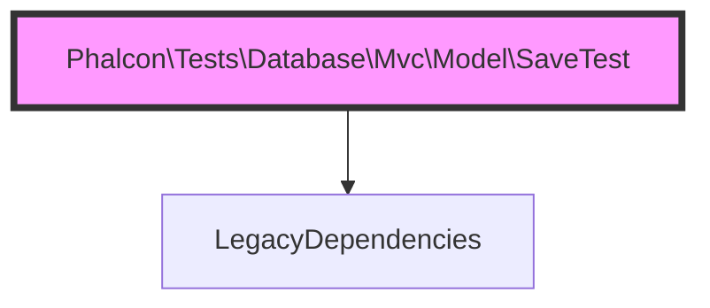

---
### [High] Critical Architectural Bottleneck in Phalcon\Tests\Database\Mvc\Model\FindTest
- **Business Impact:** Tight coupling prevents modular extraction and makes automated testing virtually impossible.
- **Strategic Action:** Isolate dependencies behind an interface. Write characterization tests before attempting extraction. *(Confidence: Probable)*
- **Evidence/Metrics:**
- `file`: Phalcon\Tests\Database\Mvc\Model\FindTest 
- `metric`: risk_score (0.48328)
- `metric`: coupling_pressure (0.40678214914856137)


#### Topology Diagram


---
### [High] Critical Architectural Bottleneck in Phalcon\Tests\Database\Mvc\Model\UnderscoreSetTest
- **Business Impact:** Tight coupling prevents modular extraction and makes automated testing virtually impossible.
- **Strategic Action:** Isolate dependencies behind an interface. Write characterization tests before attempting extraction. *(Confidence: Probable)*
- **Evidence/Metrics:**
- `file`: Phalcon\Tests\Database\Mvc\Model\UnderscoreSetTest 
- `metric`: risk_score (0.479676)
- `metric`: coupling_pressure (0.24097181444509688)


#### Topology Diagram
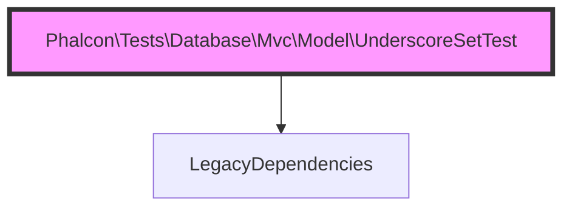

---
### [High] Critical Architectural Bottleneck in Phalcon\Tests\Database\Mvc\Model\UnderscoreGetTest
- **Business Impact:** Tight coupling prevents modular extraction and makes automated testing virtually impossible.
- **Strategic Action:** Isolate dependencies behind an interface. Write characterization tests before attempting extraction. *(Confidence: Probable)*
- **Evidence/Metrics:**
- `file`: Phalcon\Tests\Database\Mvc\Model\UnderscoreGetTest 
- `metric`: risk_score (0.474314)
- `metric`: coupling_pressure (0.25088079859072226)


#### Topology Diagram


---
### [High] Critical Architectural Bottleneck in Phalcon\Tests\Database\Mvc\Model\UpdateTest
- **Business Impact:** Tight coupling prevents modular extraction and makes automated testing virtually impossible.
- **Strategic Action:** Isolate dependencies behind an interface. Write characterization tests before attempting extraction. *(Confidence: Probable)*
- **Evidence/Metrics:**
- `file`: Phalcon\Tests\Database\Mvc\Model\UpdateTest 
- `metric`: risk_score (0.472831)
- `metric`: coupling_pressure (0.2704051673517322)


#### Topology Diagram
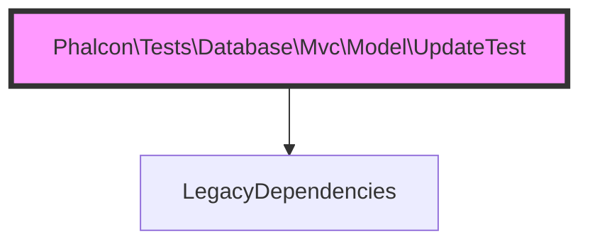

---
### [High] Critical Architectural Bottleneck in Phalcon\Tests\Database\Mvc\Model\QueryTest
- **Business Impact:** Tight coupling prevents modular extraction and makes automated testing virtually impossible.
- **Strategic Action:** Isolate dependencies behind an interface. Write characterization tests before attempting extraction. *(Confidence: Probable)*
- **Evidence/Metrics:**
- `file`: Phalcon\Tests\Database\Mvc\Model\QueryTest 
- `metric`: risk_score (0.471592)
- `metric`: coupling_pressure (0.21212566059894303)


#### Topology Diagram
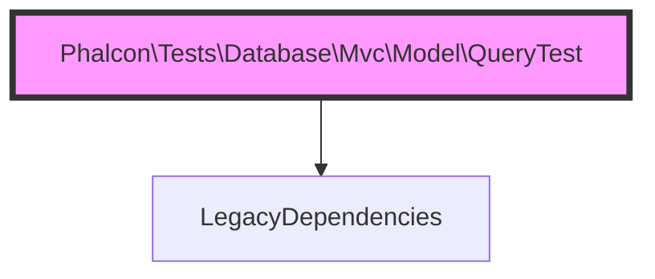

---
### [High] Critical Architectural Bottleneck in Phalcon\Tests\Database\Mvc\Model\Resultset\Simple\ConstructTest
- **Business Impact:** Tight coupling prevents modular extraction and makes automated testing virtually impossible.
- **Strategic Action:** Isolate dependencies behind an interface. Write characterization tests before attempting extraction. *(Confidence: Probable)*
- **Evidence/Metrics:**
- `file`: Phalcon\Tests\Database\Mvc\Model\Resultset\Simple\ConstructTest 
- `metric`: risk_score (0.468763)
- `metric`: coupling_pressure (0.20251027598355842)


#### Topology Diagram
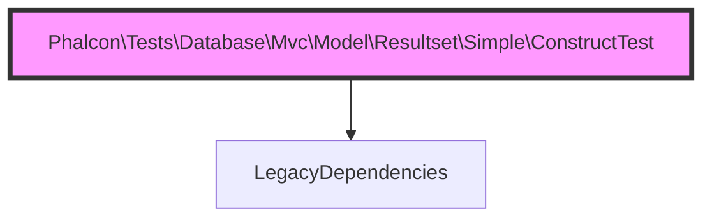

---
### [High] Critical Architectural Bottleneck in Phalcon\Tests\Database\Mvc\Model\FindTest::testMvcModelFindPrivatePropertyWithRedisCache
- **Business Impact:** Tight coupling prevents modular extraction and makes automated testing virtually impossible.
- **Strategic Action:** Isolate dependencies behind an interface. Write characterization tests before attempting extraction. *(Confidence: Probable)*
- **Evidence/Metrics:**
- `file`: Phalcon\Tests\Database\Mvc\Model\FindTest::testMvcModelFindPrivatePropertyWithRedisCache 
- `metric`: risk_score (0.466122)
- `metric`: coupling_pressure (0.1541397533763946)


#### Topology Diagram
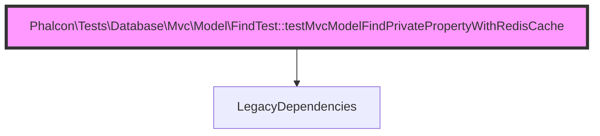

---
### [High] Critical Architectural Bottleneck in Phalcon\Tests\Database\Mvc\Model\UpdateTest::testMvcModelSaveViaSettersAndLocalMethod
- **Business Impact:** Tight coupling prevents modular extraction and makes automated testing virtually impossible.
- **Strategic Action:** Isolate dependencies behind an interface. Write characterization tests before attempting extraction. *(Confidence: Probable)*
- **Evidence/Metrics:**
- `file`: Phalcon\Tests\Database\Mvc\Model\UpdateTest::testMvcModelSaveViaSettersAndLocalMethod 
- `metric`: risk_score (0.466122)
- `metric`: coupling_pressure (0.1541397533763946)


#### Topology Diagram


---
### [High] Critical Architectural Bottleneck in Phalcon\Tests\Database\Db\DbTest::testDb
- **Business Impact:** Tight coupling prevents modular extraction and makes automated testing virtually impossible.
- **Strategic Action:** Isolate dependencies behind an interface. Write characterization tests before attempting extraction. *(Confidence: Probable)*
- **Evidence/Metrics:**
- `file`: Phalcon\Tests\Database\Db\DbTest::testDb 
- `metric`: risk_score (0.46328)
- `metric`: coupling_pressure (0.14452436876100996)


#### Topology Diagram
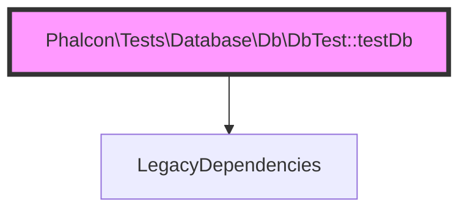

---
### [High] Critical Architectural Bottleneck in Phalcon\Tests\Database\Mvc\Model\DeleteTest::testMvcModelDeleteRestrictRelatedInTransaction
- **Business Impact:** Tight coupling prevents modular extraction and makes automated testing virtually impossible.
- **Strategic Action:** Isolate dependencies behind an interface. Write characterization tests before attempting extraction. *(Confidence: Probable)*
- **Evidence/Metrics:**
- `file`: Phalcon\Tests\Database\Mvc\Model\DeleteTest::testMvcModelDeleteRestrictRelatedInTransaction 
- `metric`: risk_score (0.46328)
- `metric`: coupling_pressure (0.14452436876100996)


#### Topology Diagram


---
### [High] Critical Architectural Bottleneck in Phalcon\Tests\Database\Mvc\Model\RelationsTest::testMvcModelSetHasOneThrough
- **Business Impact:** Tight coupling prevents modular extraction and makes automated testing virtually impossible.
- **Strategic Action:** Isolate dependencies behind an interface. Write characterization tests before attempting extraction. *(Confidence: Probable)*
- **Evidence/Metrics:**
- `file`: Phalcon\Tests\Database\Mvc\Model\RelationsTest::testMvcModelSetHasOneThrough 
- `metric`: risk_score (0.46328)
- `metric`: coupling_pressure (0.14452436876100996)


#### Topology Diagram
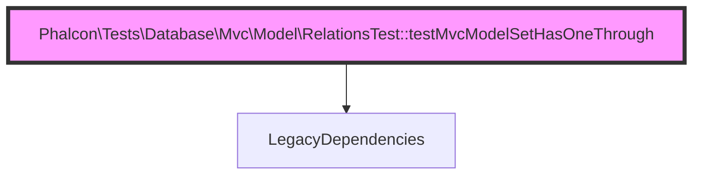

---
### [High] Critical Architectural Bottleneck in Phalcon\Tests\Database\Mvc\Model\RelationsTest::testMvcModelSetHasOneThroughComp
- **Business Impact:** Tight coupling prevents modular extraction and makes automated testing virtually impossible.
- **Strategic Action:** Isolate dependencies behind an interface. Write characterization tests before attempting extraction. *(Confidence: Probable)*
- **Evidence/Metrics:**
- `file`: Phalcon\Tests\Database\Mvc\Model\RelationsTest::testMvcModelSetHasOneThroughComp 
- `metric`: risk_score (0.46328)
- `metric`: coupling_pressure (0.14452436876100996)


#### Topology Diagram


---
### [High] Critical Architectural Bottleneck in Phalcon\Tests\Database\Mvc\Model\RelationsTest::testMvcModelSetHasManyToMany
- **Business Impact:** Tight coupling prevents modular extraction and makes automated testing virtually impossible.
- **Strategic Action:** Isolate dependencies behind an interface. Write characterization tests before attempting extraction. *(Confidence: Probable)*
- **Evidence/Metrics:**
- `file`: Phalcon\Tests\Database\Mvc\Model\RelationsTest::testMvcModelSetHasManyToMany 
- `metric`: risk_score (0.46328)
- `metric`: coupling_pressure (0.14452436876100996)


#### Topology Diagram
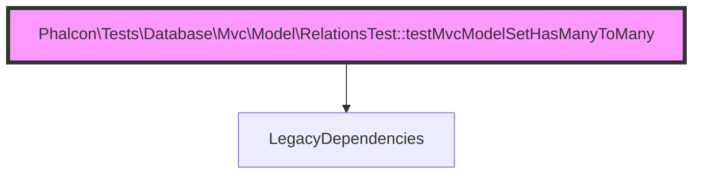

---
### [High] Critical Architectural Bottleneck in Phalcon\Tests\Database\Mvc\Model\RelationsTest::testMvcModelSetHasManyToManyComp
- **Business Impact:** Tight coupling prevents modular extraction and makes automated testing virtually impossible.
- **Strategic Action:** Isolate dependencies behind an interface. Write characterization tests before attempting extraction. *(Confidence: Probable)*
- **Evidence/Metrics:**
- `file`: Phalcon\Tests\Database\Mvc\Model\RelationsTest::testMvcModelSetHasManyToManyComp 
- `metric`: risk_score (0.46328)
- `metric`: coupling_pressure (0.14452436876100996)


#### Topology Diagram


---
### [High] Critical Architectural Bottleneck in Phalcon\Tests\Database\Mvc\Model\DeleteTest::testMvcModelDeleteRestrictRelated
- **Business Impact:** Tight coupling prevents modular extraction and makes automated testing virtually impossible.
- **Strategic Action:** Isolate dependencies behind an interface. Write characterization tests before attempting extraction. *(Confidence: Probable)*
- **Evidence/Metrics:**
- `file`: Phalcon\Tests\Database\Mvc\Model\DeleteTest::testMvcModelDeleteRestrictRelated 
- `metric`: risk_score (0.460315)
- `metric`: coupling_pressure (0.13490898414562535)


#### Topology Diagram
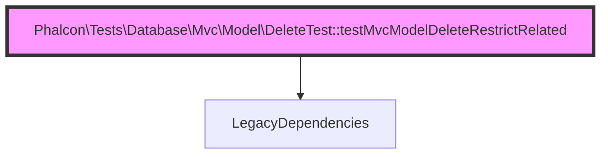

---
### [High] Critical Architectural Bottleneck in Phalcon\Tests\Database\Mvc\Model\DynamicUpdateTest::testMvcModelDisableDynamicUpdate
- **Business Impact:** Tight coupling prevents modular extraction and makes automated testing virtually impossible.
- **Strategic Action:** Isolate dependencies behind an interface. Write characterization tests before attempting extraction. *(Confidence: Probable)*
- **Evidence/Metrics:**
- `file`: Phalcon\Tests\Database\Mvc\Model\DynamicUpdateTest::testMvcModelDisableDynamicUpdate 
- `metric`: risk_score (0.460315)
- `metric`: coupling_pressure (0.13490898414562535)


#### Topology Diagram


---
### [High] Critical Architectural Bottleneck in Phalcon\Tests\Database\Mvc\Model\DynamicUpdateTest::testMvcModelDisabledCherryPickDynamicUpdate
- **Business Impact:** Tight coupling prevents modular extraction and makes automated testing virtually impossible.
- **Strategic Action:** Isolate dependencies behind an interface. Write characterization tests before attempting extraction. *(Confidence: Probable)*
- **Evidence/Metrics:**
- `file`: Phalcon\Tests\Database\Mvc\Model\DynamicUpdateTest::testMvcModelDisabledCherryPickDynamicUpdate 
- `metric`: risk_score (0.460315)
- `metric`: coupling_pressure (0.13490898414562535)


#### Topology Diagram


---
### [High] Critical Architectural Bottleneck in Phalcon\Tests\Database\Mvc\Model\DynamicUpdateTest::testMvcModelEnableDynamicUpdate
- **Business Impact:** Tight coupling prevents modular extraction and makes automated testing virtually impossible.
- **Strategic Action:** Isolate dependencies behind an interface. Write characterization tests before attempting extraction. *(Confidence: Probable)*
- **Evidence/Metrics:**
- `file`: Phalcon\Tests\Database\Mvc\Model\DynamicUpdateTest::testMvcModelEnableDynamicUpdate 
- `metric`: risk_score (0.460315)
- `metric`: coupling_pressure (0.13490898414562535)


#### Topology Diagram
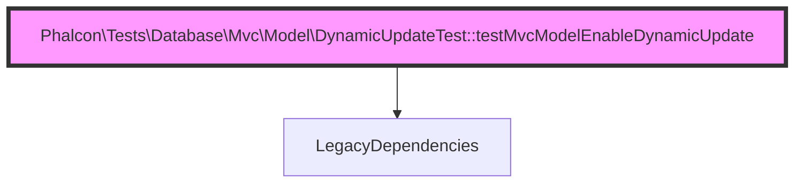

---
### [High] Critical Architectural Bottleneck in Phalcon\Tests\Database\Mvc\Model\FindTest::testMvcModelFindResultsetSecondIteration
- **Business Impact:** Tight coupling prevents modular extraction and makes automated testing virtually impossible.
- **Strategic Action:** Isolate dependencies behind an interface. Write characterization tests before attempting extraction. *(Confidence: Probable)*
- **Evidence/Metrics:**
- `file`: Phalcon\Tests\Database\Mvc\Model\FindTest::testMvcModelFindResultsetSecondIteration 
- `metric`: risk_score (0.460315)
- `metric`: coupling_pressure (0.13490898414562535)


#### Topology Diagram


---
### [High] Critical Architectural Bottleneck in Phalcon\Tests\Database\Mvc\Model\FindTest::testMvcModelFindWithCache
- **Business Impact:** Tight coupling prevents modular extraction and makes automated testing virtually impossible.
- **Strategic Action:** Isolate dependencies behind an interface. Write characterization tests before attempting extraction. *(Confidence: Probable)*
- **Evidence/Metrics:**
- `file`: Phalcon\Tests\Database\Mvc\Model\FindTest::testMvcModelFindWithCache 
- `metric`: risk_score (0.460315)
- `metric`: coupling_pressure (0.13490898414562535)


#### Topology Diagram
```mermaid
graph TD
  Phalcon\Tests\Database\Mvc\Model\FindTest::testMvcModelFindWithCache --> LegacyDependencies
  style Phalcon\Tests\Database\Mvc\Model\FindTest::testMvcModelFindWithCache fill:#f9f,stroke:#333,stroke-width:4px
```

---
### [High] Critical Architectural Bottleneck in Phalcon\Tests\Database\Mvc\Model\Resultset\Complex\CurrentTest
- **Business Impact:** Tight coupling prevents modular extraction and makes automated testing virtually impossible.
- **Strategic Action:** Isolate dependencies behind an interface. Write characterization tests before attempting extraction. *(Confidence: Probable)*
- **Evidence/Metrics:**
- `file`: Phalcon\Tests\Database\Mvc\Model\Resultset\Complex\CurrentTest 
- `metric`: risk_score (0.459733)
- `metric`: coupling_pressure (0.17366412213740456)


#### Topology Diagram
```mermaid
graph TD
  Phalcon\Tests\Database\Mvc\Model\Resultset\Complex\CurrentTest --> LegacyDependencies
  style Phalcon\Tests\Database\Mvc\Model\Resultset\Complex\CurrentTest fill:#f9f,stroke:#333,stroke-width:4px
```

---
### [High] Critical Architectural Bottleneck in Phalcon\Tests\Database\Mvc\Model\AssignTest
- **Business Impact:** Tight coupling prevents modular extraction and makes automated testing virtually impossible.
- **Strategic Action:** Isolate dependencies behind an interface. Write characterization tests before attempting extraction. *(Confidence: Probable)*
- **Evidence/Metrics:**
- `file`: Phalcon\Tests\Database\Mvc\Model\AssignTest 
- `metric`: risk_score (0.459311)
- `metric`: coupling_pressure (0.2028038755137992)


#### Topology Diagram
```mermaid
graph TD
  Phalcon\Tests\Database\Mvc\Model\AssignTest --> LegacyDependencies
  style Phalcon\Tests\Database\Mvc\Model\AssignTest fill:#f9f,stroke:#333,stroke-width:4px
```

---
### [High] Critical Architectural Bottleneck in Phalcon\Tests\Database\Mvc\Model\SerializeTest
- **Business Impact:** Tight coupling prevents modular extraction and makes automated testing virtually impossible.
- **Strategic Action:** Isolate dependencies behind an interface. Write characterization tests before attempting extraction. *(Confidence: Probable)*
- **Evidence/Metrics:**
- `file`: Phalcon\Tests\Database\Mvc\Model\SerializeTest 
- `metric`: risk_score (0.459311)
- `metric`: coupling_pressure (0.2028038755137992)


#### Topology Diagram
```mermaid
graph TD
  Phalcon\Tests\Database\Mvc\Model\SerializeTest --> LegacyDependencies
  style Phalcon\Tests\Database\Mvc\Model\SerializeTest fill:#f9f,stroke:#333,stroke-width:4px
```

---
### [High] Critical Architectural Bottleneck in Phalcon\Tests\Database\Db\Adapter\Pdo\DescribeColumnsTest
- **Business Impact:** Tight coupling prevents modular extraction and makes automated testing virtually impossible.
- **Strategic Action:** Isolate dependencies behind an interface. Write characterization tests before attempting extraction. *(Confidence: Probable)*
- **Evidence/Metrics:**
- `file`: Phalcon\Tests\Database\Db\Adapter\Pdo\DescribeColumnsTest 
- `metric`: risk_score (0.457429)
- `metric`: coupling_pressure (0.22232824427480916)


#### Topology Diagram
```mermaid
graph TD
  Phalcon\Tests\Database\Db\Adapter\Pdo\DescribeColumnsTest --> LegacyDependencies
  style Phalcon\Tests\Database\Db\Adapter\Pdo\DescribeColumnsTest fill:#f9f,stroke:#333,stroke-width:4px
```

---
### [High] Critical Architectural Bottleneck in Phalcon\Tests\Database\Db\Adapter\Pdo\DeleteTest::testDbAdapterPdoQuery
- **Business Impact:** Tight coupling prevents modular extraction and makes automated testing virtually impossible.
- **Strategic Action:** Isolate dependencies behind an interface. Write characterization tests before attempting extraction. *(Confidence: Probable)*
- **Evidence/Metrics:**
- `file`: Phalcon\Tests\Database\Db\Adapter\Pdo\DeleteTest::testDbAdapterPdoQuery 
- `metric`: risk_score (0.457202)
- `metric`: coupling_pressure (0.12529359953024075)


#### Topology Diagram
```mermaid
graph TD
  Phalcon\Tests\Database\Db\Adapter\Pdo\DeleteTest::testDbAdapterPdoQuery --> LegacyDependencies
  style Phalcon\Tests\Database\Db\Adapter\Pdo\DeleteTest::testDbAdapterPdoQuery fill:#f9f,stroke:#333,stroke-width:4px
```

---
### [High] Critical Architectural Bottleneck in Phalcon\Tests\Database\Mvc\Model\DeleteTest::testMvcModelDeleteCascadeRelated
- **Business Impact:** Tight coupling prevents modular extraction and makes automated testing virtually impossible.
- **Strategic Action:** Isolate dependencies behind an interface. Write characterization tests before attempting extraction. *(Confidence: Probable)*
- **Evidence/Metrics:**
- `file`: Phalcon\Tests\Database\Mvc\Model\DeleteTest::testMvcModelDeleteCascadeRelated 
- `metric`: risk_score (0.457202)
- `metric`: coupling_pressure (0.12529359953024075)


#### Topology Diagram
```mermaid
graph TD
  Phalcon\Tests\Database\Mvc\Model\DeleteTest::testMvcModelDeleteCascadeRelated --> LegacyDependencies
  style Phalcon\Tests\Database\Mvc\Model\DeleteTest::testMvcModelDeleteCascadeRelated fill:#f9f,stroke:#333,stroke-width:4px
```

---
### [High] Critical Architectural Bottleneck in Phalcon\Tests\Database\Mvc\Model\MetaData\Libmemcached\ConstructTest::setUp
- **Business Impact:** Tight coupling prevents modular extraction and makes automated testing virtually impossible.
- **Strategic Action:** Isolate dependencies behind an interface. Write characterization tests before attempting extraction. *(Confidence: Probable)*
- **Evidence/Metrics:**
- `file`: Phalcon\Tests\Database\Mvc\Model\MetaData\Libmemcached\ConstructTest::setUp 
- `metric`: risk_score (0.457202)
- `metric`: coupling_pressure (0.12529359953024075)


#### Topology Diagram
```mermaid
graph TD
  Phalcon\Tests\Database\Mvc\Model\MetaData\Libmemcached\ConstructTest::setUp --> LegacyDependencies
  style Phalcon\Tests\Database\Mvc\Model\MetaData\Libmemcached\ConstructTest::setUp fill:#f9f,stroke:#333,stroke-width:4px
```

---
### [High] Critical Architectural Bottleneck in Phalcon\Tests\Database\Mvc\Model\MetaData\Redis\ConstructTest::setUp
- **Business Impact:** Tight coupling prevents modular extraction and makes automated testing virtually impossible.
- **Strategic Action:** Isolate dependencies behind an interface. Write characterization tests before attempting extraction. *(Confidence: Probable)*
- **Evidence/Metrics:**
- `file`: Phalcon\Tests\Database\Mvc\Model\MetaData\Redis\ConstructTest::setUp 
- `metric`: risk_score (0.457202)
- `metric`: coupling_pressure (0.12529359953024075)


#### Topology Diagram
```mermaid
graph TD
  Phalcon\Tests\Database\Mvc\Model\MetaData\Redis\ConstructTest::setUp --> LegacyDependencies
  style Phalcon\Tests\Database\Mvc\Model\MetaData\Redis\ConstructTest::setUp fill:#f9f,stroke:#333,stroke-width:4px
```

---
### [High] Critical Architectural Bottleneck in Phalcon\Tests\Database\Mvc\Model\RelationsTest
- **Business Impact:** Tight coupling prevents modular extraction and makes automated testing virtually impossible.
- **Strategic Action:** Isolate dependencies behind an interface. Write characterization tests before attempting extraction. *(Confidence: Probable)*
- **Evidence/Metrics:**
- `file`: Phalcon\Tests\Database\Mvc\Model\RelationsTest 
- `metric`: risk_score (0.456917)
- `metric`: coupling_pressure (0.35958602466236056)


#### Topology Diagram
```mermaid
graph TD
  Phalcon\Tests\Database\Mvc\Model\RelationsTest --> LegacyDependencies
  style Phalcon\Tests\Database\Mvc\Model\RelationsTest fill:#f9f,stroke:#333,stroke-width:4px
```

---
### [High] Critical Architectural Bottleneck in Phalcon\Tests\Database\Db\Adapter\Pdo\Postgresql\DescribeColumnsTest
- **Business Impact:** Tight coupling prevents modular extraction and makes automated testing virtually impossible.
- **Strategic Action:** Isolate dependencies behind an interface. Write characterization tests before attempting extraction. *(Confidence: Probable)*
- **Evidence/Metrics:**
- `file`: Phalcon\Tests\Database\Db\Adapter\Pdo\Postgresql\DescribeColumnsTest 
- `metric`: risk_score (0.456494)
- `metric`: coupling_pressure (0.16404873752201996)


#### Topology Diagram
```mermaid
graph TD
  Phalcon\Tests\Database\Db\Adapter\Pdo\Postgresql\DescribeColumnsTest --> LegacyDependencies
  style Phalcon\Tests\Database\Db\Adapter\Pdo\Postgresql\DescribeColumnsTest fill:#f9f,stroke:#333,stroke-width:4px
```

---
### [High] Critical Architectural Bottleneck in Phalcon\Tests\Database\Mvc\Model\IsRelationshipLoadedTest
- **Business Impact:** Tight coupling prevents modular extraction and makes automated testing virtually impossible.
- **Strategic Action:** Isolate dependencies behind an interface. Write characterization tests before attempting extraction. *(Confidence: Probable)*
- **Evidence/Metrics:**
- `file`: Phalcon\Tests\Database\Mvc\Model\IsRelationshipLoadedTest 
- `metric`: risk_score (0.456494)
- `metric`: coupling_pressure (0.16404873752201996)


#### Topology Diagram
```mermaid
graph TD
  Phalcon\Tests\Database\Mvc\Model\IsRelationshipLoadedTest --> LegacyDependencies
  style Phalcon\Tests\Database\Mvc\Model\IsRelationshipLoadedTest fill:#f9f,stroke:#333,stroke-width:4px
```

---
### [High] Critical Architectural Bottleneck in Phalcon\Tests\Database\Db\DbBindTest::testDbBindByType
- **Business Impact:** Tight coupling prevents modular extraction and makes automated testing virtually impossible.
- **Strategic Action:** Isolate dependencies behind an interface. Write characterization tests before attempting extraction. *(Confidence: Probable)*
- **Evidence/Metrics:**
- `file`: Phalcon\Tests\Database\Db\DbBindTest::testDbBindByType 
- `metric`: risk_score (0.453905)
- `metric`: coupling_pressure (0.11567821491485614)


#### Topology Diagram
```mermaid
graph TD
  Phalcon\Tests\Database\Db\DbBindTest::testDbBindByType --> LegacyDependencies
  style Phalcon\Tests\Database\Db\DbBindTest::testDbBindByType fill:#f9f,stroke:#333,stroke-width:4px
```

---
### [High] Critical Architectural Bottleneck in Phalcon\Tests\Database\Db\Adapter\Pdo\Postgresql\DescribeColumnsTest::testDbAdapterPdoPostgresqlDescribeColumnsUuid
- **Business Impact:** Tight coupling prevents modular extraction and makes automated testing virtually impossible.
- **Strategic Action:** Isolate dependencies behind an interface. Write characterization tests before attempting extraction. *(Confidence: Probable)*
- **Evidence/Metrics:**
- `file`: Phalcon\Tests\Database\Db\Adapter\Pdo\Postgresql\DescribeColumnsTest::testDbAdapterPdoPostgresqlDescribeColumnsUuid 
- `metric`: risk_score (0.453905)
- `metric`: coupling_pressure (0.11567821491485614)


#### Topology Diagram
```mermaid
graph TD
  Phalcon\Tests\Database\Db\Adapter\Pdo\Postgresql\DescribeColumnsTest::testDbAdapterPdoPostgresqlDescribeColumnsUuid --> LegacyDependencies
  style Phalcon\Tests\Database\Db\Adapter\Pdo\Postgresql\DescribeColumnsTest::testDbAdapterPdoPostgresqlDescribeColumnsUuid fill:#f9f,stroke:#333,stroke-width:4px
```

---
### [High] Critical Architectural Bottleneck in Phalcon\Tests\Database\Mvc\Model\DeleteTest::testMvcModelDeleteGetRelated
- **Business Impact:** Tight coupling prevents modular extraction and makes automated testing virtually impossible.
- **Strategic Action:** Isolate dependencies behind an interface. Write characterization tests before attempting extraction. *(Confidence: Probable)*
- **Evidence/Metrics:**
- `file`: Phalcon\Tests\Database\Mvc\Model\DeleteTest::testMvcModelDeleteGetRelated 
- `metric`: risk_score (0.453905)
- `metric`: coupling_pressure (0.11567821491485614)


#### Topology Diagram
```mermaid
graph TD
  Phalcon\Tests\Database\Mvc\Model\DeleteTest::testMvcModelDeleteGetRelated --> LegacyDependencies
  style Phalcon\Tests\Database\Mvc\Model\DeleteTest::testMvcModelDeleteGetRelated fill:#f9f,stroke:#333,stroke-width:4px
```

---
### [High] Critical Architectural Bottleneck in Phalcon\Tests\Database\Mvc\Model\FindTest::testMvcModelFindWithCacheLifetimeFromCacheService
- **Business Impact:** Tight coupling prevents modular extraction and makes automated testing virtually impossible.
- **Strategic Action:** Isolate dependencies behind an interface. Write characterization tests before attempting extraction. *(Confidence: Probable)*
- **Evidence/Metrics:**
- `file`: Phalcon\Tests\Database\Mvc\Model\FindTest::testMvcModelFindWithCacheLifetimeFromCacheService 
- `metric`: risk_score (0.453905)
- `metric`: coupling_pressure (0.11567821491485614)


#### Topology Diagram
```mermaid
graph TD
  Phalcon\Tests\Database\Mvc\Model\FindTest::testMvcModelFindWithCacheLifetimeFromCacheService --> LegacyDependencies
  style Phalcon\Tests\Database\Mvc\Model\FindTest::testMvcModelFindWithCacheLifetimeFromCacheService fill:#f9f,stroke:#333,stroke-width:4px
```

---
### [High] Critical Architectural Bottleneck in Phalcon\Tests\Database\Mvc\Model\FindTest::testMvcModelFindWithCacheOptionsLifetimePriorityOverCacheService
- **Business Impact:** Tight coupling prevents modular extraction and makes automated testing virtually impossible.
- **Strategic Action:** Isolate dependencies behind an interface. Write characterization tests before attempting extraction. *(Confidence: Probable)*
- **Evidence/Metrics:**
- `file`: Phalcon\Tests\Database\Mvc\Model\FindTest::testMvcModelFindWithCacheOptionsLifetimePriorityOverCacheService 
- `metric`: risk_score (0.453905)
- `metric`: coupling_pressure (0.11567821491485614)


#### Topology Diagram
```mermaid
graph TD
  Phalcon\Tests\Database\Mvc\Model\FindTest::testMvcModelFindWithCacheOptionsLifetimePriorityOverCacheService --> LegacyDependencies
  style Phalcon\Tests\Database\Mvc\Model\FindTest::testMvcModelFindWithCacheOptionsLifetimePriorityOverCacheService fill:#f9f,stroke:#333,stroke-width:4px
```

---
### [High] Critical Architectural Bottleneck in Phalcon\Tests\Database\Mvc\Model\RelationsTest::testMvcModelGetHasManyToMany
- **Business Impact:** Tight coupling prevents modular extraction and makes automated testing virtually impossible.
- **Strategic Action:** Isolate dependencies behind an interface. Write characterization tests before attempting extraction. *(Confidence: Probable)*
- **Evidence/Metrics:**
- `file`: Phalcon\Tests\Database\Mvc\Model\RelationsTest::testMvcModelGetHasManyToMany 
- `metric`: risk_score (0.453905)
- `metric`: coupling_pressure (0.11567821491485614)


#### Topology Diagram
```mermaid
graph TD
  Phalcon\Tests\Database\Mvc\Model\RelationsTest::testMvcModelGetHasManyToMany --> LegacyDependencies
  style Phalcon\Tests\Database\Mvc\Model\RelationsTest::testMvcModelGetHasManyToMany fill:#f9f,stroke:#333,stroke-width:4px
```

---
### [High] Critical Architectural Bottleneck in Phalcon\Tests\Database\Mvc\Model\RelationsTest::testMvcModelGetHasManyToManyComp
- **Business Impact:** Tight coupling prevents modular extraction and makes automated testing virtually impossible.
- **Strategic Action:** Isolate dependencies behind an interface. Write characterization tests before attempting extraction. *(Confidence: Probable)*
- **Evidence/Metrics:**
- `file`: Phalcon\Tests\Database\Mvc\Model\RelationsTest::testMvcModelGetHasManyToManyComp 
- `metric`: risk_score (0.453905)
- `metric`: coupling_pressure (0.11567821491485614)


#### Topology Diagram
```mermaid
graph TD
  Phalcon\Tests\Database\Mvc\Model\RelationsTest::testMvcModelGetHasManyToManyComp --> LegacyDependencies
  style Phalcon\Tests\Database\Mvc\Model\RelationsTest::testMvcModelGetHasManyToManyComp fill:#f9f,stroke:#333,stroke-width:4px
```

---
### [High] Critical Architectural Bottleneck in Phalcon\Tests\Database\Mvc\Model\SaveTest::testMvcModelSaveBelongsToUpdatesExistingParent
- **Business Impact:** Tight coupling prevents modular extraction and makes automated testing virtually impossible.
- **Strategic Action:** Isolate dependencies behind an interface. Write characterization tests before attempting extraction. *(Confidence: Probable)*
- **Evidence/Metrics:**
- `file`: Phalcon\Tests\Database\Mvc\Model\SaveTest::testMvcModelSaveBelongsToUpdatesExistingParent 
- `metric`: risk_score (0.453905)
- `metric`: coupling_pressure (0.11567821491485614)


#### Topology Diagram
```mermaid
graph TD
  Phalcon\Tests\Database\Mvc\Model\SaveTest::testMvcModelSaveBelongsToUpdatesExistingParent --> LegacyDependencies
  style Phalcon\Tests\Database\Mvc\Model\SaveTest::testMvcModelSaveBelongsToUpdatesExistingParent fill:#f9f,stroke:#333,stroke-width:4px
```

---
### [High] Critical Architectural Bottleneck in Phalcon\Tests\Database\Mvc\Model\UpdateTest::testMvcModelSaveAfterWithoutDefaultValues
- **Business Impact:** Tight coupling prevents modular extraction and makes automated testing virtually impossible.
- **Strategic Action:** Isolate dependencies behind an interface. Write characterization tests before attempting extraction. *(Confidence: Probable)*
- **Evidence/Metrics:**
- `file`: Phalcon\Tests\Database\Mvc\Model\UpdateTest::testMvcModelSaveAfterWithoutDefaultValues 
- `metric`: risk_score (0.453905)
- `metric`: coupling_pressure (0.11567821491485614)


#### Topology Diagram
```mermaid
graph TD
  Phalcon\Tests\Database\Mvc\Model\UpdateTest::testMvcModelSaveAfterWithoutDefaultValues --> LegacyDependencies
  style Phalcon\Tests\Database\Mvc\Model\UpdateTest::testMvcModelSaveAfterWithoutDefaultValues fill:#f9f,stroke:#333,stroke-width:4px
```

---
### [High] Critical Architectural Bottleneck in Phalcon\Tests\Database\Mvc\Model\Manager\GetRelationRecordsTest::testMvcModelManagerGetRelationRecords
- **Business Impact:** Tight coupling prevents modular extraction and makes automated testing virtually impossible.
- **Strategic Action:** Isolate dependencies behind an interface. Write characterization tests before attempting extraction. *(Confidence: Probable)*
- **Evidence/Metrics:**
- `file`: Phalcon\Tests\Database\Mvc\Model\Manager\GetRelationRecordsTest::testMvcModelManagerGetRelationRecords 
- `metric`: risk_score (0.453905)
- `metric`: coupling_pressure (0.11567821491485614)


#### Topology Diagram
```mermaid
graph TD
  Phalcon\Tests\Database\Mvc\Model\Manager\GetRelationRecordsTest::testMvcModelManagerGetRelationRecords --> LegacyDependencies
  style Phalcon\Tests\Database\Mvc\Model\Manager\GetRelationRecordsTest::testMvcModelManagerGetRelationRecords fill:#f9f,stroke:#333,stroke-width:4px
```

---
### [High] Critical Architectural Bottleneck in Phalcon\Tests\Database\Mvc\Model\MetaData\Apcu\ConstructTest::setUp
- **Business Impact:** Tight coupling prevents modular extraction and makes automated testing virtually impossible.
- **Strategic Action:** Isolate dependencies behind an interface. Write characterization tests before attempting extraction. *(Confidence: Probable)*
- **Evidence/Metrics:**
- `file`: Phalcon\Tests\Database\Mvc\Model\MetaData\Apcu\ConstructTest::setUp 
- `metric`: risk_score (0.453905)
- `metric`: coupling_pressure (0.11567821491485614)


#### Topology Diagram
```mermaid
graph TD
  Phalcon\Tests\Database\Mvc\Model\MetaData\Apcu\ConstructTest::setUp --> LegacyDependencies
  style Phalcon\Tests\Database\Mvc\Model\MetaData\Apcu\ConstructTest::setUp fill:#f9f,stroke:#333,stroke-width:4px
```

---
### [High] Critical Architectural Bottleneck in Phalcon\Tests\Database\Mvc\Model\Query\CacheTest::testMvcModelQueryCache
- **Business Impact:** Tight coupling prevents modular extraction and makes automated testing virtually impossible.
- **Strategic Action:** Isolate dependencies behind an interface. Write characterization tests before attempting extraction. *(Confidence: Probable)*
- **Evidence/Metrics:**
- `file`: Phalcon\Tests\Database\Mvc\Model\Query\CacheTest::testMvcModelQueryCache 
- `metric`: risk_score (0.453905)
- `metric`: coupling_pressure (0.11567821491485614)


#### Topology Diagram
```mermaid
graph TD
  Phalcon\Tests\Database\Mvc\Model\Query\CacheTest::testMvcModelQueryCache --> LegacyDependencies
  style Phalcon\Tests\Database\Mvc\Model\Query\CacheTest::testMvcModelQueryCache fill:#f9f,stroke:#333,stroke-width:4px
```

---
### [High] Critical Architectural Bottleneck in Phalcon\Tests\Database\Mvc\Model\Relation\CacheKeyProviderTest::testMvcModelManagerCacheKeyProviderUniqueKey
- **Business Impact:** Tight coupling prevents modular extraction and makes automated testing virtually impossible.
- **Strategic Action:** Isolate dependencies behind an interface. Write characterization tests before attempting extraction. *(Confidence: Probable)*
- **Evidence/Metrics:**
- `file`: Phalcon\Tests\Database\Mvc\Model\Relation\CacheKeyProviderTest::testMvcModelManagerCacheKeyProviderUniqueKey 
- `metric`: risk_score (0.453905)
- `metric`: coupling_pressure (0.11567821491485614)


#### Topology Diagram
```mermaid
graph TD
  Phalcon\Tests\Database\Mvc\Model\Relation\CacheKeyProviderTest::testMvcModelManagerCacheKeyProviderUniqueKey --> LegacyDependencies
  style Phalcon\Tests\Database\Mvc\Model\Relation\CacheKeyProviderTest::testMvcModelManagerCacheKeyProviderUniqueKey fill:#f9f,stroke:#333,stroke-width:4px
```

---
### [High] Critical Architectural Bottleneck in Phalcon\Tests\Database\Db\DbTest
- **Business Impact:** Tight coupling prevents modular extraction and makes automated testing virtually impossible.
- **Strategic Action:** Isolate dependencies behind an interface. Write characterization tests before attempting extraction. *(Confidence: Probable)*
- **Evidence/Metrics:**
- `file`: Phalcon\Tests\Database\Db\DbTest 
- `metric`: risk_score (0.453109)
- `metric`: coupling_pressure (0.15443335290663535)


#### Topology Diagram
```mermaid
graph TD
  Phalcon\Tests\Database\Db\DbTest --> LegacyDependencies
  style Phalcon\Tests\Database\Db\DbTest fill:#f9f,stroke:#333,stroke-width:4px
```

---
### [High] Critical Architectural Bottleneck in Phalcon\Tests\Database\Mvc\Model\MetaData\Libmemcached\ConstructTest
- **Business Impact:** Tight coupling prevents modular extraction and makes automated testing virtually impossible.
- **Strategic Action:** Isolate dependencies behind an interface. Write characterization tests before attempting extraction. *(Confidence: Probable)*
- **Evidence/Metrics:**
- `file`: Phalcon\Tests\Database\Mvc\Model\MetaData\Libmemcached\ConstructTest 
- `metric`: risk_score (0.453109)
- `metric`: coupling_pressure (0.15443335290663535)


#### Topology Diagram
```mermaid
graph TD
  Phalcon\Tests\Database\Mvc\Model\MetaData\Libmemcached\ConstructTest --> LegacyDependencies
  style Phalcon\Tests\Database\Mvc\Model\MetaData\Libmemcached\ConstructTest fill:#f9f,stroke:#333,stroke-width:4px
```

---
### [High] Critical Architectural Bottleneck in Phalcon\Tests\Database\Mvc\Model\MetaData\Redis\ConstructTest
- **Business Impact:** Tight coupling prevents modular extraction and makes automated testing virtually impossible.
- **Strategic Action:** Isolate dependencies behind an interface. Write characterization tests before attempting extraction. *(Confidence: Probable)*
- **Evidence/Metrics:**
- `file`: Phalcon\Tests\Database\Mvc\Model\MetaData\Redis\ConstructTest 
- `metric`: risk_score (0.453109)
- `metric`: coupling_pressure (0.15443335290663535)


#### Topology Diagram
```mermaid
graph TD
  Phalcon\Tests\Database\Mvc\Model\MetaData\Redis\ConstructTest --> LegacyDependencies
  style Phalcon\Tests\Database\Mvc\Model\MetaData\Redis\ConstructTest fill:#f9f,stroke:#333,stroke-width:4px
```

---
### [High] Critical Architectural Bottleneck in Phalcon\Tests\Database\Mvc\Model\Transaction\ManagerTest
- **Business Impact:** Tight coupling prevents modular extraction and makes automated testing virtually impossible.
- **Strategic Action:** Isolate dependencies behind an interface. Write characterization tests before attempting extraction. *(Confidence: Probable)*
- **Evidence/Metrics:**
- `file`: Phalcon\Tests\Database\Mvc\Model\Transaction\ManagerTest 
- `metric`: risk_score (0.452624)
- `metric`: coupling_pressure (0.18357310628302995)


#### Topology Diagram
```mermaid
graph TD
  Phalcon\Tests\Database\Mvc\Model\Transaction\ManagerTest --> LegacyDependencies
  style Phalcon\Tests\Database\Mvc\Model\Transaction\ManagerTest fill:#f9f,stroke:#333,stroke-width:4px
```

---
### [High] Critical Architectural Bottleneck in Phalcon\Tests\Database\Filter\Validation\Validator\UniquenessTest::testFilterValidationValidatorUniquenessSingleField
- **Business Impact:** Tight coupling prevents modular extraction and makes automated testing virtually impossible.
- **Strategic Action:** Isolate dependencies behind an interface. Write characterization tests before attempting extraction. *(Confidence: Probable)*
- **Evidence/Metrics:**
- `file`: Phalcon\Tests\Database\Filter\Validation\Validator\UniquenessTest::testFilterValidationValidatorUniquenessSingleField 
- `metric`: risk_score (0.450379)
- `metric`: coupling_pressure (0.10606283029947151)


#### Topology Diagram
```mermaid
graph TD
  Phalcon\Tests\Database\Filter\Validation\Validator\UniquenessTest::testFilterValidationValidatorUniquenessSingleField --> LegacyDependencies
  style Phalcon\Tests\Database\Filter\Validation\Validator\UniquenessTest::testFilterValidationValidatorUniquenessSingleField fill:#f9f,stroke:#333,stroke-width:4px
```

---
