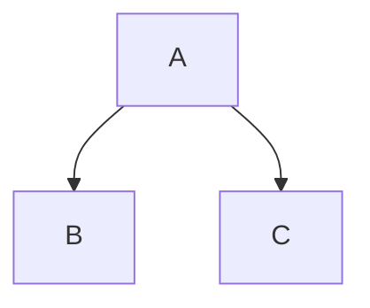

# Master Intelligence Report: Test Monolith

## 1. Executive Summary & Verdict
This report provides a comprehensive, AI-driven assessment of the system's structural integrity, pinpointing the most critical architectural bottlenecks.

### Current State Verdict
The system contains significant technical debt.

### Global System Meta-Data
- **Scale:** 7,877 Files | 5,000 Classes
- **Architecture/Era:** Custom PHP (Bespoke / Custom Era)
- **Global Modernization Readiness:** 45.0%

## 2. System Health Metrics (The Data Dashboard)
The following metrics dictate the true cost of ownership and the risk of catastrophic failure during refactoring.

| Metric | Value | Business Impact |
| :--- | :--- | :--- |
| **Lines of Code** | 1,500,000 | Defines the sheer volume of logic that must be maintained. |
| **Avg Complexity** | 12.40 | Higher numbers mean code is harder to read, test, and safely modify. |
| **Connectivity (Edges)** | 15,000 | Measures how tightly coupled the system is. High connectivity means changes break unexpected features. |

## 3. Database & State Intelligence
Stateful dependencies form the anchor of the monolith. High-pressure tables are critical bottlenecks.

*No high-pressure database tables detected.*

## 4. Top Architectural Blockers (AI Synthesis)
The AI engine has isolated the top 5 most dangerous 'God Classes' in the system. Fixing these resolves the vast majority of structural entanglement.

### [Critical] Massive God Class detected with 150 incoming dependencies.
**Business Impact:** Changes to this class have a massive blast radius.

**Strategic Action:** Decouple into separate domain services using the Strangler pattern. *(Confidence: Confirmed)*
**Files Implicated:** `core/GodClass.php`

#### Sub-System Topology

---

## 5. Strategic Roadmap
Based on the intelligence gathered, the AI engine recommends the following phased approach to decoupling and modernization:

1. Introduce static analysis. 2. Add characterization tests. 3. Incrementally decouple.

## 6. The Artifact Index (Navigating the Workspace Bundle)
This Executive Report is only the **Hub**. The accompanying `.zip` bundle contains the definitive, raw data (the **Spokes**) required for engineering execution:

- `remediation_backlog.csv`: The complete, raw risk inventory detailing the complexity and coupling scores for all 7,800+ files.
- `rector.php`: The automated refactoring rules generated specifically for this codebase.
- `deptrac.yaml`: Architectural boundary definitions to enforce layer isolation.
- `security_findings.sarif`: CI/CD compatible format for importing security vulnerabilities into GitHub or SonarQube.